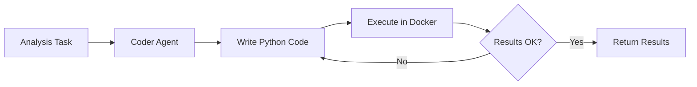

# Code-Executing AI Agents for Healthcare Analytics

## 1. Simple Explanation

Code-executing agents (also called "coder agents") can write Python code and then run it to solve problems. Instead of just describing a solution, they write actual code, execute it in a safe environment (Docker container), check the results, and iterate if needed.

## 2. Why It Matters (Interview + Real World)

- **Problem it solves**: Complex calculations, data analysis, statistical modeling that require actual computation
- **Why companies use it**: Automates data analysis, generates custom reports, performs complex medical calculations
- **Why interviewers ask it**: Tests understanding of autonomous systems, code generation, and safe execution environments

## 3. Very Simple Example

**Healthcare Scenario**: Calculate patient risk scores
- Agent receives: "Calculate CHADS2 score for 100 patients"
- Agent writes Python code to implement scoring algorithm
- Agent executes code on patient data
- Agent returns: Risk stratification results

## 4. Step-by-Step Workflow

1. Define agent with code execution enabled
2. Set execution mode to "safe" (Docker)
3. Agent receives task requiring computation
4. Agent writes Python code
5. Code executes in Docker container
6. Agent reviews output and iterates if needed



## 5. Where It Fits

- **AI Layer**: Computational analysis and data processing
- **Microservice**: Analytics service, reporting service
- **Agent**: Data analyst agent, statistician agent
- **Security**: Sandboxed execution prevents system access

## 6. Lab

### Lab Objective
Create an agent that analyzes patient lab results and generates statistical reports

### Lab Steps
1. Install Docker Desktop

2. Configure agent in `crew.py`:
   ```python
   @agent
   def data_analyst(self) -> Agent:
       return Agent(
           config=self.agents_config['analyst'],
           allow_code_execution=True,
           code_execution_mode="safe",  # Docker
           max_execution_time=30,
           max_retry_limit=5
       )
   ```

3. Create analysis task:
   ```python
   @task
   def analyze_labs(self) -> Task:
       return Task(
           description="Analyze lab results and calculate statistics",
           expected_output="Statistical report with code and results",
           agent=self.data_analyst()
       )
   ```

4. Set assignment in `main.py`:
   ```python
   assignment = """
   Calculate mean, median, and standard deviation for 
   glucose levels: [95, 110, 88, 102, 115, 92, 105]
   Identify values outside normal range (70-100 mg/dL)
   """
   ```

### Expected Outcome
- Agent writes Python code for statistical analysis
- Code executes safely in Docker
- Returns both code and computed results
- Can handle complex medical calculations

## 7. Interview Questions

**Q1: Why use Docker for code execution?**
A: Docker provides isolation - prevents malicious or buggy code from accessing the host system, file system, or network.

**Q2: What types of healthcare tasks benefit from code execution?**
A: Statistical analysis, risk score calculations, data visualization, clinical trial analysis, epidemiological modeling.

**Q3: How do you handle execution failures?**
A: Set retry limits, implement error handling, log failures, provide fallback responses, and validate inputs before execution.

## 8. Quick Revision Summary

- Code-executing agents write and run Python code
- Use `allow_code_execution=True` and `code_execution_mode="safe"`
- Docker provides secure sandboxed environment
- Perfect for complex calculations and data analysis
- Critical for healthcare analytics and reporting
