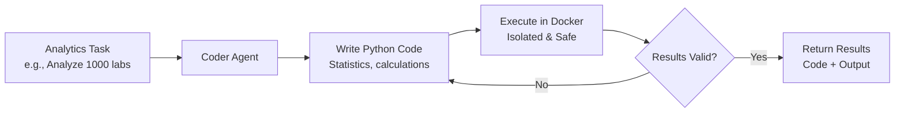

# Code-Executing AI Agents for Healthcare Analytics

## 1. Simple Explanation

Code-executing agents (also called "coder agents") can write Python code and then run it to solve problems. Instead of just describing a solution, they write actual code, execute it in a safe Docker container, check the results, and iterate if needed.

**Real Example**: Hospital needs to analyze 1000 patient lab results to identify trends. Agent writes Python code to calculate statistics (mean, median, outliers), executes it, generates visualizations, and produces a report - all automatically.

## 2. Why It Matters (Interview + Real World)

- **Problem it solves**: Complex calculations (risk scores, statistical analysis, trend detection) that require actual computation, not just text
- **Why companies use it**: Automates data analysis that would take analysts hours/days, generates custom reports, performs complex medical calculations accurately
- **Why interviewers ask it**: Tests understanding of autonomous systems, code generation, safe execution, and practical AI applications

## 3. Very Simple Example

**Healthcare Scenario**: Calculate CHADS2 stroke risk scores
```
Input: "Calculate CHADS2 scores for patients with: CHF, HTN, Age>75, Diabetes, Prior stroke"
Agent writes: 
  score = 0
  if chf: score += 1
  if htn: score += 1
  if age > 75: score += 1
  if diabetes: score += 1
  if prior_stroke: score += 2
Agent executes: score = 5 (High risk)
Agent returns: "CHADS2 Score: 5 - High stroke risk, anticoagulation recommended"
```

## 4. Step-by-Step Workflow

1. Define agent with `allow_code_execution=True`
2. Set `code_execution_mode="safe"` (Docker isolation)
3. Agent receives task requiring computation
4. Agent writes Python code to solve problem
5. Code executes in isolated Docker container
6. Agent reviews output, iterates if needed
7. Returns final results with code and output



## 5. Where It Fits

- **AI Layer**: Computational analysis and data processing layer
- **Microservice**: Analytics service, reporting service, risk calculation service
- **Agent**: Data analyst agent, statistician agent, clinical calculator agent
- **Security**: Docker sandboxing prevents malicious code from accessing hospital systems

## 6. Complete Lab: Clinical Analytics Agent

### Lab Objective
Build an agent that analyzes patient lab results, calculates statistics, identifies outliers, and generates clinical reports with visualizations

### Prerequisites
```bash
pip install crewai crewai-tools
# Install Docker Desktop from https://docker.com
# Docker is required for safe code execution
```

### Step 1: Install Docker

**Windows/Mac**: Download Docker Desktop from https://docker.com
**Linux**: 
```bash
sudo apt update
sudo apt install docker.io
sudo systemctl start docker
```

Verify Docker is running:
```bash
docker --version
# Should show: Docker version 20.x.x or higher
```

### Step 2: Create Project
```bash
crew create crew clinical_analytics
cd clinical_analytics
```

### Step 3: Configure Environment (.env)
```bash
OPENAI_API_KEY=your_openai_key_here
```

### Step 4: Define Agents (src/clinical_analytics/config/agents.yaml)

```yaml
data_analyst:
  role: Clinical Data Analyst
  goal: >
    Analyze clinical data for {analysis_request} and provide statistical
    insights. Write Python code to perform calculations, generate statistics,
    and identify clinically significant patterns.
  backstory: >
    You are an experienced clinical data analyst with expertise in biostatistics
    and healthcare analytics. You excel at writing clean, efficient Python code
    to analyze patient data, calculate clinical metrics, and identify trends.
    You understand clinical significance and can interpret results in a
    medical context.
    
    You are analyzing: {analysis_request}
  model: gpt-4o-mini

report_writer:
  role: Clinical Report Writer
  goal: >
    Create comprehensive clinical reports based on data analysis results.
    Interpret statistical findings in clinical context and provide actionable
    recommendations for healthcare providers.
  backstory: >
    You are a skilled medical writer who translates complex statistical
    analysis into clear, actionable clinical reports. You understand both
    the technical aspects of data analysis and the clinical implications
    for patient care.
    
    You are reporting on: {analysis_request}
  model: gpt-4o-mini
```

### Step 5: Define Tasks (src/clinical_analytics/config/tasks.yaml)

```yaml
analyze_clinical_data:
  description: >
    Analyze clinical data for: {analysis_request}
    
    Data provided: {clinical_data}
    
    Your task:
    1. Write Python code to analyze the data
    2. Calculate relevant statistics (mean, median, std dev, ranges)
    3. Identify outliers and abnormal values
    4. Calculate clinical metrics (e.g., percentage above/below normal range)
    5. Generate summary statistics
    
    Requirements:
    - Write clean, well-commented Python code
    - Use appropriate statistical methods
    - Handle edge cases (missing data, invalid values)
    - Output should include both code and results
    - Identify clinically significant findings
    
    The code will be executed automatically in a safe Docker environment.
  expected_output: >
    Python code that analyzes the data, plus execution results showing:
    - Summary statistics
    - Outlier identification
    - Clinical significance assessment
    - Key findings
  agent: data_analyst
  output_file: output/analysis_code_and_results.txt

generate_clinical_report:
  description: >
    Based on the data analysis results, create a comprehensive clinical report.
    
    Analysis request: {analysis_request}
    
    Your report should include:
    1. EXECUTIVE SUMMARY
       - Key findings in 2-3 sentences
       - Clinical significance
    
    2. STATISTICAL ANALYSIS
       - Summary statistics from the analysis
       - Distribution of values
       - Outliers and abnormal results
    
    3. CLINICAL INTERPRETATION
       - What do these results mean clinically?
       - Which patients need follow-up?
       - Are there concerning trends?
    
    4. RECOMMENDATIONS
       - Actions for healthcare providers
       - Patients requiring immediate attention
       - Follow-up testing needed
    
    Use the analysis results from the previous task to inform your report.
  expected_output: >
    A professional clinical report (500-800 words) with clear sections,
    clinical interpretation, and actionable recommendations.
  agent: report_writer
  context: [analyze_clinical_data]
  output_file: output/clinical_report.md
```

### Step 6: Configure Crew (src/clinical_analytics/crew.py)

```python
from crewai import Agent, Crew, Process, Task
from crewai.project import CrewBase, agent, crew, task

@CrewBase
class ClinicalAnalyticsCrew():
    """Clinical Analytics Crew with code execution"""
    
    agents_config = 'config/agents.yaml'
    tasks_config = 'config/tasks.yaml'

    @agent
    def data_analyst(self) -> Agent:
        return Agent(
            config=self.agents_config['data_analyst'],
            allow_code_execution=True,  # Enable code execution
            code_execution_mode="safe",  # Use Docker for safety
            max_execution_time=60,  # 60 seconds timeout
            max_retry_limit=3,  # Retry up to 3 times if code fails
            verbose=True
        )

    @agent
    def report_writer(self) -> Agent:
        return Agent(
            config=self.agents_config['report_writer'],
            verbose=True
        )

    @task
    def analyze_clinical_data(self) -> Task:
        return Task(
            config=self.tasks_config['analyze_clinical_data']
        )

    @task
    def generate_clinical_report(self) -> Task:
        return Task(
            config=self.tasks_config['generate_clinical_report']
        )

    @crew
    def crew(self) -> Crew:
        """Creates the Clinical Analytics crew"""
        return Crew(
            agents=self.agents,
            tasks=self.tasks,
            process=Process.sequential,
            verbose=True
        )
```

### Step 7: Setup Main Entry Point (src/clinical_analytics/main.py)

```python
#!/usr/bin/env python
from clinical_analytics.crew import ClinicalAnalyticsCrew

def analyze_glucose_levels():
    """Analyze patient glucose levels"""
    print("=" * 70)
    print("CLINICAL ANALYTICS: Glucose Level Analysis")
    print("=" * 70)
    
    inputs = {
        'analysis_request': 'Fasting glucose levels for diabetic patients',
        'clinical_data': """
        Patient fasting glucose levels (mg/dL) from morning lab draws:
        
        Patient_ID, Glucose_Level
        P001, 95
        P002, 110
        P003, 88
        P004, 245
        P005, 102
        P006, 115
        P007, 92
        P008, 305
        P009, 105
        P010, 98
        P011, 125
        P012, 180
        P013, 89
        P014, 95
        P015, 420
        P016, 108
        P017, 92
        P018, 155
        P019, 98
        P020, 102
        
        Normal fasting glucose: 70-100 mg/dL
        Prediabetes: 100-125 mg/dL
        Diabetes: ≥126 mg/dL
        Critical high: >300 mg/dL
        """
    }
    
    print(f"\nAnalysis: {inputs['analysis_request']}")
    print("Processing 20 patient glucose readings...\n")
    print("Agent will write Python code to:")
    print("  - Calculate statistics (mean, median, std dev)")
    print("  - Identify outliers and critical values")
    print("  - Categorize patients by glucose control")
    print("  - Generate clinical insights\n")
    
    result = ClinicalAnalyticsCrew().crew().kickoff(inputs=inputs)
    
    print("\n" + "=" * 70)
    print("ANALYSIS COMPLETE")
    print("=" * 70)
    print("\nReports generated:")
    print("  - output/analysis_code_and_results.txt (code + statistics)")
    print("  - output/clinical_report.md (clinical interpretation)")
    
    return result

def analyze_blood_pressure():
    """Analyze patient blood pressure readings"""
    print("\n\n" + "=" * 70)
    print("CLINICAL ANALYTICS: Blood Pressure Analysis")
    print("=" * 70)
    
    inputs = {
        'analysis_request': 'Blood pressure control in hypertensive patients',
        'clinical_data': """
        Patient blood pressure readings (mmHg):
        
        Patient_ID, Systolic, Diastolic
        P101, 118, 75
        P102, 142, 88
        P103, 125, 80
        P104, 165, 95
        P105, 120, 78
        P106, 138, 85
        P107, 115, 72
        P108, 180, 105
        P109, 128, 82
        P110, 145, 90
        P111, 122, 79
        P112, 155, 92
        P113, 119, 76
        P114, 132, 84
        P115, 195, 110
        
        Blood Pressure Categories:
        Normal: <120/<80
        Elevated: 120-129/<80
        Stage 1 HTN: 130-139/80-89
        Stage 2 HTN: ≥140/≥90
        Hypertensive Crisis: >180/>120
        """
    }
    
    print(f"\nAnalysis: {inputs['analysis_request']}")
    print("Processing 15 patient BP readings...\n")
    
    result = ClinicalAnalyticsCrew().crew().kickoff(inputs=inputs)
    
    print("\n" + "=" * 70)
    print("ANALYSIS COMPLETE")
    print("=" * 70)
    
    return result

def calculate_risk_scores():
    """Calculate CHADS2 stroke risk scores"""
    print("\n\n" + "=" * 70)
    print("CLINICAL ANALYTICS: CHADS2 Risk Score Calculation")
    print("=" * 70)
    
    inputs = {
        'analysis_request': 'CHADS2 stroke risk scores for atrial fibrillation patients',
        'clinical_data': """
        Patient risk factors for CHADS2 score calculation:
        
        CHADS2 Scoring:
        C - Congestive heart failure: 1 point
        H - Hypertension: 1 point
        A - Age ≥75: 1 point
        D - Diabetes: 1 point
        S2 - Prior Stroke/TIA: 2 points
        
        Patient_ID, CHF, HTN, Age≥75, Diabetes, Prior_Stroke
        P201, 0, 1, 1, 0, 0
        P202, 1, 1, 0, 1, 0
        P203, 0, 1, 1, 1, 0
        P204, 1, 1, 1, 1, 1
        P205, 0, 0, 1, 0, 0
        P206, 1, 1, 0, 0, 0
        P207, 0, 1, 1, 1, 1
        P208, 1, 1, 1, 1, 0
        P209, 0, 0, 0, 1, 0
        P210, 1, 1, 1, 0, 0
        
        Risk Stratification:
        Score 0: Low risk (0.5% annual stroke risk)
        Score 1: Low-moderate risk (1.5% annual stroke risk)
        Score 2: Moderate risk (2.5% annual stroke risk)
        Score 3-4: Moderate-high risk (5-7% annual stroke risk)
        Score 5-6: High risk (8-12% annual stroke risk)
        
        Clinical Action:
        Score 0-1: Consider aspirin or no therapy
        Score ≥2: Anticoagulation recommended
        """
    }
    
    print(f"\nAnalysis: {inputs['analysis_request']}")
    print("Calculating CHADS2 scores for 10 patients...\n")
    
    result = ClinicalAnalyticsCrew().crew().kickoff(inputs=inputs)
    
    print("\n" + "=" * 70)
    print("ANALYSIS COMPLETE")
    print("=" * 70)
    
    return result

def run():
    """Run all analytics demonstrations"""
    print("\n" + "=" * 70)
    print("CLINICAL ANALYTICS SYSTEM")
    print("Code-Executing AI Agents for Healthcare")
    print("=" * 70)
    print("\nThis system demonstrates AI agents that write and execute")
    print("Python code to perform clinical data analysis.\n")
    
    # Demo 1: Glucose analysis
    analyze_glucose_levels()
    
    # Demo 2: Blood pressure analysis
    # analyze_blood_pressure()
    
    # Demo 3: Risk score calculation
    # calculate_risk_scores()
    
    print("\n" + "=" * 70)
    print("ALL ANALYSES COMPLETE")
    print("=" * 70)
    print("\nThe agent wrote Python code, executed it in Docker,")
    print("and generated clinical reports - all automatically!")
    print("\nUncomment other demos in main.py to try more analyses.")

if __name__ == "__main__":
    run()
```

### Step 8: Run the System

```bash
# Make sure Docker is running first!
docker ps  # Should not error

# Run the analytics
crew run
```

### Expected Output

**Console Output:**
```
CLINICAL ANALYTICS: Glucose Level Analysis
======================================================================

Agent will write Python code to:
  - Calculate statistics (mean, median, std dev)
  - Identify outliers and critical values
  - Categorize patients by glucose control
  - Generate clinical insights

[Agent writes Python code...]

Executing code in Docker container...

Code Output:
============================================================
GLUCOSE LEVEL ANALYSIS

Summary Statistics:
  Mean: 141.8 mg/dL
  Median: 105.0 mg/dL
  Std Dev: 89.3 mg/dL
  Min: 88 mg/dL
  Max: 420 mg/dL

Patient Categories:
  Normal (70-100): 8 patients (40%)
  Prediabetes (100-125): 6 patients (30%)
  Diabetes (≥126): 6 patients (30%)

Critical Values (>300 mg/dL):
  P008: 305 mg/dL - CRITICAL
  P015: 420 mg/dL - CRITICAL

Outliers (>2 std dev from mean):
  P004: 245 mg/dL
  P008: 305 mg/dL
  P015: 420 mg/dL

Clinical Significance:
  - 30% of patients have poor glucose control (≥126 mg/dL)
  - 2 patients require immediate intervention (>300 mg/dL)
  - Mean glucose elevated, suggesting need for treatment intensification
============================================================

ANALYSIS COMPLETE
```

**Generated Report (output/clinical_report.md):**
```markdown
# Clinical Report: Fasting Glucose Analysis

## Executive Summary
Analysis of 20 diabetic patients reveals concerning glucose control with 30%
in diabetic range and 2 patients with critically high values requiring
immediate intervention. Mean glucose of 141.8 mg/dL indicates suboptimal
overall control.

## Statistical Analysis

### Summary Statistics
- Mean: 141.8 mg/dL (elevated)
- Median: 105.0 mg/dL
- Standard Deviation: 89.3 mg/dL (high variability)
- Range: 88-420 mg/dL

### Distribution
- Normal range (70-100 mg/dL): 8 patients (40%)
- Prediabetic range (100-125 mg/dL): 6 patients (30%)
- Diabetic range (≥126 mg/dL): 6 patients (30%)

### Critical Values
Two patients with dangerously high glucose levels:
- Patient P008: 305 mg/dL
- Patient P015: 420 mg/dL

## Clinical Interpretation

The analysis reveals several concerning findings:

1. **Poor Overall Control**: Mean glucose of 141.8 mg/dL suggests the
   patient population needs treatment optimization.

2. **High Variability**: Standard deviation of 89.3 mg/dL indicates
   inconsistent glucose control across the population.

3. **Critical Cases**: Two patients (10%) have glucose >300 mg/dL,
   indicating severe hyperglycemia requiring immediate attention.

4. **Treatment Gap**: Only 40% of patients achieving target glucose
   control suggests need for medication adjustment or adherence support.

## Recommendations

### Immediate Actions
1. **P008 and P015**: Contact immediately for urgent evaluation
   - Risk of diabetic ketoacidosis
   - May require hospitalization
   - Check for symptoms: excessive thirst, frequent urination, confusion

### Short-term Actions (This Week)
2. **6 patients in diabetic range**: Schedule appointments for:
   - Medication review and adjustment
   - HbA1c testing
   - Diabetes education reinforcement

### Long-term Actions
3. **Population Management**:
   - Review treatment protocols
   - Implement continuous glucose monitoring for high-risk patients
   - Enhance patient education programs
   - Consider endocrinology referrals for poorly controlled patients

### Follow-up Testing
- Repeat fasting glucose in 1 week for critical patients
- HbA1c for all patients with glucose ≥126 mg/dL
- Comprehensive metabolic panel to assess kidney function
```

## 7. Real Healthcare Use Cases

### Use Case 1: Lab Result Trend Analysis
```python
inputs = {
    'analysis_request': 'Analyze creatinine trends over 6 months',
    'clinical_data': 'Monthly creatinine values for CKD patients...'
}
# Agent calculates eGFR, identifies declining kidney function
```

### Use Case 2: Medication Adherence Analysis
```python
inputs = {
    'analysis_request': 'Calculate medication adherence rates',
    'clinical_data': 'Prescription refill data for 100 patients...'
}
# Agent calculates PDC (Proportion of Days Covered)
```

### Use Case 3: Hospital Readmission Risk
```python
inputs = {
    'analysis_request': 'Calculate 30-day readmission risk scores',
    'clinical_data': 'Patient demographics, diagnoses, prior admissions...'
}
# Agent implements LACE index or HOSPITAL score
```

### Use Case 4: Quality Metrics Calculation
```python
inputs = {
    'analysis_request': 'Calculate HEDIS quality measures',
    'clinical_data': 'Patient screening and vaccination data...'
}
# Agent calculates compliance rates for quality metrics
```

## 8. Interview Questions

**Q1: Why use Docker for code execution?**
A: Docker provides complete isolation - prevents AI-generated code from accessing hospital systems, patient databases, or file systems. If code has bugs or is malicious, it can't harm the host system. Critical for healthcare where security breaches risk HIPAA violations and patient safety.

**Q2: What types of healthcare tasks benefit from code execution?**
A: (1) Statistical analysis (mean, median, trends), (2) Risk score calculations (CHADS2, LACE, APACHE), (3) Quality metrics (HEDIS, CMS measures), (4) Clinical trial analysis, (5) Epidemiological modeling, (6) Resource utilization analysis, (7) Predictive modeling for readmissions or complications.

**Q3: How do you handle execution failures?**
A: Set `max_retry_limit` (e.g., 3 attempts), implement timeout with `max_execution_time`, log all failures with error details, provide fallback responses ("Unable to complete analysis, manual review required"), validate inputs before execution, and implement human-in-the-loop for critical calculations.

## 9. Quick Revision Summary

- Code-executing agents write and run Python code automatically
- Enable with `allow_code_execution=True` and `code_execution_mode="safe"`
- Docker provides secure sandboxed environment (required for production)
- Perfect for: statistics, risk scores, trend analysis, quality metrics
- Set timeouts and retry limits for reliability
- Critical for healthcare analytics that require actual computation
