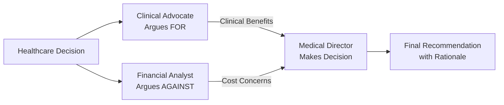

# CrewAI Debate System for Healthcare Decision Making

## 1. Simple Explanation

CrewAI is a framework that lets you create teams of AI agents that work together. Think of it like having multiple AI assistants, each with a specific role, collaborating to solve a problem. In a debate system, you have AI agents that argue different sides of a topic, and another agent that judges which argument is better.

**Real Example**: Should a hospital adopt a new AI-powered diagnostic tool for radiology? One agent argues for it (better accuracy, faster results), another argues against it (high cost, training needed), and a judge decides based on the arguments.

## 2. Why It Matters (Interview + Real World)

- **Problem it solves**: Healthcare decisions often require weighing multiple perspectives (treatment options, cost vs benefit, patient safety vs innovation)
- **Why companies use it**: Multi-agent systems provide more balanced, well-reasoned decisions by considering different viewpoints
- **Why interviewers ask it**: Shows understanding of collaborative AI systems and structured decision-making frameworks

## 3. Very Simple Example

**Healthcare Scenario**: Should a hospital adopt a new AI diagnostic tool?
- Agent 1 (Proposer): "Improves diagnostic accuracy by 25%, reduces wait times from 3 days to 3 hours"
- Agent 2 (Opposer): "Costs $500K annually, requires 6 months staff training, integration challenges with existing PACS system"
- Agent 3 (Judge): "Adopt with phased rollout - start with one department, measure ROI over 6 months"

## 4. Step-by-Step Workflow

1. Define agents with roles (clinical advocate, financial analyst, judge)
2. Create tasks for each agent (propose benefits, oppose with concerns, decide)
3. Configure agents with LLM models
4. Set up sequential process (propose → oppose → decide)
5. Run the crew and collect results



## 5. Where It Fits

- **AI Layer**: Multi-agent orchestration for decision support
- **Microservice**: Clinical decision support service, procurement evaluation service
- **Agent**: Multiple specialized agents (clinical, financial, operational perspectives)
- **Security**: Role-based access, audit trails for decisions, HIPAA-compliant logging

## 6. Complete Lab: Build a Healthcare Decision Debate System

### Lab Objective
Create a debate system to evaluate whether to implement a new telemedicine platform in a hospital

### Prerequisites
```bash
pip install crewai crewai-tools
```

### Step 1: Create Project Structure
```bash
crew create crew healthcare_debate
cd healthcare_debate
```

### Step 2: Configure Environment (.env)
```bash
# Create .env file in project root
OPENAI_API_KEY=your_openai_key_here
ANTHROPIC_API_KEY=your_anthropic_key_here
```

### Step 3: Define Agents (src/healthcare_debate/config/agents.yaml)

```yaml
clinical_advocate:
  role: Chief Medical Officer
  goal: >
    Present compelling arguments in FAVOR of {motion} from a clinical 
    and patient care perspective. Focus on patient outcomes, quality of care, 
    and clinical efficiency.
  backstory: >
    You are an experienced Chief Medical Officer with 20 years in healthcare.
    You prioritize patient outcomes and clinical excellence. You understand
    both the benefits and challenges of new healthcare technologies.
    The motion being debated is: {motion}
  model: gpt-4o-mini

financial_analyst:
  role: Chief Financial Officer
  goal: >
    Present compelling arguments AGAINST {motion} from a financial and 
    operational perspective. Focus on costs, ROI, implementation challenges,
    and resource allocation.
  backstory: >
    You are a seasoned CFO with expertise in healthcare economics. You ensure
    financial sustainability while supporting quality care. You analyze costs,
    risks, and long-term financial implications carefully.
    The motion being debated is: {motion}
  model: gpt-4o-mini

medical_director:
  role: Hospital Medical Director and Decision Maker
  goal: >
    Review arguments from both the clinical and financial perspectives and
    make a balanced, evidence-based decision on {motion}. Consider patient
    care, financial sustainability, and operational feasibility.
  backstory: >
    You are a fair and experienced Medical Director who balances clinical
    excellence with financial responsibility. You make decisions based on
    evidence, not personal bias. You consider short-term and long-term
    implications for the hospital and patients.
    The motion being debated is: {motion}
  model: claude-3-7-sonnet-latest
```

### Step 4: Define Tasks (src/healthcare_debate/config/tasks.yaml)

```yaml
propose_motion:
  description: >
    You are PROPOSING the motion: {motion}
    
    Present a clear, compelling argument IN FAVOR of this motion.
    Include:
    1. Clinical benefits for patients
    2. Impact on quality of care
    3. Efficiency improvements
    4. Evidence or examples from other hospitals
    5. Long-term strategic advantages
    
    Be persuasive but factual. Use specific examples where possible.
  expected_output: >
    A well-structured argument (300-500 words) in favor of the motion,
    with clear points and supporting evidence.
  agent: clinical_advocate
  output_file: output/clinical_argument.md

oppose_motion:
  description: >
    You are OPPOSING the motion: {motion}
    
    Present a clear, compelling argument AGAINST this motion.
    Include:
    1. Financial costs and budget impact
    2. Implementation challenges
    3. Resource requirements (staff, training, infrastructure)
    4. Risks and potential downsides
    5. Alternative solutions that might be more cost-effective
    
    Be persuasive but factual. Use specific concerns and numbers where possible.
  expected_output: >
    A well-structured argument (300-500 words) against the motion,
    with clear concerns and supporting evidence.
  agent: financial_analyst
  output_file: output/financial_argument.md

make_decision:
  description: >
    Review the arguments presented by the Clinical Advocate (FOR) and 
    the Financial Analyst (AGAINST) regarding: {motion}
    
    Make a balanced decision that considers:
    1. Patient care and clinical outcomes
    2. Financial sustainability
    3. Implementation feasibility
    4. Risk vs benefit analysis
    
    Your decision should be:
    - Clear (Approve, Reject, or Approve with Conditions)
    - Evidence-based (reference specific points from both arguments)
    - Actionable (include next steps if approved)
  expected_output: >
    A decision document (400-600 words) that includes:
    1. Final Decision (Approve/Reject/Conditional Approval)
    2. Key reasons for the decision
    3. Acknowledgment of both perspectives
    4. Next steps or conditions (if applicable)
    5. Timeline for implementation or re-evaluation
  agent: medical_director
  context: [propose_motion, oppose_motion]
  output_file: output/final_decision.md
```

### Step 5: Configure Crew (src/healthcare_debate/crew.py)

```python
from crewai import Agent, Crew, Process, Task
from crewai.project import CrewBase, agent, crew, task

@CrewBase
class HealthcareDebateCrew():
    """Healthcare Decision Debate Crew"""
    
    agents_config = 'config/agents.yaml'
    tasks_config = 'config/tasks.yaml'

    @agent
    def clinical_advocate(self) -> Agent:
        return Agent(
            config=self.agents_config['clinical_advocate'],
            verbose=True
        )

    @agent
    def financial_analyst(self) -> Agent:
        return Agent(
            config=self.agents_config['financial_analyst'],
            verbose=True
        )

    @agent
    def medical_director(self) -> Agent:
        return Agent(
            config=self.agents_config['medical_director'],
            verbose=True
        )

    @task
    def propose_motion(self) -> Task:
        return Task(
            config=self.tasks_config['propose_motion']
        )

    @task
    def oppose_motion(self) -> Task:
        return Task(
            config=self.tasks_config['oppose_motion']
        )

    @task
    def make_decision(self) -> Task:
        return Task(
            config=self.tasks_config['make_decision']
        )

    @crew
    def crew(self) -> Crew:
        """Creates the Healthcare Debate crew"""
        return Crew(
            agents=self.agents,
            tasks=self.tasks,
            process=Process.sequential,
            verbose=True
        )
```

### Step 6: Setup Main Entry Point (src/healthcare_debate/main.py)

```python
#!/usr/bin/env python
from healthcare_debate.crew import HealthcareDebateCrew

def run():
    """
    Run the Healthcare Debate crew to make a decision
    """
    # Define the motion to debate
    inputs = {
        'motion': 'Implement a comprehensive telemedicine platform for remote patient consultations'
    }
    
    print("=" * 60)
    print("HEALTHCARE DECISION DEBATE SYSTEM")
    print("=" * 60)
    print(f"\nMotion: {inputs['motion']}\n")
    print("Starting debate process...\n")
    
    # Run the crew
    result = HealthcareDebateCrew().crew().kickoff(inputs=inputs)
    
    print("\n" + "=" * 60)
    print("FINAL DECISION")
    print("=" * 60)
    print(result.raw)
    
    return result

if __name__ == "__main__":
    run()
```

### Step 7: Run the Debate System

```bash
# From the healthcare_debate directory
crew run
```

### Expected Output

The system will create three files in the `output/` directory:

**1. output/clinical_argument.md** - Clinical Advocate's argument FOR telemedicine
**2. output/financial_argument.md** - CFO's argument AGAINST (or concerns about) telemedicine
**3. output/final_decision.md** - Medical Director's balanced decision

### Sample Output Structure

```
output/
├── clinical_argument.md
│   ├── Patient Access Benefits
│   ├── Quality of Care Improvements
│   ├── Efficiency Gains
│   └── Evidence from Other Hospitals
│
├── financial_argument.md
│   ├── Implementation Costs ($500K-$1M)
│   ├── Training Requirements (3-6 months)
│   ├── Technology Infrastructure Needs
│   └── Ongoing Operational Costs
│
└── final_decision.md
    ├── Decision: Conditional Approval
    ├── Rationale (balancing both perspectives)
    ├── Conditions (phased rollout, pilot program)
    └── Next Steps (timeline, budget allocation)
```

## 7. Real Healthcare Use Cases

### Use Case 1: New Medical Equipment Purchase
```python
inputs = {
    'motion': 'Purchase a new MRI machine for $2.5M to reduce patient wait times'
}
```

### Use Case 2: EHR System Upgrade
```python
inputs = {
    'motion': 'Upgrade to a new Electronic Health Record system hospital-wide'
}
```

### Use Case 3: Clinical Protocol Change
```python
inputs = {
    'motion': 'Implement rapid COVID-19 testing protocol in the emergency department'
}
```

### Use Case 4: Staffing Decision
```python
inputs = {
    'motion': 'Hire 10 additional nurses to improve patient-to-nurse ratios'
}
```

## 8. Interview Questions

**Q1: How does CrewAI differ from single-agent systems?**
A: CrewAI enables multiple specialized agents to collaborate, each with distinct roles and expertise. In healthcare, this means a clinical expert, financial expert, and decision-maker can all contribute their perspectives, leading to more comprehensive analysis than a single agent could provide.

**Q2: What are the benefits of using a debate structure for healthcare decisions?**
A: It ensures multiple perspectives are considered (clinical vs financial), reduces bias by forcing examination of both pros and cons, provides transparent reasoning with documented arguments, and leads to more balanced decisions that consider patient care AND financial sustainability.

**Q3: How would you extend this system for more complex decisions?**
A: Add more specialized agents (legal compliance officer, patient advocate, IT security expert), implement hierarchical process with a manager agent to coordinate, add memory to track past decisions, integrate with real hospital data sources, and add custom tools for cost calculations or risk assessments.

## 9. Quick Revision Summary

- CrewAI debate system = 3 agents (proposer, opposer, judge) working sequentially
- Agents defined in YAML with roles, goals, backstories, and LLM models
- Tasks define what each agent does and how outputs flow (context)
- Sequential process ensures: propose → oppose → decide
- Perfect for healthcare decisions requiring balanced clinical and financial perspectives
- Output files provide audit trail and documentation for decision-making
