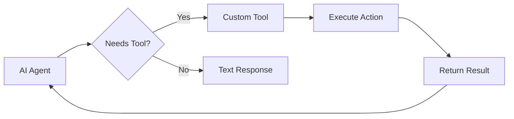

# Custom Tool Development for CrewAI Healthcare Agents

## 1. Simple Explanation

Custom tools are functions you write that AI agents can call to perform specific actions. Instead of just generating text, agents can execute code, call APIs, send notifications, or interact with external systems. You define what the tool does and what inputs it needs.

## 2. Why It Matters (Interview + Real World)

- **Problem it solves**: AI agents need to interact with real systems (databases, APIs, notification services)
- **Why companies use it**: Enables agents to take actions, not just provide information
- **Why interviewers ask it**: Tests ability to extend AI capabilities and integrate with existing infrastructure

## 3. Very Simple Example

**Healthcare Scenario**: Send alert when critical lab result detected
```python
class LabAlertTool(BaseTool):
    name = "send_lab_alert"
    description = "Send alert for critical lab values"
    
    def _run(self, patient_id: str, lab_value: str):
        # Send to on-call physician
        send_notification(f"Critical: {lab_value} for {patient_id}")
```

## 4. Step-by-Step Workflow

1. Create tool class inheriting from BaseTool
2. Define Pydantic schema for inputs
3. Implement `_run` method with tool logic
4. Assign tool to agent
5. Agent calls tool when needed



## 5. Where It Fits

- **AI Layer**: Agent action capabilities
- **Microservice**: Integration with EHR, lab systems, notification services
- **Agent**: Tool-equipped agents for real-world actions
- **Security**: Authentication, authorization, audit logging in tools

## 6. Lab

### Lab Objective
Create a custom tool for checking drug interactions

### Lab Steps
1. Define tool input schema:
   ```python
   class DrugInteractionInput(BaseModel):
       drug1: str = Field(description="First medication")
       drug2: str = Field(description="Second medication")
   ```

2. Create custom tool:
   ```python
   class DrugInteractionTool(BaseTool):
       name = "check_drug_interaction"
       description = "Check for interactions between medications"
       args_schema = DrugInteractionInput
       
       def _run(self, drug1: str, drug2: str) -> str:
           # Call drug interaction API
           response = drug_api.check_interaction(drug1, drug2)
           return f"Interaction: {response['severity']}"
   ```

3. Assign to agent:
   ```python
   @agent
   def pharmacist(self) -> Agent:
       return Agent(
           config=self.agents_config['pharmacist'],
           tools=[DrugInteractionTool()]
       )
   ```

### Expected Outcome
- Agent can check drug interactions on demand
- Returns severity and recommendations
- Integrates with external drug database

## 7. Interview Questions

**Q1: How do you handle errors in custom tools?**
A: Implement try-except blocks, return error messages to agent, log failures, and provide fallback responses.

**Q2: What's the difference between tools and regular functions?**
A: Tools have schemas that LLMs understand, include descriptions for when to use them, and are invoked by the agent autonomously.

**Q3: How do you secure custom tools in healthcare?**
A: Implement authentication, validate inputs, use role-based access control, audit all tool calls, and encrypt sensitive data.

## 8. Quick Revision Summary

- Custom tools extend agent capabilities beyond text generation
- Define input schema with Pydantic for validation
- Implement `_run` method with actual logic
- Tools enable real-world actions (API calls, notifications, database operations)
- Critical for production healthcare AI systems
