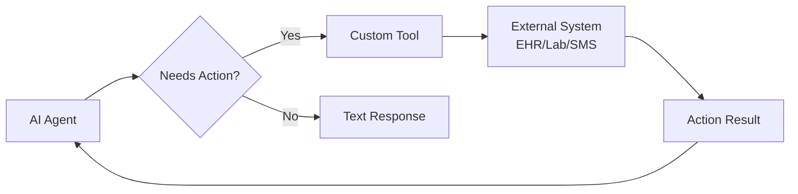

# Custom Tool Development for CrewAI Healthcare Agents

## 1. Simple Explanation

Custom tools are Python functions that AI agents can call to perform specific actions beyond just generating text. Instead of only providing information, agents can execute code, call APIs, send notifications, check databases, or interact with external systems like EHR, lab systems, or notification services.

**Real Example**: An AI agent monitoring lab results can automatically call a custom tool to send an SMS alert to the on-call physician when a critical value is detected (e.g., potassium > 6.0 mEq/L).

## 2. Why It Matters (Interview + Real World)

- **Problem it solves**: AI agents need to take real actions (send alerts, query databases, call APIs), not just provide text responses
- **Why companies use it**: Enables agents to integrate with existing hospital infrastructure (EHR, PACS, lab systems, paging systems)
- **Why interviewers ask it**: Tests ability to extend AI capabilities, integrate with APIs, and build production-ready systems

## 3. Very Simple Example

**Healthcare Scenario**: Critical lab value alert
```python
class LabAlertTool(BaseTool):
    name = "send_critical_lab_alert"
    description = "Send alert when critical lab value detected"
    
    def _run(self, patient_id: str, test: str, value: str):
        send_sms(on_call_physician, f"CRITICAL: {test}={value} for patient {patient_id}")
        return "Alert sent successfully"
```

Agent detects K+ = 6.5 → Calls tool → Physician receives SMS immediately

## 4. Step-by-Step Workflow

1. Create tool class inheriting from `BaseTool`
2. Define Pydantic schema for input parameters
3. Implement `_run` method with tool logic (API calls, database queries, etc.)
4. Assign tool to agent in tools list
5. Agent autonomously calls tool when needed



## 5. Where It Fits

- **AI Layer**: Agent action capabilities and external integrations
- **Microservice**: Integration layer with EHR, lab systems, notification services
- **Agent**: Tool-equipped agents that can take real-world actions
- **Security**: Authentication, authorization, audit logging, HIPAA compliance

## 6. Complete Lab: Build Healthcare Alert System with Custom Tools

### Lab Objective
Create custom tools for checking drug interactions and sending critical alerts to healthcare providers

### Prerequisites
```bash
pip install crewai crewai-tools requests
# For SMS alerts, sign up for Twilio (free trial) or use Pushover
```

### Step 1: Create Project
```bash
crew create crew clinical_alerts
cd clinical_alerts
```

### Step 2: Configure Environment (.env)
```bash
OPENAI_API_KEY=your_openai_key_here
# For Pushover notifications (free, easy to set up)
PUSHOVER_USER_KEY=your_pushover_user_key
PUSHOVER_API_TOKEN=your_pushover_app_token
# Get free keys at: https://pushover.net
```

### Step 3: Create Custom Tools (src/clinical_alerts/tools/healthcare_tools.py)

Create a new file for your custom tools:

```python
from crewai.tools import BaseTool
from pydantic import BaseModel, Field
from typing import Optional, List
import requests
import os

# ============================================================================
# TOOL 1: Drug Interaction Checker
# ============================================================================

class DrugInteractionInput(BaseModel):
    """Input schema for drug interaction checker"""
    drug1: str = Field(description="First medication name (e.g., 'Warfarin')")
    drug2: str = Field(description="Second medication name (e.g., 'Aspirin')")

class DrugInteractionTool(BaseTool):
    name: str = "check_drug_interaction"
    description: str = """
    Check for interactions between two medications.
    Use this tool when you need to verify if two drugs can be safely
    prescribed together. Returns interaction severity and clinical guidance.
    """
    args_schema: type[BaseModel] = DrugInteractionInput
    
    def _run(self, drug1: str, drug2: str) -> str:
        """
        Check drug interactions using a mock database.
        In production, this would call FDA API or drug interaction database.
        """
        # Mock drug interaction database
        interactions = {
            ('warfarin', 'aspirin'): {
                'severity': 'MAJOR',
                'effect': 'Increased bleeding risk',
                'recommendation': 'Avoid combination. Consider alternative antiplatelet agent.'
            },
            ('metformin', 'lisinopril'): {
                'severity': 'MODERATE',
                'effect': 'Possible increased risk of lactic acidosis',
                'recommendation': 'Monitor renal function closely.'
            },
            ('amoxicillin', 'ibuprofen'): {
                'severity': 'MINOR',
                'effect': 'No significant interaction',
                'recommendation': 'Safe to use together.'
            },
            ('simvastatin', 'amlodipine'): {
                'severity': 'MODERATE',
                'effect': 'Increased simvastatin levels, myopathy risk',
                'recommendation': 'Limit simvastatin dose to 20mg daily.'
            }
        }
        
        # Normalize drug names
        d1 = drug1.lower().strip()
        d2 = drug2.lower().strip()
        
        # Check both orders
        interaction = interactions.get((d1, d2)) or interactions.get((d2, d1))
        
        if interaction:
            return f"""
DRUG INTERACTION FOUND

Drugs: {drug1} + {drug2}
Severity: {interaction['severity']}
Effect: {interaction['effect']}
Recommendation: {interaction['recommendation']}

⚠️ Clinical review required before prescribing.
"""
        else:
            return f"""
NO KNOWN INTERACTION

Drugs: {drug1} + {drug2}
Status: No significant interactions found in database.

Note: Always verify with current drug interaction database and
consider patient-specific factors.
"""

# ============================================================================
# TOOL 2: Critical Lab Value Alert
# ============================================================================

class LabAlertInput(BaseModel):
    """Input schema for lab alert"""
    patient_id: str = Field(description="Patient identifier")
    test_name: str = Field(description="Lab test name (e.g., 'Potassium')")
    value: str = Field(description="Lab value with unit (e.g., '6.5 mEq/L')")
    severity: str = Field(description="Severity: CRITICAL, HIGH, or MODERATE")

class LabAlertTool(BaseTool):
    name: str = "send_lab_alert"
    description: str = """
    Send alert notification for critical or abnormal lab values.
    Use this when lab results require immediate physician attention.
    Sends push notification to on-call provider's mobile device.
    """
    args_schema: type[BaseModel] = LabAlertInput
    
    def _run(self, patient_id: str, test_name: str, value: str, severity: str) -> str:
        """
        Send push notification using Pushover.
        In production, this would integrate with hospital paging system.
        """
        try:
            # Get Pushover credentials from environment
            user_key = os.getenv('PUSHOVER_USER_KEY')
            api_token = os.getenv('PUSHOVER_API_TOKEN')
            
            if not user_key or not api_token:
                return "⚠️ Alert system not configured (missing Pushover credentials)"
            
            # Determine priority based on severity
            priority_map = {
                'CRITICAL': 2,  # Emergency priority (bypasses quiet hours)
                'HIGH': 1,      # High priority
                'MODERATE': 0   # Normal priority
            }
            priority = priority_map.get(severity.upper(), 0)
            
            # Prepare alert message
            title = f"🚨 {severity} LAB ALERT"
            message = f"""
Patient: {patient_id}
Test: {test_name}
Value: {value}

Action Required: Review immediately and assess patient.
"""
            
            # Send via Pushover
            response = requests.post(
                'https://api.pushover.net/1/messages.json',
                data={
                    'token': api_token,
                    'user': user_key,
                    'title': title,
                    'message': message,
                    'priority': priority,
                    'sound': 'siren' if severity == 'CRITICAL' else 'pushover'
                }
            )
            
            if response.status_code == 200:
                return f"✓ {severity} alert sent successfully for {patient_id} - {test_name}: {value}"
            else:
                return f"⚠️ Alert failed: {response.text}"
                
        except Exception as e:
            return f"⚠️ Alert system error: {str(e)}"

# ============================================================================
# TOOL 3: Patient Medication History Lookup
# ============================================================================

class MedicationHistoryInput(BaseModel):
    """Input schema for medication history lookup"""
    patient_id: str = Field(description="Patient identifier")

class MedicationHistoryTool(BaseTool):
    name: str = "get_medication_history"
    description: str = """
    Retrieve patient's current and past medication history from EHR.
    Use this to check what medications a patient is currently taking
    before prescribing new medications or checking for interactions.
    """
    args_schema: type[BaseModel] = MedicationHistoryInput
    
    def _run(self, patient_id: str) -> str:
        """
        Retrieve medication history from mock EHR database.
        In production, this would query actual EHR system via HL7/FHIR API.
        """
        # Mock patient medication database
        patient_meds = {
            'P001': {
                'current': [
                    {'name': 'Lisinopril', 'dose': '10mg', 'frequency': 'daily', 'start_date': '2023-01-15'},
                    {'name': 'Metformin', 'dose': '500mg', 'frequency': 'twice daily', 'start_date': '2023-03-20'},
                    {'name': 'Atorvastatin', 'dose': '20mg', 'frequency': 'daily', 'start_date': '2023-01-15'}
                ],
                'allergies': ['Penicillin (rash)', 'Sulfa drugs (hives)']
            },
            'P002': {
                'current': [
                    {'name': 'Warfarin', 'dose': '5mg', 'frequency': 'daily', 'start_date': '2024-06-10'},
                    {'name': 'Metoprolol', 'dose': '50mg', 'frequency': 'twice daily', 'start_date': '2024-06-10'}
                ],
                'allergies': ['No known drug allergies']
            }
        }
        
        patient_data = patient_meds.get(patient_id)
        
        if not patient_data:
            return f"No medication history found for patient {patient_id}"
        
        # Format response
        result = f"MEDICATION HISTORY - Patient {patient_id}\n\n"
        result += "CURRENT MEDICATIONS:\n"
        for med in patient_data['current']:
            result += f"  • {med['name']} {med['dose']} {med['frequency']} (since {med['start_date']})\n"
        
        result += f"\nALLERGIES:\n"
        for allergy in patient_data['allergies']:
            result += f"  • {allergy}\n"
        
        return result

# ============================================================================
# TOOL 4: Vital Signs Monitor
# ============================================================================

class VitalSignsInput(BaseModel):
    """Input schema for vital signs check"""
    patient_id: str = Field(description="Patient identifier")

class VitalSignsMonitorTool(BaseTool):
    name: str = "check_vital_signs"
    description: str = """
    Retrieve current vital signs from patient monitoring system.
    Use this to check patient's current status including heart rate,
    blood pressure, temperature, oxygen saturation, and respiratory rate.
    """
    args_schema: type[BaseModel] = VitalSignsInput
    
    def _run(self, patient_id: str) -> str:
        """
        Retrieve vital signs from mock monitoring system.
        In production, this would connect to bedside monitors or EMR.
        """
        # Mock vital signs database
        vitals_db = {
            'P001': {
                'timestamp': '2025-02-22 14:30:00',
                'heart_rate': 78,
                'bp_systolic': 128,
                'bp_diastolic': 82,
                'temperature': 98.6,
                'spo2': 97,
                'respiratory_rate': 16,
                'status': 'STABLE'
            },
            'P002': {
                'timestamp': '2025-02-22 14:32:00',
                'heart_rate': 110,
                'bp_systolic': 165,
                'bp_diastolic': 95,
                'temperature': 99.2,
                'spo2': 94,
                'respiratory_rate': 22,
                'status': 'ABNORMAL - Elevated HR and BP'
            }
        }
        
        vitals = vitals_db.get(patient_id)
        
        if not vitals:
            return f"No vital signs data available for patient {patient_id}"
        
        # Format response with clinical interpretation
        result = f"""
VITAL SIGNS - Patient {patient_id}
Recorded: {vitals['timestamp']}

Heart Rate: {vitals['heart_rate']} bpm (Normal: 60-100)
Blood Pressure: {vitals['bp_systolic']}/{vitals['bp_diastolic']} mmHg (Normal: <120/80)
Temperature: {vitals['temperature']}°F (Normal: 97.0-99.0)
SpO2: {vitals['spo2']}% (Normal: >95%)
Respiratory Rate: {vitals['respiratory_rate']} breaths/min (Normal: 12-20)

Status: {vitals['status']}
"""
        return result
```

### Step 4: Define Agents (src/clinical_alerts/config/agents.yaml)

```yaml
clinical_pharmacist:
  role: Clinical Pharmacist
  goal: >
    Review medication orders for patient {patient_id} and check for
    drug interactions, contraindications, and safety concerns.
    Use available tools to check interactions and patient medication history.
  backstory: >
    You are an experienced clinical pharmacist with expertise in
    pharmacotherapy and drug interactions. You have access to drug
    interaction databases and patient medication records. Your role
    is to ensure medication safety and prevent adverse drug events.
    
    You are reviewing medications for patient: {patient_id}
  model: gpt-4o-mini

lab_monitor:
  role: Laboratory Results Monitor
  goal: >
    Monitor lab results for patient {patient_id} and identify critical
    values that require immediate physician notification. Send alerts
    for any values outside critical ranges.
  backstory: >
    You are a clinical laboratory specialist who monitors lab results
    in real-time. You know the critical value ranges for all lab tests
    and when to alert physicians. You have access to the alert system
    to notify on-call providers immediately.
    
    You are monitoring labs for patient: {patient_id}
  model: gpt-4o-mini
```

### Step 5: Define Tasks (src/clinical_alerts/config/tasks.yaml)

```yaml
medication_safety_check:
  description: >
    Perform comprehensive medication safety review for patient {patient_id}
    who is being prescribed: {new_medication}
    
    Steps to complete:
    1. Use get_medication_history tool to retrieve patient's current medications
    2. Check for drug interactions between new medication and each current medication
    3. Review patient allergies
    4. Assess for contraindications
    5. Provide safety recommendation (Approve/Reject/Approve with Monitoring)
    
    Be thorough and prioritize patient safety.
  expected_output: >
    A comprehensive medication safety report including:
    - Current medications list
    - Interaction check results for each medication
    - Allergy considerations
    - Final recommendation with rationale
    - Monitoring parameters if approved
  agent: clinical_pharmacist
  output_file: output/medication_safety_report.md

lab_monitoring:
  description: >
    Monitor lab results for patient {patient_id} and take appropriate action.
    
    Lab results to review: {lab_results}
    
    For each lab value:
    1. Assess if value is within normal range
    2. Determine severity (CRITICAL/HIGH/MODERATE/NORMAL)
    3. If abnormal, use send_lab_alert tool to notify physician
    4. Check vital signs if concerned about patient status
    5. Provide clinical interpretation and recommendations
    
    Critical ranges to watch:
    - Potassium: <2.5 or >6.0 mEq/L = CRITICAL
    - Sodium: <120 or >155 mEq/L = CRITICAL
    - Glucose: <50 or >400 mg/dL = CRITICAL
    - Creatinine: >3.0 mg/dL = HIGH
    - Hemoglobin: <7.0 g/dL = CRITICAL
  expected_output: >
    Lab monitoring report including:
    - Assessment of each lab value
    - Alerts sent (if any)
    - Clinical interpretation
    - Recommended actions
  agent: lab_monitor
  output_file: output/lab_monitoring_report.md
```

### Step 6: Configure Crew (src/clinical_alerts/crew.py)

```python
from crewai import Agent, Crew, Process, Task
from crewai.project import CrewBase, agent, crew, task
from clinical_alerts.tools.healthcare_tools import (
    DrugInteractionTool,
    LabAlertTool,
    MedicationHistoryTool,
    VitalSignsMonitorTool
)

@CrewBase
class ClinicalAlertsCrew():
    """Clinical Alerts Crew with custom healthcare tools"""
    
    agents_config = 'config/agents.yaml'
    tasks_config = 'config/tasks.yaml'

    @agent
    def clinical_pharmacist(self) -> Agent:
        return Agent(
            config=self.agents_config['clinical_pharmacist'],
            tools=[
                DrugInteractionTool(),
                MedicationHistoryTool()
            ],
            verbose=True
        )

    @agent
    def lab_monitor(self) -> Agent:
        return Agent(
            config=self.agents_config['lab_monitor'],
            tools=[
                LabAlertTool(),
                VitalSignsMonitorTool()
            ],
            verbose=True
        )

    @task
    def medication_safety_check(self) -> Task:
        return Task(
            config=self.tasks_config['medication_safety_check']
        )

    @task
    def lab_monitoring(self) -> Task:
        return Task(
            config=self.tasks_config['lab_monitoring']
        )

    @crew
    def crew(self) -> Crew:
        """Creates the Clinical Alerts crew"""
        return Crew(
            agents=self.agents,
            tasks=self.tasks,
            process=Process.sequential,
            verbose=True
        )
```

### Step 7: Setup Main Entry Point (src/clinical_alerts/main.py)

```python
#!/usr/bin/env python
from clinical_alerts.crew import ClinicalAlertsCrew

def run_medication_check():
    """Test medication safety checking"""
    print("=" * 70)
    print("MEDICATION SAFETY CHECK")
    print("=" * 70)
    
    inputs = {
        'patient_id': 'P002',
        'new_medication': 'Aspirin 81mg daily for cardiac prophylaxis'
    }
    
    print(f"\nPatient: {inputs['patient_id']}")
    print(f"New Medication: {inputs['new_medication']}\n")
    
    result = ClinicalAlertsCrew().crew().kickoff(inputs=inputs)
    print("\n" + "=" * 70)
    print("SAFETY CHECK COMPLETE")
    print("=" * 70)
    print(result.raw)

def run_lab_monitoring():
    """Test lab monitoring and alerting"""
    print("\n\n" + "=" * 70)
    print("LAB MONITORING SYSTEM")
    print("=" * 70)
    
    inputs = {
        'patient_id': 'P002',
        'lab_results': """
        Patient P002 Lab Results (2025-02-22 14:00):
        - Potassium: 6.5 mEq/L (Normal: 3.5-5.0)
        - Sodium: 138 mEq/L (Normal: 135-145)
        - Creatinine: 2.8 mg/dL (Normal: 0.6-1.2)
        - Glucose: 145 mg/dL (Normal: 70-100)
        - Hemoglobin: 11.2 g/dL (Normal: 13.5-17.5)
        """
    }
    
    print(f"\nPatient: {inputs['patient_id']}")
    print("Reviewing lab results...\n")
    
    result = ClinicalAlertsCrew().crew().kickoff(inputs=inputs)
    print("\n" + "=" * 70)
    print("LAB MONITORING COMPLETE")
    print("=" * 70)
    print(result.raw)

def run():
    """Run both demonstrations"""
    run_medication_check()
    run_lab_monitoring()

if __name__ == "__main__":
    run()
```

### Step 8: Run the System

```bash
# From the clinical_alerts directory
crew run
```

### Expected Output

**Medication Safety Check:**
```
MEDICATION HISTORY - Patient P002

CURRENT MEDICATIONS:
  • Warfarin 5mg daily (since 2024-06-10)
  • Metoprolol 50mg twice daily (since 2024-06-10)

ALLERGIES:
  • No known drug allergies

DRUG INTERACTION FOUND

Drugs: Warfarin + Aspirin
Severity: MAJOR
Effect: Increased bleeding risk
Recommendation: Avoid combination. Consider alternative antiplatelet agent.

⚠️ Clinical review required before prescribing.

RECOMMENDATION: REJECT - Major interaction detected
```

**Lab Monitoring:**
```
🚨 CRITICAL LAB ALERT

Patient: P002
Test: Potassium
Value: 6.5 mEq/L

Action Required: Review immediately and assess patient.

✓ CRITICAL alert sent successfully for P002 - Potassium: 6.5 mEq/L
```

## 7. Real Healthcare Use Cases

### Use Case 1: Allergy Checker
```python
class AllergyCheckTool(BaseTool):
    name = "check_allergies"
    
    def _run(self, patient_id: str, medication: str) -> str:
        # Query EHR for patient allergies
        # Check if medication contains allergen
        return "ALLERGY ALERT" or "No allergies found"
```

### Use Case 2: Appointment Scheduler
```python
class AppointmentTool(BaseTool):
    name = "schedule_appointment"
    
    def _run(self, patient_id: str, specialty: str, urgency: str) -> str:
        # Call scheduling API
        # Find next available slot
        return "Appointment scheduled for..."
```

### Use Case 3: Insurance Verification
```python
class InsuranceVerificationTool(BaseTool):
    name = "verify_insurance"
    
    def _run(self, patient_id: str, procedure_code: str) -> str:
        # Call insurance API
        # Check coverage and authorization
        return "Covered" or "Prior authorization required"
```

## 8. Interview Questions

**Q1: How do you handle errors in custom tools?**
A: Implement try-except blocks in `_run` method, return descriptive error messages to the agent (not just exceptions), log failures for debugging, and provide fallback responses. Example: If API call fails, return "Service temporarily unavailable, please verify manually" so the agent can continue.

**Q2: What's the difference between tools and regular functions?**
A: Tools have: (1) Pydantic schemas that LLMs understand, (2) Name and description that help LLMs decide when to use them, (3) Are invoked autonomously by agents, (4) Return string results that agents can interpret. Regular functions are just called directly in code.

**Q3: How do you secure custom tools in healthcare?**
A: (1) Implement authentication (API keys, OAuth), (2) Validate all inputs with Pydantic, (3) Use role-based access control (RBAC), (4) Audit log all tool calls with timestamps and user IDs, (5) Encrypt sensitive data in transit and at rest, (6) Rate limit API calls, (7) Implement HIPAA-compliant logging.

## 9. Quick Revision Summary

- Custom tools extend agents beyond text generation to real actions
- Inherit from `BaseTool`, define `args_schema` with Pydantic, implement `_run` method
- Tools enable API calls, database queries, notifications, EHR integration
- Assign tools to agents with `tools=[YourTool()]`
- Critical for production healthcare: drug checking, alerts, EHR access
- Always implement error handling, logging, and security measures
