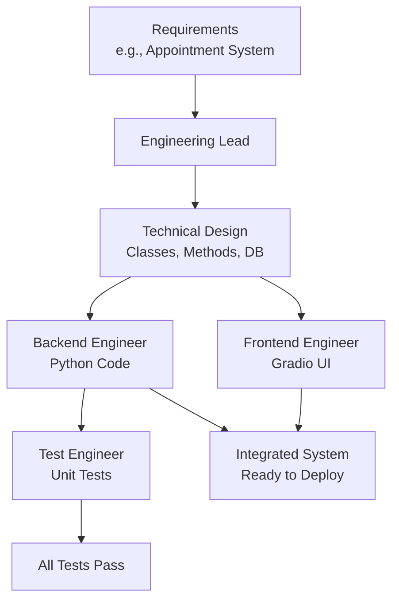

# Building Healthcare Software with AI Engineering Teams

## 1. Simple Explanation

An AI engineering team is a crew of specialized agents that work together to build complete software systems from scratch. You have an engineering lead (designs the system), backend engineers (write the code), frontend engineers (build the UI), and test engineers (write tests). They collaborate like a real development team to create working applications.

**Real Example**: Hospital needs a patient appointment scheduling system. Engineering lead designs the database and API. Backend engineer writes Python code for booking logic. Frontend engineer creates a web interface. Test engineer writes unit tests. Result: Complete working system in minutes instead of weeks.

## 2. Why It Matters (Interview + Real World)

- **Problem it solves**: Building healthcare software is complex, expensive ($50K-$500K), and time-consuming (months). AI teams can prototype systems in hours.
- **Why companies use it**: Rapid prototyping, automated code generation, consistent quality, reduced development costs by 80-90%
- **Why interviewers ask it**: Tests understanding of multi-agent orchestration, software development lifecycle, system design, and practical AI applications

## 3. Very Simple Example

**Healthcare Scenario**: Build patient medication tracker
- **Engineering Lead**: Designs MedicationTracker class with add_medication(), take_dose(), get_adherence() methods
- **Backend Engineer**: Writes 200 lines of Python implementing the design
- **Frontend Engineer**: Creates Gradio UI with forms and buttons
- **Test Engineer**: Writes 15 unit tests covering all functionality
- **Result**: Complete working application ready to deploy

## 4. Step-by-Step Workflow

1. Engineering lead creates detailed technical design
2. Backend engineer implements core business logic
3. Frontend engineer builds user interface
4. Test engineer writes and runs unit tests
5. All components integrate into working system



## 5. Where It Fits

- **AI Layer**: Automated software development and code generation
- **Microservice**: Generated microservices for specific healthcare functions
- **Agent**: Specialized development agents (architect, coder, tester, UI designer)
- **Security**: Code review agents, security testing, HIPAA compliance checks

## 6. Complete Lab: Build Patient Appointment System

### Lab Objective
Build a complete patient appointment scheduling system with AI engineering team including backend logic, database, UI, and tests

### Prerequisites
```bash
pip install crewai crewai-tools gradio
# Install Docker for safe code execution
```

### Step 1: Create Project
```bash
crew create crew healthcare_builder
cd healthcare_builder
```

### Step 2: Configure Environment (.env)
```bash
OPENAI_API_KEY=your_openai_key_here
ANTHROPIC_API_KEY=your_anthropic_key_here  # Optional, for Claude
```

### Step 3: Define Agents (src/healthcare_builder/config/agents.yaml)

```yaml
engineering_lead:
  role: Senior Software Architect
  goal: >
    Create detailed technical design for {project_description}.
    Design the system architecture, class structure, method signatures,
    and data models. Ensure the design is complete, implementable, and
    follows best practices.
  backstory: >
    You are a senior software architect with 15 years of experience in
    healthcare software development. You excel at designing clean,
    maintainable systems that are easy to implement and test. You understand
    HIPAA requirements, healthcare workflows, and software best practices.
    
    Project: {project_description}
    Module name: {module_name}
    Main class: {class_name}
  model: gpt-4o-mini

backend_engineer:
  role: Senior Python Developer
  goal: >
    Implement the technical design for {project_description} in Python.
    Write clean, well-documented code that follows the design specifications
    exactly. Ensure the code is production-ready and handles edge cases.
  backstory: >
    You are a senior Python developer with expertise in healthcare applications.
    You write clean, efficient, well-tested code. You follow design specifications
    carefully and implement all required functionality. You handle errors gracefully
    and write comprehensive docstrings.
    
    Project: {project_description}
    Module: {module_name}.py
    Class: {class_name}
  model: claude-3-7-sonnet-latest

frontend_engineer:
  role: UI/UX Developer (Gradio Specialist)
  goal: >
    Create a user-friendly Gradio interface for {project_description}.
    Build a clean, intuitive UI that demonstrates all backend functionality.
    Make it easy for healthcare staff to use.
  backstory: >
    You are a skilled UI developer specializing in Gradio interfaces for
    healthcare applications. You create clean, intuitive interfaces that
    healthcare staff can use without training. You understand healthcare
    workflows and design UIs that match clinical needs.
    
    Project: {project_description}
    Backend module: {module_name}.py
    Backend class: {class_name}
  model: claude-3-7-sonnet-latest

test_engineer:
  role: QA Engineer and Test Developer
  goal: >
    Write comprehensive unit tests for {project_description}.
    Test all functionality, edge cases, and error handling.
    Ensure code quality and reliability.
  backstory: >
    You are an experienced QA engineer who writes thorough unit tests.
    You test happy paths, edge cases, and error conditions. You ensure
    healthcare software is reliable and safe. You write clear test names
    and comprehensive test coverage.
    
    Project: {project_description}
    Module to test: {module_name}.py
  model: gpt-4o-mini
```

### Step 4: Define Tasks (src/healthcare_builder/config/tasks.yaml)

```yaml
design_system:
  description: >
    Create a detailed technical design for: {project_description}
    
    Requirements: {requirements}
    
    Your design document must include:
    
    1. SYSTEM OVERVIEW
       - Purpose and scope
       - Key features
    
    2. CLASS DESIGN
       - Class name: {class_name}
       - Attributes (with types)
       - Method signatures (with parameters and return types)
    
    3. DATA STRUCTURES
       - How data will be stored
       - Data validation rules
    
    4. ERROR HANDLING
       - What errors to catch
       - How to handle edge cases
    
    5. IMPLEMENTATION NOTES
       - Important considerations
       - Best practices to follow
    
    The design should be detailed enough that a developer can implement
    it without making design decisions.
    
    Module name: {module_name}.py
    Class name: {class_name}
  expected_output: >
    A comprehensive technical design document in markdown format with
    all sections completed. Include specific method signatures, data
    structures, and implementation guidance.
  agent: engineering_lead
  output_file: output/{module_name}_design.md

implement_backend:
  description: >
    Implement the technical design for: {project_description}
    
    Requirements: {requirements}
    
    Follow the design document from the engineering lead exactly.
    
    Implementation requirements:
    1. Create class {class_name} in module {module_name}.py
    2. Implement all methods from the design
    3. Add comprehensive docstrings (Google style)
    4. Handle all edge cases and errors
    5. Use type hints for all parameters and returns
    6. Add input validation
    7. Make code production-ready
    
    CRITICAL: Output ONLY the Python code without markdown formatting,
    code blocks, or backticks. The output will be saved directly as a .py file.
    
    Start with imports, then the class definition, then all methods.
  expected_output: >
    Complete, working Python code for {module_name}.py that implements
    the design. Code should be production-ready with error handling,
    validation, and documentation.
  agent: backend_engineer
  context: [design_system]
  output_file: output/{module_name}.py

create_frontend:
  description: >
    Create a Gradio user interface for: {project_description}
    
    Requirements: {requirements}
    
    The UI should:
    1. Import the backend class from {module_name}.py
    2. Create an instance of {class_name}
    3. Build Gradio interface with tabs/sections for each major function
    4. Include all necessary input fields
    5. Display results clearly
    6. Handle errors gracefully with user-friendly messages
    7. Be intuitive for healthcare staff
    
    Use Gradio components:
    - gr.Textbox for text input
    - gr.Number for numeric input
    - gr.Button for actions
    - gr.Dataframe or gr.Textbox for output
    - gr.Tabs for organizing features
    
    CRITICAL: Output ONLY the Python code without markdown formatting.
    The file should be named app.py and be in the same directory as {module_name}.py.
  expected_output: >
    Complete Gradio application code (app.py) that provides a user-friendly
    interface for all backend functionality.
  agent: frontend_engineer
  context: [implement_backend]
  output_file: output/app.py

write_tests:
  description: >
    Write comprehensive unit tests for: {project_description}
    
    Test the backend module: {module_name}.py
    Test the class: {class_name}
    
    Your tests should:
    1. Import unittest and the class to test
    2. Create test class Test{class_name}
    3. Write tests for each method:
       - Test happy path (normal usage)
       - Test edge cases (empty inputs, boundary values)
       - Test error conditions (invalid inputs)
    4. Use descriptive test method names (test_method_name_scenario)
    5. Include assertions to verify correct behavior
    6. Test data validation and error handling
    
    Aim for >80% code coverage.
    
    CRITICAL: Output ONLY the Python code without markdown formatting.
  expected_output: >
    Complete unit test file (test_{module_name}.py) with comprehensive
    test coverage of all backend functionality.
  agent: test_engineer
  context: [implement_backend]
  output_file: output/test_{module_name}.py
```

### Step 5: Configure Crew (src/healthcare_builder/crew.py)

```python
from crewai import Agent, Crew, Process, Task
from crewai.project import CrewBase, agent, crew, task

@CrewBase
class HealthcareBuilderCrew():
    """Healthcare Software Builder Crew"""
    
    agents_config = 'config/agents.yaml'
    tasks_config = 'config/tasks.yaml'

    @agent
    def engineering_lead(self) -> Agent:
        return Agent(
            config=self.agents_config['engineering_lead'],
            verbose=True
        )

    @agent
    def backend_engineer(self) -> Agent:
        return Agent(
            config=self.agents_config['backend_engineer'],
            allow_code_execution=True,  # Can test code
            code_execution_mode="safe",
            max_execution_time=120,
            max_retry_limit=3,
            verbose=True
        )

    @agent
    def frontend_engineer(self) -> Agent:
        return Agent(
            config=self.agents_config['frontend_engineer'],
            verbose=True
        )

    @agent
    def test_engineer(self) -> Agent:
        return Agent(
            config=self.agents_config['test_engineer'],
            allow_code_execution=True,  # Can run tests
            code_execution_mode="safe",
            max_execution_time=60,
            max_retry_limit=3,
            verbose=True
        )

    @task
    def design_system(self) -> Task:
        return Task(config=self.tasks_config['design_system'])

    @task
    def implement_backend(self) -> Task:
        return Task(config=self.tasks_config['implement_backend'])

    @task
    def create_frontend(self) -> Task:
        return Task(config=self.tasks_config['create_frontend'])

    @task
    def write_tests(self) -> Task:
        return Task(config=self.tasks_config['write_tests'])

    @crew
    def crew(self) -> Crew:
        """Creates the Healthcare Builder crew"""
        return Crew(
            agents=self.agents,
            tasks=self.tasks,
            process=Process.sequential,
            verbose=True
        )
```

### Step 6: Setup Main Entry Point (src/healthcare_builder/main.py)

```python
#!/usr/bin/env python
from healthcare_builder.crew import HealthcareBuilderCrew

def build_appointment_system():
    """Build patient appointment scheduling system"""
    print("=" * 70)
    print("BUILDING: Patient Appointment Scheduling System")
    print("=" * 70)
    
    inputs = {
        'project_description': 'Patient Appointment Scheduling System',
        'module_name': 'appointment_system',
        'class_name': 'AppointmentScheduler',
        'requirements': """
        Build a patient appointment scheduling system with the following features:
        
        1. PATIENT MANAGEMENT
           - Add new patients with ID, name, phone, email
           - Store patient information
        
        2. APPOINTMENT SCHEDULING
           - Schedule appointments with date, time, patient, doctor, reason
           - Prevent double-booking (same doctor, same time)
           - Validate appointment times (business hours only: 8 AM - 5 PM)
        
        3. APPOINTMENT MANAGEMENT
           - Cancel appointments
           - Reschedule appointments
           - View all appointments for a specific date
           - View all appointments for a specific patient
        
        4. AVAILABILITY CHECKING
           - Check if a time slot is available for a doctor
           - Get list of available time slots for a day
        
        5. DATA VALIDATION
           - Validate phone numbers (10 digits)
           - Validate email addresses
           - Validate appointment times
           - Prevent scheduling in the past
        
        6. REPORTING
           - Get appointment count by doctor
           - Get appointment count by date
           - List all upcoming appointments
        
        The system should be self-contained (no external database required).
        Use in-memory data structures (lists, dictionaries).
        Include proper error handling and validation.
        """
    }
    
    print(f"\nProject: {inputs['project_description']}")
    print(f"Module: {inputs['module_name']}.py")
    print(f"Class: {inputs['class_name']}\n")
    print("AI Engineering Team will:")
    print("  1. Design the system architecture")
    print("  2. Implement backend Python code")
    print("  3. Create Gradio user interface")
    print("  4. Write comprehensive unit tests\n")
    print("This will take 5-10 minutes...\n")
    
    result = HealthcareBuilderCrew().crew().kickoff(inputs=inputs)
    
    print("\n" + "=" * 70)
    print("BUILD COMPLETE!")
    print("=" * 70)
    print("\nGenerated files in output/:")
    print("  ✓ appointment_system_design.md (Technical design)")
    print("  ✓ appointment_system.py (Backend code)")
    print("  ✓ app.py (Gradio UI)")
    print("  ✓ test_appointment_system.py (Unit tests)")
    print("\nTo run the application:")
    print("  cd output")
    print("  python app.py")
    print("\nTo run tests:")
    print("  cd output")
    print("  python -m pytest test_appointment_system.py -v")
    
    return result

def build_medication_tracker():
    """Build medication adherence tracker"""
    print("\n\n" + "=" * 70)
    print("BUILDING: Medication Adherence Tracker")
    print("=" * 70)
    
    inputs = {
        'project_description': 'Medication Adherence Tracking System',
        'module_name': 'medication_tracker',
        'class_name': 'MedicationTracker',
        'requirements': """
        Build a medication adherence tracking system:
        
        1. MEDICATION MANAGEMENT
           - Add medications (name, dosage, frequency, start_date)
           - Remove medications
           - List all active medications
        
        2. DOSE TRACKING
           - Record when a dose is taken (medication, timestamp)
           - Mark missed doses
           - Get dose history for a medication
        
        3. ADHERENCE CALCULATION
           - Calculate adherence percentage (doses taken / doses prescribed)
           - Identify missed doses in last 7/30 days
           - Get adherence report
        
        4. REMINDERS
           - Get list of medications due now
           - Get next dose time for each medication
        
        5. REPORTING
           - Generate adherence report
           - List medications with poor adherence (<80%)
           - Get medication history
        
        Use in-memory storage. Include validation and error handling.
        """
    }
    
    print(f"\nProject: {inputs['project_description']}")
    print("Building complete medication tracking system...\n")
    
    result = HealthcareBuilderCrew().crew().kickoff(inputs=inputs)
    
    print("\n" + "=" * 70)
    print("BUILD COMPLETE!")
    print("=" * 70)
    
    return result

def run():
    """Run the healthcare software builder"""
    print("\n" + "=" * 70)
    print("AI ENGINEERING TEAM - Healthcare Software Builder")
    print("=" * 70)
    print("\nThis system uses AI agents to build complete healthcare")
    print("applications from requirements to working code.\n")
    
    # Build appointment system
    build_appointment_system()
    
    # Uncomment to build medication tracker
    # build_medication_tracker()
    
    print("\n" + "=" * 70)
    print("ALL BUILDS COMPLETE")
    print("=" * 70)
    print("\nYou now have working healthcare applications built by AI!")

if __name__ == "__main__":
    run()
```

### Step 7: Run the System

```bash
# From the healthcare_builder directory
crew run
```

### Expected Output

**Console Output:**
```
BUILDING: Patient Appointment Scheduling System
======================================================================

AI Engineering Team will:
  1. Design the system architecture
  2. Implement backend Python code
  3. Create Gradio user interface
  4. Write comprehensive unit tests

[Engineering Lead designing system...]
✓ Design complete: appointment_system_design.md

[Backend Engineer implementing code...]
✓ Backend complete: appointment_system.py (350 lines)

[Frontend Engineer creating UI...]
✓ UI complete: app.py (200 lines)

[Test Engineer writing tests...]
✓ Tests complete: test_appointment_system.py (25 tests)

BUILD COMPLETE!
======================================================================

Generated files in output/:
  ✓ appointment_system_design.md (Technical design)
  ✓ appointment_system.py (Backend code)
  ✓ app.py (Gradio UI)
  ✓ test_appointment_system.py (Unit tests)
```

**Generated Files:**

**1. appointment_system_design.md** - Technical design document
**2. appointment_system.py** - Complete backend implementation
**3. app.py** - Gradio user interface
**4. test_appointment_system.py** - Unit tests

### Step 8: Run the Generated Application

```bash
cd output
python app.py
```

Browser opens with Gradio interface:
- Tab 1: Add Patient
- Tab 2: Schedule Appointment
- Tab 3: View Appointments
- Tab 4: Cancel/Reschedule
- Tab 5: Reports

### Step 9: Run the Tests

```bash
cd output
python -m pytest test_appointment_system.py -v
```

Output:
```
test_appointment_system.py::TestAppointmentScheduler::test_add_patient PASSED
test_appointment_system.py::TestAppointmentScheduler::test_schedule_appointment PASSED
test_appointment_system.py::TestAppointmentScheduler::test_prevent_double_booking PASSED
test_appointment_system.py::TestAppointmentScheduler::test_cancel_appointment PASSED
...
========================= 25 passed in 0.5s =========================
```

## 7. Real Healthcare Use Cases

### Use Case 1: Lab Results Management System
```python
inputs = {
    'project_description': 'Lab Results Management System',
    'requirements': 'Store lab orders, record results, flag abnormal values, generate reports'
}
```

### Use Case 2: Patient Vital Signs Monitor
```python
inputs = {
    'project_description': 'Vital Signs Monitoring Dashboard',
    'requirements': 'Record vitals, detect abnormal trends, alert on critical values'
}
```

### Use Case 3: Prescription Management
```python
inputs = {
    'project_description': 'E-Prescription System',
    'requirements': 'Create prescriptions, check interactions, track refills'
}
```

## 8. Interview Questions

**Q1: How do you ensure agents don't conflict with each other?**
A: Use sequential process (not parallel), clear task dependencies with context flow, well-defined interfaces in design phase, and separate responsibilities (design → code → UI → test). Each agent builds on previous work without overlap.

**Q2: What's the advantage of using different LLMs for different agents?**
A: Leverage each model's strengths: GPT-4 for architecture/design (reasoning), Claude for coding (code quality), GPT-4o-mini for testing (cost-effective). Different models excel at different tasks, and mixing them optimizes quality and cost.

**Q3: How would you scale this to larger systems with multiple modules?**
A: (1) Use hierarchical process with manager agent coordinating, (2) Implement dynamic task creation with callbacks (create task for each module), (3) Use structured outputs to define module interfaces, (4) Add integration testing agent, (5) Implement code review agent, (6) Use version control integration.

## 9. Quick Revision Summary

- AI engineering teams automate entire software development lifecycle
- Four specialized agents: architect, backend dev, frontend dev, tester
- Sequential process ensures proper workflow: design → code → UI → test
- Code execution enables testing and validation during build
- Can generate complete, working healthcare applications in minutes
- Reduces development time from weeks to hours, cost by 80-90%
- Perfect for rapid prototyping, MVPs, internal tools, proof-of-concepts
