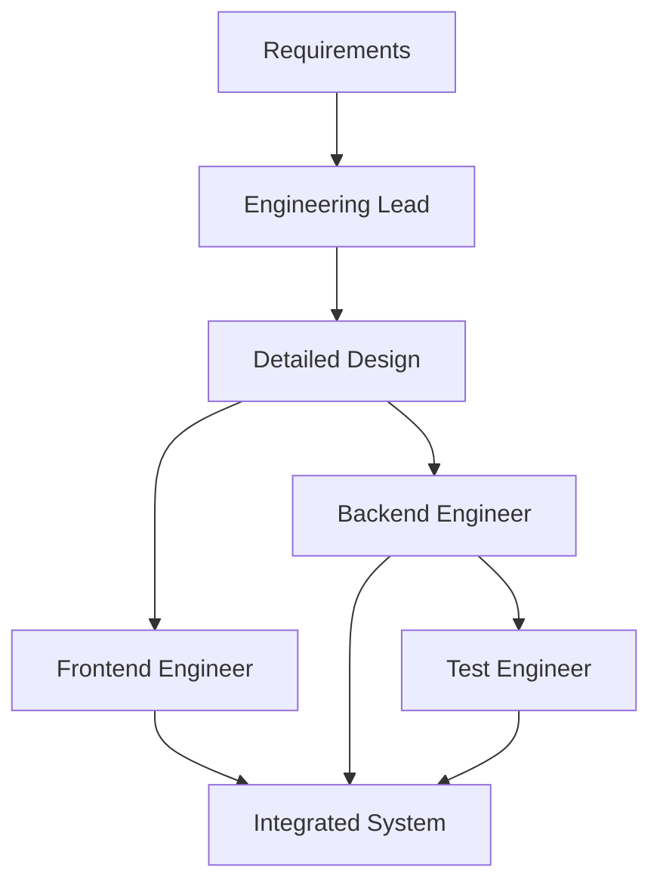

# Building Healthcare Software with AI Engineering Teams

## 1. Simple Explanation

An AI engineering team is a crew of specialized agents that work together to build complete software systems. You have an engineering lead (designs the system), backend engineers (write the code), frontend engineers (build the UI), and test engineers (write tests). They collaborate to create working applications.

## 2. Why It Matters (Interview + Real World)

- **Problem it solves**: Building software is complex and requires multiple skills; AI teams can automate the entire development process
- **Why companies use it**: Rapid prototyping, automated code generation, consistent quality, reduced development time
- **Why interviewers ask it**: Tests understanding of multi-agent orchestration, software development lifecycle, and practical AI applications

## 3. Very Simple Example

**Healthcare Scenario**: Build patient appointment system
- Engineering Lead: Designs database schema, API endpoints, UI flow
- Backend Engineer: Writes Python code for appointment logic
- Frontend Engineer: Creates Gradio UI for booking appointments
- Test Engineer: Writes unit tests for all functionality

## 4. Step-by-Step Workflow

1. Engineering lead creates detailed design
2. Backend engineer implements core logic
3. Frontend engineer builds user interface
4. Test engineer writes and runs tests
5. All components integrate into working system



## 5. Where It Fits

- **AI Layer**: Automated software development
- **Microservice**: Generated microservices for specific healthcare functions
- **Agent**: Specialized development agents (architect, coder, tester)
- **Security**: Code review agents, security testing agents

## 6. Lab

### Lab Objective
Build a patient medication tracker with AI engineering team

### Lab Steps
1. Create project: `crew create crew engineering_team`

2. Define agents in `agents.yaml`:
   ```yaml
   engineering_lead:
     role: Engineering Lead
     goal: Create detailed design for {requirements}
     model: gpt-4
   
   backend_engineer:
     role: Python Backend Engineer
     goal: Implement design for {requirements}
     model: claude-3-7-sonnet-latest
   
   frontend_engineer:
     role: Gradio UI Engineer
     goal: Build UI for backend module
     model: claude-3-7-sonnet-latest
   
   test_engineer:
     role: Test Engineer
     goal: Write unit tests for backend
     model: deepseek-chat
   ```

3. Define tasks with context flow:
   ```yaml
   design_task:
     agent: engineering_lead
     output_file: design.md
   
   code_task:
     agent: backend_engineer
     context: [design_task]
     output_file: {module_name}.py
   
   frontend_task:
     agent: frontend_engineer
     context: [code_task]
     output_file: app.py
   
   test_task:
     agent: test_engineer
     context: [code_task]
     output_file: test_{module_name}.py
   ```

4. Enable code execution for engineers:
   ```python
   @agent
   def backend_engineer(self) -> Agent:
       return Agent(
           config=self.agents_config['backend_engineer'],
           allow_code_execution=True,
           code_execution_mode="safe"
       )
   ```

5. Set requirements in `main.py`:
   ```python
   requirements = """
   Build a medication tracker that:
   - Stores patient medications with dosage and frequency
   - Tracks when medications are taken
   - Alerts for missed doses
   - Generates adherence reports
   """
   module_name = "medication_tracker"
   class_name = "MedicationTracker"
   ```

### Expected Outcome
- Complete working medication tracker system
- Backend Python module with full functionality
- Gradio UI for user interaction
- Comprehensive unit tests
- All code generated and tested automatically

## 7. Interview Questions

**Q1: How do you ensure agents don't conflict with each other?**
A: Use sequential process, clear task dependencies with context, and well-defined interfaces in the design phase.

**Q2: What's the advantage of using different LLMs for different agents?**
A: Leverage each model's strengths - GPT-4 for architecture, Claude for coding, DeepSeek for cost-effective testing.

**Q3: How would you scale this to larger systems?**
A: Use hierarchical process with manager agent, dynamic task creation with callbacks, and modular design with multiple backend engineers.

## 8. Quick Revision Summary

- AI engineering teams automate entire software development lifecycle
- Specialized agents for design, coding, UI, and testing
- Context flow ensures information passes between agents
- Code execution enables testing and validation
- Can generate complete, working healthcare applications
