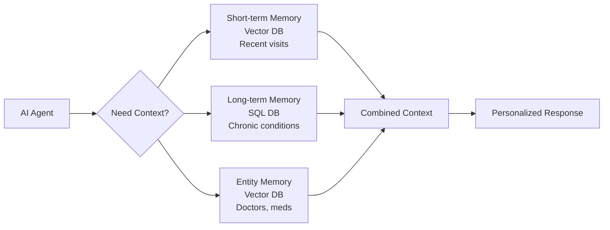

# Memory Systems in CrewAI: Vector Storage & SQL for Healthcare

## 1. Simple Explanation

Memory in AI agents means storing and retrieving past information across multiple interactions. CrewAI offers three types:
- **Short-term memory**: Recent conversations (last few visits) using vector search
- **Long-term memory**: Important facts (chronic conditions, allergies) in SQL database  
- **Entity memory**: Information about people, places, medications using vector search

**Real Example**: A patient calls about chest pain. The agent remembers: (1) Recent visits from short-term memory, (2) Chronic heart disease from long-term memory, (3) Current cardiologist from entity memory.

## 2. Why It Matters (Interview + Real World)

- **Problem it solves**: Agents need to remember patient history, avoid asking repeated questions, maintain continuity of care
- **Why companies use it**: Provides personalized care, reduces patient frustration, builds comprehensive profiles over time
- **Why interviewers ask it**: Tests understanding of RAG, vector databases, SQL, stateful systems, and production AI architecture

## 3. Very Simple Example

**Patient Follow-up Scenario**:
- **Short-term**: "Last visit 2 weeks ago, complained of headaches"
- **Long-term**: "Diabetic since 2020, allergic to penicillin"
- **Entity**: "Primary care: Dr. Smith, Pharmacy: CVS on Main St"

Agent: "I see you're back about headaches. How's your diabetes management going? Still avoiding penicillin-based antibiotics?"

## 4. Step-by-Step Workflow

1. Configure short-term memory (RAG with embeddings for semantic search)
2. Configure long-term memory (SQLite for structured facts)
3. Configure entity memory (vector storage for people/places/things)
4. Enable memory for specific agents
5. Agents automatically query relevant memories during tasks



## 5. Where It Fits

- **AI Layer**: Context management and retrieval across sessions
- **RAG**: Vector similarity search for relevant patient information
- **Microservice**: Patient history service, clinical context service
- **Security**: Encrypted storage, access control, HIPAA compliance, audit logs
- **Database**: Hybrid approach (vector + SQL) for optimal retrieval

## 6. Complete Lab: Patient Consultation System with Memory

### Lab Objective
Build a patient consultation system that remembers patient history across multiple visits using all three memory types

### Prerequisites
```bash
pip install crewai crewai-tools chromadb
```

### Step 1: Create Project
```bash
crew create crew patient_consultation
cd patient_consultation
```

### Step 2: Configure Environment (.env)
```bash
OPENAI_API_KEY=your_openai_key_here
```

### Step 3: Define Agents (src/patient_consultation/config/agents.yaml)

```yaml
primary_care_physician:
  role: Primary Care Physician
  goal: >
    Provide comprehensive primary care consultation for patient {patient_name}.
    Review patient history, current symptoms, and provide medical advice.
    Remember past interactions and build on previous conversations.
  backstory: >
    You are an experienced primary care physician with 15 years of practice.
    You excel at building long-term relationships with patients and providing
    continuity of care. You remember your patients' histories, chronic conditions,
    medications, and past concerns. You use this knowledge to provide personalized,
    context-aware medical advice.
    
    You are consulting with: {patient_name}
  model: gpt-4o-mini

medical_assistant:
  role: Medical Assistant
  goal: >
    Assist with patient {patient_name} by gathering information, documenting
    visits, and ensuring all relevant history is considered. Help the physician
    by retrieving past visit notes and medication lists.
  backstory: >
    You are a skilled medical assistant who maintains detailed patient records.
    You remember patient preferences, past visits, and important medical details.
    You help ensure continuity of care by bringing relevant history to each visit.
    
    You are assisting with: {patient_name}
  model: gpt-4o-mini
```

### Step 4: Define Tasks (src/patient_consultation/config/tasks.yaml)

```yaml
gather_patient_context:
  description: >
    Gather relevant patient context for {patient_name} before the consultation.
    
    Review and summarize:
    1. Recent visits and concerns (from short-term memory)
    2. Chronic conditions and allergies (from long-term memory)
    3. Current medications and healthcare providers (from entity memory)
    4. Any patterns or trends in patient's health
    
    Current visit reason: {visit_reason}
    
    Provide a concise summary that will help the physician provide
    personalized care.
  expected_output: >
    A patient context summary including recent history, chronic conditions,
    current medications, and relevant background for today's visit.
  agent: medical_assistant
  output_file: output/patient_context.md

conduct_consultation:
  description: >
    Conduct medical consultation for {patient_name}.
    
    Current visit reason: {visit_reason}
    
    Based on the patient context provided and your memory of this patient:
    1. Address the current concern
    2. Review relevant chronic conditions
    3. Check medication adherence
    4. Provide medical advice and recommendations
    5. Order any necessary tests or referrals
    6. Schedule follow-up if needed
    
    Be personalized and reference past visits when relevant.
    Show that you remember this patient and their history.
  expected_output: >
    A comprehensive consultation note including:
    - Assessment of current concern
    - Review of chronic conditions
    - Medication review
    - Recommendations and treatment plan
    - Follow-up instructions
  agent: primary_care_physician
  context: [gather_patient_context]
  output_file: output/consultation_note.md
```

### Step 5: Configure Crew with Memory (src/patient_consultation/crew.py)

```python
from crewai import Agent, Crew, Process, Task
from crewai.project import CrewBase, agent, crew, task
from crewai.memory import ShortTermMemory, LongTermMemory, EntityMemory
from crewai.memory.storage.rag_storage import RAGStorage
from crewai.memory.storage.ltm_sqlite_storage import LTMSQLiteStorage

@CrewBase
class PatientConsultationCrew():
    """Patient Consultation Crew with comprehensive memory"""
    
    agents_config = 'config/agents.yaml'
    tasks_config = 'config/tasks.yaml'

    @agent
    def primary_care_physician(self) -> Agent:
        return Agent(
            config=self.agents_config['primary_care_physician'],
            memory=True,  # Enable memory for this agent
            verbose=True
        )

    @agent
    def medical_assistant(self) -> Agent:
        return Agent(
            config=self.agents_config['medical_assistant'],
            memory=True,  # Enable memory for this agent
            verbose=True
        )

    @task
    def gather_patient_context(self) -> Task:
        return Task(
            config=self.tasks_config['gather_patient_context']
        )

    @task
    def conduct_consultation(self) -> Task:
        return Task(
            config=self.tasks_config['conduct_consultation']
        )

    @crew
    def crew(self) -> Crew:
        """Creates the Patient Consultation crew with memory"""
        
        # Configure Short-term Memory (recent interactions)
        short_term_memory = ShortTermMemory(
            storage=RAGStorage(
                provider="openai",
                model="text-embedding-3-small",
                path="memory/short_term"
            )
        )
        
        # Configure Long-term Memory (important facts)
        long_term_memory = LongTermMemory(
            storage=LTMSQLiteStorage(
                path="memory/long_term.db"
            )
        )
        
        # Configure Entity Memory (people, places, medications)
        entity_memory = EntityMemory(
            storage=RAGStorage(
                provider="openai",
                model="text-embedding-3-small",
                path="memory/entities"
            )
        )
        
        return Crew(
            agents=self.agents,
            tasks=self.tasks,
            process=Process.sequential,
            memory=True,  # Enable memory system
            short_term_memory=short_term_memory,
            long_term_memory=long_term_memory,
            entity_memory=entity_memory,
            verbose=True
        )
```

### Step 6: Setup Main Entry Point (src/patient_consultation/main.py)

```python
#!/usr/bin/env python
from patient_consultation.crew import PatientConsultationCrew
import time

def visit_1():
    """First patient visit - establishing baseline"""
    print("=" * 70)
    print("VISIT 1: Initial Consultation")
    print("=" * 70)
    
    inputs = {
        'patient_name': 'John Smith',
        'visit_reason': """
        New patient visit. Patient is 55-year-old male presenting for
        establishment of care. Has history of Type 2 Diabetes (diagnosed
        3 years ago) and hypertension (diagnosed 5 years ago).
        
        Current medications:
        - Metformin 1000mg twice daily
        - Lisinopril 20mg daily
        - Atorvastatin 40mg daily
        
        Allergies: Penicillin (rash)
        
        Patient reports good medication adherence. Blood sugar readings
        have been 120-140 mg/dL fasting. Blood pressure at home averages
        135/85 mmHg.
        
        Patient wants to discuss weight loss strategies and exercise program.
        """
    }
    
    print(f"\nPatient: {inputs['patient_name']}")
    print("Type: New patient establishment of care\n")
    
    result = PatientConsultationCrew().crew().kickoff(inputs=inputs)
    
    print("\n" + "=" * 70)
    print("VISIT 1 COMPLETE - Memory Stored")
    print("=" * 70)
    print("\nConsultation note saved to output/consultation_note.md")
    print("Patient history now in memory system\n")
    
    return result

def visit_2():
    """Second visit - follow-up, memory should recall previous visit"""
    print("\n\n" + "=" * 70)
    print("VISIT 2: Follow-up Visit (2 weeks later)")
    print("=" * 70)
    
    inputs = {
        'patient_name': 'John Smith',
        'visit_reason': """
        Follow-up visit. Patient reports starting exercise program as discussed.
        Walking 30 minutes daily for past 2 weeks. Has lost 3 pounds.
        
        However, patient is experiencing new symptom: occasional dizziness
        when standing up quickly, especially in the morning.
        
        Blood sugar readings: 110-130 mg/dL fasting (improved)
        Blood pressure at home: 118/75 mmHg (improved)
        
        Patient wants to know if dizziness is related to blood pressure
        medication and if dose adjustment is needed.
        """
    }
    
    print(f"\nPatient: {inputs['patient_name']}")
    print("Type: Follow-up visit\n")
    print("Testing memory: Agent should remember previous visit, medications,")
    print("chronic conditions, and exercise discussion...\n")
    
    result = PatientConsultationCrew().crew().kickoff(inputs=inputs)
    
    print("\n" + "=" * 70)
    print("VISIT 2 COMPLETE - Memory Updated")
    print("=" * 70)
    print("\nCheck consultation note - should reference previous visit!")
    print("Agent should remember: diabetes, hypertension, medications,")
    print("exercise plan, and weight loss goal\n")
    
    return result

def visit_3():
    """Third visit - testing long-term memory"""
    print("\n\n" + "=" * 70)
    print("VISIT 3: Routine Follow-up (3 months later)")
    print("=" * 70)
    
    inputs = {
        'patient_name': 'John Smith',
        'visit_reason': """
        Routine 3-month follow-up for diabetes and hypertension management.
        
        Patient reports:
        - Continuing exercise program (now up to 45 minutes daily)
        - Lost total of 12 pounds since first visit
        - Dizziness resolved after medication adjustment
        - Blood sugar well controlled: 100-120 mg/dL fasting
        - Blood pressure stable: 120/78 mmHg average
        
        Patient wants to discuss:
        - Possibly reducing diabetes medication due to improved control
        - Scheduling annual physical and lab work
        """
    }
    
    print(f"\nPatient: {inputs['patient_name']}")
    print("Type: 3-month follow-up\n")
    print("Testing long-term memory: Agent should remember entire history")
    print("including initial visit, medication changes, and progress...\n")
    
    result = PatientConsultationCrew().crew().kickoff(inputs=inputs)
    
    print("\n" + "=" * 70)
    print("VISIT 3 COMPLETE")
    print("=" * 70)
    print("\nMemory system demonstration complete!")
    print("Agent maintained continuity across 3 visits over 3 months\n")
    
    return result

def run():
    """Run all three visits to demonstrate memory"""
    print("\n" + "=" * 70)
    print("PATIENT CONSULTATION SYSTEM - Memory Demonstration")
    print("=" * 70)
    print("\nThis demo shows how CrewAI memory maintains patient context")
    print("across multiple visits using short-term, long-term, and entity memory.\n")
    
    # Visit 1: Initial consultation
    visit_1()
    time.sleep(2)  # Brief pause between visits
    
    # Visit 2: Follow-up (memory should recall visit 1)
    visit_2()
    time.sleep(2)
    
    # Visit 3: Long-term follow-up (memory should recall all history)
    visit_3()
    
    print("\n" + "=" * 70)
    print("MEMORY DEMONSTRATION COMPLETE")
    print("=" * 70)
    print("\nMemory files created in:")
    print("  - memory/short_term/ (Chroma vector database)")
    print("  - memory/long_term.db (SQLite database)")
    print("  - memory/entities/ (Chroma vector database)")
    print("\nThese files persist between runs, maintaining patient history!")

if __name__ == "__main__":
    run()
```

### Step 7: Run the System

```bash
# From the patient_consultation directory
crew run
```

### Expected Output

**Visit 1 Output:**
```
VISIT 1: Initial Consultation
======================================================================

Patient: John Smith
Type: New patient establishment of care

[Agent processes and stores in memory...]

CONSULTATION NOTE:

Patient: John Smith, 55-year-old male
Date: 2025-02-22

CHIEF COMPLAINT: Establishment of care

HISTORY:
- Type 2 Diabetes (3 years)
- Hypertension (5 years)

CURRENT MEDICATIONS:
- Metformin 1000mg BID
- Lisinopril 20mg daily
- Atorvastatin 40mg daily

ASSESSMENT:
Diabetes and hypertension reasonably controlled but room for improvement.

PLAN:
1. Continue current medications
2. Start exercise program: 30 min walking daily
3. Weight loss goal: 10-15 pounds over 3 months
4. Follow-up in 2 weeks

✓ Memory stored: chronic conditions, medications, treatment plan
```

**Visit 2 Output (Memory Recall):**
```
VISIT 2: Follow-up Visit (2 weeks later)
======================================================================

[Agent retrieves memory from Visit 1...]

PATIENT CONTEXT SUMMARY:
- Last visit 2 weeks ago: discussed exercise and weight loss
- Chronic conditions: Type 2 Diabetes, Hypertension
- Current meds: Metformin, Lisinopril, Atorvastatin
- Allergy: Penicillin

CONSULTATION NOTE:

Great to see you back, John! I'm pleased to hear you've started the
walking program we discussed and already lost 3 pounds - excellent progress
toward your 10-15 pound goal.

Regarding your dizziness: Your blood pressure has improved significantly
(118/75 from 135/85), which is wonderful, but may be causing orthostatic
hypotension. Let's reduce your Lisinopril to 10mg daily.

Your blood sugar control has also improved (110-130 from 120-140).
Keep up the exercise!

PLAN:
1. Reduce Lisinopril to 10mg daily
2. Continue exercise program
3. Monitor BP and dizziness
4. Follow-up in 3 months

✓ Memory updated: medication change, symptom resolution, progress tracking
```

**Visit 3 Output (Long-term Memory):**
```
VISIT 3: Routine Follow-up (3 months later)
======================================================================

[Agent retrieves comprehensive history...]

CONSULTATION NOTE:

John, it's wonderful to see your continued progress! You've lost 12 pounds
since we first met - that's fantastic. Your exercise program has clearly
paid off, and I'm glad the dizziness resolved after we adjusted your
Lisinopril dose.

Your diabetes control is excellent now (100-120 mg/dL). Given your
weight loss and improved control, let's consider reducing Metformin
to 500mg twice daily. We'll monitor closely.

PLAN:
1. Reduce Metformin to 500mg BID
2. Order annual labs: HbA1c, lipid panel, CMP, CBC
3. Schedule annual physical
4. Continue current exercise and diet
5. Follow-up in 3 months with lab results

✓ Complete patient history maintained across 3 months
```

## 7. Memory System Architecture

### What Gets Stored Where

**Short-term Memory (Vector DB):**
- Recent visit notes
- Conversation context
- Temporary concerns
- Recent symptoms

**Long-term Memory (SQL DB):**
- Chronic conditions
- Allergies
- Medication history
- Surgical history
- Family history

**Entity Memory (Vector DB):**
- Healthcare providers (Dr. Smith, Dr. Jones)
- Medications (Metformin, Lisinopril)
- Facilities (Main Street Clinic, City Hospital)
- Pharmacies (CVS, Walgreens)

### Memory Retrieval Process

```python
# When agent needs context, CrewAI automatically:
1. Queries short-term memory for recent interactions
2. Queries long-term memory for chronic conditions
3. Queries entity memory for people/places/medications
4. Combines all relevant information
5. Includes in agent's prompt
```

## 8. Real Healthcare Use Cases

### Use Case 1: Chronic Disease Management
```python
# Track diabetes management over years
# Remember A1C trends, medication adjustments, complications
```

### Use Case 2: Mental Health Therapy
```python
# Remember patient's triggers, coping strategies, progress
# Build therapeutic relationship over multiple sessions
```

### Use Case 3: Medication Reconciliation
```python
# Track all medication changes across visits
# Remember why medications were started/stopped
# Identify patterns in side effects
```

## 9. Interview Questions

**Q1: When would you use vector storage vs SQL storage?**
A: Vector storage (RAG) for semantic similarity searches - finding related symptoms, similar past visits, or relevant medical history. SQL for structured facts that need exact matching - patient demographics, lab values, medication lists, allergies. Use both together for comprehensive memory.

**Q2: How do you ensure HIPAA compliance with memory systems?**
A: (1) Encrypt data at rest (database encryption), (2) Encrypt in transit (TLS), (3) Implement access controls (only authorized agents), (4) Audit all memory queries (log who accessed what when), (5) Enable data retention policies (auto-delete after X years), (6) Use secure storage locations (not public cloud without BAA), (7) Implement patient consent tracking.

**Q3: What's the difference between short-term and long-term memory?**
A: Short-term stores recent interactions (last few visits, temporary concerns) in vector DB for semantic search. Long-term stores permanent facts (chronic conditions, allergies, surgical history) in SQL for reliable retrieval. Short-term may be cleared periodically; long-term persists indefinitely. Both are essential for continuity of care.

## 10. Quick Revision Summary

- Three memory types: short-term (recent, vector), long-term (facts, SQL), entity (people/places, vector)
- Enable with `memory=True` in crew and agents
- Configure storage: RAGStorage for vectors, LTMSQLiteStorage for SQL
- Agents automatically query relevant memories during tasks
- Critical for patient continuity, personalized care, avoiding repeated questions
- Requires HIPAA-compliant security: encryption, access control, audit logs
