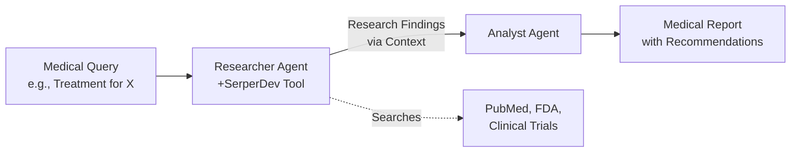

# Multi-Agent Medical Research System with CrewAI

## 1. Simple Explanation

A multi-agent research system uses specialized AI agents to gather, analyze, and synthesize information. One agent searches for medical information online, another analyzes the findings, and they pass information between each other to produce comprehensive medical reports.

**Real Example**: A hospital needs to research treatment options for a rare disease. The researcher agent searches medical journals, clinical trials, and FDA databases. The analyst agent reviews all findings, compares treatment efficacy, side effects, and costs, then creates an actionable report for physicians.

## 2. Why It Matters (Interview + Real World)

- **Problem it solves**: Medical research is time-consuming (hours/days), requires checking multiple sources, and needs expert analysis
- **Why companies use it**: Automates research that would take doctors 4-6 hours, ensures comprehensive coverage of latest studies, maintains consistency across reports
- **Why interviewers ask it**: Tests understanding of agent collaboration, context management, tool integration, and real-world AI applications

## 3. Very Simple Example

**Healthcare Scenario**: Research new diabetes medication "Ozempic"
- Researcher Agent: Finds 15 clinical studies, FDA approval status, 2024 safety data
- Analyst Agent: "Efficacy: 85% A1C reduction, Side effects: nausea (20%), Cost: $900/month, Recommendation: Effective but expensive"

## 4. Step-by-Step Workflow

1. Define researcher agent with web search tools (SerperDev)
2. Define analyst agent with analysis capabilities
3. Create research task (gather current medical information)
4. Create analysis task (synthesize findings into report)
5. Pass context from research to analysis automatically
6. Generate structured medical report



## 5. Where It Fits

- **AI Layer**: Research automation and knowledge synthesis
- **Microservice**: Medical research service, drug information service, clinical decision support
- **RAG**: Can be enhanced with internal medical literature database
- **Agent**: Specialized research and analysis agents with domain expertise
- **Security**: HIPAA-compliant logging, secure API access, audit trails

## 6. Complete Lab: Build Medical Research System

### Lab Objective
Build a medical research system that researches treatment options for specific conditions and generates comprehensive medical reports

### Prerequisites
```bash
pip install crewai crewai-tools
# Sign up for free SerperDev API key at https://serper.dev (2500 free searches)
```

### Step 1: Create Project
```bash
crew create crew medical_researcher
cd medical_researcher
```

### Step 2: Configure Environment (.env)
```bash
# Create .env file in project root
OPENAI_API_KEY=your_openai_key_here
SERPER_API_KEY=your_serper_key_here
```

### Step 3: Define Agents (src/medical_researcher/config/agents.yaml)

```yaml
medical_researcher:
  role: Senior Medical Researcher
  goal: >
    Research comprehensive, current information about {medical_condition}.
    Find the latest treatment options, clinical studies, FDA approvals,
    efficacy data, side effects, and cost information.
  backstory: >
    You are a senior medical researcher with 15 years of experience in
    clinical research. You excel at finding the most current and relevant
    medical information from reputable sources like PubMed, FDA databases,
    clinical trial registries, and peer-reviewed journals. You know how to
    identify credible sources and filter out unreliable information.
    
    You are researching: {medical_condition}
  model: gpt-4o-mini

clinical_analyst:
  role: Clinical Data Analyst and Report Writer
  goal: >
    Analyze the research findings about {medical_condition} and create a
    comprehensive, well-structured medical report. Compare treatment options,
    assess efficacy and safety, and provide clear recommendations for
    healthcare providers.
  backstory: >
    You are a skilled clinical analyst with expertise in evidence-based
    medicine. You excel at synthesizing complex medical research into clear,
    actionable reports for healthcare providers. You understand clinical
    significance, can interpret study results, and provide balanced
    recommendations considering efficacy, safety, and cost.
    
    You are analyzing research about: {medical_condition}
  model: gpt-4o-mini
```

### Step 4: Define Tasks (src/medical_researcher/config/tasks.yaml)

```yaml
research_medical_condition:
  description: >
    Conduct thorough research on {medical_condition} using web search.
    
    Find and document:
    1. Current standard treatments and emerging therapies
    2. Recent clinical studies (2023-2025) and their results
    3. FDA approval status for medications
    4. Efficacy rates and success metrics
    5. Common side effects and safety concerns
    6. Cost information and insurance coverage
    7. Patient outcomes and quality of life data
    8. Contraindications and special populations
    
    Search multiple sources:
    - Medical journals and PubMed
    - FDA announcements
    - Clinical trial databases
    - Medical association guidelines
    - Recent news about breakthroughs
    
    Organize findings clearly with sources cited.
  expected_output: >
    A comprehensive research document (800-1200 words) with:
    - Treatment options listed with details
    - Clinical study results with dates
    - Efficacy and safety data
    - Cost information
    - Sources cited for each major point
  agent: medical_researcher
  output_file: output/research_findings.md

analyze_and_report:
  description: >
    Analyze the research findings about {medical_condition} and create a
    comprehensive medical report for healthcare providers.
    
    Your report should include:
    
    1. EXECUTIVE SUMMARY
       - Brief overview of the condition
       - Key findings in 3-4 bullet points
    
    2. TREATMENT OPTIONS COMPARISON
       - List each treatment option
       - Efficacy rates and evidence level
       - Pros and cons of each option
    
    3. SAFETY PROFILE
       - Common side effects
       - Serious adverse events
       - Contraindications
    
    4. COST ANALYSIS
       - Approximate costs per treatment
       - Insurance coverage considerations
       - Cost-effectiveness assessment
    
    5. CLINICAL RECOMMENDATIONS
       - First-line treatment recommendations
       - Alternative options
       - Special considerations for different patient populations
    
    6. RECENT DEVELOPMENTS
       - New research or FDA approvals in last 2 years
       - Emerging therapies in pipeline
    
    Use clear medical terminology but explain complex concepts.
    Base all recommendations on the research evidence provided.
  expected_output: >
    A professional medical report (1000-1500 words) formatted in markdown
    with clear sections, bullet points, and evidence-based recommendations.
    The report should be suitable for use by physicians, pharmacists, and
    other healthcare providers.
  agent: clinical_analyst
  context: [research_medical_condition]
  output_file: output/medical_report.md
```

### Step 5: Configure Crew (src/medical_researcher/crew.py)

```python
from crewai import Agent, Crew, Process, Task
from crewai.project import CrewBase, agent, crew, task
from crewai_tools import SerperDevTool

@CrewBase
class MedicalResearcherCrew():
    """Medical Research Crew for analyzing treatment options"""
    
    agents_config = 'config/agents.yaml'
    tasks_config = 'config/tasks.yaml'

    @agent
    def medical_researcher(self) -> Agent:
        return Agent(
            config=self.agents_config['medical_researcher'],
            tools=[SerperDevTool()],  # Enable web search
            verbose=True
        )

    @agent
    def clinical_analyst(self) -> Agent:
        return Agent(
            config=self.agents_config['clinical_analyst'],
            verbose=True
        )

    @task
    def research_medical_condition(self) -> Task:
        return Task(
            config=self.tasks_config['research_medical_condition']
        )

    @task
    def analyze_and_report(self) -> Task:
        return Task(
            config=self.tasks_config['analyze_and_report']
        )

    @crew
    def crew(self) -> Crew:
        """Creates the Medical Research crew"""
        return Crew(
            agents=self.agents,
            tasks=self.tasks,
            process=Process.sequential,
            verbose=True
        )
```

### Step 6: Setup Main Entry Point (src/medical_researcher/main.py)

```python
#!/usr/bin/env python
from medical_researcher.crew import MedicalResearcherCrew

def run():
    """
    Run the Medical Research crew
    """
    # Define the medical condition to research
    inputs = {
        'medical_condition': 'Type 2 Diabetes treatment options including GLP-1 agonists'
    }
    
    print("=" * 70)
    print("MEDICAL RESEARCH SYSTEM")
    print("=" * 70)
    print(f"\nResearching: {inputs['medical_condition']}\n")
    print("This will take 2-3 minutes as we search and analyze medical literature...\n")
    
    # Run the crew
    result = MedicalResearcherCrew().crew().kickoff(inputs=inputs)
    
    print("\n" + "=" * 70)
    print("RESEARCH COMPLETE")
    print("=" * 70)
    print("\nReports generated in output/ directory:")
    print("  - research_findings.md (raw research data)")
    print("  - medical_report.md (analyzed report with recommendations)")
    
    return result

if __name__ == "__main__":
    run()
```

### Step 7: Run the Research System

```bash
# From the medical_researcher directory
crew run
```

### Expected Output

The system will create two files in the `output/` directory:

**1. output/research_findings.md** - Raw research data
```markdown
# Research Findings: Type 2 Diabetes Treatment Options

## Current Standard Treatments

### Metformin
- First-line therapy for T2D
- Efficacy: Reduces A1C by 1-2%
- Cost: $4-20/month (generic)
- Source: ADA Guidelines 2024

### GLP-1 Agonists (Ozempic, Wegovy, Mounjaro)
- Recent FDA approvals: Mounjaro (2022), Wegovy (2021)
- Efficacy: Reduces A1C by 1.5-2.5%
- Weight loss: 10-15% body weight
- Cost: $900-1,300/month
- Source: NEJM Study 2023

[... more detailed research ...]
```

**2. output/medical_report.md** - Analyzed report with recommendations
```markdown
# Medical Report: Type 2 Diabetes Treatment Options

## Executive Summary
Type 2 Diabetes affects 37M Americans. Multiple effective treatments
available with varying efficacy, cost, and side effect profiles.

Key Findings:
- GLP-1 agonists show superior A1C reduction and weight loss
- Metformin remains cost-effective first-line therapy
- Combination therapy often needed for optimal control

## Treatment Options Comparison

| Treatment | A1C Reduction | Weight Impact | Monthly Cost |
|-----------|---------------|---------------|--------------|
| Metformin | 1-2% | Neutral | $4-20 |
| GLP-1 | 1.5-2.5% | -10-15% | $900-1,300 |
| SGLT2 | 0.5-1% | -2-3kg | $400-600 |

[... detailed analysis ...]

## Clinical Recommendations

**First-Line:**
- Metformin for most patients (cost-effective, proven safety)

**Second-Line:**
- GLP-1 agonists for patients needing weight loss
- SGLT2 inhibitors for patients with cardiovascular disease

[... more recommendations ...]
```

## 7. Real Healthcare Use Cases

### Use Case 1: Drug Research
```python
inputs = {
    'medical_condition': 'Rheumatoid Arthritis biologics - comparing Humira, Enbrel, and Remicade'
}
```

### Use Case 2: Treatment Protocol Research
```python
inputs = {
    'medical_condition': 'Sepsis treatment protocols and early intervention strategies'
}
```

### Use Case 3: Rare Disease Research
```python
inputs = {
    'medical_condition': 'Duchenne Muscular Dystrophy - current treatments and gene therapy options'
}
```

### Use Case 4: Preventive Care Research
```python
inputs = {
    'medical_condition': 'Colorectal cancer screening guidelines and methods comparison'
}
```

## 8. Extending the System

### Add Structured Output for Database Storage

```python
from pydantic import BaseModel, Field
from typing import List

class TreatmentOption(BaseModel):
    name: str = Field(description="Treatment name")
    efficacy: str = Field(description="Efficacy rate or A1C reduction")
    side_effects: List[str] = Field(description="Common side effects")
    cost_per_month: str = Field(description="Approximate monthly cost")
    fda_approved: bool = Field(description="FDA approval status")

class MedicalReport(BaseModel):
    condition: str = Field(description="Medical condition researched")
    treatments: List[TreatmentOption] = Field(description="Treatment options")
    recommendation: str = Field(description="Clinical recommendation")

# In tasks.yaml, add to analyze_and_report task:
# output_pydantic: MedicalReport
```

### Add Custom PubMed Tool

```python
from crewai.tools import BaseTool
from pydantic import BaseModel, Field
import requests

class PubMedSearchInput(BaseModel):
    query: str = Field(description="Medical search query")
    max_results: int = Field(default=10, description="Maximum results")

class PubMedTool(BaseTool):
    name = "pubmed_search"
    description = "Search PubMed for medical research articles"
    args_schema = PubMedSearchInput
    
    def _run(self, query: str, max_results: int = 10) -> str:
        # Use PubMed E-utilities API
        base_url = "https://eutils.ncbi.nlm.nih.gov/entrez/eutils/"
        search_url = f"{base_url}esearch.fcgi"
        
        params = {
            'db': 'pubmed',
            'term': query,
            'retmax': max_results,
            'retmode': 'json'
        }
        
        response = requests.get(search_url, params=params)
        # Parse and return results
        return f"Found {len(results)} articles about {query}"

# Add to researcher agent:
# tools=[SerperDevTool(), PubMedTool()]
```

## 9. Interview Questions

**Q1: How do you pass information between agents in CrewAI?**
A: Use the `context` field in task definitions. In our example, `analyze_and_report` task has `context: [research_medical_condition]`, which automatically passes the research findings to the analyst agent. This ensures the analyst has all the research data without manual data passing.

**Q2: What tools would you integrate for medical research beyond SerperDev?**
A: PubMed API for peer-reviewed articles, FDA API for drug approvals, ClinicalTrials.gov API for ongoing studies, WHO database for global health data, and internal hospital EHR system for patient outcome data. Each tool would be a custom BaseTool implementation.

**Q3: How do you ensure research quality and accuracy?**
A: (1) Use multiple reputable sources and cross-reference, (2) Implement structured outputs with Pydantic to enforce data completeness, (3) Add a validation agent that checks citations, (4) Require evidence levels (e.g., "Level 1: RCT, Level 2: Cohort study"), (5) Add memory to track past research and avoid contradictions, (6) Implement human-in-the-loop review for critical decisions.

## 10. Quick Revision Summary

- Two-agent system: Researcher (gathers data) → Analyst (synthesizes report)
- SerperDev tool enables real-time web search for current medical information
- Context passing automatically flows research findings to analyst
- Sequential process ensures research completes before analysis begins
- Output files provide structured research data and actionable medical reports
- Easily extensible with custom tools (PubMed, FDA APIs) and structured outputs
