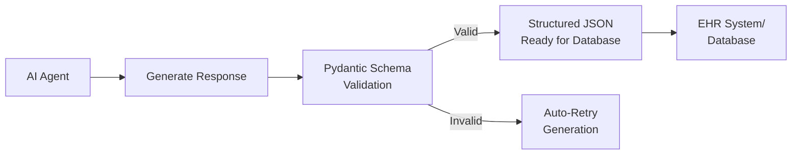

# Structured Outputs with Pydantic in CrewAI for Healthcare

## 1. Simple Explanation

Structured outputs force AI agents to return data in a specific JSON format instead of free-form text. Using Pydantic, you define exactly what fields you want (patient name, age, symptoms), their types (string, integer, list), and descriptions. The AI must follow this schema, ensuring consistent, machine-readable data every time.

**Real Example**: Instead of getting "Patient John Doe, 45 years old, has chest pain for 2 days" (hard to parse), you get:
```json
{
  "name": "John Doe",
  "age": 45,
  "chief_complaint": "chest pain",
  "duration_days": 2
}
```

## 2. Why It Matters (Interview + Real World)

- **Problem it solves**: AI responses are inconsistent ("45 years", "45", "forty-five") making database storage impossible
- **Why companies use it**: Enables direct integration with EHR systems, databases, and APIs without parsing errors
- **Why interviewers ask it**: Shows understanding of production-ready AI, data validation, type safety, and system integration

## 3. Very Simple Example

**Without Pydantic** (unreliable):
```
"Patient has fever, pretty bad, maybe 8 out of 10, started 3 days ago"
```

**With Pydantic** (reliable):
```json
{
  "symptom": "fever",
  "severity": 8,
  "duration_days": 3
}
```

## 4. Step-by-Step Workflow

1. Import Pydantic BaseModel
2. Define schema class with typed fields and descriptions
3. Create CrewAI task with `output_pydantic` parameter
4. Agent generates response matching schema
5. Pydantic validates data types automatically
6. Use structured JSON in your application



## 5. Where It Fits

- **AI Layer**: Output validation and formatting layer
- **Microservice**: API response standardization for health services
- **RAG**: Structured knowledge extraction from medical documents
- **Security**: Input validation, SQL injection prevention, data sanitization
- **EHR Integration**: Direct insertion into Electronic Health Records

## 6. Complete Lab: Patient Intake System with Structured Outputs

### Lab Objective
Build a patient intake system that extracts structured information from clinical notes and outputs validated JSON for EHR integration

### Prerequisites
```bash
pip install crewai crewai-tools pydantic
```

### Step 1: Create Project
```bash
crew create crew patient_intake
cd patient_intake
```

### Step 2: Configure Environment (.env)
```bash
OPENAI_API_KEY=your_openai_key_here
```

### Step 3: Define Pydantic Models (src/patient_intake/models.py)

Create a new file `models.py` in your project:

```python
from pydantic import BaseModel, Field
from typing import List, Optional
from datetime import date

class VitalSigns(BaseModel):
    """Patient vital signs"""
    temperature_f: float = Field(description="Temperature in Fahrenheit (e.g., 98.6)")
    blood_pressure_systolic: int = Field(description="Systolic BP (e.g., 120)")
    blood_pressure_diastolic: int = Field(description="Diastolic BP (e.g., 80)")
    heart_rate_bpm: int = Field(description="Heart rate in beats per minute")
    respiratory_rate: int = Field(description="Breaths per minute")
    oxygen_saturation: int = Field(description="O2 saturation percentage (e.g., 98)")

class Symptom(BaseModel):
    """Individual symptom details"""
    name: str = Field(description="Symptom name (e.g., 'chest pain', 'fever')")
    severity: int = Field(description="Severity on scale 1-10, where 10 is worst")
    duration_days: int = Field(description="How many days patient has had this symptom")
    description: str = Field(description="Additional details about the symptom")

class Medication(BaseModel):
    """Current medication"""
    name: str = Field(description="Medication name")
    dosage: str = Field(description="Dosage (e.g., '10mg', '500mg twice daily')")
    frequency: str = Field(description="How often taken (e.g., 'daily', 'twice daily')")

class PatientIntakeRecord(BaseModel):
    """Complete patient intake record"""
    # Demographics
    patient_name: str = Field(description="Patient full name")
    age: int = Field(description="Patient age in years")
    gender: str = Field(description="Patient gender (Male/Female/Other)")
    
    # Visit Information
    visit_date: str = Field(description="Date of visit in YYYY-MM-DD format")
    chief_complaint: str = Field(description="Primary reason for visit")
    
    # Clinical Data
    symptoms: List[Symptom] = Field(description="List of all symptoms patient is experiencing")
    vital_signs: VitalSigns = Field(description="Patient vital signs")
    current_medications: List[Medication] = Field(description="List of current medications")
    
    # Medical History
    allergies: List[str] = Field(description="List of known allergies")
    chronic_conditions: List[str] = Field(description="List of chronic medical conditions")
    
    # Assessment
    preliminary_assessment: str = Field(description="Initial clinical assessment")
    urgency_level: str = Field(description="Urgency: Routine, Urgent, or Emergency")
```

### Step 4: Define Agents (src/patient_intake/config/agents.yaml)

```yaml
intake_nurse:
  role: Clinical Intake Nurse
  goal: >
    Extract complete, accurate patient information from clinical notes
    about {patient_case}. Ensure all required fields are captured with
    proper medical terminology and accurate data.
  backstory: >
    You are an experienced intake nurse with 10 years in emergency and
    primary care. You excel at gathering complete patient information,
    asking the right questions, and documenting everything accurately
    in structured formats for EHR systems. You understand medical
    terminology and know what information is critical for patient care.
    
    You are processing: {patient_case}
  model: gpt-4o-mini
```

### Step 5: Define Tasks (src/patient_intake/config/tasks.yaml)

```yaml
extract_patient_data:
  description: >
    Extract structured patient information from the following clinical notes:
    {patient_case}
    
    You must extract and structure ALL of the following information:
    
    1. DEMOGRAPHICS: Name, age, gender
    2. VISIT INFO: Date, chief complaint
    3. SYMPTOMS: For each symptom, capture name, severity (1-10), duration in days, description
    4. VITAL SIGNS: Temperature (F), BP (systolic/diastolic), heart rate, respiratory rate, O2 sat
    5. MEDICATIONS: Current medications with dosage and frequency
    6. HISTORY: Allergies and chronic conditions
    7. ASSESSMENT: Preliminary assessment and urgency level (Routine/Urgent/Emergency)
    
    If information is not explicitly stated, make reasonable clinical inferences
    based on the context. For example:
    - If patient has "severe chest pain", severity might be 8-9/10
    - If "shortness of breath", respiratory rate might be elevated
    - If no allergies mentioned, use empty list
    
    Be thorough and accurate. This data will be entered directly into the EHR system.
  expected_output: >
    A complete PatientIntakeRecord object with all fields populated.
    All data must be in the correct format and types as defined in the schema.
  agent: intake_nurse
```

### Step 6: Configure Crew (src/patient_intake/crew.py)

```python
from crewai import Agent, Crew, Process, Task
from crewai.project import CrewBase, agent, crew, task
from patient_intake.models import PatientIntakeRecord

@CrewBase
class PatientIntakeCrew():
    """Patient Intake Crew for structured data extraction"""
    
    agents_config = 'config/agents.yaml'
    tasks_config = 'config/tasks.yaml'

    @agent
    def intake_nurse(self) -> Agent:
        return Agent(
            config=self.agents_config['intake_nurse'],
            verbose=True
        )

    @task
    def extract_patient_data(self) -> Task:
        return Task(
            config=self.tasks_config['extract_patient_data'],
            output_pydantic=PatientIntakeRecord  # This enforces structured output!
        )

    @crew
    def crew(self) -> Crew:
        """Creates the Patient Intake crew"""
        return Crew(
            agents=self.agents,
            tasks=self.tasks,
            process=Process.sequential,
            verbose=True
        )
```

### Step 7: Setup Main Entry Point (src/patient_intake/main.py)

```python
#!/usr/bin/env python
import json
from patient_intake.crew import PatientIntakeCrew

def run():
    """
    Run the Patient Intake crew with sample clinical notes
    """
    
    # Sample clinical notes (unstructured text)
    inputs = {
        'patient_case': """
        Patient: Sarah Johnson, 52-year-old female
        Date: 2025-02-22
        
        Chief Complaint: Severe chest pain and shortness of breath
        
        HPI: Patient presents to ED with acute onset chest pain that started 
        2 hours ago. Describes pain as crushing, radiating to left arm. 
        Pain severity 9/10. Also experiencing shortness of breath and nausea.
        
        Additional symptoms:
        - Nausea (moderate, started with chest pain)
        - Sweating (profuse, started 2 hours ago)
        - Dizziness (mild, intermittent for past hour)
        
        Vitals on arrival:
        - Temp: 98.4°F
        - BP: 165/95 mmHg
        - HR: 110 bpm
        - RR: 24 breaths/min
        - O2 Sat: 94% on room air
        
        Current Medications:
        - Lisinopril 10mg daily (hypertension)
        - Metformin 500mg twice daily (diabetes)
        - Aspirin 81mg daily (cardiac prophylaxis)
        
        Allergies: Penicillin (rash)
        
        Past Medical History:
        - Hypertension (diagnosed 5 years ago)
        - Type 2 Diabetes (diagnosed 3 years ago)
        - Hyperlipidemia
        
        Assessment: Acute coronary syndrome suspected. Patient is hemodynamically 
        stable but symptomatic. Requires immediate cardiac workup including EKG, 
        troponin, and cardiology consult.
        
        Urgency: EMERGENCY - Potential MI
        """
    }
    
    print("=" * 70)
    print("PATIENT INTAKE SYSTEM - Structured Data Extraction")
    print("=" * 70)
    print("\nProcessing clinical notes...\n")
    
    # Run the crew
    result = PatientIntakeCrew().crew().kickoff(inputs=inputs)
    
    # The result is now a validated Pydantic object!
    patient_data = result.pydantic
    
    print("\n" + "=" * 70)
    print("STRUCTURED PATIENT DATA EXTRACTED")
    print("=" * 70)
    
    # Convert to JSON for display
    patient_json = patient_data.model_dump_json(indent=2)
    print("\n" + patient_json)
    
    # Save to file for EHR integration
    with open('output/patient_record.json', 'w') as f:
        f.write(patient_json)
    
    print("\n" + "=" * 70)
    print("✓ Data validated and saved to output/patient_record.json")
    print("✓ Ready for EHR system integration")
    print("=" * 70)
    
    # Demonstrate accessing structured data
    print("\n" + "=" * 70)
    print("ACCESSING STRUCTURED DATA")
    print("=" * 70)
    print(f"\nPatient: {patient_data.patient_name}, Age {patient_data.age}")
    print(f"Chief Complaint: {patient_data.chief_complaint}")
    print(f"Urgency: {patient_data.urgency_level}")
    print(f"\nVital Signs:")
    print(f"  BP: {patient_data.vital_signs.blood_pressure_systolic}/{patient_data.vital_signs.blood_pressure_diastolic}")
    print(f"  HR: {patient_data.vital_signs.heart_rate_bpm} bpm")
    print(f"  Temp: {patient_data.vital_signs.temperature_f}°F")
    print(f"\nSymptoms ({len(patient_data.symptoms)}):")
    for symptom in patient_data.symptoms:
        print(f"  - {symptom.name}: Severity {symptom.severity}/10, Duration {symptom.duration_days} days")
    print(f"\nMedications ({len(patient_data.current_medications)}):")
    for med in patient_data.current_medications:
        print(f"  - {med.name} {med.dosage} {med.frequency}")
    
    return result

if __name__ == "__main__":
    run()
```

### Step 8: Run the System

```bash
# From the patient_intake directory
crew run
```

### Expected Output

**Console Output:**
```
STRUCTURED PATIENT DATA EXTRACTED
======================================================================

{
  "patient_name": "Sarah Johnson",
  "age": 52,
  "gender": "Female",
  "visit_date": "2025-02-22",
  "chief_complaint": "Severe chest pain and shortness of breath",
  "symptoms": [
    {
      "name": "chest pain",
      "severity": 9,
      "duration_days": 0,
      "description": "Crushing pain radiating to left arm"
    },
    {
      "name": "shortness of breath",
      "severity": 8,
      "duration_days": 0,
      "description": "Acute onset with chest pain"
    },
    {
      "name": "nausea",
      "severity": 5,
      "duration_days": 0,
      "description": "Moderate, started with chest pain"
    }
  ],
  "vital_signs": {
    "temperature_f": 98.4,
    "blood_pressure_systolic": 165,
    "blood_pressure_diastolic": 95,
    "heart_rate_bpm": 110,
    "respiratory_rate": 24,
    "oxygen_saturation": 94
  },
  "current_medications": [
    {
      "name": "Lisinopril",
      "dosage": "10mg",
      "frequency": "daily"
    },
    {
      "name": "Metformin",
      "dosage": "500mg",
      "frequency": "twice daily"
    },
    {
      "name": "Aspirin",
      "dosage": "81mg",
      "frequency": "daily"
    }
  ],
  "allergies": ["Penicillin"],
  "chronic_conditions": [
    "Hypertension",
    "Type 2 Diabetes",
    "Hyperlipidemia"
  ],
  "preliminary_assessment": "Acute coronary syndrome suspected",
  "urgency_level": "Emergency"
}

✓ Data validated and saved to output/patient_record.json
✓ Ready for EHR system integration
```

## 7. Real Healthcare Use Cases

### Use Case 1: Lab Results Extraction
```python
class LabResult(BaseModel):
    test_name: str
    value: float
    unit: str
    reference_range: str
    abnormal: bool

class LabReport(BaseModel):
    patient_id: str
    test_date: str
    results: List[LabResult]
```

### Use Case 2: Medication Reconciliation
```python
class MedicationReconciliation(BaseModel):
    patient_name: str
    home_medications: List[Medication]
    hospital_medications: List[Medication]
    discrepancies: List[str]
    reconciled_list: List[Medication]
```

### Use Case 3: Radiology Report Structuring
```python
class RadiologyFinding(BaseModel):
    location: str
    finding: str
    severity: str  # "mild", "moderate", "severe"
    
class RadiologyReport(BaseModel):
    patient_id: str
    study_type: str
    findings: List[RadiologyFinding]
    impression: str
    recommendations: List[str]
```

## 8. Benefits of Structured Outputs

### Before Pydantic (Problems):
```python
# Inconsistent formats
"Patient is 45 years old"
"Age: forty-five"
"45"

# Hard to parse
"BP is 120 over 80"
"Blood pressure: 120/80 mmHg"

# Missing data
"Patient has chest pain" (no severity, duration)
```

### After Pydantic (Solutions):
```python
# Always consistent
{"age": 45}

# Always parseable
{"bp_systolic": 120, "bp_diastolic": 80}

# Complete data enforced
{
  "symptom": "chest pain",
  "severity": 8,
  "duration_days": 2
}
```

## 9. Interview Questions

**Q1: Why use Pydantic over regular dictionaries?**
A: Pydantic provides: (1) Automatic type validation (age must be int, not string), (2) Clear documentation with Field descriptions, (3) Catches errors before database insertion, (4) IDE autocomplete support, (5) Automatic JSON serialization. Regular dicts have none of these protections.

**Q2: How do you handle nested medical data structures?**
A: Create nested Pydantic models. Example: `PatientRecord` contains `VitalSigns`, `List[Symptom]`, `List[Medication]`. Each is its own BaseModel. Pydantic validates the entire nested structure automatically.

**Q3: What happens if the AI returns invalid data?**
A: Pydantic raises `ValidationError` with specific details (e.g., "age must be integer, got string"). CrewAI can catch this and retry the task automatically, or you can implement custom error handling to prompt the agent to fix specific fields.

## 10. Quick Revision Summary

- Pydantic enforces strict JSON schemas for AI outputs
- Define models with `BaseModel` and typed fields with `Field()` descriptions
- Use `output_pydantic=YourModel` in CrewAI tasks
- Automatic validation ensures data quality before database insertion
- Critical for healthcare: prevents data corruption, enables EHR integration
- Nested models handle complex medical records (patient → vitals → medications)
