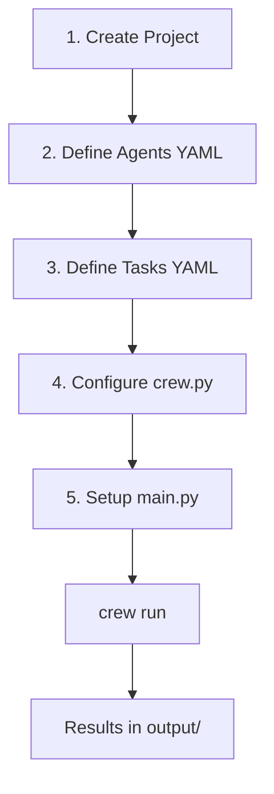

# Complete CrewAI Workflow Guide

## 1. Simple Explanation

This guide covers the complete workflow for building CrewAI projects from start to finish. It includes all five essential steps: project creation, agent definition, task configuration, crew setup, and execution. This is your end-to-end reference.

## 2. Why It Matters (Interview + Real World)

- **Problem it solves**: Provides a repeatable process for building multi-agent systems
- **Why companies use it**: Standardized approach ensures consistency and quality
- **Why interviewers ask it**: Tests comprehensive understanding of the framework

## 3. Very Simple Example

Complete workflow in 5 steps:
1. `crew create crew my_project`
2. Edit `agents.yaml` (define who)
3. Edit `tasks.yaml` (define what)
4. Edit `crew.py` (connect everything)
5. `crew run` (execute)

## 4. Step-by-Step Workflow

### Step 1: Create Project
```bash
crew create crew project_name
cd project_name
```

### Step 2: Define Agents (config/agents.yaml)
```yaml
agent_name:
  role: Role description
  goal: What agent should achieve
  backstory: Context and personality
  model: gpt-4o-mini  # or claude, deepseek, etc.
```

### Step 3: Define Tasks (config/tasks.yaml)
```yaml
task_name:
  description: What needs to be done
  expected_output: What format/content expected
  agent: agent_name
  context: [previous_task]  # Optional
  output_file: output/result.md  # Optional
```

### Step 4: Configure Crew (crew.py)
```python
from crewai import Agent, Crew, Task, Process
from crewai_tools import SerperDevTool

class ProjectCrew:
    @agent
    def agent_name(self) -> Agent:
        return Agent(
            config=self.agents_config['agent_name'],
            tools=[SerperDevTool()],  # Optional
            memory=True,  # Optional
            verbose=True
        )
    
    @task
    def task_name(self) -> Task:
        return Task(
            config=self.tasks_config['task_name']
        )
    
    @crew
    def crew(self) -> Crew:
        return Crew(
            agents=self.agents,
            tasks=self.tasks,
            process=Process.sequential,
            verbose=True
        )
```

### Step 5: Run (main.py)
```python
def run():
    inputs = {
        'variable': 'value'
    }
    result = ProjectCrew().crew().kickoff(inputs=inputs)
    print(result.raw)
```

Then execute:
```bash
crew run
```



## 5. Where It Fits

- **AI Layer**: Complete multi-agent system development
- **Microservice**: Can generate or orchestrate microservices
- **Agent**: Full agent lifecycle management

## 6. Lab

### Lab Objective
Build a complete content creation system with research, writing, and editing agents

### Lab Steps

**1. Create Project**
```bash
crew create crew content_creator
cd content_creator
```

**2. Define Agents (config/agents.yaml)**
```yaml
researcher:
  role: Content Researcher
  goal: Research {topic} thoroughly
  backstory: Expert researcher with attention to detail
  model: gpt-4o-mini

writer:
  role: Content Writer
  goal: Write engaging article about {topic}
  backstory: Skilled writer with clear, concise style
  model: claude-3-7-sonnet-latest

editor:
  role: Content Editor
  goal: Polish and improve the article
  backstory: Meticulous editor focused on quality
  model: gpt-4o-mini
```

**3. Define Tasks (config/tasks.yaml)**
```yaml
research_task:
  description: Research {topic} and gather key information
  expected_output: Comprehensive research notes
  agent: researcher
  output_file: output/research.md

writing_task:
  description: Write 500-word article about {topic}
  expected_output: Well-structured article
  agent: writer
  context: [research_task]
  output_file: output/draft.md

editing_task:
  description: Edit and improve the article
  expected_output: Polished final article
  agent: editor
  context: [writing_task]
  output_file: output/final.md
```

**4. Configure Crew (src/content_creator/crew.py)**
```python
from crewai import Agent, Crew, Task, Process
from crewai.project import CrewBase, agent, crew, task
from crewai_tools import SerperDevTool

@CrewBase
class ContentCreatorCrew:
    agents_config = 'config/agents.yaml'
    tasks_config = 'config/tasks.yaml'
    
    @agent
    def researcher(self) -> Agent:
        return Agent(
            config=self.agents_config['researcher'],
            tools=[SerperDevTool()],
            verbose=True
        )
    
    @agent
    def writer(self) -> Agent:
        return Agent(
            config=self.agents_config['writer'],
            verbose=True
        )
    
    @agent
    def editor(self) -> Agent:
        return Agent(
            config=self.agents_config['editor'],
            verbose=True
        )
    
    @task
    def research_task(self) -> Task:
        return Task(config=self.tasks_config['research_task'])
    
    @task
    def writing_task(self) -> Task:
        return Task(config=self.tasks_config['writing_task'])
    
    @task
    def editing_task(self) -> Task:
        return Task(config=self.tasks_config['editing_task'])
    
    @crew
    def crew(self) -> Crew:
        return Crew(
            agents=self.agents,
            tasks=self.tasks,
            process=Process.sequential,
            verbose=True
        )
```

**5. Setup Main (src/content_creator/main.py)**
```python
def run():
    inputs = {
        'topic': 'Artificial Intelligence in Healthcare'
    }
    
    result = ContentCreatorCrew().crew().kickoff(inputs=inputs)
    print(result.raw)

if __name__ == "__main__":
    run()
```

**6. Run**
```bash
crew run
```

### Expected Outcome
- Research notes in `output/research.md`
- Draft article in `output/draft.md`
- Final polished article in `output/final.md`
- Each agent builds on previous work
- Complete content creation pipeline

## 7. Interview Questions

**Q1: What's the purpose of each of the 5 steps?**
A: 1) Scaffolding, 2) Define who does work, 3) Define what work to do, 4) Connect agents/tasks/tools, 5) Execute with inputs.

**Q2: Can you skip any of these steps?**
A: You can skip YAML files and define everything in Python, but YAML separation is best practice for maintainability.

**Q3: How do you debug when something goes wrong?**
A: Set `verbose=True`, check output files, review task descriptions, verify context flow, check API keys, examine error logs.

## 8. Quick Revision Summary

- 5 steps: Create → Agents → Tasks → Crew → Run
- YAML for configuration, Python for orchestration
- Agents = who, Tasks = what, Crew = how
- Context flows from task to task
- `crew run` executes complete workflow
