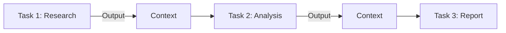

# Context Management Between Tasks in CrewAI

## 1. Simple Explanation

Context management is how you pass information from one task to another. When Task B needs the output from Task A, you specify Task A in Task B's context. This ensures agents have the information they need from previous steps in the workflow.

## 2. Why It Matters (Interview + Real World)

- **Problem it solves**: Agents need information from previous tasks to do their work effectively
- **Why companies use it**: Enables complex multi-step workflows where each step builds on previous results
- **Why interviewers ask it**: Tests understanding of data flow, workflow design, and agent collaboration

## 3. Very Simple Example

```yaml
research_task:
  description: Research the topic
  agent: researcher
  output_file: research.md

analysis_task:
  description: Analyze the research findings
  agent: analyst
  context: [research_task]  # Gets research_task output
  output_file: analysis.md
```

## 4. Step-by-Step Workflow

1. Task A executes and produces output
2. Task B specifies Task A in its context
3. Task B receives Task A's output automatically
4. Task B uses that information in its work
5. Process continues through all tasks



## 5. Where It Fits

- **AI Layer**: Information flow and data passing
- **Agent**: Inter-agent communication
- **Microservice**: Service-to-service data flow

## 6. Lab

### Lab Objective
Build a three-task workflow with context passing

### Lab Steps
1. Define tasks in `tasks.yaml`:
   ```yaml
   gather_data:
     description: Gather information about {topic}
     expected_output: Raw data and facts
     agent: researcher
     output_file: data.md
   
   analyze_data:
     description: Analyze the gathered data
     expected_output: Analysis with insights
     agent: analyst
     context: [gather_data]  # Receives data from gather_data
     output_file: analysis.md
   
   create_report:
     description: Create final report from analysis
     expected_output: Comprehensive report
     agent: writer
     context: [gather_data, analyze_data]  # Receives both
     output_file: report.md
   ```

2. Configure in `crew.py`:
   ```python
   @task
   def gather_data(self) -> Task:
       return Task(config=self.tasks_config['gather_data'])
   
   @task
   def analyze_data(self) -> Task:
       return Task(config=self.tasks_config['analyze_data'])
   
   @task
   def create_report(self) -> Task:
       return Task(config=self.tasks_config['create_report'])
   ```

3. Run workflow:
   ```python
   inputs = {"topic": "AI trends"}
   result = crew.kickoff(inputs=inputs)
   ```

### Expected Outcome
- Researcher gathers data
- Analyst receives and analyzes that data
- Writer receives both data and analysis
- Each task builds on previous work

## 7. Interview Questions

**Q1: What happens if you don't specify context?**
A: The task won't have access to previous outputs and will work in isolation, potentially missing critical information.

**Q2: Can a task have multiple contexts?**
A: Yes, use a list: `context: [task1, task2, task3]` to receive outputs from multiple previous tasks.

**Q3: How is context different from memory?**
A: Context is explicit task-to-task data passing; memory is persistent storage across multiple crew runs.

## 8. Quick Revision Summary

- Context passes output from one task to another
- Specify with `context: [previous_task]` in YAML
- Enables multi-step workflows
- Can reference multiple previous tasks
- Automatic - no manual data passing needed
