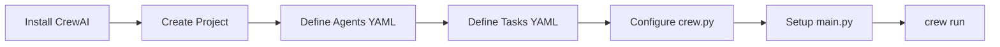

# CrewAI Setup and Project Structure

## 1. Simple Explanation

CrewAI is a framework for building multi-agent AI systems. Setting up a project involves creating a directory structure with configuration files (YAML) for agents and tasks, Python modules for orchestration, and a main file to run everything. The framework provides scaffolding to get started quickly.

## 2. Why It Matters (Interview + Real World)

- **Problem it solves**: Building multi-agent systems from scratch is complex; CrewAI provides structure and best practices
- **Why companies use it**: Rapid development, consistent architecture, built-in features (memory, tools, execution modes)
- **Why interviewers ask it**: Tests understanding of project organization, configuration management, and framework usage

## 3. Very Simple Example

```bash
# Create new project
crew create crew my_project

# Project structure created:
my_project/
├── src/
│   └── my_project/
│       ├── config/
│       │   ├── agents.yaml
│       │   └── tasks.yaml
│       ├── crew.py
│       └── main.py
└── output/
```

## 4. Step-by-Step Workflow

1. Install CrewAI: `pip install crewai`
2. Create project: `crew create crew project_name`
3. Define agents in `config/agents.yaml`
4. Define tasks in `config/tasks.yaml`
5. Configure crew in `crew.py`
6. Set inputs in `main.py`
7. Run: `crew run`



## 5. Where It Fits

- **AI Layer**: Multi-agent orchestration framework
- **Microservice**: Can generate microservices with agent teams
- **Agent**: Framework for building and managing agents

## 6. Lab

### Lab Objective
Create a basic CrewAI project and understand the structure

### Lab Steps
1. Install CrewAI:
   ```bash
   pip install crewai crewai-tools
   ```

2. Create project:
   ```bash
   crew create crew hello_crew
   cd hello_crew
   ```

3. Examine generated structure:
   - `config/agents.yaml` - Agent definitions
   - `config/tasks.yaml` - Task definitions
   - `crew.py` - Crew orchestration
   - `main.py` - Entry point

4. Define simple agent in `agents.yaml`:
   ```yaml
   greeter:
     role: Friendly Greeter
     goal: Greet the user warmly
     backstory: You're a cheerful assistant
     model: gpt-4o-mini
   ```

5. Define task in `tasks.yaml`:
   ```yaml
   greet_task:
     description: Greet {name} warmly
     expected_output: A friendly greeting
     agent: greeter
   ```

6. Run:
   ```bash
   crew run
   ```

### Expected Outcome
- Understanding of CrewAI project structure
- Ability to create and configure basic projects
- Knowledge of YAML configuration format

## 7. Interview Questions

**Q1: What's the purpose of separating agents and tasks into YAML files?**
A: Separates configuration from code, makes it easier to modify behavior without changing Python code, enables non-developers to configure agents.

**Q2: What's the difference between crew.py and main.py?**
A: crew.py defines the crew structure (agents, tasks, process); main.py is the entry point that sets inputs and runs the crew.

**Q3: How do you pass dynamic values to agents and tasks?**
A: Use template syntax with curly braces `{variable}` in YAML, then provide values in the inputs dictionary in main.py.

## 8. Quick Revision Summary

- CrewAI provides structured framework for multi-agent systems
- `crew create crew project_name` generates scaffolding
- YAML files for configuration, Python files for orchestration
- Template variables enable dynamic configuration
- `crew run` executes the entire workflow
