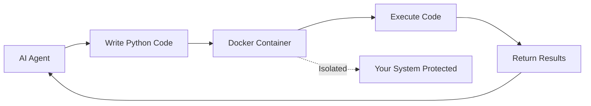

# Docker Safe Code Execution for AI Agents

## 1. Simple Explanation

Docker provides a safe, isolated environment (container) where AI agents can execute code without risking damage to your computer. When an agent writes and runs Python code, it happens inside this container, which can't access your files, network, or system resources.

## 2. Why It Matters (Interview + Real World)

- **Problem it solves**: Running AI-generated code directly on your system is dangerous; Docker provides isolation
- **Why companies use it**: Security, prevents malicious code, protects production systems
- **Why interviewers ask it**: Tests understanding of security, containerization, and safe AI deployment

## 3. Very Simple Example

```python
@agent
def coder(self) -> Agent:
    return Agent(
        role="Python Developer",
        allow_code_execution=True,
        code_execution_mode="safe",  # Uses Docker
        max_execution_time=30
    )
```
Code runs in isolated Docker container, not on your machine.

## 4. Step-by-Step Workflow

1. Install Docker Desktop
2. Enable code execution in agent
3. Set mode to "safe"
4. Agent writes Python code
5. Code executes in Docker container
6. Results return to agent
7. Container is destroyed



## 5. Where It Fits

- **AI Layer**: Safe code execution
- **Security**: Sandboxing, isolation, protection
- **Agent**: Code-executing agents

## 6. Lab

### Lab Objective
Set up safe code execution with Docker

### Lab Steps
1. Install Docker Desktop:
   - Windows/Mac: Download from docker.com
   - Linux: `sudo apt install docker.io`

2. Verify Docker is running:
   ```bash
   docker --version
   ```

3. Configure agent with safe execution:
   ```python
   @agent
   def data_analyst(self) -> Agent:
       return Agent(
           config=self.agents_config['analyst'],
           allow_code_execution=True,
           code_execution_mode="safe",  # Docker
           max_execution_time=60,  # seconds
           max_retry_limit=3
       )
   ```

4. Create task requiring computation:
   ```python
   @task
   def analyze_data(self) -> Task:
       return Task(
           description="Calculate statistics for dataset",
           expected_output="Code and results",
           agent=self.data_analyst()
       )
   ```

5. Run and observe Docker container creation:
   ```bash
   crew run
   # Docker container starts, executes code, returns results
   ```

### Expected Outcome
- Code executes safely in Docker
- Your system remains protected
- Results return successfully
- Container automatically cleaned up

## 7. Interview Questions

**Q1: What's the difference between "safe" and "unsafe" execution modes?**
A: Safe uses Docker isolation; unsafe runs directly on your system (faster but dangerous).

**Q2: What happens if code execution times out?**
A: Docker container is killed, agent receives timeout error, can retry based on max_retry_limit.

**Q3: Can Docker containers access the internet?**
A: By default, yes, but you can configure network isolation for additional security.

## 8. Quick Revision Summary

- Docker provides isolated execution environment
- Use `code_execution_mode="safe"` for security
- Protects your system from malicious/buggy code
- Requires Docker Desktop installation
- Essential for production AI code execution
