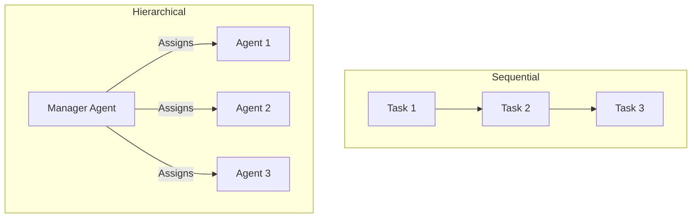

# Sequential vs Hierarchical Process in CrewAI

## 1. Simple Explanation

CrewAI offers two ways to execute tasks: Sequential (tasks run in order, one after another) and Hierarchical (a manager agent decides which agent does which task). Sequential is predictable and simple; hierarchical is flexible and autonomous.

## 2. Why It Matters (Interview + Real World)

- **Problem it solves**: Different workflows need different execution strategies
- **Why companies use it**: Sequential for predictable pipelines, hierarchical for complex decision-making
- **Why interviewers ask it**: Tests understanding of workflow orchestration and autonomous systems

## 3. Very Simple Example

**Sequential**: Research → Analyze → Report (fixed order)
**Hierarchical**: Manager assigns tasks based on agent availability and expertise

## 4. Step-by-Step Workflow

**Sequential Process:**
1. Task 1 executes
2. Task 2 executes (can use Task 1 output)
3. Task 3 executes (can use Task 1 & 2 output)

**Hierarchical Process:**
1. Manager agent receives all tasks
2. Manager decides which agent handles which task
3. Manager can reassign or delegate dynamically



## 5. Where It Fits

- **AI Layer**: Workflow orchestration
- **Agent**: Process management and task delegation
- **Microservice**: Service orchestration patterns

## 6. Lab

### Lab Objective
Compare sequential and hierarchical execution modes

### Lab Steps

**Sequential Setup:**
```python
@crew
def crew(self) -> Crew:
    return Crew(
        agents=self.agents,
        tasks=self.tasks,
        process=Process.sequential,
        verbose=True
    )
```

**Hierarchical Setup:**
```python
@crew
def crew(self) -> Crew:
    manager = Agent(
        role="Project Manager",
        goal="Coordinate team to achieve objectives",
        backstory="Experienced manager",
        allow_delegation=True,
        model="gpt-4"
    )
    
    return Crew(
        agents=self.agents,
        tasks=self.tasks,
        process=Process.hierarchical,
        manager_agent=manager,
        verbose=True
    )
```

**Alternative (simpler):**
```python
return Crew(
    agents=self.agents,
    tasks=self.tasks,
    process=Process.hierarchical,
    manager_llm="gpt-4",  # No custom agent needed
    verbose=True
)
```

### Expected Outcome
- Sequential: Predictable, ordered execution
- Hierarchical: Dynamic task assignment, more autonomous

## 7. Interview Questions

**Q1: When would you use sequential vs hierarchical?**
A: Sequential for fixed workflows (data pipeline, report generation); hierarchical for complex projects requiring dynamic decision-making.

**Q2: What are the trade-offs of hierarchical mode?**
A: Pros: Flexibility, autonomy, handles complexity. Cons: Less predictable, harder to debug, requires stronger LLM for manager.

**Q3: How do you ensure quality in hierarchical mode?**
A: Use strong LLM for manager (GPT-4), clear agent descriptions, well-defined tasks, and implement guardrails.

## 8. Quick Revision Summary

- Sequential: Fixed order, predictable, simple
- Hierarchical: Manager assigns tasks, flexible, autonomous
- Use `Process.sequential` or `Process.hierarchical`
- Hierarchical requires manager agent or manager LLM
- Choose based on workflow complexity and predictability needs
