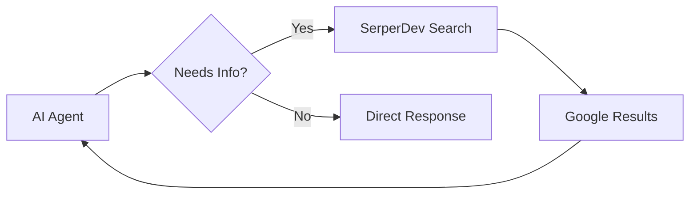

# Web Search Integration with SerperDev in CrewAI

## 1. Simple Explanation

SerperDev is a tool that lets AI agents search Google and get real-time information from the internet. Instead of relying on training data (which has a cutoff date), agents can look up current information, news, and facts. It's fast, affordable, and easy to integrate with CrewAI.

## 2. Why It Matters (Interview + Real World)

- **Problem it solves**: LLMs have knowledge cutoffs; web search provides current information
- **Why companies use it**: Enables agents to access real-time data, verify facts, research topics
- **Why interviewers ask it**: Tests understanding of tool integration, API usage, and overcoming LLM limitations

## 3. Very Simple Example

```python
from crewai_tools import SerperDevTool

@agent
def researcher(self) -> Agent:
    return Agent(
        role="Researcher",
        tools=[SerperDevTool()],
        model="gpt-4o-mini"
    )
```
Agent can now search: "latest AI regulations 2025"

## 4. Step-by-Step Workflow

1. Sign up at serper.dev (free 2500 credits)
2. Get API key
3. Add to .env: `SERPER_API_KEY=your_key`
4. Import SerperDevTool
5. Add to agent's tools list
6. Agent automatically searches when needed



## 5. Where It Fits

- **AI Layer**: Real-time information retrieval
- **RAG**: Alternative to vector database for current info
- **Agent**: Tool-equipped agents with web access

## 6. Lab

### Lab Objective
Create a research agent that uses web search for current information

### Lab Steps
1. Sign up at https://serper.dev
2. Get API key from dashboard
3. Add to `.env`:
   ```
   SERPER_API_KEY=your_api_key_here
   ```

4. Create agent with search capability:
   ```python
   from crewai_tools import SerperDevTool
   
   @agent
   def researcher(self) -> Agent:
       return Agent(
           config=self.agents_config['researcher'],
           tools=[SerperDevTool()],
           verbose=True
       )
   ```

5. Create research task:
   ```python
   @task
   def research_task(self) -> Task:
       return Task(
           description="Research latest developments in {topic}",
           expected_output="Comprehensive report with current information",
           agent=self.researcher()
       )
   ```

6. Run with current topic:
   ```python
   inputs = {"topic": "AI regulations 2025"}
   result = crew.kickoff(inputs=inputs)
   ```

### Expected Outcome
- Agent searches Google for current information
- Returns up-to-date results (not limited by training cutoff)
- Includes recent news, articles, and developments

## 7. Interview Questions

**Q1: Why use SerperDev instead of OpenAI's web search?**
A: SerperDev is free (2500 credits), faster, and costs nothing compared to OpenAI's $0.025 per search.

**Q2: How do you handle rate limits with SerperDev?**
A: Monitor credit usage, implement retry logic, cache results when possible, and upgrade plan if needed.

**Q3: What's the difference between SerperDev and RAG?**
A: SerperDev searches the live web for current info; RAG searches your own documents/knowledge base. Use both together for comprehensive coverage.

## 8. Quick Revision Summary

- SerperDev enables Google search from AI agents
- Free tier: 2500 searches
- Add to agent with `tools=[SerperDevTool()]`
- Overcomes LLM knowledge cutoff limitations
- Essential for research, news, and current events
