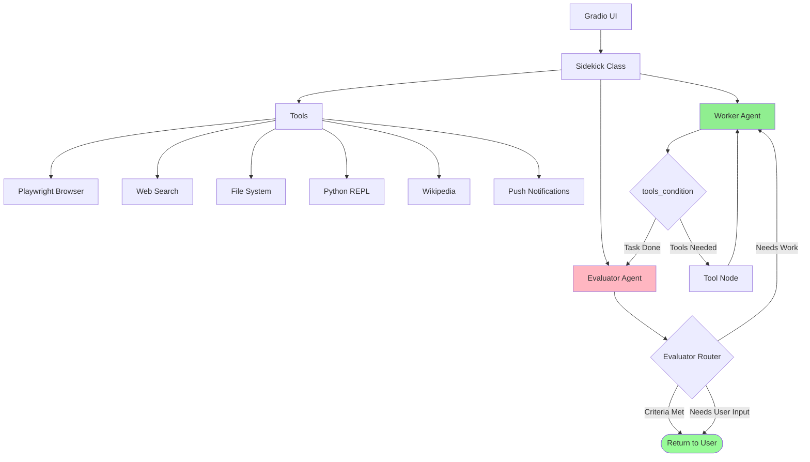

# Building AI Sidekick - Complete Project

## Simple Explanation

The AI Sidekick is a complete production-ready AI assistant that combines everything we've learned: multi-agent workflows, tool calling, browser automation, feedback loops, and memory. It's like building your own version of OpenAI's "Operator" agent - an AI that can browse the web, write files, run Python code, and complete complex tasks autonomously while you supervise.

**Key Components:**
- **Worker Agent**: Does the actual work (research, coding, file operations)
- **Evaluator Agent**: Checks if work meets quality standards
- **Feedback Loop**: Worker gets multiple attempts to improve based on evaluator feedback
- **Rich Toolset**: Web browsing (Playwright), web search, file system, Python execution, Wikipedia
- **Gradio UI**: Clean interface to interact with your sidekick
- **Memory**: Remembers conversation history across sessions

## Why It Matters

**For Interviews:**
- Demonstrates end-to-end AI system architecture
- Shows you can build production-ready applications, not just prototypes
- Combines multiple advanced concepts (multi-agent, tools, evaluation, memory)

**Real-World Value:**
- Automates research and data gathering tasks
- Can write code, create reports, analyze data
- Saves hours of manual work on repetitive tasks
- Provides 24/7 AI assistance for complex workflows

**Why Companies Use It:**
- **Productivity**: Automates tasks that would take humans hours
- **Consistency**: Quality control through evaluator ensures reliable outputs
- **Flexibility**: Easy to add new tools and capabilities
- **Transparency**: Can monitor every action the AI takes

## Very Simple Example

**Healthcare Scenario:**
```
User: "Research latest diabetes treatments and create a summary report"

Success Criteria: "Comprehensive report with citations from medical journals"

Sidekick Workflow:
1. Worker: Searches PubMed for diabetes treatments
2. Worker: Browses top 5 research papers
3. Worker: Extracts key findings
4. Worker: Writes summary to file "diabetes_report.md"
5. Evaluator: Checks if report has citations and is comprehensive
6. Evaluator: ❌ "Missing comparison of treatment effectiveness"
7. Worker: Adds comparison section
8. Evaluator: ✅ "Report meets criteria"
9. User: Receives completed report
```

**Real Example from Transcript:**
```
User: "What is the current USD to GBP exchange rate?"
Success Criteria: "Accurate answer"

Workflow:
1. Worker opens browser → navigates to exchange rate site
2. Worker extracts exchange rate: 0.77463
3. Evaluator checks accuracy
4. Evaluator: ✅ "Accurate, but should note rates change"
5. Returns: "Current USD to GBP is 0.77463 (rates may vary)"
```

## Architecture Overview



## Project Structure

```
4_langgraph/
├── sidekick_tools.py      # Tool definitions
├── sidekick.py            # Core Sidekick class with agents
├── app.py                 # Gradio UI
└── .env                   # API keys
```

## Complete Implementation

### 1. Tools Module (sidekick_tools.py)

```python
from langchain.tools import tool
from langchain_community.agent_toolkits.playwright.toolkit import PlaywrightBrowserToolkit
from langchain_community.tools import WikipediaQueryRun
from langchain_community.utilities import WikipediaAPIWrapper
from langchain_experimental.tools import PythonREPLTool
from playwright.async_api import async_playwright
import os

async def get_all_tools():
    """Get all tools for the sidekick"""
    
    # 1. Playwright browser tools
    playwright = await async_playwright().start()
    browser = await playwright.chromium.launch(headless=False)
    toolkit = PlaywrightBrowserToolkit.from_browser(async_context=browser)
    browser_tools = toolkit.get_tools()
    
    # 2. Web search tool
    @tool
    def search_web(query: str) -> str:
        """Search the web for information"""
        from langchain_community.utilities import GoogleSerperAPIWrapper
        search = GoogleSerperAPIWrapper()
        return search.run(query)
    
    # 3. File system tools
    @tool
    def write_file(filename: str, content: str) -> str:
        """Write content to a file in the workspace directory"""
        workspace_dir = "workspace"
        os.makedirs(workspace_dir, exist_ok=True)
        filepath = os.path.join(workspace_dir, filename)
        with open(filepath, 'w') as f:
            f.write(content)
        return f"File written successfully: {filepath}"
    
    @tool
    def read_file(filename: str) -> str:
        """Read content from a file in the workspace directory"""
        workspace_dir = "workspace"
        filepath = os.path.join(workspace_dir, filename)
        with open(filepath, 'r') as f:
            return f.read()
    
    # 4. Python REPL tool
    python_repl = PythonREPLTool()
    
    # 5. Wikipedia tool
    wikipedia = WikipediaQueryRun(api_wrapper=WikipediaAPIWrapper())
    
    # 6. Notification tool
    @tool
    def send_notification(message: str) -> str:
        """Send a push notification"""
        # Your notification logic here
        print(f"📱 Notification: {message}")
        return "Notification sent"
    
    # Combine all tools
    all_tools = (
        browser_tools + 
        [search_web, write_file, read_file, python_repl, wikipedia, send_notification]
    )
    
    return all_tools
```

### 2. Sidekick Core (sidekick.py)

```python
from typing import TypedDict, Annotated, Optional
from datetime import datetime
from pydantic import BaseModel, Field
from langchain_openai import ChatOpenAI
from langgraph.graph import StateGraph, START, END
from langgraph.graph.message import add_messages
from langgraph.prebuilt import ToolNode, tools_condition
from langgraph.checkpoint.memory import MemorySaver
import uuid

# Evaluation schema
class EvaluatorOutput(BaseModel):
    feedback: str = Field(description="Feedback on the assistant's response")
    success_criteria_met: bool = Field(description="Whether success criteria was met")
    user_input_needed: bool = Field(description="True if more input needed from user")

# State definition
class State(TypedDict):
    messages: Annotated[list, add_messages]
    success_criteria: str
    feedback_on_work: Optional[str]
    success_criteria_met: bool
    user_input_needed: bool

class Sidekick:
    def __init__(self, tools):
        self.tools = tools
        self.sidekick_id = str(uuid.uuid4())
        
        # Create LLMs
        self.worker_llm = ChatOpenAI(model="gpt-4o-mini", temperature=0)
        self.worker_llm_with_tools = self.worker_llm.bind_tools(tools)
        
        self.evaluator_llm = ChatOpenAI(model="gpt-4o-mini", temperature=0)
        self.evaluator_llm = self.evaluator_llm.with_structured_output(EvaluatorOutput)
        
        # Build graph
        self.graph = self._build_graph()
    
    def _worker_node(self, state: State):
        """Worker agent that attempts tasks"""
        
        # Build system message
        current_time = datetime.now().strftime("%Y-%m-%d %H:%M:%S")
        
        system_message = f"""You are a helpful AI assistant with access to various tools.
        
Current Date/Time: {current_time}

Success Criteria: {state['success_criteria']}

You should work on the task until either:
1. You have a question or need clarification from the user, OR
2. The success criteria has been met

IMPORTANT: 
- If you use the Python REPL tool, you MUST include print() statements to see output
- If you write files, mention the filename in your response
- Be thorough and check your work

If you have a question, clearly state: "QUESTION: [your question]"
If you're done, provide your final answer without asking follow-up questions.
"""
        
        # Add feedback if exists
        if state.get('feedback_on_work'):
            system_message += f"""

FEEDBACK: Your previous response was rejected.
Reason: {state['feedback_on_work']}

Please revise your response to meet the success criteria.
"""
        
        # Call LLM
        messages = [{"role": "system", "content": system_message}] + state['messages']
        response = self.worker_llm_with_tools.invoke(messages)
        
        return {"messages": [response]}
    
    def _worker_router(self, state: State):
        """Route worker to tools or evaluator"""
        last_message = state['messages'][-1].content
        
        # If worker is asking a question, go to user
        if "QUESTION:" in last_message:
            return "user_input"
        
        # Otherwise, send to evaluator
        return "evaluator"
    
    def _evaluator_node(self, state: State):
        """Evaluator agent that judges worker's output"""
        
        # Format conversation
        conversation = self._format_conversation(state['messages'])
        last_response = state['messages'][-1].content
        
        eval_prompt = f"""You are an evaluator that determines if a task has been completed successfully.

Conversation:
{conversation}

Success Criteria: {state['success_criteria']}

Final Response to Evaluate: {last_response}

Assess whether:
1. The success criteria has been met
2. The assistant needs more input from the user
3. Provide specific feedback if criteria not met

IMPORTANT:
- If the assistant says they've written a file or completed an action, trust them
- Give the benefit of the doubt, but reject if more work is clearly needed
- Be constructive in your feedback
"""
        
        evaluation = self.evaluator_llm.invoke(eval_prompt)
        
        return {
            "feedback_on_work": evaluation.feedback,
            "success_criteria_met": evaluation.success_criteria_met,
            "user_input_needed": evaluation.user_input_needed
        }
    
    def _evaluator_router(self, state: State):
        """Route evaluator to end or back to worker"""
        
        # If criteria met or user input needed, we're done
        if state['success_criteria_met'] or state['user_input_needed']:
            return END
        
        # Otherwise, send back to worker
        return "worker"
    
    def _format_conversation(self, messages):
        """Format messages for evaluator"""
        formatted = []
        for msg in messages:
            role = "User" if msg.type == "human" else "Assistant"
            formatted.append(f"{role}: {msg.content}")
        return "\n".join(formatted)
    
    def _build_graph(self):
        """Build the LangGraph workflow"""
        
        # Create graph
        graph = StateGraph(State)
        
        # Add nodes
        graph.add_node("worker", self._worker_node)
        graph.add_node("tools", ToolNode(self.tools))
        graph.add_node("evaluator", self._evaluator_node)
        
        # Add edges
        graph.add_edge(START, "worker")
        graph.add_conditional_edges(
            "worker",
            self._worker_router,
            {
                "evaluator": "evaluator",
                "user_input": END
            }
        )
        graph.add_conditional_edges("worker", tools_condition, {"tools": "tools"})
        graph.add_edge("tools", "worker")
        graph.add_conditional_edges("evaluator", self._evaluator_router)
        
        # Compile with memory
        memory = MemorySaver()
        return graph.compile(checkpointer=memory)
    
    async def run_super_step(self, user_message: str, success_criteria: str = None):
        """Run one super step of the sidekick"""
        
        # Default success criteria
        if not success_criteria:
            success_criteria = "The answer should be clear and accurate"
        
        # Create config for memory
        config = {"configurable": {"thread_id": self.sidekick_id}}
        
        # Initial state
        initial_state = {
            "messages": [("user", user_message)],
            "success_criteria": success_criteria,
            "feedback_on_work": None,
            "success_criteria_met": False,
            "user_input_needed": False
        }
        
        # Invoke graph
        result = await self.graph.ainvoke(initial_state, config=config)
        
        # Extract response
        assistant_reply = result['messages'][-2].content  # Second to last
        evaluator_feedback = result['messages'][-1].content  # Last
        
        return {
            "user_message": user_message,
            "assistant_reply": assistant_reply,
            "evaluator_feedback": evaluator_feedback
        }
```

### 3. Gradio UI (app.py)

```python
import gradio as gr
import asyncio
from sidekick import Sidekick
from sidekick_tools import get_all_tools

# Global sidekick instance
sidekick = None

async def initialize_sidekick():
    """Initialize sidekick with tools"""
    global sidekick
    tools = await get_all_tools()
    sidekick = Sidekick(tools)

async def process_message(message, success_criteria, history):
    """Process user message"""
    result = await sidekick.run_super_step(message, success_criteria)
    
    # Build history
    history.append((message, result['assistant_reply']))
    history.append((None, f"**Evaluator**: {result['evaluator_feedback']}"))
    
    return history, ""

def reset_conversation():
    """Reset the conversation"""
    global sidekick
    asyncio.run(initialize_sidekick())
    return [], ""

# Initialize on startup
asyncio.run(initialize_sidekick())

# Create Gradio interface
with gr.Blocks(theme=gr.themes.Soft()) as app:
    gr.Markdown("# 🤖 AI Sidekick - Your Personal AI Coworker")
    
    with gr.Row():
        with gr.Column(scale=3):
            chatbot = gr.Chatbot(label="Conversation", height=500)
            
            with gr.Row():
                message = gr.Textbox(
                    label="Your Message",
                    placeholder="What would you like me to do?",
                    scale=4
                )
                submit = gr.Button("Send", variant="primary", scale=1)
            
            success_criteria = gr.Textbox(
                label="Success Criteria (optional)",
                placeholder="e.g., 'Provide accurate answer with sources'",
                value="The answer should be clear and accurate"
            )
            
            reset = gr.Button("Reset Conversation")
    
    # Event handlers
    submit.click(
        process_message,
        inputs=[message, success_criteria, chatbot],
        outputs=[chatbot, message]
    )
    
    reset.click(
        reset_conversation,
        outputs=[chatbot, message]
    )

if __name__ == "__main__":
    app.launch()
```

## Running the Sidekick

```bash
# 1. Install dependencies
pip install langgraph langchain langchain-openai langchain-community
pip install playwright gradio python-dotenv
playwright install

# 2. Set up .env file
OPENAI_API_KEY=your_key_here
SERPER_API_KEY=your_key_here  # For web search

# 3. Run the app
python app.py
```

## Where It Fits

**In Smart Healthcare AI Platform:**

This Sidekick architecture can be adapted for healthcare-specific use cases:

### 1. Medical Research Assistant
```python
# Add healthcare-specific tools
@tool
def search_pubmed(query: str) -> str:
    """Search PubMed for medical research"""
    # Call PubMed API
    
@tool
def check_clinical_guidelines(condition: str) -> str:
    """Check clinical practice guidelines"""
    # Query guidelines database
```

### 2. Patient Care Coordinator
```python
# Healthcare workflow
User: "Schedule follow-up for diabetes patient, check lab results, send care plan"

Success Criteria: "All tasks completed with documentation"

Sidekick:
1. Checks patient's lab results from EHR
2. Schedules appointment based on availability
3. Generates personalized care plan
4. Sends care plan to patient via secure messaging
5. Documents all actions in patient record
```

### 3. Clinical Documentation Assistant
```python
# Automate documentation
Doctor: "Create discharge summary for patient #12345"

Success Criteria: "Complete discharge summary with all required sections"

Sidekick:
1. Retrieves patient admission notes
2. Gathers lab results and procedures
3. Checks medication list
4. Generates structured discharge summary
5. Evaluator checks for completeness
6. Saves to EHR system
```

## Best Practices

1. **Start Simple**: Begin with basic tools, add complexity gradually
2. **Monitor Closely**: Watch what the AI does, especially with file/code execution
3. **Refine Prompts**: Continuously improve system messages based on results
4. **Set Clear Criteria**: Specific success criteria lead to better outcomes
5. **Limit Iterations**: Prevent infinite loops (max 3-5 attempts)
6. **Use LangSmith**: Monitor all actions for debugging and improvement

## Safety Considerations

⚠️ **IMPORTANT**: This is an experimental application

- **File System**: Limited to workspace directory, but can still write/delete files
- **Python REPL**: Can execute arbitrary Python code - use with caution
- **Browser**: Runs in isolated Chromium instance without your cookies/passwords
- **Web Search**: Can access any public website
- **Recommendation**: Remove Python REPL tool if concerned about security

## Cost Considerations

- **Per Task**: $0.002 - $0.02 depending on complexity
- **Example**: Exchange rate lookup = $0.002
- **Example**: Research + report generation = $0.01 - $0.02
- **Scaling**: Costs add up with heavy use, but still very affordable
- **Optimization**: Use GPT-4o-mini for both worker and evaluator

## Real-World Applications

1. **Research & Reporting**: Gather information, synthesize, create reports
2. **Data Analysis**: Load data, analyze, generate visualizations
3. **Code Generation**: Write scripts, test code, debug issues
4. **Content Creation**: Research topics, write articles, fact-check
5. **Task Automation**: Multi-step workflows that would take hours manually

This is your canvas - customize tools, prompts, and workflows for your specific needs!
