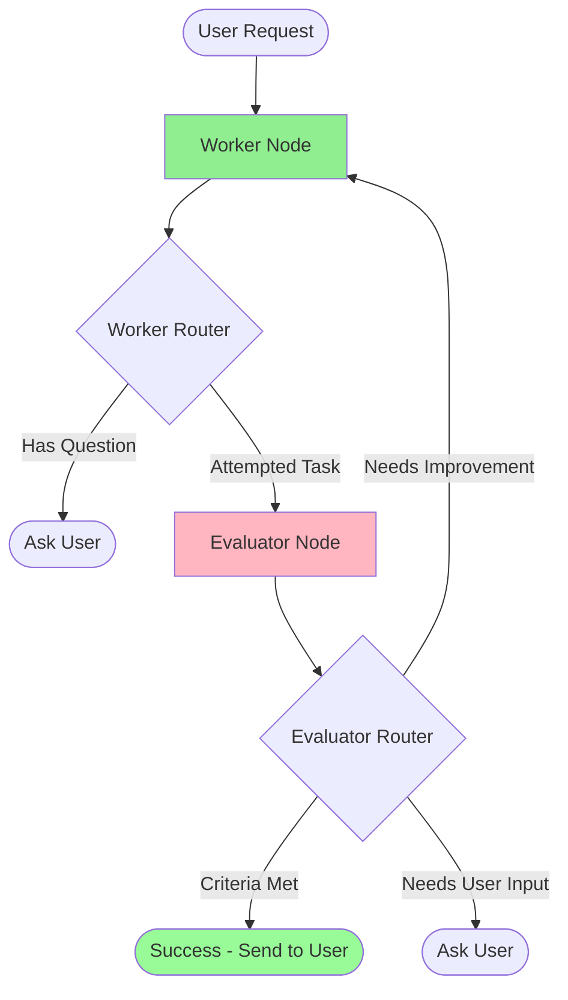

# LLM Evaluator Agents and Feedback Loops

## Simple Explanation

An evaluator agent is an AI that judges the work of another AI. Instead of sending every AI response directly to the user, you have a second AI (the evaluator) check if the response meets quality standards. If not, it sends feedback to the first AI (the worker) to try again.

This creates a feedback loop:
1. **Worker AI** attempts the task
2. **Evaluator AI** checks if it's good enough
3. If not good → Send feedback to Worker → Worker tries again
4. If good → Send to user

This pattern dramatically improves output quality because the worker AI gets multiple chances to refine its response based on expert feedback.

## Why It Matters

**For Interviews:**
- Shows you understand quality control in AI systems
- Demonstrates knowledge of multi-agent architectures
- Feedback loops are critical for production AI reliability

**Real-World Value:**
- Catches errors before users see them
- Improves response quality without manual review
- Reduces hallucinations and incorrect information
- Provides automatic quality assurance

**Why Companies Use It:**
- **Quality Control**: Automated QA for AI outputs
- **Compliance**: Ensure responses meet regulatory standards
- **Consistency**: Maintain quality across all interactions
- **Cost Savings**: Catch errors before human review needed

## Very Simple Example

**Healthcare Scenario:**
```
Patient: "What medication should I take for my headache?"

Worker AI: "Take 1000mg of aspirin"

Evaluator AI: "❌ REJECTED - Didn't ask about allergies or other medications"

Worker AI (retry): "Before I recommend medication, do you have any allergies? Are you taking any other medications?"

Evaluator AI: "✅ APPROVED - Properly gathered safety information"

→ Send to patient
```

**Without Evaluator:**
Patient gets potentially dangerous advice immediately

**With Evaluator:**
Patient gets safe, thorough response

## Step-by-Step Workflow

### 1. Define Evaluation Schema

```python
from pydantic import BaseModel, Field

class EvaluatorOutput(BaseModel):
    """Schema for evaluator's judgment"""
    feedback: str = Field(description="Feedback on the assistant's response")
    success_criteria_met: bool = Field(description="Whether success criteria was met")
    user_input_needed: bool = Field(description="True if more input needed from user")
```

### 2. Define Rich State

```python
from typing import TypedDict, Annotated, Optional
from langgraph.graph.message import add_messages

class State(TypedDict):
    messages: Annotated[list, add_messages]  # Conversation history
    success_criteria: str  # What defines success
    feedback_on_work: Optional[str]  # Evaluator's feedback
    success_criteria_met: bool  # Is task complete?
    user_input_needed: bool  # Does user need to provide more info?
```

### 3. Create Worker Node

```python
def worker_node(state: State):
    """Worker AI that attempts the task"""
    
    # Build system message with success criteria
    system_message = f"""You are a helpful assistant that can use tools to complete tasks.
    
    Success Criteria: {state['success_criteria']}
    
    Keep working until either:
    1. You have a question for the user, OR
    2. The success criteria has been met
    
    If you have a question, clearly state: "QUESTION: [your question]"
    If you're done, provide your final answer without asking follow-up questions.
    """
    
    # If there's feedback, add it to the system message
    if state.get('feedback_on_work'):
        system_message += f"""
        
        FEEDBACK: Your previous response was rejected.
        Reason: {state['feedback_on_work']}
        
        Please revise your response to meet the success criteria.
        """
    
    # Call LLM with tools
    response = worker_llm_with_tools.invoke([
        {"role": "system", "content": system_message},
        *state['messages']
    ])
    
    return {"messages": [response]}
```

### 4. Create Evaluator Node

```python
def evaluator_node(state: State):
    """Evaluator AI that judges worker's output"""
    
    # Get worker's last response
    last_message = state['messages'][-1].content
    
    # Build evaluation prompt
    eval_prompt = f"""Evaluate this assistant's response against the success criteria.
    
    Success Criteria: {state['success_criteria']}
    
    Assistant's Response: {last_message}
    
    Determine:
    1. Is the success criteria met?
    2. Does the assistant need more input from the user?
    3. Provide specific feedback if criteria not met
    """
    
    # Call evaluator LLM with structured output
    evaluation = evaluator_llm.invoke(eval_prompt)
    
    return {
        "feedback_on_work": evaluation.feedback,
        "success_criteria_met": evaluation.success_criteria_met,
        "user_input_needed": evaluation.user_input_needed
    }
```

### 5. Create Router Function

```python
def worker_router(state: State):
    """Decide where to route after worker completes"""
    
    # If worker is asking for user input, go to END
    last_message = state['messages'][-1].content
    if "QUESTION:" in last_message:
        return "user_input"
    
    # Otherwise, send to evaluator
    return "evaluator"

def evaluator_router(state: State):
    """Decide where to route after evaluation"""
    
    # If success criteria met, we're done
    if state['success_criteria_met']:
        return END
    
    # If user input needed, go to END to get user response
    if state['user_input_needed']:
        return END
    
    # Otherwise, send back to worker for another attempt
    return "worker"
```

### 6. Build Graph

```python
from langgraph.graph import StateGraph, START, END

# Create graph
graph = StateGraph(State)

# Add nodes
graph.add_node("worker", worker_node)
graph.add_node("evaluator", evaluator_node)
graph.add_node("tools", tool_node)

# Add edges
graph.add_edge(START, "worker")

# Worker can go to tools or evaluator
graph.add_conditional_edges(
    "worker",
    worker_router,
    {
        "evaluator": "evaluator",
        "user_input": END
    }
)

# Tools always go back to worker
graph.add_edge("tools", "worker")

# Evaluator can end or loop back to worker
graph.add_conditional_edges(
    "evaluator",
    evaluator_router,
    {
        "worker": "worker",
        END: END
    }
)

# Compile
app = graph.compile(checkpointer=memory)
```

## Complete Code Example

```python
from typing import TypedDict, Annotated, Optional
from pydantic import BaseModel, Field
from langchain_openai import ChatOpenAI
from langgraph.graph import StateGraph, START, END
from langgraph.graph.message import add_messages
from langgraph.prebuilt import ToolNode, tools_condition

# 1. Define evaluation schema
class EvaluatorOutput(BaseModel):
    feedback: str = Field(description="Feedback on the assistant's response")
    success_criteria_met: bool = Field(description="Whether success criteria was met")
    user_input_needed: bool = Field(description="True if more input needed from user")

# 2. Define state
class State(TypedDict):
    messages: Annotated[list, add_messages]
    success_criteria: str
    feedback_on_work: Optional[str]
    success_criteria_met: bool
    user_input_needed: bool

# 3. Create LLMs
worker_llm = ChatOpenAI(model="gpt-4o-mini")
worker_llm_with_tools = worker_llm.bind_tools(tools)

evaluator_llm = ChatOpenAI(model="gpt-4o-mini").with_structured_output(EvaluatorOutput)

# 4. Define nodes
def worker_node(state: State):
    system_msg = f"""You are a helpful medical assistant.
    
    Success Criteria: {state['success_criteria']}
    
    {f"FEEDBACK: {state['feedback_on_work']}" if state.get('feedback_on_work') else ""}
    """
    
    response = worker_llm_with_tools.invoke([
        {"role": "system", "content": system_msg},
        *state['messages']
    ])
    
    return {"messages": [response]}

def evaluator_node(state: State):
    last_message = state['messages'][-1].content
    
    eval_prompt = f"""Evaluate this response:
    
    Success Criteria: {state['success_criteria']}
    Response: {last_message}
    """
    
    evaluation = evaluator_llm.invoke(eval_prompt)
    
    return {
        "feedback_on_work": evaluation.feedback,
        "success_criteria_met": evaluation.success_criteria_met,
        "user_input_needed": evaluation.user_input_needed
    }

# 5. Define routers
def worker_router(state: State):
    if "QUESTION:" in state['messages'][-1].content:
        return "user_input"
    return "evaluator"

def evaluator_router(state: State):
    if state['success_criteria_met'] or state['user_input_needed']:
        return END
    return "worker"

# 6. Build graph
graph = StateGraph(State)
graph.add_node("worker", worker_node)
graph.add_node("evaluator", evaluator_node)
graph.add_node("tools", ToolNode(tools))

graph.add_edge(START, "worker")
graph.add_conditional_edges("worker", tools_condition, {"tools": "tools", "evaluator": "evaluator"})
graph.add_edge("tools", "worker")
graph.add_conditional_edges("evaluator", evaluator_router)

app = graph.compile()

# 7. Run
result = app.invoke({
    "messages": [("user", "I have a headache")],
    "success_criteria": "Gather patient allergies and current medications before recommending treatment"
})
```

## Workflow Diagram



## Where It Fits

**In Smart Healthcare AI Platform:**

- **Medical Assistant Agent**: Evaluator ensures medical advice is safe and complete
- **Diagnosis Support**: Evaluator checks that all relevant symptoms were considered
- **Treatment Planning**: Evaluator verifies treatment plans follow clinical guidelines
- **Prescription Generation**: Evaluator checks for drug interactions and contraindications
- **Patient Communication**: Evaluator ensures responses are clear and empathetic

**Practical Healthcare Use Cases:**

### 1. Medication Recommendation Safety
```
Success Criteria: "Must ask about allergies, current medications, and medical conditions before recommending any medication"

Patient: "What can I take for my headache?"

Worker (Attempt 1): "Take 500mg of ibuprofen"
Evaluator: ❌ "Didn't ask about allergies or current medications"

Worker (Attempt 2): "Before I recommend anything, do you have any allergies? Are you taking any other medications?"
Evaluator: ✅ "Properly gathered safety information"
```

### 2. Diagnosis Completeness
```
Success Criteria: "Must gather all relevant symptoms, duration, severity, and medical history before suggesting diagnosis"

Patient: "I have chest pain"

Worker (Attempt 1): "This could be heartburn. Try antacids."
Evaluator: ❌ "Didn't assess severity, duration, or rule out cardiac issues"

Worker (Attempt 2): "Chest pain requires careful evaluation. On a scale of 1-10, how severe is the pain? When did it start? Does it radiate to your arm or jaw?"
Evaluator: ✅ "Properly triaging potentially serious symptom"
```

### 3. Treatment Plan Validation
```
Success Criteria: "Treatment plan must be evidence-based, consider patient's medical history, and include follow-up instructions"

Doctor Request: "Create treatment plan for Type 2 diabetes patient"

Worker (Attempt 1): "Start metformin 500mg twice daily"
Evaluator: ❌ "Didn't check for contraindications or include lifestyle modifications"

Worker (Attempt 2): "Treatment plan: 1) Metformin 500mg twice daily (check kidney function first), 2) Diet: reduce carbs to 150g/day, 3) Exercise: 30min walking daily, 4) Follow-up: Check HbA1c in 3 months"
Evaluator: ✅ "Comprehensive, evidence-based plan with follow-up"
```

## Advanced Patterns

### Multi-Evaluator Pattern
```python
# Different evaluators for different aspects
safety_evaluator = create_evaluator("Check for safety issues")
completeness_evaluator = create_evaluator("Check if all info gathered")
clarity_evaluator = create_evaluator("Check if response is clear")

# Run all evaluators in parallel
# Only proceed if ALL pass
```

### Iterative Refinement with Limits
```python
def evaluator_router(state: State):
    # Limit to 3 attempts to prevent infinite loops
    if state.get('attempt_count', 0) >= 3:
        return END  # Give up after 3 tries
    
    if state['success_criteria_met']:
        return END
    
    return "worker"
```

### Confidence Scoring
```python
class EvaluatorOutput(BaseModel):
    feedback: str
    success_criteria_met: bool
    confidence_score: float = Field(description="0-1 confidence in evaluation")
    
# Only loop back if confidence is high
def evaluator_router(state: State):
    if state['confidence_score'] < 0.7:
        return "human_review"  # Low confidence → human checks
    # ... rest of logic
```

## Best Practices

1. **Clear Success Criteria**: Be specific about what "good" means
2. **Limit Iterations**: Prevent infinite loops (max 3-5 attempts)
3. **Structured Outputs**: Use Pydantic for consistent evaluations
4. **Detailed Feedback**: Help worker understand what to improve
5. **Monitor Costs**: Each iteration costs LLM tokens
6. **Human Fallback**: Route to human if evaluator keeps rejecting

## Cost Considerations

- **Double LLM Calls**: Worker + Evaluator = 2x cost per interaction
- **Multiple Iterations**: Failed attempts multiply costs
- **Example**: 3 attempts = 6 LLM calls (3 worker + 3 evaluator)
- **Mitigation**: Use cheaper models for evaluator (GPT-4o-mini vs GPT-4)
- **ROI**: Higher quality outputs often worth the extra cost
