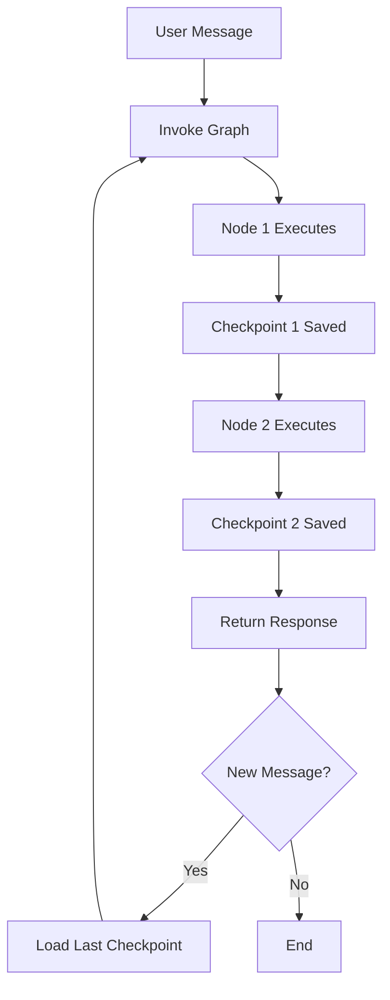

# LangGraph Checkpointing and Memory

## Simple Explanation

Checkpointing in LangGraph is like saving your progress in a video game. Every time your agent workflow completes a step (called a "super step"), LangGraph can save a snapshot of the entire state. This gives you three powerful abilities:

1. **Memory Between Conversations**: Remember what happened in previous interactions
2. **Resume After Failures**: If something crashes, restart from the last checkpoint instead of starting over
3. **Time Travel**: Go back to any previous point and replay from there

Without checkpointing, each time you invoke your graph it starts fresh with no memory. With checkpointing, it remembers everything.

## Why It Matters

**For Interviews:**
- Shows you understand stateful vs stateless systems
- Demonstrates knowledge of fault tolerance and resilience
- Memory management is critical for production AI systems

**Real-World Value:**
- Users expect AI to remember previous conversations
- Production systems need to recover from failures gracefully
- Debugging is easier when you can replay from any checkpoint

**Why Companies Use It:**
- **Reliability**: Systems can recover from crashes without losing work
- **User Experience**: Conversations feel natural with memory
- **Debugging**: Can reproduce issues by replaying from specific checkpoints
- **Compliance**: Audit trail of every state change for regulatory requirements

## Very Simple Example

**Healthcare Scenario Without Checkpointing:**
```
Patient: "My name is John, I have a fever"
AI: "I'll help you. What are your symptoms?"
Patient: "What's my name?"
AI: "I don't have access to your personal information"
```

**With Checkpointing:**
```
Patient: "My name is John, I have a fever"
AI: "Hello John, I'll help with your fever. Any other symptoms?"
Patient: "What's my name?"
AI: "Your name is John. How can I help you further?"
```

**Persistence Example:**
```
Session 1 (Monday): Patient reports symptoms, gets diagnosis
[System crashes]
Session 2 (Tuesday): Patient returns, system remembers Monday's diagnosis
```

## Step-by-Step Workflow

1. **Create Memory Saver**: Initialize `MemorySaver()` (in-memory) or `SqliteSaver()` (persistent)
2. **Compile with Checkpointer**: Pass checkpointer to `graph.compile(checkpointer=memory)`
3. **Create Thread ID**: Make a config with unique thread ID for each conversation
4. **Invoke with Config**: Call `graph.invoke(state, config=config)` to associate with thread
5. **Automatic Checkpointing**: LangGraph saves state after each super step automatically
6. **Access History**: Use `graph.get_state_history(config)` to see all checkpoints



## Where It Fits

**In Smart Healthcare AI Platform:**

- **Patient Service**: Checkpointing stores patient interaction history across sessions
- **AI Agent Layer**: Medical Assistant remembers patient's medical history, preferences, previous diagnoses
- **Appointment Service**: Remembers scheduling preferences, no-show patterns, preferred doctors
- **Compliance & Audit**: Every checkpoint is an immutable audit record for HIPAA compliance
- **Resilience**: If AI service crashes mid-diagnosis, can resume without re-asking patient questions

**Practical Healthcare Use Cases:**

**Continuous Care Monitoring:**
```
Day 1: Patient reports symptoms → Checkpoint saved
Day 2: Patient updates symptoms → Loads Day 1 checkpoint, adds new data
Day 3: Doctor reviews → Full history available from all checkpoints
```

**Multi-Session Diagnosis:**
```
Session 1: Initial symptoms collected → Checkpoint
Session 2: Lab results added → Checkpoint
Session 3: Specialist consultation → Checkpoint
Session 4: Treatment plan finalized → Checkpoint
All sessions linked by thread ID (patient_id)
```

**Fault Tolerance:**
```
Step 1: Analyze symptoms → Checkpoint
Step 2: Check drug interactions → Checkpoint
Step 3: Generate prescription → [SYSTEM CRASH]
Recovery: Resume from Step 2 checkpoint, retry Step 3
```

**Memory Types:**

1. **MemorySaver**: Stores in RAM, lost when system restarts (good for development)
2. **SqliteSaver**: Stores in SQLite database, persists across restarts (good for production)
3. **Custom Savers**: Can implement PostgreSQL, Redis, or cloud storage backends

**Thread ID Strategy:**
- Use `patient_id` as thread ID for patient-specific conversations
- Use `session_id` for temporary interactions
- Use `case_id` for multi-provider care coordination

**Time Travel Use Cases:**
- **Debugging**: Replay failed workflows from specific checkpoint
- **What-If Analysis**: Branch from checkpoint to test alternative treatment paths
- **Audit**: Review exact state at time of critical decision
- **Rollback**: Undo incorrect actions by reverting to previous checkpoint

**HIPAA Compliance Benefits:**
- Immutable audit trail of all patient interactions
- Point-in-time snapshots for regulatory review
- Ability to prove what information was available at decision time
- Complete history for malpractice defense
