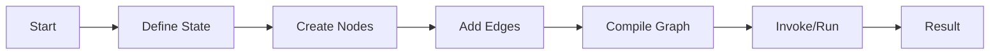

# LangGraph Introduction and Architecture

## Simple Explanation

LangGraph is a framework for building AI agent systems that need to be stable, repeatable, and scalable. Think of it like a blueprint system where you design workflows as graphs (tree structures) with nodes (functions that do work) and edges (connections that decide what happens next). It's separate from LangChain but made by the same company, and it focuses specifically on making complex agent workflows reliable and easy to monitor.

The key idea: instead of writing code that runs directly, you first describe your workflow as a graph, then LangGraph executes it with built-in safety, memory management, and the ability to restart from any point if something fails.

## Why It Matters

**For Interviews:**
- Companies ask about agent orchestration frameworks because production AI systems need reliability
- Understanding graph-based workflows shows you can design complex, multi-step AI processes
- Knowing the difference between LangChain (general LLM glue code) and LangGraph (agent orchestration) demonstrates depth

**Real-World Value:**
- Prevents agent systems from failing silently or losing progress
- Makes debugging easier with visual workflow representations
- Allows human-in-the-loop workflows where people can intervene
- Provides "time travel" - ability to rewind and replay from any checkpoint

**Why Companies Use It:**
- Stability: Built-in fault tolerance for unpredictable AI operations
- Scalability: Can deploy to LangGraph Platform for enterprise scale
- Monitoring: Integrates with LangSmith for visibility into agent reasoning
- Repeatability: Checkpointing ensures workflows can resume after failures

## Very Simple Example

**Healthcare Scenario:**
```
Patient submits symptoms → Medical AI analyzes → Risk assessment runs → Scheduling agent books appointment
```

If the scheduling fails (doctor unavailable), LangGraph can:
- Save the state at "Risk assessment complete"
- Retry scheduling without re-analyzing symptoms
- Resume exactly where it left off

## Step-by-Step Workflow

1. **Define State**: Create a class that holds all workflow data (patient info, analysis results)
2. **Build Graph**: Add nodes (functions) for each step - symptom analysis, risk check, scheduling
3. **Connect Edges**: Define which node runs after which (conditional or sequential)
4. **Compile**: Turn the graph definition into executable workflow
5. **Invoke**: Run the graph with initial state, get final result



## Where It Fits

**In Smart Healthcare AI Platform:**

- **AI Service Layer**: LangGraph orchestrates multi-agent workflows (Medical Assistant → Risk Prediction → Scheduling agents)
- **Agent Orchestrator**: Manages sequential, parallel, and hierarchical agent execution patterns
- **RAG Integration**: Coordinates retrieval and generation steps in medical knowledge queries
- **Microservices**: Each node can call different microservices (Patient Service, Appointment Service, Billing Service)
- **Resilience**: Checkpointing ensures patient workflows don't lose progress if services fail
- **Audit Trail**: Graph execution history provides compliance-ready logs for healthcare regulations

**Key Architecture Benefits:**
- Replaces ad-hoc agent coordination with structured, testable workflows
- Enables complex medical workflows (triage → diagnosis → treatment planning → scheduling)
- Provides visibility into AI decision-making for regulatory compliance
- Supports human-in-the-loop for critical medical decisions
