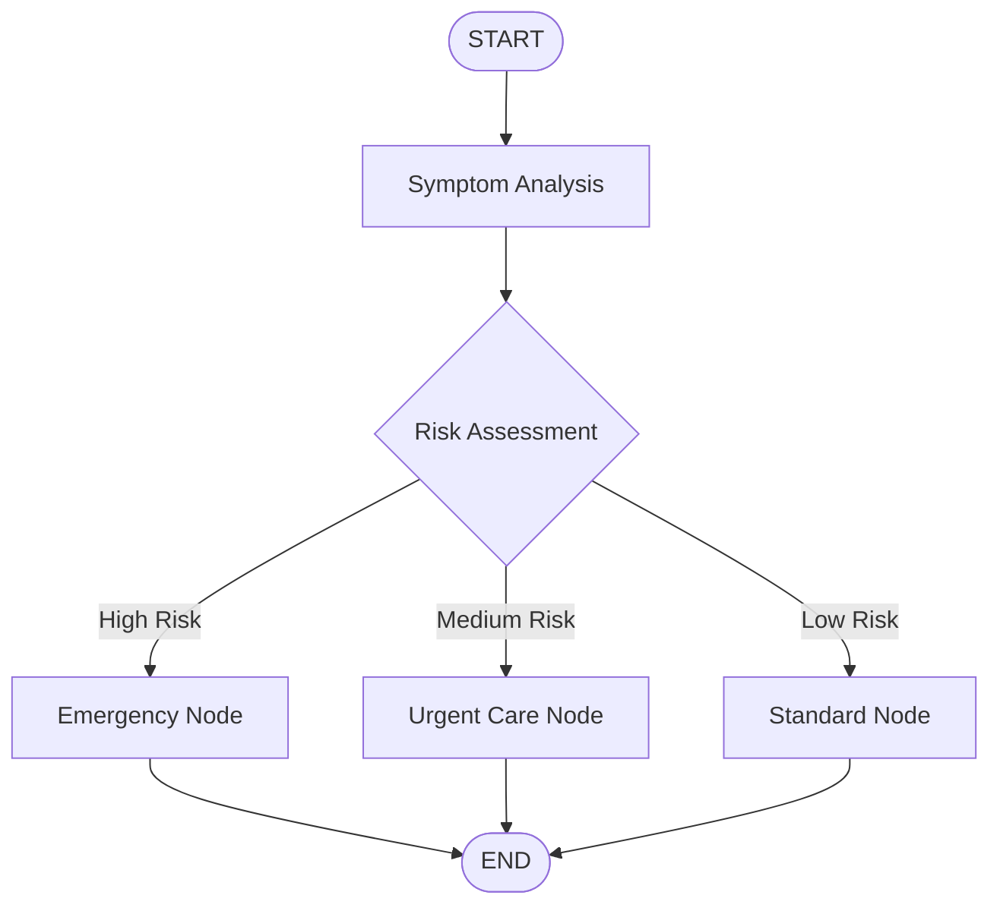

# LangGraph Nodes, Edges, and Workflows

## Simple Explanation

In LangGraph, you build agent workflows using two main building blocks:

**Nodes** = Python functions that do the actual work (call an LLM, process data, make decisions)
**Edges** = Connections that determine what happens next (go to node B after node A finishes)

Think of nodes as workers in a hospital and edges as the routing rules:
- Node: "Lab technician runs blood test"
- Edge: "If results are abnormal, route to specialist; if normal, route to discharge"

There are two types of edges:
1. **Simple edges**: Always go from A to B
2. **Conditional edges**: Check the state and decide which node to run next

## Why It Matters

**For Interviews:**
- Shows you can design complex workflows, not just single-shot AI calls
- Demonstrates understanding of control flow in agent systems
- Conditional edges show you know how to build decision trees

**Real-World Value:**
- Nodes let you break complex tasks into manageable pieces
- Edges create flexible workflows that adapt based on results
- Visual graph representation makes workflows easy to understand and debug

**Why Companies Use It:**
- Modular design: Each node is independently testable
- Flexibility: Change workflow by rewiring edges, not rewriting code
- Clarity: Graph visualization shows exactly what the system does

## Very Simple Example

**Healthcare Scenario:**
```
[Patient Input] 
    ↓ (simple edge)
[Symptom Analysis Node] 
    ↓ (conditional edge)
    ├─ If urgent → [Emergency Triage Node]
    ├─ If routine → [Standard Appointment Node]
    └─ If unclear → [Ask Clarifying Questions Node]
```

**Simple Node Example:**
```python
def analyze_symptoms(state):
    symptoms = state.symptoms
    # Call medical AI to analyze
    analysis = medical_llm.analyze(symptoms)
    # Return new state with analysis
    return State(symptoms=symptoms, analysis=analysis)
```

**Conditional Edge Example:**
```python
def route_patient(state):
    if state.risk_score > 8:
        return "emergency"
    elif state.risk_score > 5:
        return "urgent_care"
    else:
        return "standard_appointment"
```

## Step-by-Step Workflow

1. **Create Node Functions**: Write Python functions that take state and return new state
2. **Add Nodes to Graph**: Use `graph.add_node("node_name", function)`
3. **Connect with Simple Edges**: Use `graph.add_edge("node_a", "node_b")` for sequential flow
4. **Add Conditional Edges**: Use `graph.add_conditional_edges("node_a", routing_function)` for branching
5. **Define Start/End**: Connect START to first node, last node(s) to END
6. **Compile and Run**: Compile the graph, then invoke it with initial state



## Where It Fits

**In Smart Healthcare AI Platform:**

- **AI Service Layer**: Each agent (Medical Assistant, Risk Prediction, Scheduling) is a node
- **Microservices Integration**: Nodes call different microservices (Patient Service, Appointment Service, Billing Service)
- **Workflow Orchestration**: Edges implement clinical pathways and treatment protocols
- **Decision Support**: Conditional edges encode medical decision trees and triage protocols

**Practical Healthcare Workflows:**

**Patient Triage Workflow:**
```
Intake Node → Symptom Analysis Node → Risk Scoring Node
    ↓ (conditional edge based on risk)
    ├─ High Risk → Emergency Protocol Node → Immediate Scheduling
    ├─ Medium Risk → Specialist Referral Node → Priority Scheduling
    └─ Low Risk → General Practitioner Node → Standard Scheduling
```

**Insurance Claim Processing:**
```
Claim Submission Node → Validation Node
    ↓ (conditional edge)
    ├─ Valid → Fraud Detection Node → Approval Node
    ├─ Invalid → Rejection Node → Notification Node
    └─ Needs Review → Human Review Node → Manual Decision Node
```

**Medication Management:**
```
Prescription Request → Drug Interaction Check Node
    ↓ (conditional edge)
    ├─ No Interactions → Pharmacy Node → Fulfillment
    ├─ Minor Interactions → Warning Node → Doctor Review → Approval
    └─ Major Interactions → Block Node → Alternative Suggestion Node
```

**Why This Matters in Healthcare:**
- **Safety**: Conditional edges enforce safety checks (drug interactions, allergy checks)
- **Compliance**: Workflow graphs serve as documentation for regulatory audits
- **Flexibility**: Easy to update clinical protocols by changing edges, not rewriting code
- **Human-in-Loop**: Nodes can pause for human review at critical decision points
