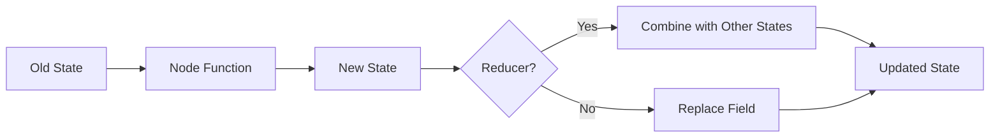

# LangGraph State Management Complete Guide

## Simple Explanation

State in LangGraph is like a snapshot of everything your agent workflow knows at any moment. It's an object that holds all the data - conversation history, intermediate results, user information - and gets passed between nodes as the workflow runs.

**Key Concepts:**
- **Immutable State**: You never change the state object directly. Each node receives a state, does work, and returns a NEW state
- **Reducers**: Special functions that tell LangGraph how to combine states when multiple nodes run in parallel
- **State Class**: A Python class (usually Pydantic or TypedDict) that defines what fields your state contains

Think of state like a medical chart that gets updated as a patient moves through the hospital - each department adds information, but the original notes stay intact.

## Why It Matters

**For Interviews:**
- State management is fundamental to any multi-step AI system
- Understanding immutability shows you know functional programming concepts
- Reducers demonstrate knowledge of concurrent programming patterns

**Real-World Value:**
- Immutable state prevents bugs from one node accidentally breaking another
- Reducers allow parallel processing without race conditions
- Clear state structure makes workflows easier to debug and test

**Why Companies Use It:**
- Enables parallel agent execution safely
- Makes workflows reproducible and testable
- Provides clear data contracts between workflow steps

## Very Simple Example

**Healthcare Scenario:**
```python
# State holds patient journey data
class PatientState:
    patient_id: str
    symptoms: list
    risk_score: float
    appointment_slot: str
    
# Node 1: Analyze symptoms (returns new state with risk_score)
# Node 2: Check availability (returns new state with appointment_slot)
# Both can run in parallel safely because state is immutable
```

**Reducer Example:**
```python
# Messages field uses add_messages reducer
# Node A adds: "Fever detected"
# Node B adds: "High blood pressure noted"
# Reducer combines: ["Fever detected", "High blood pressure noted"]
```

## Step-by-Step Workflow

1. **Define State Class**: Create a class with all fields your workflow needs
2. **Add Type Hints**: Specify types for each field (str, list, int, etc.)
3. **Annotate with Reducers**: For fields that need special combining logic, use `Annotated[list, add_messages]`
4. **Pass to Graph Builder**: Give your state class to StateGraph when creating the graph
5. **Nodes Use State**: Each node function receives state, does work, returns new state
6. **LangGraph Manages**: Framework handles state updates and applies reducers automatically



## Where It Fits

**In Smart Healthcare AI Platform:**

- **AI Agent Orchestrator**: State holds patient context as it flows through Medical Assistant → Risk Prediction → Scheduling agents
- **Session Management**: State stores conversation history for continuous patient interactions
- **Multi-Agent Coordination**: Reducers allow parallel agents (diagnosis + billing + scheduling) to update state simultaneously
- **Audit Trail**: Immutable state creates natural audit log - every state change is a new object
- **HIPAA Compliance**: State snapshots provide point-in-time records for regulatory requirements

**Practical Use Cases:**
- **Patient Triage**: State accumulates symptoms, vital signs, medical history as patient progresses through triage workflow
- **Treatment Planning**: Multiple specialists (agents) can add recommendations to state in parallel
- **Appointment Scheduling**: State tracks patient preferences, doctor availability, insurance verification results
- **Billing Workflow**: State holds diagnosis codes, procedures, insurance claims as they move through approval process

**Why Immutability Matters in Healthcare:**
- Prevents accidental data corruption in critical medical workflows
- Creates clear audit trail for compliance
- Enables safe rollback if workflow needs to restart
- Allows parallel processing of patient data without conflicts
