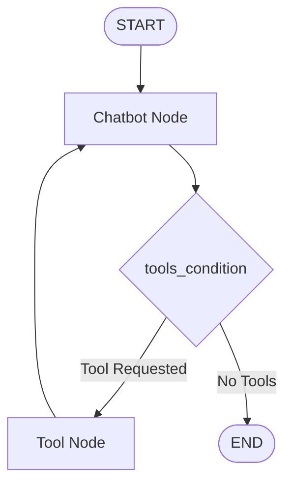

# LangGraph Tool Calling Complete Guide

## Simple Explanation

Tool calling in LangGraph lets your AI agents perform actions beyond just generating text - they can search the web, send notifications, query databases, call APIs, and more. There are two key parts to making tools work:

1. **Telling the LLM about tools**: When you call the model, you describe what tools are available (using JSON)
2. **Executing tool calls**: When the model responds with a tool request, you actually run the tool and feed results back

LangGraph makes this easier with:
- **bind_tools()**: Automatically packages tool descriptions for the LLM
- **ToolNode**: Pre-built node that executes tool calls automatically
- **tools_condition**: Conditional edge that routes to tools only when needed

## Why It Matters

**For Interviews:**
- Tool calling is fundamental to agentic AI - agents that can take actions
- Shows you understand the request-execute-feedback loop
- Demonstrates knowledge of conditional workflows and error handling

**Real-World Value:**
- Agents become useful when they can interact with real systems
- Tools connect AI to databases, APIs, and external services
- Proper tool handling prevents errors and infinite loops

**Why Companies Use It:**
- **Extensibility**: Easy to add new capabilities by creating new tools
- **Safety**: Tools are explicitly defined and controlled
- **Debugging**: LangSmith shows exactly which tools were called and why
- **Reusability**: Same tools work across different agents and workflows

## Very Simple Example

**Healthcare Scenario:**
```python
# Define tools
tools = [
    search_medical_guidelines,  # Search medical knowledge base
    check_drug_interactions,    # Query drug interaction database
    schedule_appointment,       # Call appointment service API
    send_patient_notification   # Send SMS/email to patient
]

# Workflow:
Patient: "I have a fever and take aspirin daily"
→ Agent calls search_medical_guidelines("fever")
→ Agent calls check_drug_interactions("aspirin", "fever medications")
→ Agent calls schedule_appointment(patient_id, urgency="routine")
→ Agent calls send_patient_notification("Appointment scheduled for Tuesday")
→ Agent responds: "I've scheduled you for Tuesday and checked your medications are safe"
```

**Two Places Tools Appear:**

1. **At LLM Call** (bind_tools):
```python
llm_with_tools = llm.bind_tools([search, schedule, notify])
# LangGraph automatically builds JSON tool descriptions
```

2. **After LLM Response** (ToolNode):
```python
tool_node = ToolNode(tools=[search, schedule, notify])
# Automatically executes tools if LLM requests them
```

## Step-by-Step Workflow

1. **Create Tool Functions**: Write Python functions with docstrings describing what they do
2. **Wrap in Tool Objects**: Use LangChain's `@tool` decorator or `Tool()` wrapper
3. **Bind to LLM**: Call `llm.bind_tools(tools)` to create LLM that knows about tools
4. **Create Chatbot Node**: Node that calls `llm_with_tools.invoke(state.messages)`
5. **Create Tool Node**: `ToolNode(tools)` - pre-built node that executes tools
6. **Add Conditional Edge**: Use `tools_condition` to route to ToolNode only if needed
7. **Loop Back**: Edge from ToolNode back to chatbot to process tool results



## Where It Fits

**In Smart Healthcare AI Platform:**

- **AI Service Layer**: Tools connect agents to microservices and external systems
- **Medical Assistant Agent**: Uses tools to search medical knowledge (RAG), check patient history, schedule appointments
- **Risk Prediction Agent**: Tools query patient vitals, lab results, medication history from databases
- **Scheduling Agent**: Tools check doctor availability, book appointments, send confirmations
- **Fraud Detection Agent**: Tools query billing history, check claim patterns, verify provider credentials

**Practical Healthcare Tools:**

**Medical Knowledge Tools:**
```python
@tool
def search_medical_guidelines(condition: str) -> str:
    """Search medical guidelines and research for a condition"""
    # Calls RAG Knowledge Service
    return rag_service.search(condition)

@tool
def check_drug_interactions(medications: list) -> dict:
    """Check for dangerous drug interactions"""
    # Calls drug interaction database API
    return drug_db.check_interactions(medications)
```

**Patient Data Tools:**
```python
@tool
def get_patient_history(patient_id: str) -> dict:
    """Retrieve patient medical history"""
    # Calls Patient Service microservice
    return patient_service.get_history(patient_id)

@tool
def get_lab_results(patient_id: str, test_type: str) -> dict:
    """Get recent lab test results"""
    # Queries lab results database
    return lab_service.get_results(patient_id, test_type)
```

**Scheduling Tools:**
```python
@tool
def check_doctor_availability(specialty: str, date: str) -> list:
    """Check which doctors are available"""
    # Calls Appointment Service
    return appointment_service.check_availability(specialty, date)

@tool
def book_appointment(patient_id: str, doctor_id: str, slot: str) -> dict:
    """Book an appointment slot"""
    # Calls Appointment Service
    return appointment_service.book(patient_id, doctor_id, slot)
```

**Notification Tools:**
```python
@tool
def send_patient_sms(patient_id: str, message: str) -> bool:
    """Send SMS notification to patient"""
    # Calls Notification Service
    return notification_service.send_sms(patient_id, message)

@tool
def send_patient_email(patient_id: str, subject: str, body: str) -> bool:
    """Send email to patient"""
    # Calls Notification Service
    return notification_service.send_email(patient_id, subject, body)
```

**Tool Calling Flow in Healthcare:**

```
Patient Query: "I need to see a cardiologist for chest pain"
    ↓
Chatbot Node (LLM with tools)
    ↓
LLM Response: [
    tool_call: search_medical_guidelines("chest pain urgency"),
    tool_call: check_doctor_availability("cardiology", "today")
]
    ↓
tools_condition: TRUE (tools requested)
    ↓
Tool Node executes both tools in parallel
    ↓
Results: {
    "urgency": "high - see within 24 hours",
    "available_slots": ["Dr. Smith 2pm", "Dr. Jones 4pm"]
}
    ↓
Back to Chatbot Node with tool results
    ↓
LLM Response: "Chest pain requires urgent attention. I found two cardiologists available today: Dr. Smith at 2pm or Dr. Jones at 4pm. Which works better for you?"
```

**LangSmith Monitoring:**
- See exactly which tools were called
- View tool inputs and outputs
- Track latency for each tool call
- Debug failed tool executions
- Monitor costs (some tools may have API costs)

**Safety Considerations:**
- **Validation**: Always validate tool inputs before execution
- **Permissions**: Check user has permission to access patient data
- **Rate Limiting**: Prevent infinite tool calling loops
- **Error Handling**: Gracefully handle tool failures
- **Audit Logging**: Log all tool calls for compliance (HIPAA)

**Custom vs Pre-built Tools:**
- **Pre-built**: LangChain community has tools for web search, Wikipedia, calculators
- **Custom**: Build your own for domain-specific needs (medical databases, EHR systems)
- **Wrappers**: Wrap existing APIs as tools (Appointment Service, Billing Service)
