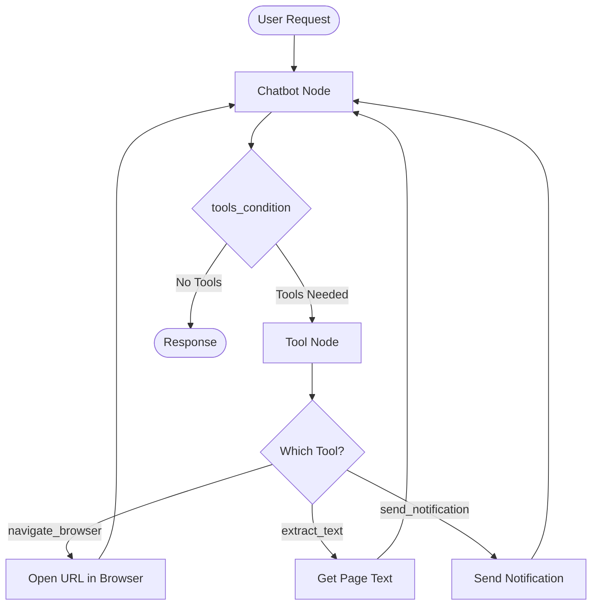

# Playwright Web Automation with LangGraph

## Simple Explanation

Playwright is a browser automation framework (like Selenium but newer and better) that lets you programmatically control a web browser - open pages, click buttons, extract text, fill forms, etc. When combined with LangGraph, you can create AI agents that can browse the web like a human, gathering information and performing tasks.

LangChain provides a Playwright toolkit with pre-built tools that your AI agents can use:
- `navigate_browser`: Go to a URL
- `extract_text`: Get all text from current page
- `extract_hyperlinks`: Get all links
- `click_element`: Click on page elements
- `get_elements`: Find specific elements
- `previous_webpage`: Go back

This turns your AI into a web-browsing assistant that can research topics, gather data, and interact with websites.

## Why It Matters

**For Interviews:**
- Shows you can integrate AI with real-world automation tools
- Demonstrates understanding of tool composition and orchestration
- Web scraping and automation are common enterprise needs

**Real-World Value:**
- Agents can gather real-time information from websites
- Automate repetitive web tasks (data entry, research, monitoring)
- Build AI assistants that can navigate complex web interfaces
- Extract structured data from unstructured web pages

**Why Companies Use It:**
- **Research Automation**: AI can browse multiple sources and synthesize information
- **Data Collection**: Automated web scraping with intelligent navigation
- **Testing**: AI-driven testing of web applications
- **Competitive Intelligence**: Monitor competitor websites automatically

## Very Simple Example

**Healthcare Scenario:**
```python
# AI agent browses medical research sites
Patient: "Find latest research on diabetes treatment"

Agent workflow:
1. navigate_browser("https://pubmed.ncbi.nlm.nih.gov")
2. Search for "diabetes treatment 2024"
3. extract_text() from results page
4. click_element() on first research paper
5. extract_text() from paper abstract
6. Summarize findings for patient
```

**Real Example from Transcript:**
```python
User: "Send me a push notification with a news headline from CNN"

Agent workflow:
1. navigate_browser("https://cnn.com")
2. extract_text() from homepage
3. Parse headlines from text
4. send_push_notification("Breaking: [headline]")
```

## Step-by-Step Workflow

### 1. Install Playwright

```bash
# Windows/Mac
playwright install

# Linux
playwright install --with-deps
```

### 2. Create Playwright Tools

```python
from langchain_community.agent_toolkits.playwright.toolkit import PlaywrightBrowserToolkit
from playwright.async_api import async_playwright

# Create async browser
async_browser = await async_playwright().start()
browser = await async_browser.chromium.launch(headless=False)  # headless=True to hide browser

# Create toolkit with all Playwright tools
toolkit = PlaywrightBrowserToolkit.from_browser(async_context=browser)
tools = toolkit.get_tools()

# Available tools:
# - navigate_browser
# - extract_text
# - extract_hyperlinks
# - click_element
# - get_elements
# - previous_webpage
# - current_webpage
```

### 3. Combine with Other Tools

```python
# Add custom tools alongside Playwright tools
from langchain.tools import tool

@tool
def send_notification(message: str) -> str:
    """Send push notification to user"""
    # Your notification logic
    return f"Sent: {message}"

# Combine all tools
all_tools = tools + [send_notification]
```

### 4. Create LangGraph Agent with Tools

```python
from langgraph.graph import StateGraph, END
from langgraph.prebuilt import ToolNode, tools_condition

# Define state
class State(TypedDict):
    messages: Annotated[list, add_messages]

# Create LLM with tools
llm_with_tools = llm.bind_tools(all_tools)

# Create nodes
def chatbot(state: State):
    return {"messages": [llm_with_tools.invoke(state["messages"])]}

tool_node = ToolNode(all_tools)

# Build graph
graph = StateGraph(State)
graph.add_node("chatbot", chatbot)
graph.add_node("tools", tool_node)

# Add edges
graph.add_edge(START, "chatbot")
graph.add_conditional_edges("chatbot", tools_condition)
graph.add_edge("tools", "chatbot")

# Compile
app = graph.compile()
```

### 5. Run Agent

```python
# Invoke agent
result = await app.ainvoke({
    "messages": [("user", "Get the latest news from CNN and send me a notification")]
})
```

## Complete Code Example

```python
import asyncio
from typing import TypedDict, Annotated
from langchain_openai import ChatOpenAI
from langchain.tools import tool
from langchain_community.agent_toolkits.playwright.toolkit import PlaywrightBrowserToolkit
from playwright.async_api import async_playwright
from langgraph.graph import StateGraph, START, END
from langgraph.graph.message import add_messages
from langgraph.prebuilt import ToolNode, tools_condition

# 1. Define State
class State(TypedDict):
    messages: Annotated[list, add_messages]

# 2. Create Playwright tools
async def create_browser_tools():
    playwright = await async_playwright().start()
    browser = await playwright.chromium.launch(headless=False)
    toolkit = PlaywrightBrowserToolkit.from_browser(async_context=browser)
    return toolkit.get_tools()

# 3. Create custom tool
@tool
def send_notification(message: str) -> str:
    """Send push notification with a message"""
    print(f"📱 Notification: {message}")
    return "Notification sent successfully"

# 4. Build graph
async def build_agent():
    # Get tools
    browser_tools = await create_browser_tools()
    all_tools = browser_tools + [send_notification]
    
    # Create LLM with tools
    llm = ChatOpenAI(model="gpt-4o-mini")
    llm_with_tools = llm.bind_tools(all_tools)
    
    # Define nodes
    def chatbot(state: State):
        return {"messages": [llm_with_tools.invoke(state["messages"])]}
    
    tool_node = ToolNode(all_tools)
    
    # Build graph
    graph = StateGraph(State)
    graph.add_node("chatbot", chatbot)
    graph.add_node("tools", tool_node)
    
    graph.add_edge(START, "chatbot")
    graph.add_conditional_edges("chatbot", tools_condition)
    graph.add_edge("tools", "chatbot")
    
    return graph.compile()

# 5. Run agent
async def main():
    app = await build_agent()
    
    result = await app.ainvoke({
        "messages": [("user", "Go to CNN.com and send me a notification with the top headline")]
    })
    
    print(result["messages"][-1].content)

# Run
asyncio.run(main())
```

## Workflow Diagram



## Where It Fits

**In Smart Healthcare AI Platform:**

- **Medical Research Agent**: Browse PubMed, medical journals, clinical trial databases
- **Insurance Verification**: Navigate insurance provider websites to verify coverage
- **Appointment Scheduling**: Interact with external scheduling systems that don't have APIs
- **Drug Information**: Browse FDA website, drug databases for latest information
- **Competitor Analysis**: Monitor other healthcare providers' services and pricing

**Practical Healthcare Use Cases:**

### 1. Medical Research Assistant
```python
# Agent browses medical databases
User: "Find latest clinical trials for lung cancer treatment"

Workflow:
1. navigate_browser("https://clinicaltrials.gov")
2. Fill search form with "lung cancer"
3. extract_text() from results
4. Click on relevant trials
5. Extract trial details
6. Summarize findings with citations
```

### 2. Insurance Eligibility Checker
```python
# Agent checks insurance coverage
User: "Check if Blue Cross covers this procedure"

Workflow:
1. navigate_browser("https://bluecross.com")
2. Navigate to coverage lookup
3. Fill in procedure code
4. extract_text() from results page
5. Parse coverage information
6. Return structured response
```

### 3. Drug Interaction Checker
```python
# Agent browses drug databases
User: "Check interactions between aspirin and ibuprofen"

Workflow:
1. navigate_browser("https://drugs.com/interactions")
2. Enter drug names
3. extract_text() from interaction results
4. Parse severity and recommendations
5. Return formatted warnings
```

### 4. Medical News Aggregator
```python
# Agent monitors medical news sites
Scheduled task (daily):
1. navigate_browser("https://medscape.com")
2. extract_text() from homepage
3. Parse latest articles
4. Filter by specialty (cardiology, oncology, etc.)
5. send_notification() with summaries to doctors
```

## Async vs Sync

**Why Async?**
- Playwright operations are I/O bound (waiting for pages to load)
- Async allows other tasks to run while waiting
- Better performance for multiple concurrent browser operations

**Async Setup:**
```python
import nest_asyncio  # For Jupyter notebooks
nest_asyncio.apply()

# Use await with tools
result = await navigate_tool.ainvoke({"url": "https://example.com"})

# Use await with graph
result = await graph.ainvoke(state)
```

## LangSmith Monitoring

When you run Playwright agents, LangSmith shows:
- Which tools were called (navigate, extract_text, etc.)
- URLs visited
- Text extracted from pages
- Time spent on each operation
- Costs (LLM calls, not browser operations)

**Example Trace:**
```
1. User: "Get news from CNN"
2. Chatbot → Tool Call: navigate_browser("https://cnn.com")
3. Tool Node → Executes navigation
4. Tool Node → Tool Call: extract_text()
5. Tool Node → Returns page text
6. Chatbot → Processes text, extracts headline
7. Chatbot → Tool Call: send_notification("Breaking: ...")
8. Tool Node → Sends notification
9. Chatbot → Final response: "Sent you the latest headline"
```

## Best Practices

1. **Headless vs Headful**: Use `headless=True` in production, `headless=False` for debugging
2. **Error Handling**: Websites can be unreliable - add retry logic
3. **Rate Limiting**: Don't hammer websites - add delays between requests
4. **Selectors**: Use robust selectors (data attributes) not fragile ones (CSS classes)
5. **Timeouts**: Set reasonable timeouts for page loads
6. **Clean Up**: Close browsers when done to free resources

## Cost Considerations

- **Playwright**: Free, open-source
- **LLM Calls**: Each tool decision costs tokens (GPT-4o-mini ~$0.008 per call)
- **Example**: CNN news task = ~$0.008 (very cheap!)
- **Scaling**: Costs add up with many concurrent browser sessions
