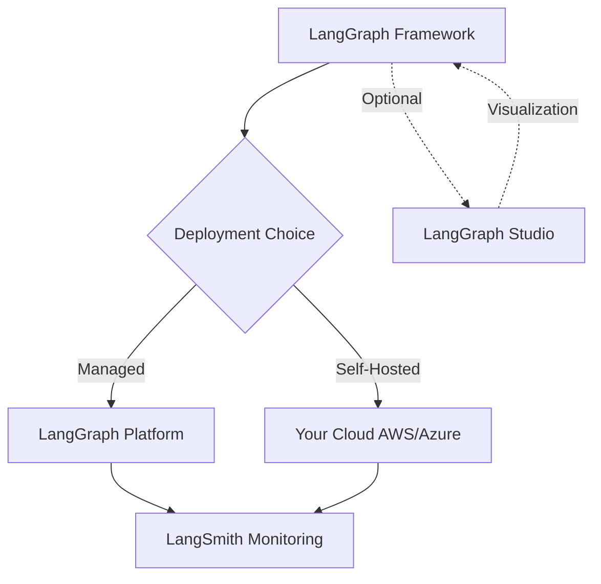

# LangGraph Framework, Studio, and Platform Components

## Simple Explanation

LangGraph actually consists of three separate products:

1. **LangGraph Framework**: The core library you code with - defines graphs, nodes, edges, and state management
2. **LangGraph Studio**: A visual builder tool (like a drag-and-drop interface) to design agent workflows
3. **LangGraph Platform**: A hosted cloud service for deploying and running your agents at enterprise scale

Think of it like: Framework = the programming language, Studio = the visual editor, Platform = the cloud hosting service.

Most developers focus on the Framework (the actual coding part). The Platform is the commercial offering similar to how Crew has Crew Enterprise.

## Why It Matters

**For Interviews:**
- Shows you understand the full ecosystem, not just the coding part
- Demonstrates awareness of deployment and scaling considerations
- Helps you discuss trade-offs between self-hosted vs managed solutions

**Real-World Value:**
- Framework gives you full control and flexibility
- Studio helps non-technical stakeholders visualize workflows
- Platform simplifies deployment but creates vendor lock-in

**Why Companies Use It:**
- Start with Framework for prototyping and development
- Use Studio for stakeholder demos and documentation
- Consider Platform when scaling to production (if budget allows)

## Very Simple Example

**Development Journey:**
```
Week 1: Build medical triage agent using Framework (Python code)
Week 2: Show workflow in Studio to hospital administrators
Week 3: Deploy to Platform for 24/7 patient access
```

**Alternative Path:**
```
Week 1: Build with Framework
Week 2: Deploy to your own AWS/Azure infrastructure
Week 3: Monitor with LangSmith (separate monitoring tool)
```

## Step-by-Step Workflow

1. **Develop**: Write agent logic using LangGraph Framework in Python
2. **Visualize**: Optionally use Studio to create visual representations
3. **Test**: Run locally with Framework's built-in tools
4. **Deploy**: Choose between Platform (managed) or self-hosted (AWS/Azure)
5. **Monitor**: Use LangSmith for observability regardless of deployment choice



## Where It Fits

**General Technical - Not Healthcare Specific**

This is infrastructure knowledge applicable to any domain. The choice between Framework/Studio/Platform depends on:
- Team size and DevOps capabilities
- Budget for managed services
- Compliance requirements (healthcare may require self-hosted)
- Need for visual workflow documentation

**Anthropic's Perspective:**
The transcript mentions Anthropic's blog post suggesting developers start with LLM APIs directly rather than heavy frameworks. They argue abstractions can obscure what's happening and make debugging harder. This is worth considering - sometimes simpler is better than using a full framework.
