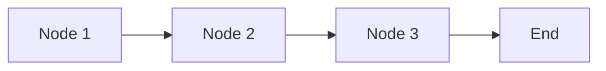
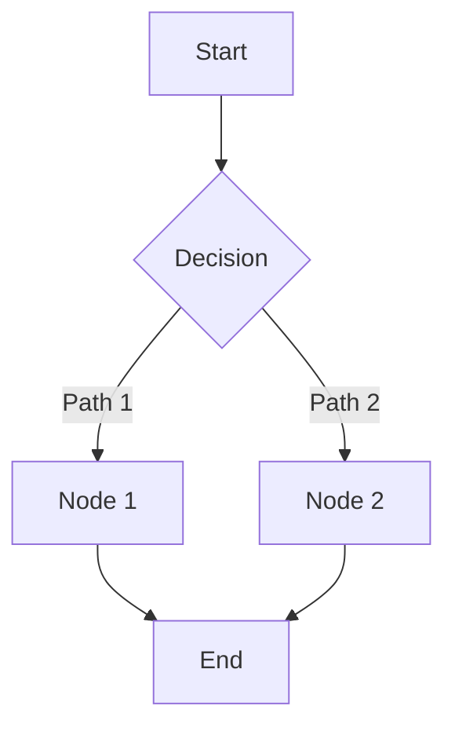
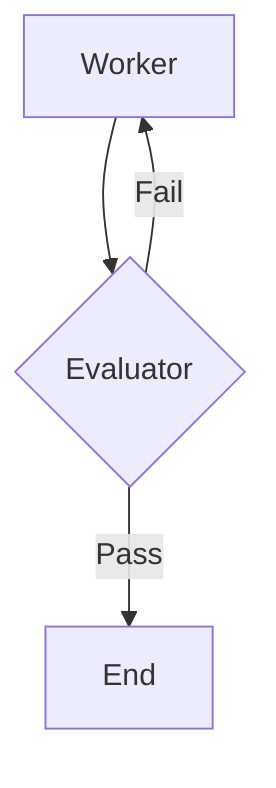

# LangGraph Documentation - Smart Healthcare AI Platform

This documentation covers LangGraph concepts and implementations for building robust AI agent systems, with specific adaptations for healthcare applications.

## 📚 Documentation Index

### Core Concepts

1. **[HC_LangGraph_Introduction_and_Architecture.md](HC_LangGraph_Introduction_and_Architecture.md)**
   - What is LangGraph and why use it
   - Graph-based architecture for AI agents
   - Healthcare-specific applications
   - Stability, repeatability, and scalability

2. **[LangGraph_Framework_Studio_Platform_Components.md](LangGraph_Framework_Studio_Platform_Components.md)**
   - Framework vs Studio vs Platform
   - Deployment options (managed vs self-hosted)
   - When to use each component
   - Anthropic's perspective on frameworks

3. **[HC_LangGraph_State_Management_Complete_Guide.md](HC_LangGraph_State_Management_Complete_Guide.md)**
   - Immutable state pattern
   - Reducers and state combining
   - State class definition
   - Healthcare workflow state management

4. **[HC_LangGraph_Nodes_Edges_and_Workflows.md](HC_LangGraph_Nodes_Edges_and_Workflows.md)**
   - Nodes as Python functions
   - Simple vs conditional edges
   - Building complex workflows
   - Healthcare clinical pathways

### Advanced Features

5. **[HC_LangGraph_Checkpointing_and_Memory.md](HC_LangGraph_Checkpointing_and_Memory.md)**
   - Memory between conversations
   - Checkpointing for fault tolerance
   - Time travel and state replay
   - HIPAA compliance benefits

6. **[HC_LangGraph_Tool_Calling_Complete_Guide.md](HC_LangGraph_Tool_Calling_Complete_Guide.md)**
   - Tool definition and binding
   - ToolNode and tools_condition
   - Healthcare-specific tools
   - LangSmith monitoring

### Integration & Automation

7. **[HC_Playwright_Web_Automation_with_LangGraph.md](HC_Playwright_Web_Automation_with_LangGraph.md)**
   - Browser automation with Playwright
   - Web scraping and navigation
   - Medical research automation
   - Async workflows

8. **[HC_LLM_Evaluator_Agents_and_Feedback_Loops.md](HC_LLM_Evaluator_Agents_and_Feedback_Loops.md)**
   - Worker-Evaluator pattern
   - Quality control for AI outputs
   - Structured evaluation schemas
   - Healthcare safety checks

### Complete Project

9. **[HC_Building_AI_Sidekick_Complete_Project.md](HC_Building_AI_Sidekick_Complete_Project.md)**
   - End-to-end production application
   - Multi-agent architecture
   - Rich toolset (browser, files, Python, search)
   - Gradio UI implementation

## 🏥 Healthcare Applications

### Patient Care
- **Triage Systems**: Intelligent symptom analysis and urgency assessment
- **Appointment Scheduling**: Multi-agent coordination for optimal scheduling
- **Treatment Planning**: Evidence-based recommendations with evaluator validation

### Clinical Operations
- **Medical Research**: Automated literature review and synthesis
- **Documentation**: AI-assisted clinical note generation
- **Drug Interaction Checking**: Safety validation before prescriptions

### Administrative
- **Insurance Verification**: Automated eligibility and coverage checks
- **Billing Automation**: Claims processing with fraud detection
- **Compliance Reporting**: Audit trail generation for regulatory requirements

## 🎯 Key Concepts Summary

### Graph Architecture
```
State → Nodes (Functions) → Edges (Routing) → New State
```

### Multi-Agent Pattern
```
User Input → Worker Agent → Evaluator Agent → Quality Output
```

### Tool Integration
```
LLM Decision → Tool Execution → Result Processing → Next Action
```

### Memory Management
```
Conversation → Checkpoint → Resume → Continue
```

## 🚀 Getting Started

### Prerequisites
```bash
pip install langgraph langchain langchain-openai
pip install playwright gradio python-dotenv
playwright install
```

### Basic Example
```python
from langgraph.graph import StateGraph, START, END
from typing import TypedDict, Annotated
from langgraph.graph.message import add_messages

# Define state
class State(TypedDict):
    messages: Annotated[list, add_messages]

# Create node
def chatbot(state: State):
    return {"messages": [llm.invoke(state["messages"])]}

# Build graph
graph = StateGraph(State)
graph.add_node("chatbot", chatbot)
graph.add_edge(START, "chatbot")
graph.add_edge("chatbot", END)

# Compile and run
app = graph.compile()
result = app.invoke({"messages": [("user", "Hello!")]})
```

## 📊 Architecture Patterns

### Sequential Workflow


### Conditional Workflow


### Feedback Loop


## 🔧 Tools & Integrations

### Pre-built Tools
- **Web Search**: SerpAPI, Google Search
- **Browser Automation**: Playwright toolkit
- **Knowledge Bases**: Wikipedia, custom RAG
- **File Operations**: Read/write workspace files
- **Code Execution**: Python REPL

### Custom Tools
```python
from langchain.tools import tool

@tool
def custom_tool(input: str) -> str:
    """Description of what the tool does"""
    # Your logic here
    return result
```

## 📈 Monitoring & Debugging

### LangSmith Integration
- View all LLM calls and tool executions
- Track costs and latency
- Debug failed workflows
- Replay conversations

### Best Practices
1. Start with simple workflows
2. Add complexity incrementally
3. Monitor costs closely
4. Test edge cases thoroughly
5. Use structured outputs for consistency

## 🔒 Security Considerations

### Healthcare-Specific
- **HIPAA Compliance**: Immutable audit trails
- **Data Privacy**: Secure state management
- **Access Control**: Tool-level permissions
- **Audit Logging**: Complete action history

### General
- **Input Validation**: Sanitize all user inputs
- **Tool Restrictions**: Limit file system access
- **Rate Limiting**: Prevent abuse
- **Error Handling**: Graceful failure modes

## 💰 Cost Optimization

### Strategies
- Use GPT-4o-mini for most tasks
- Cache frequent queries
- Limit tool call iterations
- Batch operations when possible
- Monitor token usage

### Typical Costs (GPT-4o-mini)
- Simple query: $0.001 - $0.002
- Tool-using task: $0.005 - $0.01
- Complex workflow: $0.01 - $0.05
- Research + report: $0.02 - $0.10

## 🎓 Learning Path

1. **Basics**: Start with Introduction and State Management
2. **Building Blocks**: Learn Nodes, Edges, and Workflows
3. **Advanced**: Add Checkpointing and Tool Calling
4. **Integration**: Explore Playwright and Evaluators
5. **Production**: Build complete Sidekick project

## 📝 Code Examples

All documentation includes:
- ✅ Complete code snippets
- ✅ Mermaid diagrams
- ✅ Healthcare-specific examples
- ✅ Best practices
- ✅ Common pitfalls

## 🤝 Contributing

This documentation is based on LangGraph course transcripts and adapted for the Smart Healthcare AI Platform. Each file follows a consistent structure:

1. Simple Explanation
2. Why It Matters (Interview + Real-World)
3. Very Simple Example
4. Step-by-Step Workflow with Diagrams
5. Where It Fits (Healthcare Context)

## 📚 Additional Resources

- [LangGraph Official Docs](https://langchain-ai.github.io/langgraph/)
- [LangSmith Platform](https://smith.langchain.com/)
- [LangChain Documentation](https://python.langchain.com/)
- [Playwright Documentation](https://playwright.dev/)

## 🏗️ Smart Healthcare AI Platform Integration

These LangGraph concepts integrate with the platform's:
- **AI Service Layer**: Agent orchestration
- **Microservices**: Tool integration with services
- **RAG Knowledge Service**: Medical knowledge retrieval
- **Blockchain Audit**: Immutable state logging
- **Security & Compliance**: HIPAA-compliant workflows

---

**Last Updated**: February 2026  
**Course**: Mastering AI Agents  
**Platform**: Smart Healthcare AI Platform
