# 04. Comparing AI Agent Frameworks: Simplicity vs Power in LLM Orchestration

---

# AI Agent Frameworks Overview

## 1. Simple Explanation

AI agent frameworks are pre-built tools that help you build AI systems without writing everything from scratch. They provide ready-made code to connect to AI models (like ChatGPT or Claude) and manage how agents work together.

Think of them like building blocks - instead of making bricks yourself, you use pre-made ones to build your house faster.

## 2. Why It Matters (Interview + Real World)

- **Problem it solves**: Writing AI code from scratch is time-consuming and complex
- **Why companies use it**: Speeds up development and reduces errors
- **Why interviewers ask**: They want to know if you can choose the right tool for the job

## 3. Very Simple Healthcare Example

Hospital needs AI to handle patient queries → Developer uses a framework (like OpenAI SDK) → Framework handles connection to AI model → Developer focuses on medical logic, not technical details.

## 4. Step-by-Step Workflow

1. Developer chooses a framework (OpenAI SDK, LangGraph, etc.)
2. Framework provides pre-built functions to connect to AI models
3. Developer writes business logic (what the AI should do)
4. Framework handles technical details (API calls, error handling)
5. AI agent runs and solves the problem

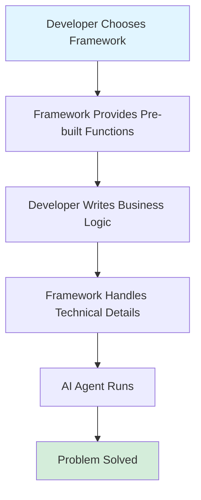

## 5. Where It Fits in the System

- **AI Layer**: Core component for building agents
- **Agent**: Frameworks help create and manage agents
- **Microservice**: Can be wrapped as a service

## 6. Common Interview Questions

**Q1: What is an AI agent framework?**
A: Pre-built tools that simplify building AI systems by providing ready-made code for connecting to AI models.

**Q2: Why use a framework instead of direct API calls?**
A: Frameworks save time, reduce errors, and provide helpful abstractions. But direct APIs give more control.

**Q3: Name some popular AI agent frameworks.**
A: OpenAI Agents SDK, CrewAI, LangGraph, Autogen, and MCP (Model Context Protocol).

## 7. Quick Revision Summary

- Frameworks = pre-built tools for AI development
- Trade-off: simplicity vs control vs power
- Popular ones: OpenAI SDK, CrewAI, LangGraph, Autogen
- Choose based on project needs and team skills
- No framework (direct API) is also a valid choice

---

# Framework Complexity Levels

## 1. Simple Explanation

AI frameworks come in different complexity levels - from very simple to very complex. Simple ones are easy to learn but less powerful. Complex ones are harder to learn but can do more advanced things.

It's like choosing between a bicycle (simple, easy) and a car (complex, powerful).

## 2. Why It Matters (Interview + Real World)

- **Problem it solves**: Helps teams pick the right tool based on their skills and needs
- **Why companies use it**: Match framework complexity to project requirements
- **Why interviewers ask**: Tests your ability to make architectural decisions

## 3. Very Simple Healthcare Example

Small clinic needs basic appointment booking → Use simple framework (OpenAI SDK) → Easy to build and maintain.
Large hospital needs complex patient routing across departments → Use powerful framework (LangGraph) → Handles complexity better.

## 4. Step-by-Step Workflow

1. Identify project requirements (simple vs complex)
2. Assess team skills (beginners vs experts)
3. Choose framework level (lightweight vs heavyweight)
4. Build solution using chosen framework
5. Maintain and scale as needed

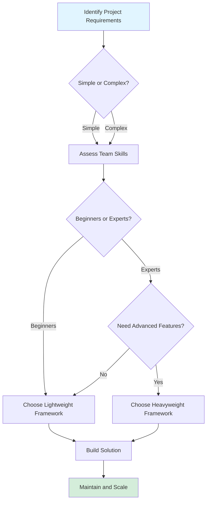

## 5. Where It Fits in the System

- **AI Layer**: Framework choice affects entire AI architecture
- **Agent**: Determines how agents are built and managed

## 6. Common Interview Questions

**Q1: What's the difference between lightweight and heavyweight frameworks?**
A: Lightweight = easy to learn, less features. Heavyweight = harder to learn, more powerful features.

**Q2: When should you use a simple framework vs complex one?**
A: Simple for straightforward tasks and small teams. Complex for advanced features and large-scale systems.

**Q3: What's the trade-off in framework selection?**
A: Simplicity vs power. Simple = faster development but limited features. Complex = more features but steeper learning curve.

## 7. Quick Revision Summary

- Frameworks range from simple to complex
- Simple = easy to learn, less powerful
- Complex = harder to learn, more features
- Choose based on project needs and team skills
- Trade-off between ease of use and capabilities

---

# Level 1: No Framework (Direct API)

## 1. Simple Explanation

This means you don't use any pre-built framework. Instead, you connect directly to AI models (like ChatGPT or Claude) using their basic APIs. You write all the code yourself.

It's like cooking from scratch instead of using a meal kit - more work, but full control.

## 2. Why It Matters (Interview + Real World)

- **Problem it solves**: Gives complete control over every detail
- **Why companies use it**: Maximum flexibility, no framework limitations
- **Why interviewers ask**: Shows deep understanding of how AI models work

## 3. Very Simple Healthcare Example

Doctor portal needs AI diagnosis helper → Developer writes code to call OpenAI API directly → Full control over prompts and responses → No framework overhead.

## 4. Step-by-Step Workflow

1. Get API key from AI provider (OpenAI, Anthropic, etc.)
2. Write code to send HTTP requests to AI API
3. Format prompts manually
4. Handle responses manually
5. Manage errors and retries yourself
6. Build all orchestration logic from scratch

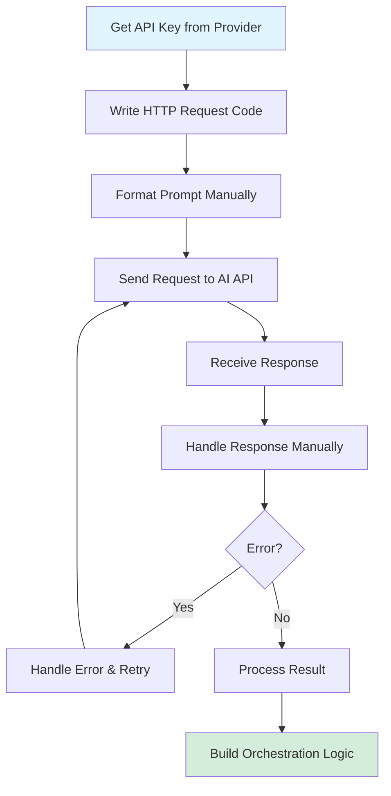

## 5. Where It Fits in the System

- **AI Layer**: Direct connection to AI models
- **Agent**: You build agent logic manually

## 6. Common Interview Questions

**Q1: What are advantages of using no framework?**
A: Full control, no learning curve, see exactly what's happening, no framework limitations.

**Q2: What are disadvantages of no framework?**
A: More code to write, more potential for errors, slower development.

**Q3: When should you use direct API calls?**
A: For simple projects, when you need maximum control, or when frameworks don't fit your needs.

## 7. Quick Revision Summary

- No framework = direct API calls to AI models
- Pros: full control, maximum flexibility
- Cons: more work, more code to maintain
- Best for: simple projects or when you need complete control
- Anthropic recommends this approach

---

# Model Context Protocol (MCP)

## 1. Simple Explanation

MCP is a standard way for AI models to connect to data sources and tools. It's not a framework - it's like a universal plug that lets different AI systems work together easily.

Think of it like USB - one standard that works with many devices.

## 2. Why It Matters (Interview + Real World)

- **Problem it solves**: Makes it easy to connect AI models to different data sources
- **Why companies use it**: Open standard, no vendor lock-in, easy integration
- **Why interviewers ask**: It's a new important standard in AI development

## 3. Very Simple Healthcare Example

Hospital has patient data in multiple systems → MCP provides standard way to connect → AI agent can access all data sources using same protocol → No custom code for each system.

## 4. Step-by-Step Workflow

1. Data source implements MCP protocol
2. AI model supports MCP protocol
3. Connect them using MCP standard
4. AI can now access data without custom code
5. Add new data sources easily using same protocol

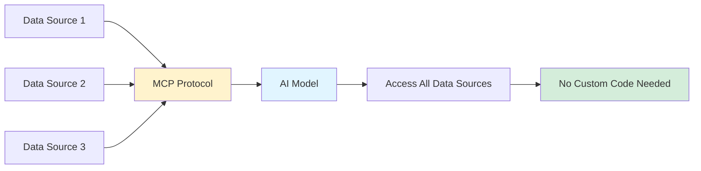

## 5. Where It Fits in the System

- **AI Layer**: Protocol for connecting models to data
- **Agent**: Helps agents access tools and data
- **Microservice**: Can connect multiple services

## 6. Common Interview Questions

**Q1: What is MCP?**
A: Model Context Protocol - an open standard for connecting AI models to data sources and tools.

**Q2: How is MCP different from a framework?**
A: MCP is a protocol (standard), not a framework. It defines how things connect, not how to build them.

**Q3: Who created MCP?**
A: Anthropic (makers of Claude AI).

## 7. Quick Revision Summary

- MCP = standard protocol for AI connections
- Not a framework, just a connection standard
- Open source and vendor-neutral
- Makes integration easier
- Created by Anthropic

---

# Level 2: Lightweight Frameworks (OpenAI Agents SDK & CrewAI)

## 1. Simple Explanation

These are simple, easy-to-use frameworks that help you build AI agents quickly. They handle basic tasks but stay out of your way. You still feel like you're working directly with AI models.

Like using a simple recipe app - helpful but not overwhelming.

## 2. Why It Matters (Interview + Real World)

- **Problem it solves**: Balance between ease of use and control
- **Why companies use it**: Fast development without heavy complexity
- **Why interviewers ask**: These are popular choices for real projects

## 3. Very Simple Healthcare Example

Clinic needs AI to schedule appointments and answer FAQs → Use OpenAI Agents SDK → Quick to build, easy to maintain → Handles basic agent tasks without complexity.

## 4. Step-by-Step Workflow

1. Install lightweight framework (OpenAI SDK or CrewAI)
2. Define agents with simple configuration
3. Write minimal code for business logic
4. Framework handles AI model connections
5. Deploy and run agents easily

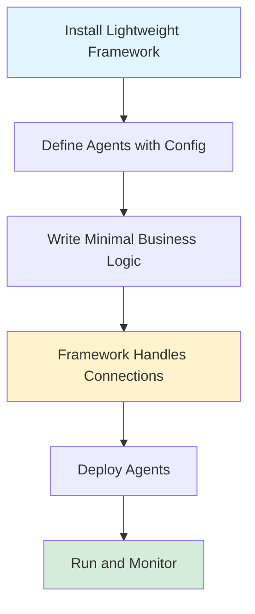

## 5. Where It Fits in the System

- **AI Layer**: Simplified agent building
- **Agent**: Easy agent creation and management

## 6. Common Interview Questions

**Q1: What makes a framework "lightweight"?**
A: Easy to learn, minimal abstractions, stays out of your way, flexible.

**Q2: Difference between OpenAI Agents SDK and CrewAI?**
A: OpenAI SDK is very minimal. CrewAI has more features and uses YAML configuration files.

**Q3: When to use lightweight frameworks?**
A: For most projects where you want speed and simplicity without heavy complexity.

## 7. Quick Revision Summary

- Lightweight = easy to learn and use
- OpenAI Agents SDK: very simple, flexible
- CrewAI: slightly more features, uses YAML config
- Best for: most real-world projects
- Good balance of simplicity and power

---

# OpenAI Agents SDK

## 1. Simple Explanation

OpenAI's official framework for building AI agents. It's very new, super simple, and clean. You can build agents quickly with minimal code.

Like a starter kit that gives you just what you need, nothing extra.

## 2. Why It Matters (Interview + Real World)

- **Problem it solves**: Simplest way to build agents with OpenAI models
- **Why companies use it**: Official support, clean API, easy to learn
- **Why interviewers ask**: It's becoming very popular for new projects

## 3. Very Simple Healthcare Example

Hospital needs AI assistant for nurses → Use OpenAI Agents SDK → Build agent in few lines of code → Agent answers medical protocol questions quickly.

## 4. Step-by-Step Workflow

1. Install OpenAI Agents SDK
2. Create agent with simple Python code
3. Define tools agent can use
4. Connect to OpenAI models
5. Run agent and handle responses

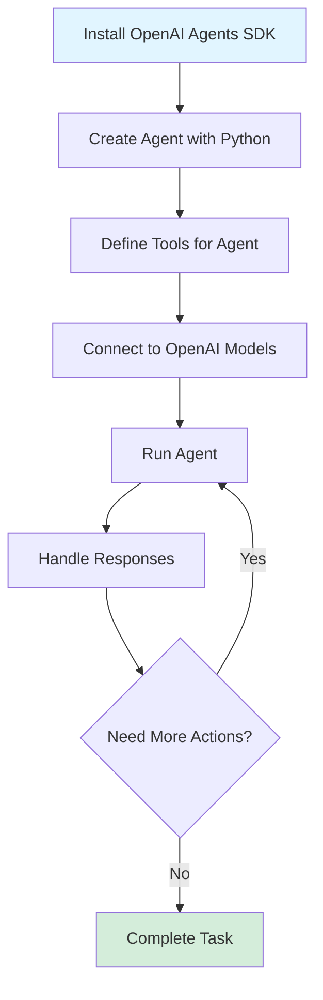

## 5. Where It Fits in the System

- **AI Layer**: Agent framework
- **Agent**: Primary tool for building agents

## 6. Common Interview Questions

**Q1: What is OpenAI Agents SDK?**
A: Official lightweight framework from OpenAI for building AI agents quickly and simply.

**Q2: Why is it popular?**
A: Very simple, clean API, official support from OpenAI, flexible.

**Q3: Is it stable?**
A: Very new (API still changing), but backed by OpenAI.

## 7. Quick Revision Summary

- Official OpenAI framework
- Very lightweight and simple
- New (still evolving)
- Clean and flexible
- Great for most projects

---

# CrewAI

## 1. Simple Explanation

CrewAI is a framework where you build teams of AI agents that work together. You can configure agents using YAML files (text configuration) without writing much code.

Like managing a team where you write job descriptions (YAML) instead of training each person manually.

## 2. Why It Matters (Interview + Real World)

- **Problem it solves**: Easy way to create multi-agent teams
- **Why companies use it**: Low-code approach, good for teams with less coding experience
- **Why interviewers ask**: Popular for multi-agent systems

## 3. Very Simple Healthcare Example

Hospital needs multiple AI agents (scheduler, diagnostics helper, billing) → Use CrewAI → Define each agent in YAML file → Agents work together as a team automatically.

## 4. Step-by-Step Workflow

1. Install CrewAI framework
2. Create YAML files defining agents and their roles
3. Define tasks in YAML
4. Write minimal Python code to run the crew
5. Agents collaborate automatically

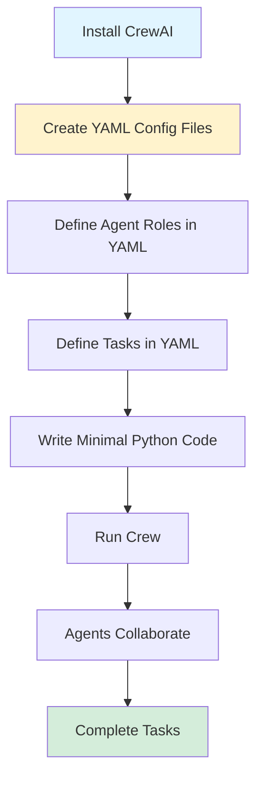

## 5. Where It Fits in the System

- **AI Layer**: Multi-agent framework
- **Agent**: Creates and manages agent teams

## 6. Common Interview Questions

**Q1: What is CrewAI?**
A: Framework for building teams of AI agents that work together, with low-code YAML configuration.

**Q2: What's unique about CrewAI?**
A: Uses YAML configuration files for defining agents, making it more accessible to non-programmers.

**Q3: When to use CrewAI?**
A: When you need multiple agents working together and prefer configuration over code.

## 7. Quick Revision Summary

- Framework for multi-agent teams
- Uses YAML configuration (low-code)
- Easy to define agent roles and tasks
- Good for teams with varied coding skills
- Been around longer than OpenAI SDK

---

# Level 3: Heavyweight Frameworks (LangGraph & Autogen)

## 1. Simple Explanation

These are powerful but complex frameworks. They can do advanced things but take longer to learn. Your project becomes heavily tied to the framework's way of doing things.

Like learning to fly a plane - powerful but requires serious training.

## 2. Why It Matters (Interview + Real World)

- **Problem it solves**: Handles very complex AI workflows and large-scale systems
- **Why companies use it**: When they need advanced features and have skilled teams
- **Why interviewers ask**: Tests knowledge of enterprise-level AI systems

## 3. Very Simple Healthcare Example

Large hospital network needs complex patient routing across 50 departments with AI → Use LangGraph → Build sophisticated workflow with multiple decision points → Handles complexity that simple frameworks can't.

## 4. Step-by-Step Workflow

1. Learn framework concepts and terminology (steep learning curve)
2. Design complex workflow as a graph
3. Implement using framework's abstractions
4. Test and debug within framework ecosystem
5. Deploy enterprise-scale solution

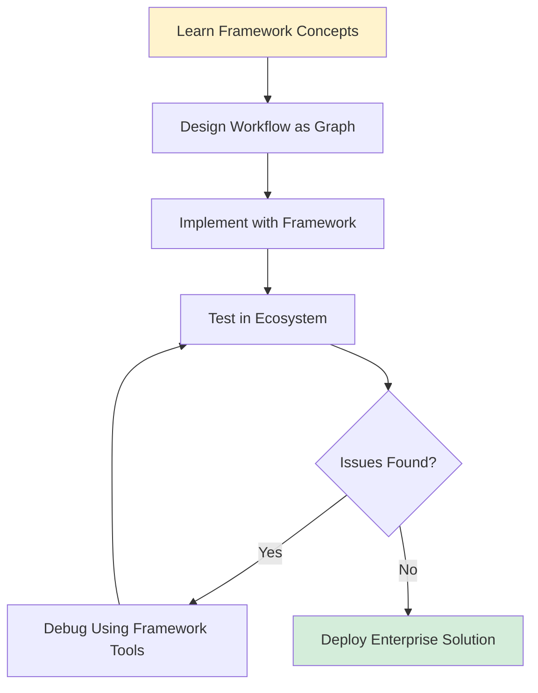

## 5. Where It Fits in the System

- **AI Layer**: Complex agent orchestration
- **Agent**: Advanced multi-agent systems

## 6. Common Interview Questions

**Q1: When should you use heavyweight frameworks?**
A: For complex enterprise systems that need advanced features and have experienced teams.

**Q2: What's the main trade-off?**
A: More power and features, but steeper learning curve and less flexibility.

**Q3: Name two heavyweight frameworks.**
A: LangGraph (from LangChain) and Autogen (from Microsoft).

## 7. Quick Revision Summary

- Heavyweight = powerful but complex
- Steep learning curve
- Best for enterprise-scale projects
- Your project becomes tied to the framework
- LangGraph and Autogen are main examples

---

# LangGraph

## 1. Simple Explanation

LangGraph is a powerful framework from the LangChain team. You build AI workflows as graphs (flowcharts) where each node is a step. Very powerful but complex to learn.

Like building a complex factory assembly line - powerful but needs expertise.

## 2. Why It Matters (Interview + Real World)

- **Problem it solves**: Handles very complex AI workflows with multiple steps and decisions
- **Why companies use it**: When they need sophisticated AI systems
- **Why interviewers ask**: It's popular for enterprise AI projects

## 3. Very Simple Healthcare Example

Hospital needs AI system that: checks symptoms → orders tests → analyzes results → suggests treatment → gets doctor approval → updates records → Use LangGraph to build this complex flow as a graph.

## 4. Step-by-Step Workflow

1. Design workflow as a computational graph
2. Define nodes (steps) and edges (connections)
3. Implement each node's logic
4. Connect nodes to create flow
5. Run graph to execute complex workflow

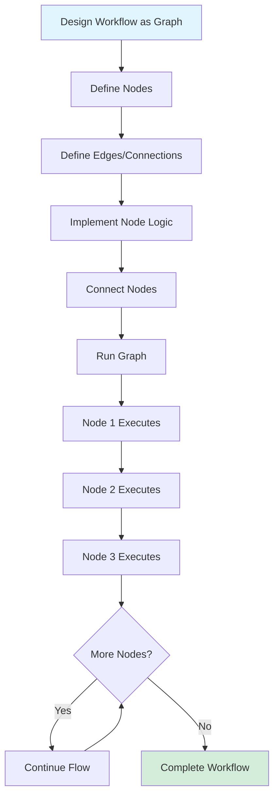

## 5. Where It Fits in the System

- **AI Layer**: Complex workflow orchestration
- **Agent**: Multi-step agent systems

## 6. Common Interview Questions

**Q1: What is LangGraph?**
A: Framework for building complex AI workflows as computational graphs.

**Q2: What's the main concept?**
A: Build AI systems as graphs where nodes are steps and edges are connections.

**Q3: When to use LangGraph?**
A: For complex workflows that need sophisticated control flow and decision making.

## 7. Quick Revision Summary

- From LangChain team
- Build workflows as graphs
- Very powerful for complex systems
- Steep learning curve
- Lots of terminology and concepts

---

# Autogen

## 1. Simple Explanation

Autogen is Microsoft's framework for building AI agent systems. It's powerful and can handle complex scenarios, but requires learning Microsoft's approach and ecosystem.

Like using Microsoft Office - powerful tools but you need to learn their way of doing things.

## 2. Why It Matters (Interview + Real World)

- **Problem it solves**: Enterprise-grade multi-agent systems
- **Why companies use it**: Microsoft backing, good for large organizations
- **Why interviewers ask**: Popular in enterprise environments

## 3. Very Simple Healthcare Example

Large healthcare system needs AI agents for: patient intake, insurance verification, appointment scheduling, medical records → Use Autogen → Build multiple specialized agents that work together in Microsoft ecosystem.

## 4. Step-by-Step Workflow

1. Learn Autogen concepts and patterns
2. Define multiple specialized agents
3. Set up agent communication
4. Implement business logic
5. Deploy in enterprise environment

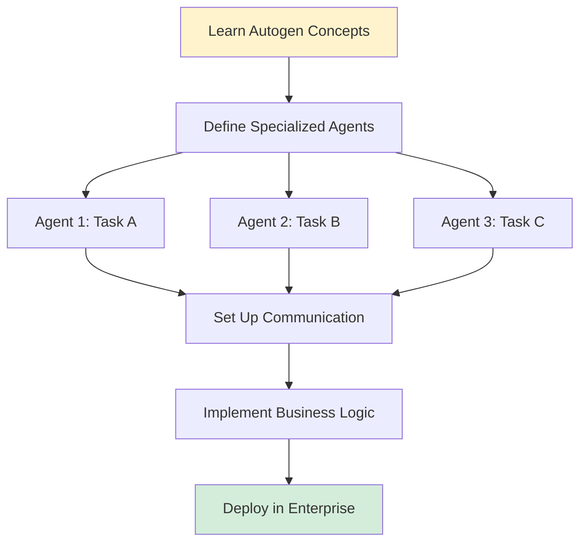

## 5. Where It Fits in the System

- **AI Layer**: Enterprise agent framework
- **Agent**: Multi-agent orchestration

## 6. Common Interview Questions

**Q1: What is Autogen?**
A: Microsoft's framework for building multi-agent AI systems.

**Q2: How is it different from others?**
A: Microsoft ecosystem, enterprise focus, heavyweight with lots of features.

**Q3: When to use Autogen?**
A: In Microsoft-heavy organizations or when you need enterprise-grade features.

## 7. Quick Revision Summary

- Microsoft's AI agent framework
- Enterprise-focused
- Heavyweight with many features
- Good for large organizations
- Steep learning curve

---

# Choosing the Right Framework

## 1. Simple Explanation

Picking the right framework depends on your project needs, team skills, and how much control you want. There's no "best" framework - only the best one for your situation.

Like choosing transportation - bicycle, car, or plane depends on where you're going.

## 2. Why It Matters (Interview + Real World)

- **Problem it solves**: Helps make smart architectural decisions
- **Why companies use it**: Right tool = faster development and better results
- **Why interviewers ask**: Tests decision-making and architectural thinking

## 3. Very Simple Healthcare Example

Small clinic with 2 developers → Use OpenAI SDK (simple, fast).
Large hospital with 20 developers → Use LangGraph (powerful, handles complexity).
Mid-size practice → Use CrewAI (good balance).

## 4. Step-by-Step Workflow

1. Assess project complexity (simple vs complex)
2. Evaluate team skills (beginners vs experts)
3. Consider timeline (fast vs thorough)
4. Check integration needs (standalone vs ecosystem)
5. Choose framework that fits best
6. Start building and adjust if needed

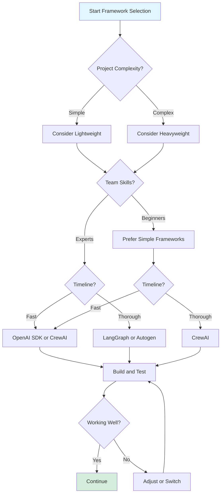

## 5. Where It Fits in the System

- **AI Layer**: Architectural decision
- **Agent**: Affects entire agent implementation

## 6. Common Interview Questions

**Q1: How do you choose an AI framework?**
A: Consider project complexity, team skills, timeline, and integration needs.

**Q2: What factors matter most?**
A: Use case requirements, team experience, and trade-off between simplicity and power.

**Q3: Can you switch frameworks later?**
A: Possible but costly. Better to choose wisely upfront.

## 7. Quick Revision Summary

- No single "best" framework
- Choose based on: project needs, team skills, timeline
- Simple projects → lightweight frameworks
- Complex projects → heavyweight frameworks
- Personal preference matters too

---

# Framework Trade-offs

## 1. Simple Explanation

Every framework has pros and cons. Simple frameworks are easy but limited. Complex frameworks are powerful but hard to learn. You always trade something to get something else.

Like choosing a phone - cheap and simple vs expensive and feature-rich.

## 2. Why It Matters (Interview + Real World)

- **Problem it solves**: Helps understand what you're giving up and gaining
- **Why companies use it**: Make informed decisions
- **Why interviewers ask**: Tests critical thinking about technology choices

## 3. Very Simple Healthcare Example

Clinic chooses simple framework → Fast to build, easy to maintain → But can't handle complex workflows.
Hospital chooses complex framework → Can handle anything → But takes 3 months to train team.

## 4. Step-by-Step Workflow

1. List project requirements
2. Identify must-have vs nice-to-have features
3. Evaluate framework pros and cons
4. Match framework strengths to priorities
5. Accept trade-offs consciously

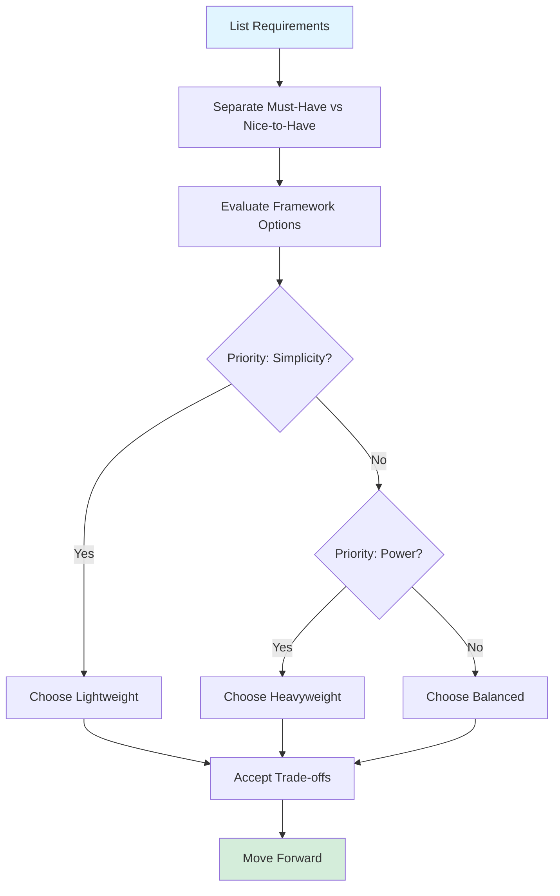

## 5. Where It Fits in the System

- **AI Layer**: Architectural consideration

## 6. Common Interview Questions

**Q1: What's the main trade-off in frameworks?**
A: Simplicity vs power. Easy to use vs advanced features.

**Q2: What do you lose with simple frameworks?**
A: Advanced features, complex workflows, enterprise capabilities.

**Q3: What do you lose with complex frameworks?**
A: Simplicity, flexibility, fast learning curve, development speed.

## 7. Quick Revision Summary

- Every choice has trade-offs
- Simple = easy but limited
- Complex = powerful but hard
- No perfect solution
- Choose based on priorities

---

# Framework Ecosystem Lock-in

## 1. Simple Explanation

When you use a heavyweight framework, your project becomes deeply tied to it. You use their terms, their way of thinking, their tools. It's hard to switch later.

Like building a house with special custom parts - hard to change later.

## 2. Why It Matters (Interview + Real World)

- **Problem it solves**: Understanding long-term commitment
- **Why companies use it**: Sometimes worth it for the power
- **Why interviewers ask**: Tests understanding of technical debt

## 3. Very Simple Healthcare Example

Hospital builds patient system with LangGraph → Uses LangGraph everywhere → 2 years later wants to switch → Would need to rewrite entire system → Stuck with LangGraph.

## 4. Step-by-Step Workflow

1. Choose heavyweight framework
2. Learn framework's concepts and terms
3. Build system using framework patterns
4. System becomes dependent on framework
5. Hard to switch to different approach later

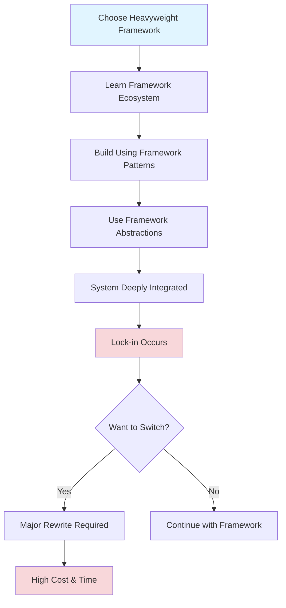

## 5. Where It Fits in the System

- **AI Layer**: Long-term architectural impact

## 6. Common Interview Questions

**Q1: What is framework lock-in?**
A: When your project becomes so dependent on a framework that switching is very difficult.

**Q2: Which frameworks have more lock-in?**
A: Heavyweight ones like LangGraph and Autogen.

**Q3: How to avoid lock-in?**
A: Use lightweight frameworks or direct APIs, or accept lock-in as trade-off for power.

## 7. Quick Revision Summary

- Lock-in = hard to switch frameworks later
- Heavyweight frameworks cause more lock-in
- Your project becomes a "LangGraph project" not just an "AI project"
- Consider long-term implications
- Sometimes worth it for the features

---

# Comparison Summary Diagram

```
┌─────────────────────────────────────────────────────────────┐
│           AI AGENT FRAMEWORK COMPLEXITY LEVELS              │
└─────────────────────────────────────────────────────────────┘

LEVEL 1: NO FRAMEWORK / PROTOCOL
┌──────────────────────────────────────┐
│  Direct API Calls                    │  ← Most Control
│  • Full control                      │  ← Least Abstraction
│  • Most work                         │  ← Most Flexibility
│  • No learning curve                 │
│                                      │
│  MCP (Model Context Protocol)        │
│  • Open standard                     │
│  • Easy integration                  │
│  • Not a framework                   │
└──────────────────────────────────────┘

LEVEL 2: LIGHTWEIGHT FRAMEWORKS
┌──────────────────────────────────────┐
│  OpenAI Agents SDK                   │  ← Good Balance
│  • Very simple                       │  ← Fast Development
│  • Flexible                          │  ← Easy to Learn
│  • New (evolving)                    │
│                                      │
│  CrewAI                              │
│  • Multi-agent teams                 │
│  • YAML configuration                │
│  • Low-code approach                 │
└──────────────────────────────────────┘

LEVEL 3: HEAVYWEIGHT FRAMEWORKS
┌──────────────────────────────────────┐
│  LangGraph                           │  ← Most Power
│  • Complex workflows                 │  ← Steep Learning
│  • Graph-based                       │  ← Ecosystem Lock-in
│  • Very powerful                     │
│                                      │
│  Autogen                             │
│  • Microsoft ecosystem               │
│  • Enterprise-grade                  │
│  • Multi-agent systems               │
└──────────────────────────────────────┘

TRADE-OFF SPECTRUM:
Simple/Fast ←──────────────────→ Complex/Powerful
Flexible    ←──────────────────→ Feature-Rich
Easy        ←──────────────────→ Steep Learning
```

---

# Healthcare Platform Framework Decision

## 1. Simple Explanation

For a healthcare AI platform, you need to choose frameworks based on different parts of the system. Simple patient queries might use lightweight frameworks. Complex diagnosis workflows might need heavyweight ones.

Like using different tools for different jobs in a hospital.

## 2. Why It Matters (Interview + Real World)

- **Problem it solves**: Match framework to specific healthcare needs
- **Why companies use it**: Different problems need different solutions
- **Why interviewers ask**: Tests practical application to healthcare

## 3. Very Simple Healthcare Example

Healthcare platform uses:
- OpenAI SDK for patient chatbot (simple queries)
- CrewAI for appointment scheduling team (multiple agents)
- LangGraph for complex diagnosis workflow (many steps)

## 4. Step-by-Step Workflow

1. Break healthcare platform into components
2. Assess complexity of each component
3. Choose appropriate framework for each
4. Build components with chosen frameworks
5. Integrate components together

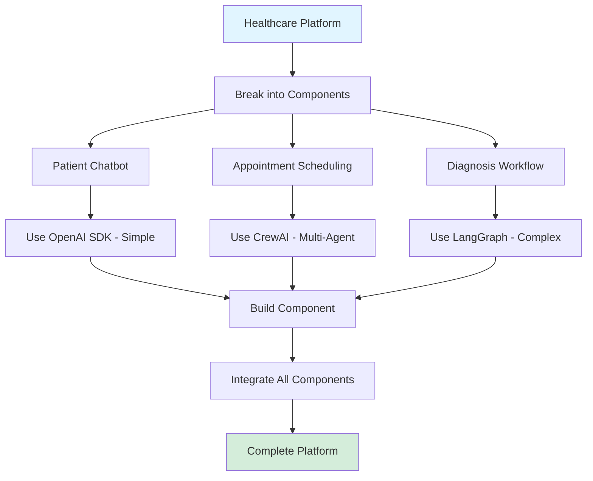

## 5. Where It Fits in the System

- **AI Layer**: Multiple frameworks for different needs
- **Agent**: Different agent types use different frameworks
- **Microservice**: Each service can use different framework

## 6. Common Interview Questions

**Q1: Should you use one framework for everything?**
A: No, different parts of the system may need different frameworks.

**Q2: How to integrate multiple frameworks?**
A: Use microservices architecture - each service uses its own framework.

**Q3: Example for healthcare?**
A: Chatbot (OpenAI SDK), scheduling (CrewAI), diagnosis (LangGraph).

## 7. Quick Revision Summary

- Healthcare platforms are complex
- Use different frameworks for different needs
- Simple tasks → lightweight frameworks
- Complex workflows → heavyweight frameworks
- Microservices help integrate multiple frameworks

---

# Final Recommendations

## 1. Simple Explanation

Start with simple frameworks and only move to complex ones when you really need to. Most projects don't need heavyweight frameworks. Learn the basics first, then add complexity if needed.

Like learning to walk before you run.

## 2. Why It Matters (Interview + Real World)

- **Problem it solves**: Prevents over-engineering
- **Why companies use it**: Faster time to market, easier maintenance
- **Why interviewers ask**: Tests practical wisdom

## 3. Very Simple Healthcare Example

New healthcare startup → Start with OpenAI SDK → Build MVP quickly → If it grows and needs more power → Then consider LangGraph → Don't start with complexity.

## 4. Step-by-Step Workflow

1. Start with simplest solution (direct API or OpenAI SDK)
2. Build and test core functionality
3. Identify limitations
4. Upgrade to more powerful framework only if needed
5. Don't over-engineer from the start

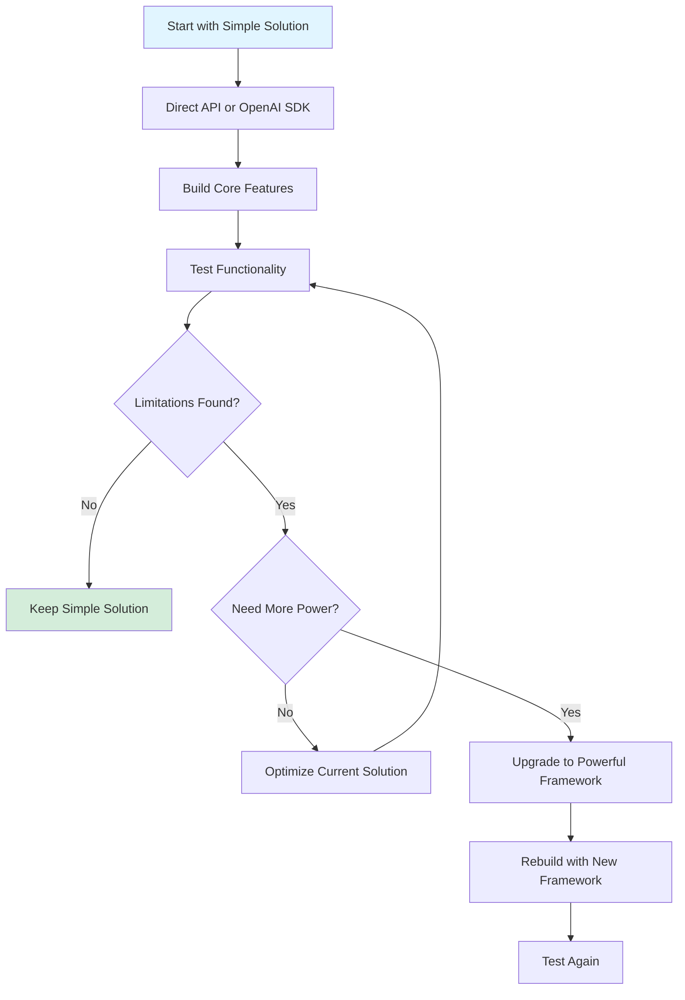

## 5. Where It Fits in the System

- **AI Layer**: Development strategy

## 6. Common Interview Questions

**Q1: What's the best framework to start with?**
A: Start simple (OpenAI SDK or direct API), upgrade only if needed.

**Q2: When to use heavyweight frameworks?**
A: Only when you've proven you need the extra power and complexity.

**Q3: Common mistake in framework selection?**
A: Starting with complex frameworks when simple ones would work fine.

## 7. Quick Revision Summary

- Start simple, add complexity only when needed
- Most projects don't need heavyweight frameworks
- Bias towards lightweight and flexible
- Learn basics first
- Upgrade when you hit real limitations

---

# Course Framework Coverage

## 1. Simple Explanation

This course will teach you multiple frameworks across the spectrum - from no framework to heavyweight ones. You'll learn when to use each and get hands-on experience.

Like learning multiple cooking techniques - then you can choose the right one for each dish.

## 2. Why It Matters (Interview + Real World)

- **Problem it solves**: Makes you versatile and able to choose wisely
- **Why companies use it**: Different projects need different approaches
- **Why interviewers ask**: Want to know you understand the full landscape

## 3. Very Simple Healthcare Example

After course, you can:
- Build simple patient chatbot (no framework)
- Create appointment scheduling team (CrewAI)
- Design complex diagnosis workflow (LangGraph)
Choose right tool for each healthcare problem.

## 4. Step-by-Step Workflow

1. Week 1: No framework (direct API calls)
2. Week 2: OpenAI Agents SDK (lightweight)
3. Week 3: CrewAI (lightweight multi-agent)
4. Week 4: LangGraph (heavyweight)
5. Week 5: Autogen (heavyweight)

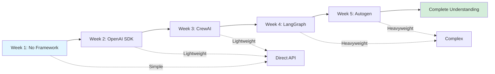

## 5. Where It Fits in the System

- **AI Layer**: Complete framework knowledge

## 6. Common Interview Questions

**Q1: What frameworks have you used?**
A: After this course, you can list multiple frameworks across complexity levels.

**Q2: How do you decide which to use?**
A: Based on project complexity, team skills, and specific requirements.

**Q3: What's your preference?**
A: Depends on use case, but bias towards simpler solutions when possible.

## 7. Quick Revision Summary

- Course covers full spectrum of frameworks
- Hands-on experience with each
- Learn when to use each one
- Become versatile in framework selection
- Understand trade-offs practically

---

# END OF DOCUMENT

**Total Topics Covered**: 17

**Framework Complexity Levels**:
- Level 1: No Framework, MCP
- Level 2: OpenAI Agents SDK, CrewAI  
- Level 3: LangGraph, Autogen

**Key Takeaway**: Choose the simplest framework that solves your problem. Start simple, add complexity only when needed.
