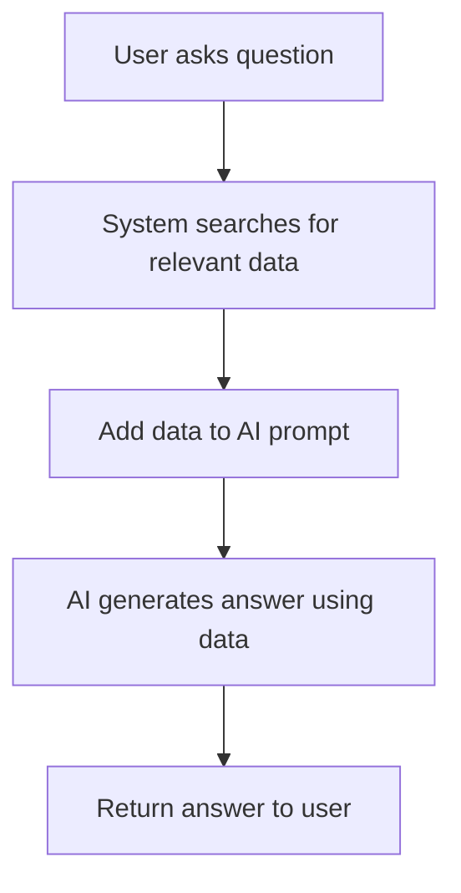
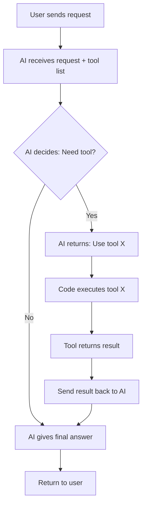

# 05. Resources vs. Tools: Two Ways to Enhance LLM Capabilities in Agentic AI

---

## Resources

### 1. Simple Explanation

Resources are extra information you add to the AI's prompt to make it smarter. Think of it like giving the AI a cheat sheet before asking a question.

Instead of the AI guessing, you give it facts, data, or documents so it can answer accurately.

**Example:** If you ask AI about flight prices, you first give it a list of all ticket prices. Then it can answer correctly.

### 2. Why It Matters (Interview + Real World)

- **Problem it solves:** AI doesn't know everything. Resources fill the knowledge gap.
- **Why companies use it:** Makes AI answers accurate and up-to-date without retraining the model.
- **Why interviewers ask:** It's the foundation of RAG (Retrieval Augmented Generation), a key AI technique.

### 3. Very Simple Healthcare Example

Patient asks: "What vaccines do I need for travel?"  
AI gets resource: Latest CDC vaccine guidelines  
AI answers: "You need Hepatitis A and Typhoid vaccines for India."

### 4. Step-by-Step Workflow

```
1. User asks a question
2. System finds relevant data (documents, database, files)
3. System adds this data to the AI prompt
4. AI reads the data and generates answer
5. System returns answer to user
```

**Mermaid Diagram:**



### 5. Where It Fits in the System

- **AI Layer:** Prompt enhancement
- **RAG System:** Core component for retrieval
- **Agent:** Provides context for better decisions

### 6. Common Interview Questions

**Q1: What are resources in AI agents?**  
A: Extra information added to prompts to improve AI accuracy.

**Q2: How do resources differ from training data?**  
A: Resources are added at runtime; training data is used when building the model.

**Q3: Give an example of using resources.**  
A: Adding company policy documents to a customer support AI's prompt.

### 7. Quick Revision Summary

- Resources = extra context added to AI prompts
- Makes AI smarter without retraining
- Foundation of RAG systems
- Simple concept: just add relevant data to the prompt

---

## Tools (Function Calling)

### 1. Simple Explanation

Tools let the AI take actions, not just answer questions. The AI can decide to use a tool (like querying a database, sending an email, or turning on lights) when needed.

**The Secret:** It's not magic. The AI just tells you "I want to use this tool" in JSON format, and your code runs that tool.

**How it really works:**
1. You tell AI: "You can use these tools"
2. AI responds: "Use tool X"
3. Your code runs tool X
4. You send results back to AI
5. AI gives final answer

### 2. Why It Matters (Interview + Real World)

- **Problem it solves:** AI can interact with real systems (databases, APIs, devices).
- **Why companies use it:** Enables AI agents to automate tasks, not just chat.
- **Why interviewers ask:** Core concept in agentic AI and automation.

### 3. Very Simple Healthcare Example

Patient: "Book me an appointment with Dr. Smith tomorrow at 2 PM"  
AI decides: Use "book_appointment" tool  
System books appointment in database  
AI confirms: "Appointment booked successfully"

### 4. Step-by-Step Workflow

```
1. User sends request to AI
2. AI receives list of available tools
3. AI decides which tool to use (returns JSON)
4. Your code checks the JSON response
5. Your code executes the requested tool
6. Tool returns result
7. Send result back to AI
8. AI generates final response
```

**Mermaid Diagram:**



### 5. Where It Fits in the System

- **Agent Layer:** Core capability for autonomous actions
- **Microservices:** Tools connect to various services
- **API Gateway:** Tools may call external APIs

### 6. Common Interview Questions

**Q1: What are tools in AI agents?**  
A: Functions the AI can call to perform actions like database queries or API calls.

**Q2: How does tool calling actually work?**  
A: AI returns JSON saying which tool to use, your code executes it, then sends results back to AI.

**Q3: What's the difference between resources and tools?**  
A: Resources = giving AI information. Tools = letting AI take actions.

### 7. Quick Revision Summary

- Tools = actions AI can perform
- Not magic: AI returns JSON, your code runs the tool
- Enables AI autonomy and automation
- Uses if-statements to check which tool AI wants
- AI decides when to use tools based on user request

---

## Resources vs. Tools: Quick Comparison

| Aspect | Resources | Tools |
|--------|-----------|-------|
| **Purpose** | Give AI information | Let AI take actions |
| **Example** | Add ticket prices to prompt | Query database for prices |
| **When to use** | AI needs knowledge | AI needs to do something |
| **Complexity** | Simple (add text to prompt) | Medium (JSON + code execution) |
| **Related to** | RAG, context enhancement | Function calling, agents |

---

## Key Takeaway

**Resources** make AI smarter by giving it information.  
**Tools** make AI more powerful by letting it take actions.

Both work together to create effective AI agents.
