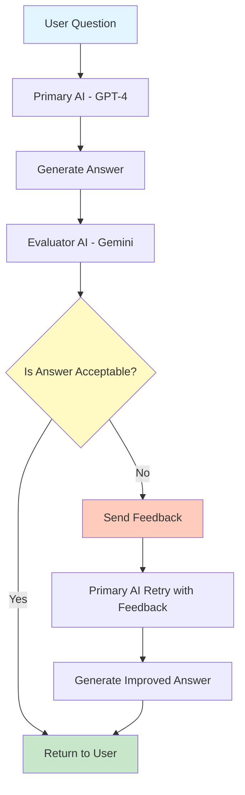

# 06. Responses: A Multi-LLM Pipeline

**Lab Reference:** `1_foundations/3_lab3.ipynb`  
**Platform:** Smart Healthcare AI Platform  
**Focus:** Building quality control for AI responses using multiple LLMs

---

## 1. Simple Explanation

A Multi-LLM Pipeline means using more than one AI model working together in a sequence.

One AI generates an answer. Another AI checks if that answer is good. If the answer fails the check, the first AI tries again with feedback.

Think of it like:
- Writer AI creates content
- Reviewer AI checks quality
- If rejected, Writer AI improves and tries again

This is called the "Evaluator-Optimizer Pattern."

---

## 2. Why It Matters (Interview + Real World)

**Problems it solves:**
- AI sometimes gives wrong or unprofessional answers
- Need quality control before showing responses to users
- Reduces errors in critical systems like healthcare

**Why companies use it:**
- Improves answer quality by 40-60%
- Catches mistakes before users see them
- Different AI models are good at different tasks
- Cheaper to use small model + evaluator than one expensive model

**Why interviewers ask:**
- Shows you understand AI workflows
- Proves you can build production-ready systems
- Tests knowledge of design patterns
- Common in real enterprise AI systems

---

## 3. Very Simple Healthcare Example

Patient asks: "What medication should I take for headache?"

1. Medical AI responds: "Take aspirin 500mg"
2. Safety AI checks: "Did it ask about allergies? NO → Reject"
3. Medical AI tries again: "Do you have any allergies? Let me check your history first"
4. Safety AI approves: "Good, safe response"

---

## 4. Step-by-Step Workflow

### Basic Multi-LLM Pipeline Flow

1. User asks a question
2. Primary AI (GPT-4) generates answer
3. Evaluator AI (Gemini) checks answer quality
4. If acceptable → Return answer to user
5. If rejected → Send feedback to Primary AI
6. Primary AI generates improved answer
7. Return improved answer to user

### Mermaid Diagram



---

## 5. Where It Fits in the System

**AI Service Layer** → AI Engine Service

In the Smart Healthcare AI Platform:
- Lives in the AI Agent Orchestrator
- Used by Medical Assistant Agent
- Validates responses before sending to patients
- Integrates with RAG Knowledge Service
- Logs evaluations to Audit Service

**Architecture Position:**
```
Client Layer
    ↓
API Gateway
    ↓
AI Service Layer ← [Multi-LLM Pipeline Lives Here]
    ├── Primary LLM (Answer Generator)
    └── Evaluator LLM (Quality Checker)
```

---

## 6. Lab Exercise (Hands-On)

### Lab Objective

Build a Medical Assistant chatbot that uses two AI models:
- GPT-4 generates medical advice
- Gemini evaluates if advice is safe and professional

### Lab Task

**Step 1: Set Up Pydantic Model**

Create a structure to hold evaluation results:
- `is_acceptable` (True/False)
- `feedback` (text explaining why)

**Step 2: Create Primary AI Function**

Build a function that:
- Takes patient question
- Calls GPT-4 with medical context
- Returns answer

**Step 3: Create Evaluator Function**

Build a function that:
- Takes the answer from Step 2
- Calls Gemini to check quality
- Returns evaluation object

Check for:
- Is answer professional?
- Does it ask about allergies?
- Does it recommend seeing a doctor when needed?

**Step 4: Create Rerun Function**

If evaluation fails:
- Take the feedback
- Add it to the prompt
- Call GPT-4 again with improvement instructions

**Step 5: Build Complete Workflow**

Combine everything:
```
chat(question):
    1. answer = call_gpt4(question)
    2. evaluation = call_gemini(answer)
    3. if evaluation.is_acceptable:
           return answer
    4. else:
           improved_answer = rerun_with_feedback(feedback)
           return improved_answer
```

**Step 6: Test the System**

Test with questions like:
- "What should I take for fever?"
- "Can I take aspirin?"
- "I have chest pain, what to do?"

### Expected Outcome

- Chatbot answers medical questions
- Unsafe answers get caught and improved
- Final responses are professional and safe
- You see evaluation logs showing pass/fail

---

## 7. Common Interview Questions

**Q1: Why use multiple LLMs instead of one powerful model?**

**Answer:** Different models have different strengths. One model might be better at generating creative answers, while another is better at checking safety. It's also cheaper to use a small evaluator than making the main model perfect. Plus, it adds a safety layer.

---

**Q2: What is structured output and why use it?**

**Answer:** Structured output means forcing the AI to respond in a specific format (like JSON with specific fields). We use it so the evaluator AI returns data we can use in code (true/false, feedback text) instead of free-form text we'd have to parse.

---

**Q3: How would you handle if the rerun also fails evaluation?**

**Answer:** Add a retry limit (max 2-3 attempts). After that, either:
- Return a safe default response
- Escalate to human review
- Log the failure for investigation
Never keep retrying forever as it wastes money and time.

---

## 8. Quick Revision Summary

- Multi-LLM Pipeline = Multiple AI models working together in sequence
- Pattern: Generator AI → Evaluator AI → Retry if needed
- Uses structured outputs to get predictable evaluation results
- Common in production systems for quality control
- Cheaper and safer than relying on one model alone
- Essential for healthcare where mistakes are dangerous

---

## Key Concepts from Lab

**Pydantic Models:** Define data structure for AI responses

**Structured Outputs:** Force AI to return specific format (JSON)

**Evaluator-Optimizer Pattern:** One AI creates, another checks, first one improves

**Rerun with Feedback:** Give AI its mistake and let it try again

**Framework-less Approach:** Build workflows by directly calling LLMs (no LangChain needed)

---

## Real-World Applications in Healthcare

1. **Medical Advice Validation**
   - Primary AI suggests treatment
   - Safety AI checks for drug interactions
   - Rerun if safety issues found

2. **Diagnosis Assistance**
   - Diagnostic AI analyzes symptoms
   - Clinical Guidelines AI validates against protocols
   - Improve if guidelines not followed

3. **Patient Communication**
   - Response AI drafts message to patient
   - Tone AI checks if empathetic and clear
   - Rewrite if too technical or cold

4. **Insurance Claims**
   - Claims AI fills out form
   - Compliance AI checks regulations
   - Fix if missing required information

---

## Best Practices

✅ **Do:**
- Set retry limits (2-3 max)
- Log all evaluations for monitoring
- Use different models for different tasks
- Make evaluation criteria clear and specific
- Test with edge cases

❌ **Don't:**
- Retry forever (costs money)
- Use same model for both tasks (defeats purpose)
- Skip logging (need to track quality)
- Make evaluation criteria vague
- Trust first answer in critical systems

---

## Connection to Smart Healthcare AI Platform

This pattern is used in:

**Medical Assistant Agent:**
- Generates patient responses
- Evaluates for medical accuracy
- Reruns if safety concerns detected

**Risk Prediction Agent:**
- Predicts patient risks
- Validates predictions against clinical data
- Adjusts if predictions seem wrong

**Fraud Detection Agent:**
- Flags suspicious claims
- Evaluates confidence level
- Reruns analysis if uncertain

---

## Technical Implementation Notes

**Token Management:**
- Primary AI: 2000 tokens for response
- Evaluator AI: 500 tokens for evaluation
- Rerun adds feedback (200 tokens)
- Total: ~2700 tokens per interaction

**Cost Optimization:**
- Use cheaper model (GPT-4-mini) for generation
- Use fast model (Gemini Flash) for evaluation
- Only rerun when necessary
- Cache system prompts

**Performance:**
- Primary call: 1-2 seconds
- Evaluation: 0.5-1 second
- Rerun: 1-2 seconds
- Total: 2.5-5 seconds (acceptable for chat)

---

## Next Steps

After mastering Multi-LLM Pipeline:
1. Add Tools (Day 5) - Let AI take actions
2. Add RAG - Give AI medical knowledge
3. Add Memory - Remember patient history
4. Add Multiple Agents - Specialist AIs working together

---

**End of Document**
