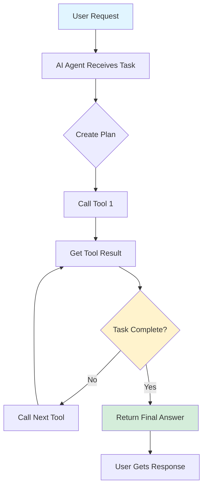
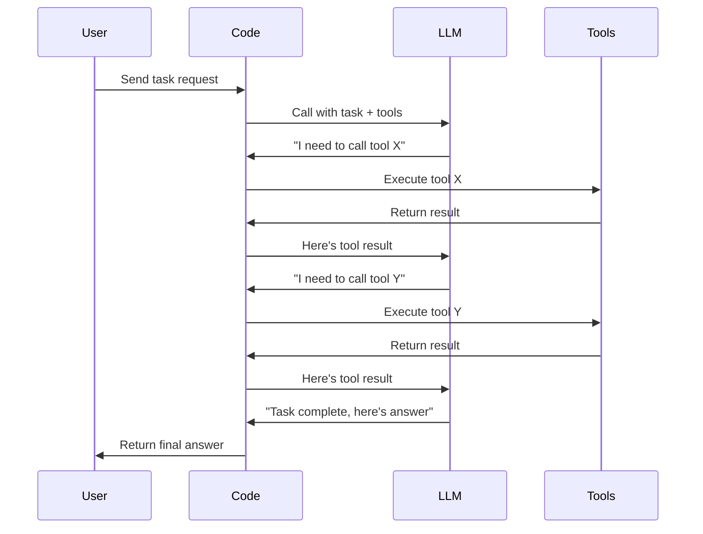
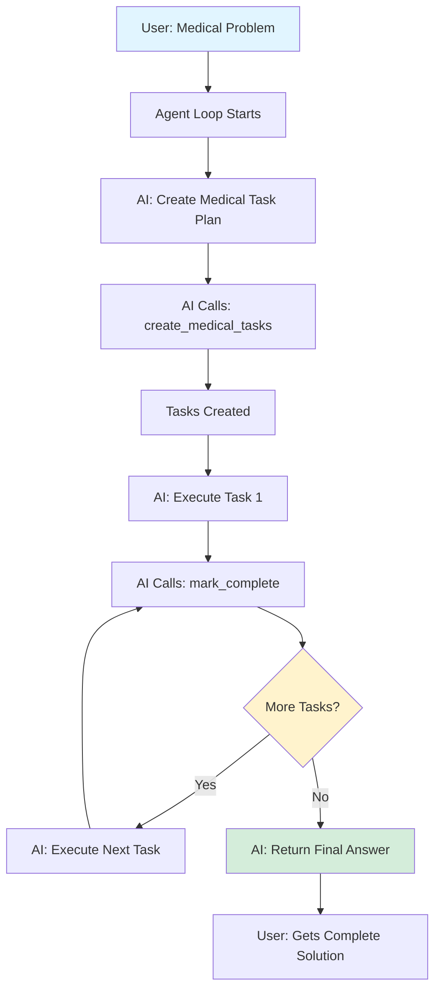

# 07. Building Your First Agent Loop with OpenAI Tools from Scratch

---

## What is an AI Agent?

### 1. Simple Explanation

An AI agent is an LLM (Large Language Model) that:
- Has access to tools (functions it can call)
- Runs in a loop (keeps working until done)
- Achieves a goal (solves a problem step by step)

Think of it like this: You give the AI a task, and it keeps calling tools and making decisions until it finishes the job.

**Important Reality Check:**
- It FEELS like the AI is "thinking" and "working" independently
- But ACTUALLY, your code is just calling the LLM repeatedly
- The LLM generates tokens (text predictions)
- Your code interprets those tokens and calls tools
- This creates the illusion of an intelligent agent

### 2. Why It Matters (Interview + Real World)

**Problem it solves:**
- Single LLM calls can't handle complex multi-step tasks
- Humans need to break down problems into steps manually
- Agent loops automate this planning and execution process

**Why companies use it:**
- Automates complex workflows (scheduling, diagnosis, planning)
- Reduces human intervention in repetitive tasks
- Improves accuracy by breaking problems into smaller steps
- Scales better than single-shot LLM calls

**Why interviewers ask about it:**
- Agent loops are the foundation of modern AI systems
- Shows understanding of LLM limitations and how to overcome them
- Demonstrates practical AI engineering skills
- Core concept in AI agent frameworks (LangChain, AutoGPT, etc.)

### 3. Very Simple Healthcare Example

Patient asks: "I have fever and cough, what should I do?"

Agent loop workflow:
1. AI creates plan: Check symptoms → Assess severity → Recommend action
2. AI calls symptom checker tool → Gets risk level
3. AI calls appointment tool → Finds available doctor
4. AI responds: "Book urgent care appointment today at 3 PM"

### 4. Step-by-Step Workflow

**Agent Loop Execution:**

1. User sends request to AI agent
2. AI creates a plan (list of steps to complete)
3. AI calls first tool (e.g., check patient history)
4. Tool returns result to AI
5. AI decides next action based on result
6. AI calls next tool (e.g., search medical guidelines)
7. Loop continues until AI decides task is complete
8. AI returns final answer to user

**Mermaid Diagram:**



**Detailed Agent Loop Flow:**



### 5. Where It Fits in the System

**Component:** AI Agent Layer

**Location in Smart Healthcare Platform:**
- Sits in the AI Service Layer
- Used by: Medical Assistant Agent, Scheduling Agent, Risk Prediction Agent
- Connects to: RAG Knowledge Service, Microservices (Patient, Appointment, Billing)
- Pattern: Agent Orchestration Pattern

**Architecture Position:**
```
Client Layer
    ↓
API Gateway
    ↓
Microservices Layer
    ↓
AI Agent Layer ← [AGENT LOOP LIVES HERE]
    ↓
Tools (RAG, Database, APIs)
```

---

## 6. Lab Exercise (Hands-On)

### Lab Objective

Build a healthcare AI agent from scratch that uses tools in a loop to solve medical scheduling problems.

**Reference Path:** `D:\MyProjects\agents\1_foundations\5_extra.ipynb`

---

### 📁 Folder Name
`HC_1_foundations`

### 📄 File Name
`HC_5_extra.ipynb`

---

### 📘 Lab Content

## Lab Title
**Building Your First Healthcare Agent Loop from Scratch**

---

## Objective

Learn how to build an AI agent that:
- Uses tools (functions) to manage patient tasks
- Runs in a loop until a medical problem is solved
- Plans and executes steps automatically
- Demonstrates the core concept of agentic AI

---

## Scenario

You are building a **Medical Task Management Agent** for a healthcare clinic.

The agent needs to:
- Create a list of medical tasks (e.g., "Check patient vitals", "Order lab tests")
- Execute each task step by step
- Mark tasks as complete when done
- Solve complex medical scheduling problems

**Example Problem:**
"A patient needs a follow-up appointment. They need blood work done first, then a doctor consultation, then prescription refill. Plan and execute these tasks."

---

## Tasks / Steps

### Step 1: Setup and Imports

```python
# Import required libraries
from rich.console import Console
from dotenv import load_dotenv
from openai import OpenAI
import json
load_dotenv(override=True)
```

**Healthcare Context:**
- `rich.console` - For formatted output (useful for displaying patient task lists)
- `openai` - To call the LLM
- `json` - To handle tool call data

---

### Step 2: Create Helper Function for Display

```python
def show(text):
    try:
        Console().print(text)
    except Exception:
        print(text)
```

**Purpose:** Display formatted text in the terminal (patient task updates, completion status)

---

### Step 3: Initialize OpenAI Client

```python
openai = OpenAI()
```

---

### Step 4: Create Medical Task Lists

```python
# Medical task tracking lists
medical_tasks = []
completed = []
```

**Healthcare Context:**
- `medical_tasks` - List of medical procedures/tasks to complete
- `completed` - Boolean list tracking which tasks are done

---

### Step 5: Create Task Report Function

```python
def get_task_report() -> str:
    result = ""
    for index, task in enumerate(medical_tasks):
        if completed[index]:
            result += f"Task #{index + 1}: [green][strike]{task}[/strike][/green]\n"
        else:
            result += f"Task #{index + 1}: {task}\n"
    show(result)
    return result
```

**Healthcare Context:**
- Shows all medical tasks
- Completed tasks are shown with strikethrough (green)
- Pending tasks are shown normally

**Example Output:**
```
Task #1: ~~Check patient vitals~~ ✓
Task #2: Order blood work
Task #3: Schedule follow-up
```

---

### Step 6: Create Function to Add Medical Tasks

```python
def create_medical_tasks(descriptions: list[str]) -> str:
    medical_tasks.extend(descriptions)
    completed.extend([False] * len(descriptions))
    return get_task_report()
```

**Healthcare Context:**
- Takes a list of medical task descriptions
- Adds them to the task list
- Marks all as incomplete initially
- Returns updated task report

**Example Usage:**
```python
create_medical_tasks([
    "Check patient blood pressure",
    "Order CBC lab test",
    "Schedule cardiology consult"
])
```

---

### Step 7: Create Function to Mark Tasks Complete

```python
def mark_complete(index: int, completion_notes: str) -> str:
    if 1 <= index <= len(medical_tasks):
        completed[index - 1] = True
    else:
        return "No task at this index."
    Console().print(completion_notes)
    return get_task_report()
```

**Healthcare Context:**
- Marks a medical task as complete
- Records completion notes (e.g., "Blood pressure: 120/80 - Normal")
- Returns updated task report

**Example Usage:**
```python
mark_complete(1, "Blood pressure checked: 120/80 mmHg - Normal range")
```

---

### Step 8: Test the Functions (Manual)

```python
# Reset lists
medical_tasks, completed = [], []

# Create sample medical tasks
create_medical_tasks([
    "Check patient vitals",
    "Review medication list",
    "Schedule follow-up appointment"
])
```

**Output:**
```
Task #1: Check patient vitals
Task #2: Review medication list
Task #3: Schedule follow-up appointment
```

```python
# Mark first task complete
mark_complete(1, "Vitals checked: BP 120/80, HR 72, Temp 98.6°F")
```

**Output:**
```
Vitals checked: BP 120/80, HR 72, Temp 98.6°F
Task #1: ~~Check patient vitals~~
Task #2: Review medication list
Task #3: Schedule follow-up appointment
```

---

### Step 9: Define Tool JSON Schemas

**Tool 1: Create Medical Tasks**

```python
create_medical_tasks_json = {
    "name": "create_medical_tasks",
    "description": "Add new medical tasks from a list of descriptions and return the full list",
    "parameters": {
        "type": "object",
        "properties": {
            "descriptions": {
                'type': 'array',
                'items': {'type': 'string'},
                'title': 'Descriptions'
            }
        },
        "required": ["descriptions"],
        "additionalProperties": False
    }
}
```

**Healthcare Context:**
- Tells the AI how to create medical tasks
- AI can call this tool to plan medical procedures

---

**Tool 2: Mark Task Complete**

```python
mark_complete_json = {
    "name": "mark_complete",
    "description": "Mark complete the medical task at the given position (starting from 1) and return the full list",
    "parameters": {
        'properties': {
            'index': {
                'description': 'The 1-based index of the task to mark as complete',
                'title': 'Index',
                'type': 'integer'
            },
            'completion_notes': {
                'description': 'Notes about how you completed the task in rich console markup',
                'title': 'Completion Notes',
                'type': 'string'
            }
        },
        'required': ['index', 'completion_notes'],
        'type': 'object',
        'additionalProperties': False
    }
}
```

**Healthcare Context:**
- Tells the AI how to mark medical tasks complete
- AI can record completion notes (e.g., test results, observations)

---

### Step 10: Combine Tools into List

```python
tools = [
    {"type": "function", "function": create_medical_tasks_json},
    {"type": "function", "function": mark_complete_json}
]
```

**Healthcare Context:**
- This list is passed to the LLM
- LLM can choose which tool to call based on the task

---

### Step 11: Create Tool Call Handler

```python
def handle_tool_calls(tool_calls):
    results = []
    for tool_call in tool_calls:
        tool_name = tool_call.function.name
        arguments = json.loads(tool_call.function.arguments)
        tool = globals().get(tool_name)
        result = tool(**arguments) if tool else {}
        results.append({
            "role": "tool",
            "content": json.dumps(result),
            "tool_call_id": tool_call.id
        })
    return results
```

**Healthcare Context:**
- When AI wants to call a tool, this function executes it
- Extracts tool name and arguments from AI's response
- Calls the actual Python function
- Returns results back to AI

**Flow:**
```
AI says: "Call create_medical_tasks with ['Check vitals', 'Order labs']"
    ↓
handle_tool_calls extracts the function name and arguments
    ↓
Calls create_medical_tasks(['Check vitals', 'Order labs'])
    ↓
Returns result to AI
```

---

### Step 12: Create the Agent Loop (THE CORE!)

```python
def loop(messages):
    done = False
    while not done:
        # Call OpenAI with messages and tools
        response = openai.chat.completions.create(
            model="gpt-4",
            messages=messages,
            tools=tools
        )
        
        finish_reason = response.choices[0].finish_reason
        
        if finish_reason == "tool_calls":
            # AI wants to call a tool
            message = response.choices[0].message
            tool_calls = message.tool_calls
            results = handle_tool_calls(tool_calls)
            messages.append(message)
            messages.extend(results)
        else:
            # AI is done
            done = True
    
    show(response.choices[0].message.content)
```

**Healthcare Context:**
- This is the AGENT LOOP
- Keeps calling the AI until it's done
- AI can call tools multiple times
- Loop stops when AI says "I'm finished"

**Loop Flow:**
```
1. Call AI with current messages
2. AI responds with tool call OR final answer
3. If tool call → Execute tool → Add result to messages → Loop again
4. If final answer → Stop loop → Show result
```

---

### Step 13: Define System and User Messages

```python
system_message = """
You are a medical task planning assistant.
You are given a medical problem to solve by using your task tools to plan a list of steps, then carrying out each step in turn.
Use the medical task tools to create a plan, carry out the steps, and reply with the solution.
If any information isn't provided, include a step to estimate or research it.
Provide your solution in Rich console markup without code blocks.
Do not ask the user questions; respond only with the answer after using your tools.
"""

user_message = """
A patient needs a comprehensive health check.
They need:
1. Vital signs check (BP, HR, Temp)
2. Blood work (CBC, metabolic panel)
3. Doctor consultation to review results
4. Prescription refill if needed

Plan and execute these tasks in the correct order.
"""

messages = [
    {"role": "system", "content": system_message},
    {"role": "user", "content": user_message}
]
```

**Healthcare Context:**
- System message: Tells AI its role (medical task planner)
- User message: The medical problem to solve
- AI will create tasks and execute them step by step

---

### Step 14: Run the Agent Loop

```python
# Reset task lists
medical_tasks, completed = [], []

# Run the agent loop
loop(messages)
```

**Expected Output:**
```
Task #1: Check vital signs (BP, HR, Temp)
Task #2: Order blood work (CBC, metabolic panel)
Task #3: Schedule doctor consultation
Task #4: Prepare prescription refill request

Vitals checked: BP 118/76, HR 68, Temp 98.4°F - All normal
Task #1: ~~Check vital signs (BP, HR, Temp)~~
Task #2: Order blood work (CBC, metabolic panel)
Task #3: Schedule doctor consultation
Task #4: Prepare prescription refill request

Blood work ordered: CBC and metabolic panel - Results in 24 hours
Task #1: ~~Check vital signs (BP, HR, Temp)~~
Task #2: ~~Order blood work (CBC, metabolic panel)~~
Task #3: Schedule doctor consultation
Task #4: Prepare prescription refill request

Doctor consultation scheduled for tomorrow at 10 AM
Task #1: ~~Check vital signs (BP, HR, Temp)~~
Task #2: ~~Order blood work (CBC, metabolic panel)~~
Task #3: ~~Schedule doctor consultation~~
Task #4: Prepare prescription refill request

Prescription refill request prepared - Ready for doctor review
Task #1: ~~Check vital signs (BP, HR, Temp)~~
Task #2: ~~Order blood work (CBC, metabolic panel)~~
Task #3: ~~Schedule doctor consultation~~
Task #4: ~~Prepare prescription refill request~~

✅ All tasks completed! Patient health check fully planned and executed.
```

---

### Step 15: Try Different Medical Problems

**Example 1: Emergency Triage**
```python
user_message = """
A patient calls with chest pain and shortness of breath.
Triage the situation and plan immediate actions.
"""
```

**Example 2: Appointment Scheduling**
```python
user_message = """
A patient needs a follow-up appointment.
They need lab work done 2 days before the appointment.
The appointment should be with Dr. Smith.
Plan the scheduling.
```

**Example 3: Medication Management**
```python
user_message = """
A patient is on 3 medications.
Check for drug interactions.
Verify dosages are correct.
Schedule pharmacy pickup.
```

---

## Agent Loop Workflow Diagram



---

## Expected Outcome

After completing this lab, you will have:

1. ✅ Built an AI agent loop from scratch (no frameworks)
2. ✅ Created tools that the AI can call
3. ✅ Implemented tool call handling
4. ✅ Seen the AI plan and execute tasks automatically
5. ✅ Understood how agent loops work under the hood

**Key Insight:**
The AI doesn't actually "think" or "plan" independently. Your code is repeatedly calling the LLM, interpreting its responses, executing tools, and feeding results back. This creates the illusion of an intelligent agent.

---

## Key Learning Points

1. **Agent Loop = LLM + Tools + While Loop**
   - Not magic, just repeated LLM calls
   - Tools are regular Python functions
   - Loop continues until AI says "done"

2. **Tool Calling Mechanism**
   - Define tools as JSON schemas
   - LLM returns tool calls as structured data
   - Your code executes the actual functions
   - Results are fed back to LLM

3. **Why This Works Better Than Single Calls**
   - Breaks complex problems into steps
   - AI can use tools to gather information
   - More accurate than trying to solve everything in one shot
   - Mimics human problem-solving approach

4. **Healthcare Applications**
   - Medical task planning
   - Appointment scheduling
   - Triage automation
   - Treatment plan creation
   - Diagnostic workflows

---

## Notes

**Important Concepts:**

1. **The Illusion vs Reality**
   - FEELS like: AI is independently working
   - ACTUALLY: Your code is calling LLM repeatedly

2. **Tool Definitions**
   - Must be valid JSON schemas
   - LLM uses descriptions to decide when to call tools
   - Clear descriptions = better tool usage

3. **Message History**
   - Each loop iteration adds to message history
   - History includes: user message, AI responses, tool calls, tool results
   - This is how AI "remembers" what it's done

4. **Stopping Condition**
   - Loop stops when `finish_reason != "tool_calls"`
   - AI decides when task is complete
   - Can add max iteration limit for safety

**Best Practices:**

- Always reset task lists before running loop
- Use clear, descriptive tool names
- Provide detailed tool descriptions
- Test tools manually before giving to AI
- Add error handling for production use

---

## 7. Common Interview Questions

**Q1: What is an AI agent loop and how does it work?**

**Answer:**
An AI agent loop is a pattern where an LLM repeatedly calls tools until a task is complete. It works by:
1. Calling the LLM with a task and available tools
2. LLM decides which tool to call (or if it's done)
3. Code executes the tool and returns results
4. Results are added to message history
5. Loop repeats until LLM says "finished"

This allows AI to solve complex multi-step problems by breaking them into smaller actions.

---

**Q2: Why use an agent loop instead of a single LLM call?**

**Answer:**
Agent loops are better because:
- **Complex tasks**: Single calls can't handle multi-step problems well
- **Tool usage**: AI can gather information and take actions dynamically
- **Better accuracy**: Breaking problems into steps reduces errors
- **Flexibility**: AI can adapt its plan based on intermediate results

Example: Scheduling a patient appointment requires checking availability, verifying insurance, and confirming with patient - too complex for one call.

---

**Q3: What are the key components needed to build an agent loop?**

**Answer:**
You need:
1. **LLM API** (OpenAI, Anthropic, etc.)
2. **Tools** (Python functions the AI can call)
3. **Tool schemas** (JSON descriptions of tools)
4. **Tool handler** (Code to execute tool calls)
5. **Loop logic** (While loop that continues until done)
6. **Message history** (Track conversation and tool results)

The loop repeatedly calls the LLM, executes tools, and updates message history until the task is complete.

---

## 8. Quick Revision Summary

- **Agent Loop** = LLM + Tools + While Loop (keeps running until task is done)
- **Reality Check**: Not magic - just your code calling LLM repeatedly and executing tools
- **Why It Works**: Breaks complex problems into steps, like humans do
- **Healthcare Use**: Medical task planning, scheduling, triage, treatment workflows
- **Key Components**: LLM API, tool definitions (JSON), tool handler, loop logic, message history
- **Interview Focus**: Understand it's not "thinking" - it's repeated LLM calls with tool execution
- **Practical Benefit**: Solves multi-step problems better than single LLM calls

---

**End of Document**
