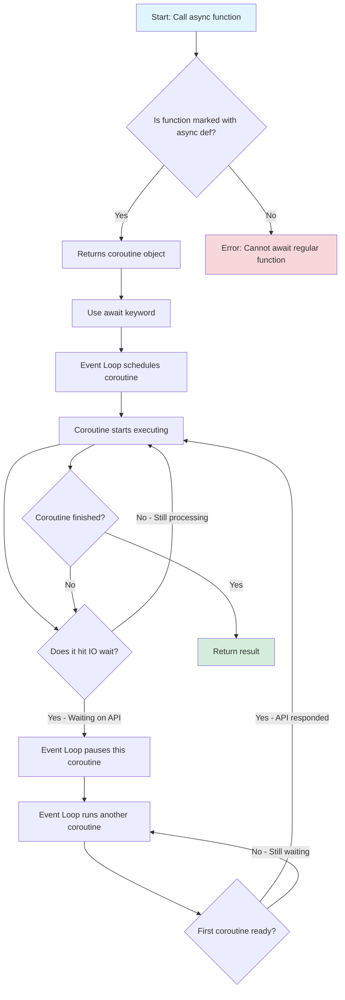
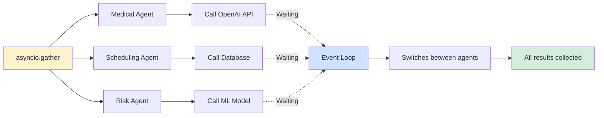

# 2.1 The Foundation for OpenAI Agents SDK - Async IO

**Version:** 1.0  
**Topic:** Asynchronous Python (async/await)  
**Date:** February 2026  
**Level:** Beginner-Friendly

---

## 1. Simple Explanation

**Async IO** is a way to write Python code that can do multiple things at the same time without using heavy system resources.

Think of it like a chef cooking multiple dishes:
- Normal Python: Cook one dish completely, then start the next one
- Async Python: While one dish is in the oven (waiting), start preparing another dish

When your code is waiting (like waiting for OpenAI API response), async lets other code run instead of just sitting idle.

**Two main keywords:**
- `async def` - marks a function that can run concurrently
- `await` - tells Python to run that async function

---

## 2. Why It Matters (Interview + Real World)

**Problems it solves:**
- Waiting time is wasted time - when calling APIs, most time is spent waiting for responses
- Running multiple AI agents efficiently without heavy resource usage
- Handling thousands of requests without creating thousands of threads

**Why companies use it:**
- AI applications make many API calls (OpenAI, databases, external services)
- Can handle 10,000+ concurrent operations with minimal memory
- Much simpler than traditional multithreading
- Perfect for IO-bound tasks (network calls, file operations)

**Why interviewers ask:**
- All modern AI frameworks (OpenAI Agents SDK, LangChain, CrewAI) use async
- Shows you understand concurrent programming
- Critical for building scalable AI systems
- Common in production healthcare AI systems

---

## 3. Very Simple Healthcare Example

**Without Async (Slow):**
Patient 1 asks symptom question → Wait 3 seconds for AI → Get answer → Patient 2 asks question → Wait 3 seconds → Get answer
Total time: 6 seconds for 2 patients

**With Async (Fast):**
Patient 1 asks question → While waiting, Patient 2 asks question → Both get answers around same time
Total time: ~3 seconds for 2 patients

---

## 4. Step-by-Step Workflow

### How Async IO Works

1. **Define async function** - Mark function with `async def` (now called a "coroutine")
2. **Call with await** - Use `await` keyword to run the coroutine
3. **Event loop starts** - Python's event loop begins executing the coroutine
4. **Hit waiting point** - When code waits (API call), event loop pauses this coroutine
5. **Switch to another** - Event loop runs a different coroutine that's ready
6. **Resume when ready** - When API responds, event loop resumes the first coroutine
7. **Return result** - Coroutine completes and returns the result

### Multiple Coroutines Running Together

1. **Create multiple async tasks** - Define several async functions
2. **Use asyncio.gather()** - Bundle them together
3. **Event loop schedules all** - All tasks are queued for execution
4. **Concurrent execution** - While one waits, others run
5. **Collect all results** - All results returned as a list

---

## 5. Mermaid Flow Diagram



### Multiple Agents Running Concurrently



---

## 6. Where It Fits in the System

**Location:** AI Service Layer - Foundation for all AI agents

**Used in:**
- **AI Agent Orchestrator** - Running multiple agents concurrently
- **Medical Assistant Agent** - Handling multiple patient queries simultaneously
- **RAG Knowledge Service** - Parallel document retrieval and embedding generation
- **Risk Prediction Agent** - Running multiple ML models at once
- **API Gateway** - Handling thousands of concurrent requests

**Integration points:**
- All OpenAI API calls use async
- Database queries in microservices
- Event-driven communication (Azure Service Bus)
- Real-time notifications (SignalR)

---

## 7. Common Interview Questions

### Q1: What's the difference between async def and regular def?

**Answer:**
- `def` creates a regular function that runs immediately when called
- `async def` creates a coroutine that doesn't run until you `await` it
- Coroutines can be paused and resumed by the event loop

### Q2: Why use async instead of multithreading?

**Answer:**
- Async is lightweight - can handle 10,000+ concurrent operations
- No thread overhead - doesn't create OS-level threads
- Perfect for IO-bound tasks (API calls, database queries)
- Simpler to write and debug than traditional threads

### Q3: When should you NOT use async?

**Answer:**
- CPU-intensive tasks (heavy calculations, image processing)
- When you don't have any waiting/IO operations
- Simple scripts that run once and exit
- For CPU-bound work, use multiprocessing instead

### Q4: What does await do?

**Answer:**
- Schedules a coroutine for execution in the event loop
- Blocks until that coroutine completes
- Returns the result from the coroutine
- Without await, the coroutine never actually runs

### Q5: How does asyncio.gather() work?

**Answer:**
- Takes multiple coroutines as input
- Runs them all concurrently (not sequentially)
- Returns a list of all results in the same order
- Waits for all to complete before returning

---

## 8. Code Examples (Simple)

### Basic Async Function

```python
# Define async function (coroutine)
async def check_patient_symptoms(patient_id):
    # Simulate API call to OpenAI
    response = await openai_api_call(patient_id)
    return response

# Call it with await
result = await check_patient_symptoms("P123")
```

### Running Multiple Agents Concurrently

```python
import asyncio

# Three different agents
async def medical_agent(query):
    return await call_openai(query)

async def scheduling_agent(patient_id):
    return await check_availability(patient_id)

async def risk_agent(patient_id):
    return await predict_risk(patient_id)

# Run all three at the same time
results = await asyncio.gather(
    medical_agent("headache symptoms"),
    scheduling_agent("P123"),
    risk_agent("P123")
)

# results = [medical_response, schedule_response, risk_response]
```

---

## 9. Key Concepts

### Coroutine vs Function

| Regular Function | Coroutine (Async Function) |
|-----------------|---------------------------|
| `def my_func()` | `async def my_func()` |
| Runs immediately when called | Doesn't run until awaited |
| Returns result directly | Returns coroutine object |
| Cannot be paused | Can be paused and resumed |

### Event Loop

**What it is:**
- A while loop that manages coroutines
- Executes one coroutine at a time
- Switches when a coroutine is waiting (blocked on IO)

**How it works:**
1. Takes a coroutine from the queue
2. Starts executing it
3. If it hits IO wait, pause it
4. Pick another coroutine and run it
5. When IO completes, resume the paused coroutine

---

## 10. Healthcare Platform Examples

### Example 1: Patient Triage System

```python
async def triage_patient(symptoms):
    # All three run concurrently
    results = await asyncio.gather(
        search_medical_knowledge(symptoms),  # RAG search
        get_patient_history(patient_id),     # Database query
        check_drug_interactions(medications) # External API
    )
    return analyze_results(results)
```

**Benefit:** Instead of 9 seconds (3+3+3), takes only ~3 seconds

### Example 2: Multi-Agent Orchestration

```python
async def handle_patient_request(patient_id, query):
    # Medical Assistant analyzes symptoms
    diagnosis = await medical_assistant_agent(query)
    
    # While scheduling, also predict risk (concurrent)
    appointment, risk_score = await asyncio.gather(
        scheduling_agent(patient_id, diagnosis),
        risk_prediction_agent(patient_id)
    )
    
    return {
        "diagnosis": diagnosis,
        "appointment": appointment,
        "risk": risk_score
    }
```

---

## 11. Common Mistakes

### Mistake 1: Forgetting await

```python
# WRONG - coroutine never runs
result = my_async_function()  # Returns coroutine object, doesn't run

# CORRECT
result = await my_async_function()  # Actually runs the function
```

### Mistake 2: Using await in non-async function

```python
# WRONG - Cannot use await outside async function
def regular_function():
    result = await async_function()  # ERROR!

# CORRECT
async def async_function_wrapper():
    result = await async_function()  # OK
```

### Mistake 3: Not using asyncio.gather for parallel execution

```python
# WRONG - Runs sequentially (slow)
result1 = await agent1()
result2 = await agent2()
result3 = await agent3()

# CORRECT - Runs concurrently (fast)
results = await asyncio.gather(agent1(), agent2(), agent3())
```

---

## 12. Quick Revision Summary

- **Async IO** = Lightweight way to run multiple things concurrently without threads
- **async def** = Creates a coroutine (special function that can be paused/resumed)
- **await** = Runs a coroutine and waits for its result
- **Event Loop** = Python's manager that switches between coroutines when they're waiting
- **asyncio.gather()** = Run multiple coroutines at the same time
- **Perfect for** = API calls, database queries, any IO-bound operations
- **All AI frameworks use it** = OpenAI Agents SDK, LangChain, CrewAI
- **Healthcare benefit** = Handle thousands of patient requests efficiently

---

## 13. Interview Preparation Tips

**What to memorize:**
1. Async is for IO-bound tasks (waiting on networks, databases)
2. Two keywords: `async def` and `await`
3. Coroutines don't run until awaited
4. Event loop manages execution
5. Use `asyncio.gather()` for parallel execution

**What to practice:**
- Converting regular functions to async functions
- Using asyncio.gather() for concurrent operations
- Explaining when to use async vs threads vs multiprocessing

**Red flags to avoid:**
- Saying "async makes code faster" (it doesn't speed up CPU work)
- Confusing async with multithreading (they're different)
- Not knowing when NOT to use async

---

## 14. Real-World Impact

**In Smart Healthcare AI Platform:**

**Without Async:**
- 100 patients asking questions = 100 × 3 seconds = 300 seconds (5 minutes)
- Agents run one at a time
- Poor user experience

**With Async:**
- 100 patients asking questions = ~3-5 seconds total
- All agents run concurrently
- Excellent user experience
- Can scale to 10,000+ concurrent users

**Cost savings:**
- Fewer servers needed
- Better resource utilization
- Lower cloud costs
- Faster response times = better patient outcomes

---

**Next Topic:** OpenAI Agents SDK (Swarm) - Building Multi-Agent Systems
