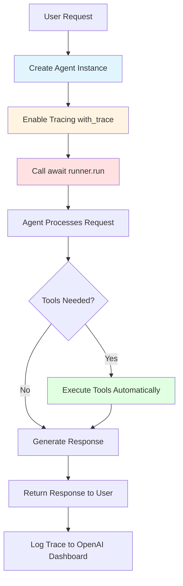

# 2.2 Creating, Tracing, and Running Agents

---

## 1. Simple Explanation

**OpenAI Agents SDK** is a lightweight framework that helps you build AI agents easily. It removes the complicated JSON code you normally need to write and handles tool calling automatically.

**Three key concepts:**
- **Agent**: A package that calls an LLM with a specific role or purpose
- **Handoff**: How agents talk to each other and pass work between them
- **Guardrails**: Safety checks to make sure agents do what you want

**Three steps to run an agent:**
1. Create an agent instance
2. Use `with_trace` to log everything the agent does
3. Call `runner.run()` to actually run the agent

---

## 2. Why It Matters (Interview + Real World)

**Problem it solves:**
- Writing JSON for tools is repetitive and error-prone
- Managing agent conversations is complex
- Tracking what agents do is difficult

**Why companies use it:**
- Saves development time (no boilerplate code)
- Easy to debug with built-in tracing
- Flexible - not "opinionated" (you choose how to build)
- Simple tool integration

**Why interviewers ask:**
- Tests if you understand agent lifecycle
- Shows you can build production AI systems
- Demonstrates knowledge of modern AI frameworks

---

## 3. Very Simple Healthcare Example

**Patient asks: "I have a fever and cough"**
→ Medical Assistant Agent is created
→ Tracing logs all interactions
→ Agent runs and analyzes symptoms
→ Agent suggests: "Visit urgent care within 24 hours"

---

## 4. Step-by-Step Workflow

### Creating and Running an Agent

1. **Create agent instance** - Define the agent's role and capabilities
2. **Add tracing** - Enable logging to monitor agent behavior
3. **Call runner.run()** - Execute the agent (async operation)
4. **Agent processes request** - LLM generates response
5. **Tools are called** - If needed, agent uses tools automatically
6. **Response returned** - Final answer sent back to user
7. **Trace logged** - All steps recorded in OpenAI monitoring

### Mermaid Diagram



---

## 5. Where It Fits in the System

**Location:** AI Service Layer → Agent Orchestrator

**In Smart Healthcare Platform:**
- **Medical Assistant Agent** - Uses OpenAI SDK to create patient triage agent
- **Scheduling Agent** - Uses OpenAI SDK to optimize appointments
- **Risk Prediction Agent** - Uses OpenAI SDK to analyze patient data
- **Fraud Detection Agent** - Uses OpenAI SDK to detect billing anomalies

**Integration points:**
- Connects to Azure OpenAI for LLM calls
- Uses RAG Knowledge Service for medical information
- Logs traces to monitoring dashboard
- Calls microservices via tools

---

## 6. Common Interview Questions

**Q1: What are the three steps to run an OpenAI agent?**

**Answer:** 
1. Create an agent instance with a specific role
2. Use `with_trace` to enable logging
3. Call `await runner.run()` to execute the agent

---

**Q2: What is the difference between "opinionated" and "non-opinionated" frameworks?**

**Answer:** 
- **Opinionated**: Forces you to follow specific patterns (faster to start, less flexible)
- **Non-opinionated**: Gives you freedom to choose how to build (more flexible, like OpenAI SDK)

---

**Q3: Why do we use `await` when calling `runner.run()`?**

**Answer:** 
Because `runner.run()` is an async function (coroutine). It runs in the background, so we use `await` to wait for it to complete before moving forward.

---

**Q4: What is a "handoff" in OpenAI Agents SDK?**

**Answer:** 
A handoff is when one agent passes work to another agent. For example, a triage agent might hand off to a scheduling agent after analyzing symptoms.

---

**Q5: What are guardrails and why are they important?**

**Answer:** 
Guardrails are safety checks that prevent agents from doing unwanted things. In healthcare, they ensure agents don't give dangerous medical advice or access unauthorized patient data.

---

## 7. Quick Revision Summary

- OpenAI Agents SDK is lightweight and flexible (not opinionated)
- Three concepts: Agent (role), Handoff (agent-to-agent), Guardrails (safety)
- Three steps: Create agent → Add tracing → Run with `await runner.run()`
- Tracing logs everything to OpenAI dashboard for debugging
- Handles all JSON tool calling automatically (no boilerplate code)
- Used in AI Service Layer for all healthcare agents
- Async execution requires `await` keyword

---

## 8. Key Terminology

| Term | Simple Meaning |
|------|----------------|
| **Agent** | AI worker with a specific job (like triage, scheduling) |
| **Handoff** | Passing work from one agent to another |
| **Guardrails** | Safety rules to control agent behavior |
| **with_trace** | Logging feature to track agent actions |
| **runner.run()** | Command that actually executes the agent |
| **Async/Await** | Way to run code in the background without blocking |
| **Opinionated** | Framework that forces you to follow its rules |
| **Boilerplate** | Repetitive code you have to write every time |

---

## 9. Real-World Healthcare Use Cases

### Use Case 1: Patient Symptom Triage
```
1. Create Medical Assistant Agent
2. Enable tracing
3. Run agent with patient symptoms
4. Agent analyzes and suggests urgency level
5. Trace shows all reasoning steps
```

### Use Case 2: Appointment Scheduling
```
1. Create Scheduling Agent
2. Enable tracing
3. Run agent with patient request
4. Agent checks availability and optimizes slot
5. Trace logs all calendar checks
```

### Use Case 3: Multi-Agent Handoff
```
1. Triage Agent analyzes symptoms
2. Handoff to Risk Prediction Agent
3. Risk Agent calculates urgency
4. Handoff to Scheduling Agent
5. Scheduling Agent books appointment
6. All steps traced in dashboard
```

---

## 10. Advantages of OpenAI Agents SDK

✅ **No JSON boilerplate** - Framework handles tool definitions automatically
✅ **Built-in tracing** - Easy debugging and monitoring
✅ **Flexible architecture** - Build agents your way
✅ **Simple tool integration** - Just define functions, SDK handles the rest
✅ **Async support** - Non-blocking execution for better performance
✅ **Production-ready** - Used by real companies in healthcare and finance

---

## 11. Common Mistakes to Avoid

❌ **Forgetting `await`** - `runner.run()` is async, must use `await`
❌ **Skipping tracing** - Always use `with_trace` for debugging
❌ **Not defining guardrails** - Agents can go off-track without safety checks
❌ **Overcomplicating agents** - Keep each agent focused on one job
❌ **Ignoring handoffs** - Use handoffs instead of making one giant agent

---

## 12. Connection to Smart Healthcare Platform

In our architecture:

**AI Service Layer** uses OpenAI Agents SDK to power:
- Medical Assistant Agent (symptom analysis)
- Scheduling Optimization Agent (appointment booking)
- Risk Prediction Agent (patient risk scoring)
- Fraud Detection Agent (billing anomaly detection)

**Each agent follows the 3-step pattern:**
1. Create with specific healthcare role
2. Enable tracing for compliance and debugging
3. Run with `await` for async processing

**Tracing is critical for:**
- HIPAA compliance (audit trail)
- Debugging medical recommendations
- Monitoring agent performance
- Improving agent accuracy over time

---

**End of Notes**
