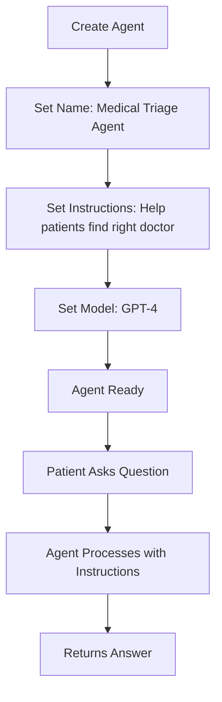
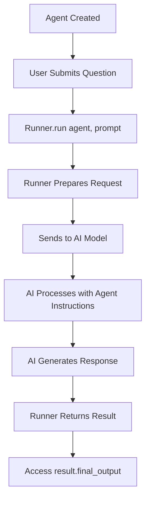
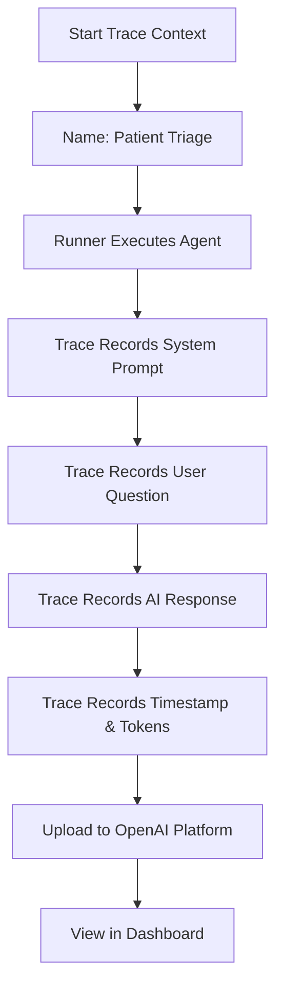
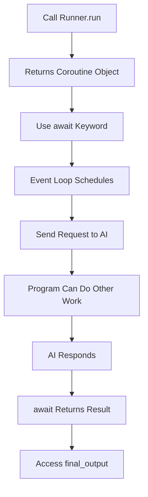
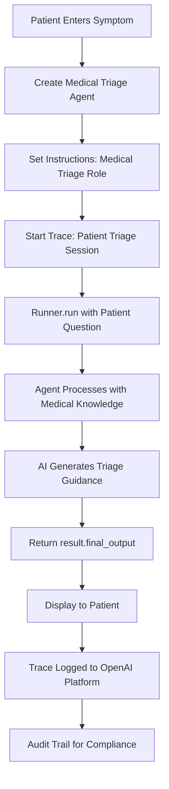

# 2.3 Introduction to Agent, Runner, and Trace Classes in OpenAI Agents SDK

---

## Agent Class

### 1. Simple Explanation

The Agent class is like creating a specialized AI worker with a specific job. You give it:
- A name (what to call it)
- Instructions (what its job is)
- A model (which AI brain to use)

Think of it as hiring an employee. You tell them their role, give them instructions, and they use their skills (the AI model) to do the work.

### 2. Why It Matters (Interview + Real World)

**Problem it solves:**
- Without agents, you'd write the same system prompts repeatedly
- Hard to organize different AI tasks
- Difficult to track which AI is doing what

**Why companies use it:**
- Keeps AI tasks organized and reusable
- Each agent has one clear responsibility
- Easy to maintain and update specific AI behaviors

**Why interviewers ask:**
- Tests if you understand AI task organization
- Shows you can structure AI systems properly
- Demonstrates knowledge of modern AI frameworks

### 3. Very Simple Healthcare Example

**Scenario:**
Patient asks: "What specialist should I see for chest pain?"
→ Medical Triage Agent (with instructions: "You help patients find the right doctor")
→ Agent checks symptoms
→ Suggests: "Visit a cardiologist"

### 4. Step-by-Step Workflow

1. Create Agent with name, instructions, and model
2. Agent receives patient question
3. Agent uses its instructions (system prompt) to understand its role
4. Agent processes question using AI model (GPT-4)
5. Agent returns specialized response



### 5. Where It Fits in the System

**Location:** AI Service Layer → Agent Orchestrator

The Agent class sits in the AI Engine Service and is managed by the Agent Orchestrator. Each microservice can request different agents for specific tasks.

---

## Runner Class

### 1. Simple Explanation

The Runner class is the executor. It takes your agent and actually runs it with a user's question.

Think of it like this:
- Agent = A trained doctor
- Runner = The hospital that schedules and runs the doctor's appointments
- User prompt = The patient's question

Runner.run() is how you actually use the agent to get work done.

### 2. Why It Matters (Interview + Real World)

**Problem it solves:**
- Agents alone don't do anything - they need to be executed
- Runner handles the complex execution logic
- Manages async operations automatically

**Why companies use it:**
- Standardized way to execute AI agents
- Handles errors and retries
- Works with async/await for better performance

**Why interviewers ask:**
- Tests understanding of execution vs definition
- Shows knowledge of async programming
- Demonstrates practical AI implementation skills

### 3. Very Simple Healthcare Example

**Scenario:**
Medical Assistant Agent is created (but not running)
→ Runner.run(agent, "What are symptoms of diabetes?")
→ Runner executes the agent
→ Returns: "Common symptoms include increased thirst, frequent urination, fatigue..."

### 4. Step-by-Step Workflow

1. Agent is created and configured
2. User submits a question/prompt
3. Runner.run() is called with agent and prompt
4. Runner sends prompt to AI model with agent's instructions
5. AI model processes and generates response
6. Runner returns result with final_output



### 5. Where It Fits in the System

**Location:** AI Service Layer → AI Engine Service

The Runner is part of the AI Engine Service that coordinates agent execution. It sits between the agent definition and the actual LLM API calls.

---

## Trace Class

### 1. Simple Explanation

The Trace class records everything that happens when an agent runs. It's like a security camera for your AI.

It captures:
- What question was asked
- What instructions the agent had
- What the AI responded
- How long it took
- Any errors that happened

You can view all traces in OpenAI's platform dashboard.

### 2. Why It Matters (Interview + Real World)

**Problem it solves:**
- Hard to debug AI when you can't see what happened
- Compliance requires audit trails (HIPAA in healthcare)
- Need to track AI performance and costs

**Why companies use it:**
- Required for healthcare compliance (audit trails)
- Helps debug AI issues
- Tracks token usage and costs
- Monitors AI quality over time

**Why interviewers ask:**
- Shows understanding of production AI systems
- Demonstrates knowledge of compliance requirements
- Tests awareness of monitoring and observability

### 3. Very Simple Healthcare Example

**Scenario:**
Patient asks Medical Agent: "Can I take aspirin with my blood pressure medication?"
→ Trace records: question, agent instructions, AI response, timestamp
→ Later, doctor reviews trace to verify AI gave safe advice
→ Compliance team uses trace for HIPAA audit

### 4. Step-by-Step Workflow

1. Wrap agent execution in trace context manager
2. Give trace a descriptive name
3. Runner executes agent
4. Trace automatically records all details
5. Trace uploads to OpenAI platform
6. View trace in dashboard at platform.openai.com/traces



### 5. Where It Fits in the System

**Location:** AI Service Layer → Monitoring & Audit

Traces integrate with:
- AI Engine Service (captures agent execution)
- Audit Service (stores compliance records)
- Blockchain Audit Service (immutable audit trail)
- Azure Monitor (performance metrics)

---

## Async/Await Pattern

### 1. Simple Explanation

Runner.run() is an async function, which means it doesn't block your program while waiting for the AI to respond.

**Without async:**
Your program freezes → waits for AI → then continues

**With async:**
Your program starts AI request → does other work → comes back when AI is ready

You must use `await` keyword to wait for the result.

### 2. Why It Matters (Interview + Real World)

**Problem it solves:**
- AI calls take 2-10 seconds
- Without async, your app freezes
- Can't handle multiple users at once

**Why companies use it:**
- Better performance and user experience
- Handle thousands of concurrent requests
- Essential for production AI systems

**Why interviewers ask:**
- Tests Python/async programming knowledge
- Shows understanding of scalable systems
- Critical for real-world AI applications

### 3. Very Simple Healthcare Example

**Scenario:**
10 patients ask questions simultaneously
→ Without async: Process one at a time (10 × 5 seconds = 50 seconds)
→ With async: Process all at once (5 seconds total)
→ All patients get answers quickly

### 4. Step-by-Step Workflow

1. Call Runner.run() - returns coroutine (not result)
2. Use await keyword to execute coroutine
3. Event loop schedules execution
4. While waiting for AI, other code can run
5. When AI responds, await returns result
6. Access result.final_output



### 5. Where It Fits in the System

**Location:** All AI Service Layer components

Async/await is used throughout:
- AI Engine Service (agent execution)
- RAG Knowledge Service (vector search)
- All microservices calling AI agents
- API Gateway handling concurrent requests

---

## 6. Lab Exercise (Hands-On)

### Lab Objective

Learn to create, execute, and trace AI agents using OpenAI Agents SDK in a healthcare context.

**Lab Exercise Reference Path:** `D:\MyProjects\agents\2_openai\1_lab1.ipynb`

---

## 📁 Folder Name

**HC_2_openai**

---

## 📄 File Name

**HC_1_lab1.ipynb**

---

## 📘 Lab Content

### Lab Title

**Week 2 Day 1: First Look at OpenAI Agents SDK - Healthcare Medical Assistant**

---

### Objective

Build your first AI agent using OpenAI Agents SDK to create a Medical Triage Assistant that helps patients understand symptoms and find appropriate care.

You'll learn:
- How to create an Agent with healthcare-specific instructions
- How to execute agents using Runner
- How to trace agent execution for compliance and debugging

---

### Scenario

You are building a Smart Healthcare AI Platform. The first feature is a Medical Triage Assistant that helps patients with basic medical questions.

**Real-world use case:**
- Patient visits healthcare portal
- Types medical question or symptom
- AI Medical Assistant provides guidance
- System logs interaction for compliance (HIPAA audit trail)

---

### Documentation Reference

The OpenAI Agents SDK documentation is clear and simple:
[https://openai.github.io/openai-agents-python/](https://openai.github.io/openai-agents-python/)

---

### Tasks / Steps

#### Step 1: Import Required Libraries

```python
# The imports
from dotenv import load_dotenv
from agents import Agent, Runner, trace
```

**Healthcare Context:**
These are the core building blocks for creating medical AI assistants in our Smart Healthcare AI Platform.

---

#### Step 2: Load Environment Variables

```python
# Load API keys and configuration
load_dotenv(override=True)
```

**Healthcare Context:**
Loads your OpenAI API key securely. In production, this would also load HIPAA-compliant database connections and encryption keys.

---

#### Step 3: Create Your First Medical Agent

```python
# Create a Medical Triage Assistant Agent
agent = Agent(
    name="Medical Triage Assistant", 
    instructions="You are a medical triage assistant. Help patients understand their symptoms and guide them to appropriate care. Always remind patients to seek professional medical advice for serious concerns.",
    model="gpt-4o-mini"
)
```

**Healthcare Context:**
- **Name:** Identifies this agent in logs and traces
- **Instructions:** The system prompt - defines the agent's role and behavior
- **Model:** GPT-4o-mini provides fast, cost-effective responses for triage

**Important:** The instructions include a safety disclaimer to encourage professional medical consultation.

---

#### Step 4: Execute the Agent with Runner and Trace

```python
# Run the agent with tracing for compliance
with trace("Patient Triage Session"):
    result = await Runner.run(
        agent, 
        "I have a persistent headache for 3 days with mild fever. What should I do?"
    )
    print(result.final_output)
```

**Healthcare Context:**
- **trace("Patient Triage Session"):** Records this interaction for HIPAA compliance and audit trails
- **Runner.run():** Executes the agent asynchronously
- **await:** Waits for AI response without blocking other operations
- **result.final_output:** The agent's medical guidance response

**Expected Response Example:**
```
I understand you're experiencing a persistent headache with mild fever for 3 days. 
Here's what I recommend:

1. **Immediate Actions:**
   - Rest and stay hydrated
   - Take over-the-counter pain relievers (acetaminophen or ibuprofen)
   - Monitor your temperature

2. **When to Seek Care:**
   - If fever exceeds 101°F (38.3°C)
   - If headache worsens or becomes severe
   - If you experience neck stiffness, confusion, or vision changes

3. **Recommended Next Step:**
   - Schedule an appointment with your primary care physician
   - If symptoms worsen, visit urgent care

**Important:** This is general guidance. Please consult a healthcare professional 
for proper diagnosis and treatment.
```

---

#### Step 5: View the Trace in OpenAI Platform

After running the code, visit:
**https://platform.openai.com/traces**

You'll see:
- **Trace Name:** "Patient Triage Session"
- **System Instructions:** Your agent's instructions
- **User Prompt:** The patient's question
- **Assistant Response:** The AI's medical guidance
- **Metadata:** Timestamp, tokens used, model, latency

**Healthcare Context:**
This trace serves as an immutable audit log for compliance. In production, these traces would also be stored in the Blockchain Audit Service for HIPAA compliance.

---

### Workflow Diagram



---

### Expected Outcome

✅ Successfully created a Medical Triage Assistant agent  
✅ Executed agent with a patient symptom query  
✅ Received appropriate medical guidance response  
✅ Trace recorded and visible in OpenAI platform  
✅ Understanding of Agent, Runner, and Trace classes  

---

### Key Learning Points

1. **Agent Class:** Defines an AI worker with specific instructions (system prompt)
2. **Runner Class:** Executes agents asynchronously with user prompts
3. **Trace Class:** Records all interactions for debugging and compliance
4. **Async/Await:** Essential for non-blocking AI operations
5. **Healthcare Safety:** Always include disclaimers in medical AI instructions

---

### Notes

**Production Considerations:**

1. **HIPAA Compliance:**
   - All traces must be encrypted
   - Store traces in Blockchain Audit Service
   - Implement access controls

2. **Safety Guardrails:**
   - Add input validation (detect emergency keywords)
   - Add output validation (ensure disclaimers present)
   - Implement escalation to human doctors

3. **Performance:**
   - Use GPT-4o-mini for fast triage
   - Upgrade to GPT-4 for complex diagnostic assistance
   - Cache common symptom responses

4. **Integration:**
   - Connect to Patient Service for medical history
   - Connect to Appointment Service for scheduling
   - Connect to Notification Service for follow-ups

---

### Try These Variations

**Exercise 1:** Create a Medication Information Agent
```python
agent = Agent(
    name="Medication Assistant",
    instructions="You provide information about medications, side effects, and drug interactions. Always advise consulting a pharmacist or doctor.",
    model="gpt-4o-mini"
)
```

**Exercise 2:** Create an Appointment Scheduling Agent
```python
agent = Agent(
    name="Appointment Scheduler",
    instructions="You help patients schedule medical appointments. Be friendly and efficient. Collect: reason for visit, preferred date/time, doctor preference.",
    model="gpt-4o-mini"
)
```

**Exercise 3:** Add Multiple Traces
```python
# Trace different types of interactions
with trace("Medication Query"):
    result1 = await Runner.run(med_agent, "What are side effects of metformin?")

with trace("Appointment Booking"):
    result2 = await Runner.run(schedule_agent, "I need to see a cardiologist next week")
```

---

## 7. Common Interview Questions

### Question 1: What is the difference between an Agent and Runner in OpenAI Agents SDK?

**Answer:**
- **Agent:** Defines the AI worker with instructions and model (like a job description)
- **Runner:** Executes the agent with a user prompt (like actually doing the job)
- Agent is configuration, Runner is execution

### Question 2: Why do we need to use `await` with Runner.run()?

**Answer:**
Runner.run() is an async function that returns a coroutine. Using `await` tells Python to:
- Execute the coroutine
- Wait for the AI response
- Return the result
Without `await`, you just get a coroutine object, not the actual result.

### Question 3: Why is tracing important in healthcare AI applications?

**Answer:**
Tracing is critical for:
- **Compliance:** HIPAA requires audit trails of all patient data access
- **Safety:** Allows review of AI medical advice for quality assurance
- **Debugging:** Helps identify and fix incorrect AI responses
- **Liability:** Provides evidence of what AI recommended in case of disputes

---

## 8. Quick Revision Summary

✅ **Agent Class:** Creates AI worker with name, instructions (system prompt), and model  
✅ **Runner Class:** Executes agents with user prompts using Runner.run()  
✅ **Trace Class:** Records all agent interactions for compliance and debugging  
✅ **Async/Await:** Required for non-blocking AI execution - use `await Runner.run()`  
✅ **Healthcare Use:** Medical triage, medication info, appointment scheduling with safety disclaimers  

---

**Next Steps:**
- Learn about agent tools and function calling
- Explore multi-agent orchestration
- Implement RAG for medical knowledge retrieval
- Add guardrails for safety validation

---

**Document Version:** 1.0  
**Last Updated:** February 2026  
**Part of:** Smart Healthcare AI Platform Documentation
