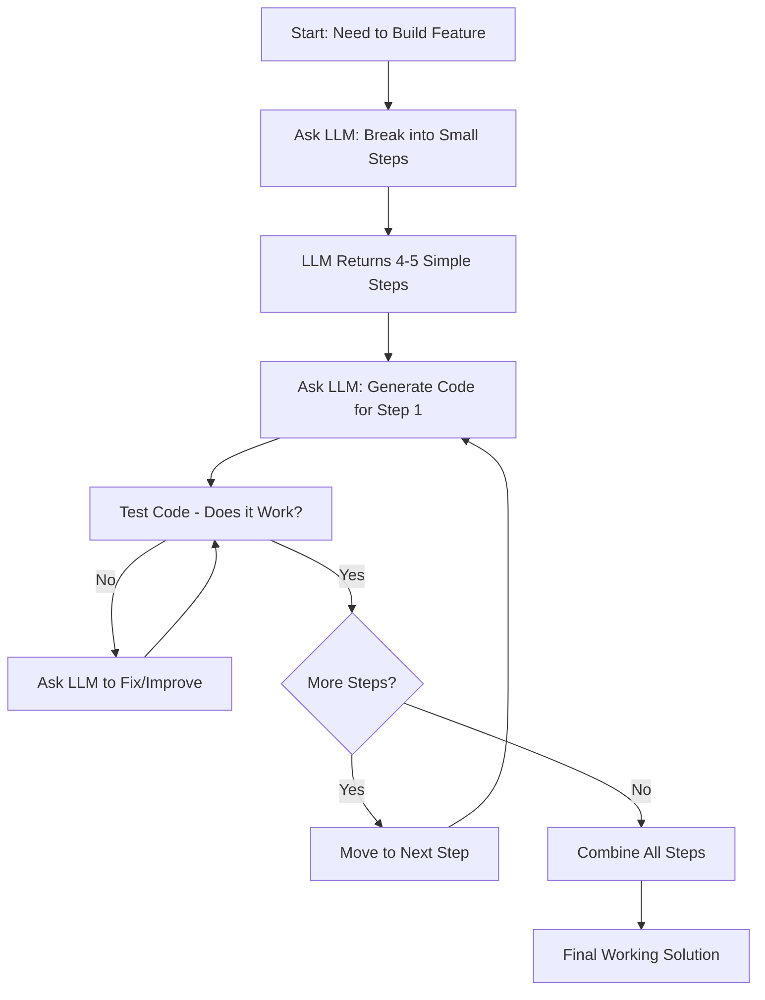
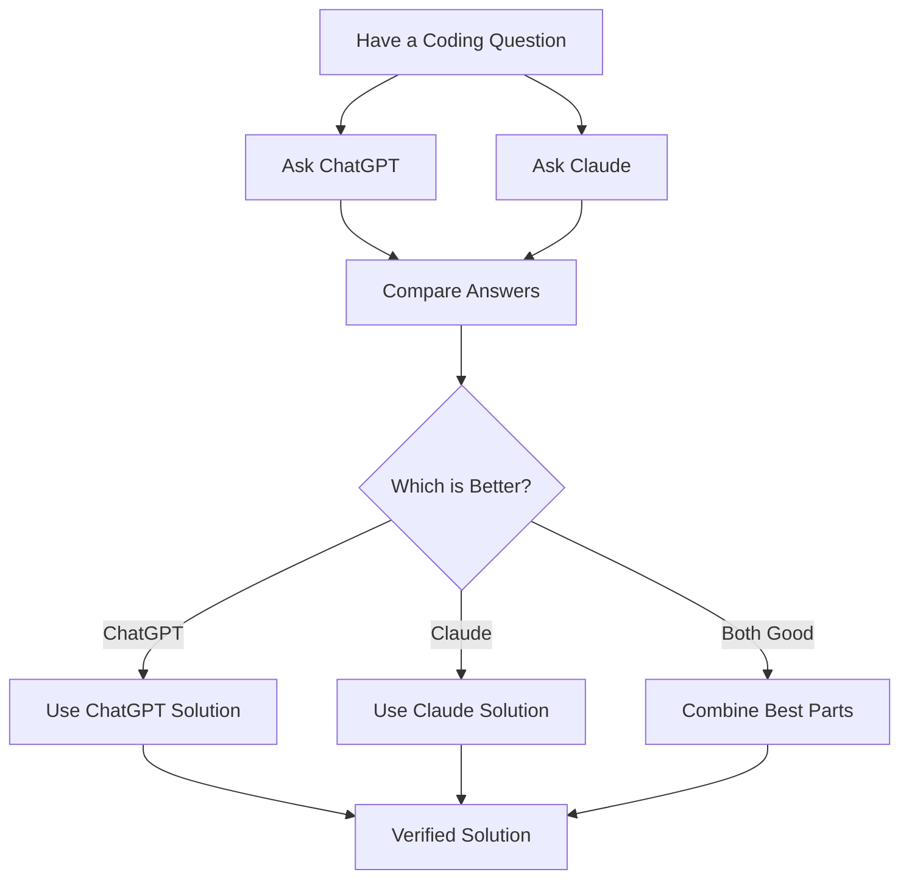
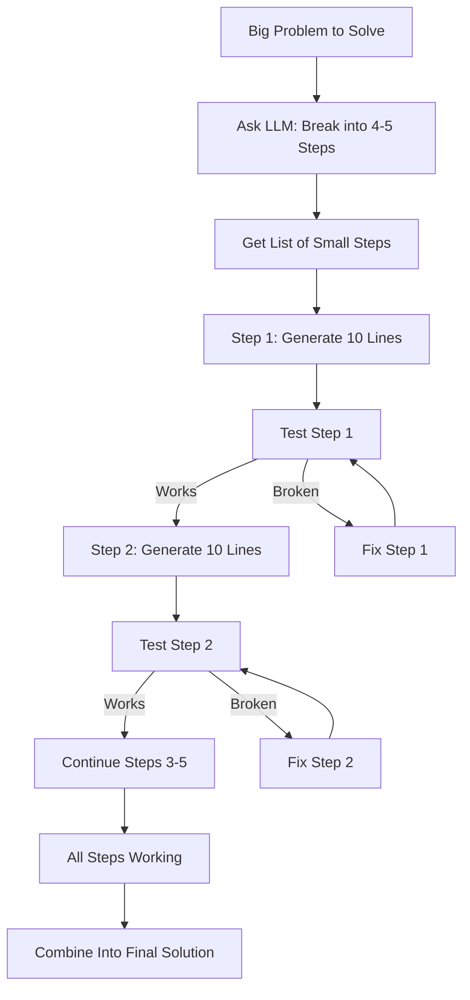
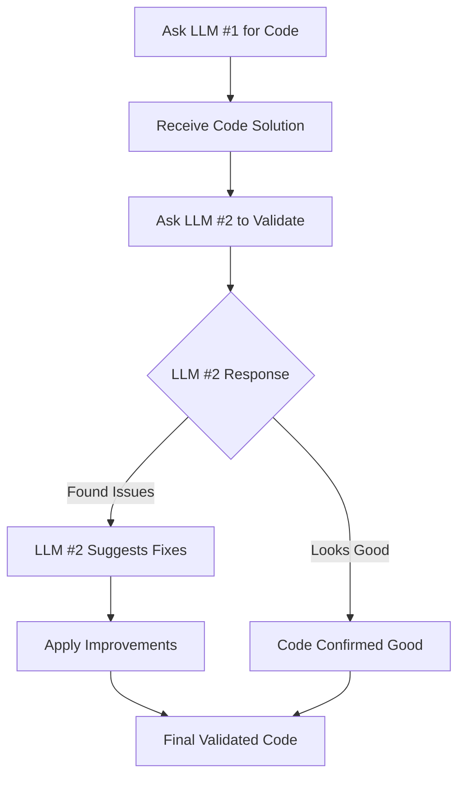
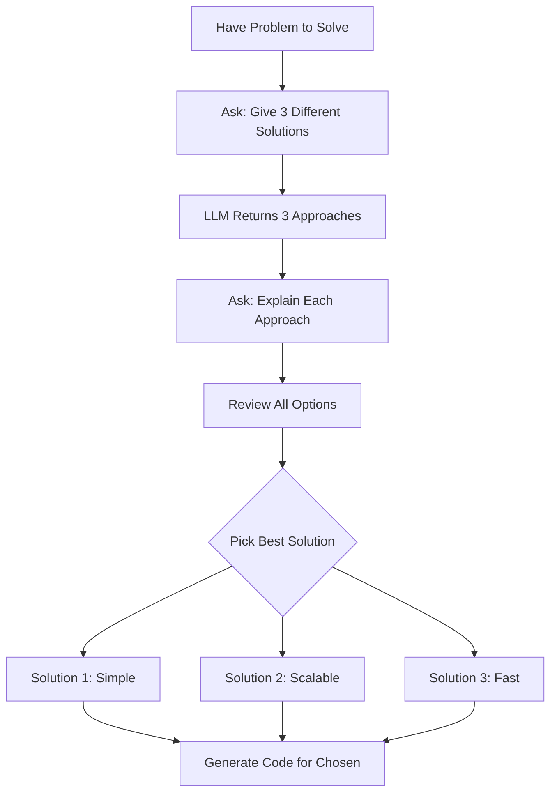
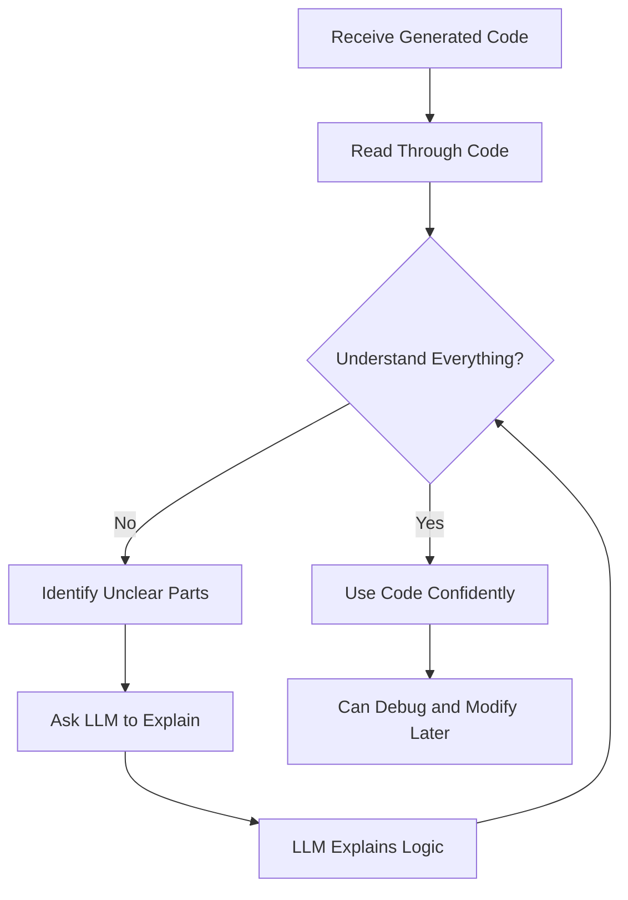
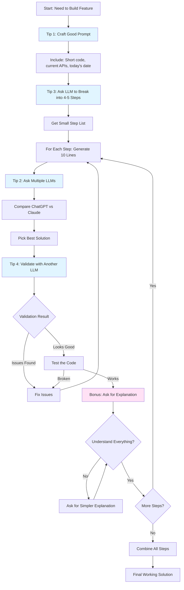

# 2.4 Vibe Coding: 5 Essential Tips for Efficient Code Generation with LLMs

## 1. Simple Explanation

Vibe coding is a way of writing code where you work together with AI (like ChatGPT or Claude) to generate code quickly. Instead of writing everything yourself, you ask the AI to create small pieces of code, check them, fix them, and keep moving forward. It's like having a coding partner that writes fast, but you need to guide it properly.

The term was coined by Andrej Karpathy to describe this fun and productive way of coding with LLMs.

## 2. Why It Matters (Interview + Real World)

- **Problem it solves**: Speeds up coding, especially when learning new frameworks or building prototypes quickly
- **Why companies use it**: Developers can build features 3-5x faster, test ideas quickly, and learn new technologies faster
- **Why interviewers ask**: Companies want developers who can use AI tools effectively without getting stuck or creating buggy code

## 3. Very Simple Healthcare Example

Doctor wants to build a patient symptom checker → Asks AI to generate code for symptom input form → AI creates the form code → Doctor tests it → Asks AI to add validation → Tests again → Repeats until complete.

## 4. Step-by-Step Workflow

### Basic Vibe Coding Flow:

1. Developer identifies what feature to build
2. Asks LLM to break problem into 4-5 small steps
3. Asks LLM to generate code for first step (10 lines max)
4. Tests the code to verify it works
5. Moves to next step and repeats
6. Combines all working pieces into final solution

## 5. Where It Fits in the System

- **Development Process**: Used across all layers (frontend, backend, AI agents, microservices)
- **AI Layer**: Especially useful for building AI features, prompt engineering, and agent workflows
- **Prototyping**: Quick testing of ideas before full implementation
- **Learning**: Understanding new frameworks or APIs faster

## 6. Common Interview Questions

**Q1: What is vibe coding and why is it useful?**
A: Vibe coding is working with AI to generate code in small pieces. It's useful because it speeds up development and helps learn new technologies quickly.

**Q2: What's the biggest mistake developers make with vibe coding?**
A: Generating too much code at once (like 200 lines) without testing. You should generate 10 lines at a time and test each piece.

**Q3: How do you ensure AI-generated code is reliable?**
A: Use multiple LLMs to verify answers, break problems into small testable chunks, and always understand the code before using it.

## 7. Quick Revision Summary

- Vibe coding = coding with AI as your partner, generating small pieces at a time
- Always break problems into 4-5 small steps before generating code
- Generate 10 lines at a time, test each piece independently
- Use 2-3 different LLMs to verify answers (ChatGPT + Claude)
- Always understand the generated code before moving forward

---

# The 5 Essential Tips for Vibe Coding

## Tip 1: Good Vibes - Craft Great Prompts

### 1. Simple Explanation

Before asking AI to generate code, spend time creating a really good prompt that you can reuse. A good prompt tells the AI exactly what you want: short code, clean structure, and current APIs (not old ones).

### 2. Why It Matters (Interview + Real World)

- **Problem it solves**: Prevents AI from generating long, messy, outdated code
- **Why companies use it**: Saves time by getting good code on the first try instead of fixing bad code
- **Why interviewers ask**: Shows you know how to communicate effectively with AI tools

### 3. Very Simple Healthcare Example

Bad prompt: "Create patient form"
Good prompt: "Create a simple patient registration form with 3 fields (name, age, symptoms). Use clean, concise code. Today is 2024. Use current HTML5 standards."

### 4. Step-by-Step Workflow

1. Write your prompt with clear requirements
2. Specify: "Keep code short and clean"
3. Add: "Use APIs current as of [today's date]"
4. Ask for specific structure or style
5. Save good prompts for reuse

### 5. Where It Fits in the System

- **Development Process**: First step before any code generation
- **All Layers**: Applies to frontend, backend, AI, database queries

### 6. Common Interview Questions

**Q1: Why mention today's date in prompts?**
A: LLMs were trained on old data and might use outdated APIs. Mentioning the date helps them use current methods.

**Q2: What makes a good vibe coding prompt?**
A: Clear requirements, request for concise code, today's date, and specific structure needs.

**Q3: Should you reuse prompts?**
A: Yes! Save prompts that work well and reuse them for similar tasks.

### 7. Quick Revision Summary

- Spend time crafting good prompts before generating code
- Always ask for "short, clean, concise code"
- Include today's date to get current APIs
- Save and reuse good prompts

---

## Tip 2: Vibe But Verify - Ask Multiple LLMs

### 1. Simple Explanation

Don't trust just one AI. Ask the same question to 2-3 different LLMs (like ChatGPT and Claude). Compare their answers. Often one will be better, clearer, or more correct than the others.

### 2. Why It Matters (Interview + Real World)

- **Problem it solves**: Catches mistakes, finds better solutions, prevents following bad advice
- **Why companies use it**: Reduces bugs, improves code quality, validates approaches
- **Why interviewers ask**: Shows critical thinking and not blindly trusting AI

### 3. Very Simple Healthcare Example

Ask ChatGPT: "How to validate patient age input?"
Ask Claude: Same question
Compare both answers → ChatGPT suggests regex, Claude suggests simple number check → Choose the simpler solution.

### 4. Step-by-Step Workflow

1. Write your question/prompt
2. Ask ChatGPT for solution
3. Ask Claude the same question
4. Compare both answers
5. Pick the best one or combine good parts from both
6. Proceed with verified solution

### 5. Where It Fits in the System

- **Development Process**: Quality assurance step during coding
- **All Layers**: Applies everywhere - frontend, backend, AI, database

### 6. Common Interview Questions

**Q1: Why use multiple LLMs instead of just one?**
A: Different LLMs have different strengths. One might give a better answer, and comparing helps catch mistakes.

**Q2: Which LLMs should you compare?**
A: Common pairs: ChatGPT + Claude, or ChatGPT + Gemini. Use at least 2 different ones.

**Q3: What if both LLMs give different answers?**
A: Analyze both, test both if possible, or ask a third LLM. Choose based on simplicity and correctness.

### 7. Quick Revision Summary

- Never trust just one LLM - always verify
- Ask same question to ChatGPT and Claude
- Compare answers and pick the best one
- Often one will be clearer or more correct

---

## Tip 3: Step Up the Vibe - Break Into Small Chunks

### 1. Simple Explanation

Never ask AI to generate 200 lines of code at once. Instead, break your problem into 4-5 small steps. Generate 10 lines of code at a time for each step. Test each small piece before moving to the next. This prevents getting stuck with broken code you can't fix.

If you don't know how to break down the problem, ask the AI to do it for you first!

### 2. Why It Matters (Interview + Real World)

- **Problem it solves**: Prevents creating large amounts of broken code that's hard to debug
- **Why companies use it**: Easier to test, easier to fix, faster to build reliable features
- **Why interviewers ask**: Shows you understand good development practices and can manage complexity

### 3. Very Simple Healthcare Example

Wrong way: "Build complete patient management system" → Gets 500 lines of broken code
Right way: Step 1: "Create patient data structure (10 lines)" → Test → Step 2: "Add save function (10 lines)" → Test → Continue...

### 4. Step-by-Step Workflow

1. Identify the big problem you want to solve
2. Ask LLM: "Break this into 4-5 simple steps"
3. LLM returns list of small steps
4. For Step 1: Ask LLM to generate code (10 lines max)
5. Test Step 1 code - make sure it works
6. Move to Step 2, repeat
7. Combine all tested steps into final solution

### 5. Where It Fits in the System

- **Development Process**: Core strategy for all coding tasks
- **All Layers**: Frontend components, backend functions, AI agents, database operations

### 6. Common Interview Questions

**Q1: What's wrong with generating 200 lines of code at once?**
A: It's hard to test, hard to debug, and usually contains multiple bugs. Small chunks (10 lines) are easier to verify.

**Q2: What if you don't know how to break down a problem?**
A: Ask the LLM! Say "Break this problem into 4-5 simple steps" and it will help you plan.

**Q3: How small should each chunk be?**
A: Aim for 10 lines of code per chunk. Each chunk should be independently testable.

### 7. Quick Revision Summary

- Never generate 200 lines at once - you'll get stuck
- Break problems into 4-5 small steps (ask LLM to help)
- Generate 10 lines at a time, test each piece
- Combine tested pieces into final working solution

---

## Tip 4: Vibe and Validate - Double-Check with Another LLM

### 1. Simple Explanation

After getting code from one AI, ask a different AI to review it. Say "I got this code for this problem. Is it correct? Can it be improved?" The second AI will often find bugs, suggest cleaner code, or confirm it's good.

This is like having a code reviewer, but automated.

### 2. Why It Matters (Interview + Real World)

- **Problem it solves**: Catches bugs before they reach production, improves code quality
- **Why companies use it**: Automated code review, quality assurance, learning better patterns
- **Why interviewers ask**: Shows you value code quality and use validation processes

### 3. Very Simple Healthcare Example

ChatGPT generates code to calculate patient BMI → Ask Claude: "Review this BMI code. Any bugs or improvements?" → Claude finds missing edge case for zero height → Fix it before using.

### 4. Step-by-Step Workflow

1. Get code solution from LLM #1 (e.g., ChatGPT)
2. Copy the code and the original question
3. Ask LLM #2 (e.g., Claude): "I asked [question], got [code]. Please validate this."
4. LLM #2 reviews and suggests improvements or confirms it's good
5. Apply improvements if needed
6. Use validated code

### 5. Where It Fits in the System

- **Development Process**: Quality assurance and code review step
- **All Layers**: Validation for any generated code

### 6. Common Interview Questions

**Q1: What is vibe and validate?**
A: Getting code from one LLM, then asking another LLM to review and validate it for bugs or improvements.

**Q2: Why not just use the same LLM to validate?**
A: A different LLM provides a fresh perspective and might catch things the first one missed.

**Q3: What should you ask the validator LLM?**
A: "I asked [question] and got [code]. Please confirm this is correct and suggest any improvements."

### 7. Quick Revision Summary

- After getting code, ask another LLM to review it
- Validator LLM catches bugs and suggests improvements
- Similar to code review but automated
- Mirrors the evaluator-optimizer pattern from AI agents

---

## Tip 5: Vibe with Variety - Ask for Multiple Solutions

### 1. Simple Explanation

Don't just ask "Give me code for this." Instead ask "Give me 3 different ways to solve this problem." This forces the AI to think about different approaches. You might discover a better, simpler solution you didn't know existed.

Even for 10 lines of code, asking for variety helps.

### 2. Why It Matters (Interview + Real World)

- **Problem it solves**: Avoids getting stuck with one approach, discovers better solutions
- **Why companies use it**: Finds optimal solutions, learns different patterns, improves code quality
- **Why interviewers ask**: Shows you explore options and don't settle for the first answer

### 3. Very Simple Healthcare Example

Ask: "Give me 3 ways to store patient appointments"
AI returns: 1) Array, 2) Dictionary by date, 3) Priority queue
You pick dictionary by date as simplest for your needs.

### 4. Step-by-Step Workflow

1. Identify the problem to solve
2. Ask LLM: "Give me 3 different solutions for [problem]"
3. Ask LLM to explain rationale for each approach
4. Review all 3 solutions
5. Pick the best one for your needs
6. Ask for code for the chosen approach

### 5. Where It Fits in the System

- **Development Process**: Design and planning phase before coding
- **All Layers**: Useful for architecture decisions, algorithm choices, data structure selection

### 6. Common Interview Questions

**Q1: Why ask for multiple solutions instead of just one?**
A: Forces the AI to think deeper, you might discover simpler or better approaches you didn't know about.

**Q2: What if the AI says there's only one way?**
A: That's fine - it means the solution is straightforward. But often you'll get useful alternatives.

**Q3: Should you always implement all 3 solutions?**
A: No, just pick the best one for your needs. The others help you understand trade-offs.

### 7. Quick Revision Summary

- Ask for 3 different solutions, not just one
- Forces AI to think about different approaches
- Request explanations for each approach
- Pick the best solution for your specific needs

---

# Bonus Tip: Always Understand the Code

## 1. Simple Explanation

After AI generates code, always ask it to explain what the code does line by line. Never use code you don't understand. If something is unclear, ask the AI to explain it in simpler terms. Understanding prevents problems later.

## 2. Why It Matters (Interview + Real World)

- **Problem it solves**: Prevents using code you can't maintain or debug
- **Why companies use it**: Developers must understand their codebase to fix bugs and add features
- **Why interviewers ask**: Tests if you actually understand what you're building

## 3. Very Simple Healthcare Example

AI generates patient data validation code → You don't understand the regex pattern → Ask: "Explain this regex in simple terms" → AI explains it checks email format → Now you understand and can modify it later.

## 4. Step-by-Step Workflow

1. Receive generated code from LLM
2. Read through the code
3. Identify parts you don't understand
4. Ask LLM: "Explain [specific part] in simple terms"
5. LLM explains the logic
6. Repeat until you understand everything
7. Use the code confidently

## 5. Where It Fits in the System

- **Development Process**: Final step before using any generated code
- **All Layers**: Critical for all code you'll maintain

## 6. Common Interview Questions

**Q1: Should you use AI-generated code you don't understand?**
A: No, never. Always ask the AI to explain until you fully understand it.

**Q2: What if the explanation is too technical?**
A: Ask the AI to "explain it in simpler terms" or "explain like I'm a beginner."

**Q3: Why is understanding important for vibe coding?**
A: When bugs happen or you need to modify code, you must understand it. Otherwise you'll get stuck and frustrated.

## 7. Quick Revision Summary

- Never use code you don't understand
- Ask AI to explain unclear parts
- Request simpler explanations if needed
- Understanding prevents future problems

---

# Complete Vibe Coding Workflow

---

# Summary: The 5 Essential Tips

1. **Good Vibes**: Craft great prompts (short code, current APIs, today's date)
2. **Vibe But Verify**: Ask multiple LLMs (ChatGPT + Claude)
3. **Step Up the Vibe**: Break into small chunks (10 lines at a time)
4. **Vibe and Validate**: Have another LLM review the code
5. **Vibe with Variety**: Ask for 3 different solutions

**Bonus**: Always understand the code before using it

---

# Key Takeaways for Interviews

- Vibe coding is fast and productive when done right
- The biggest mistake: generating too much code at once
- Always break problems into 4-5 small testable steps
- Use multiple LLMs to verify and validate
- Never use code you don't understand
- Ask for explanations until everything is clear
- This approach prevents getting stuck with broken code

---

# When Vibe Coding Goes Wrong

**Warning Signs:**
- You have 200+ lines of code that don't work
- You can't explain what the code does
- You're stuck debugging for hours
- The code uses old/deprecated APIs

**How to Fix:**
- Go back to basics: break into small steps
- Delete the broken code and start over with 10-line chunks
- Ask for explanations of what you don't understand
- Validate with multiple LLMs before proceeding

---

# Vibe Coding Best Practices

✅ **DO:**
- Break problems into 4-5 small steps
- Generate 10 lines at a time
- Test each piece before moving forward
- Use 2-3 LLMs to verify answers
- Ask for explanations
- Request multiple solution approaches

❌ **DON'T:**
- Generate 200 lines at once
- Use code you don't understand
- Trust only one LLM
- Skip testing small pieces
- Use old APIs (mention today's date)
- Accept verbose, messy code

---

*End of Document*
