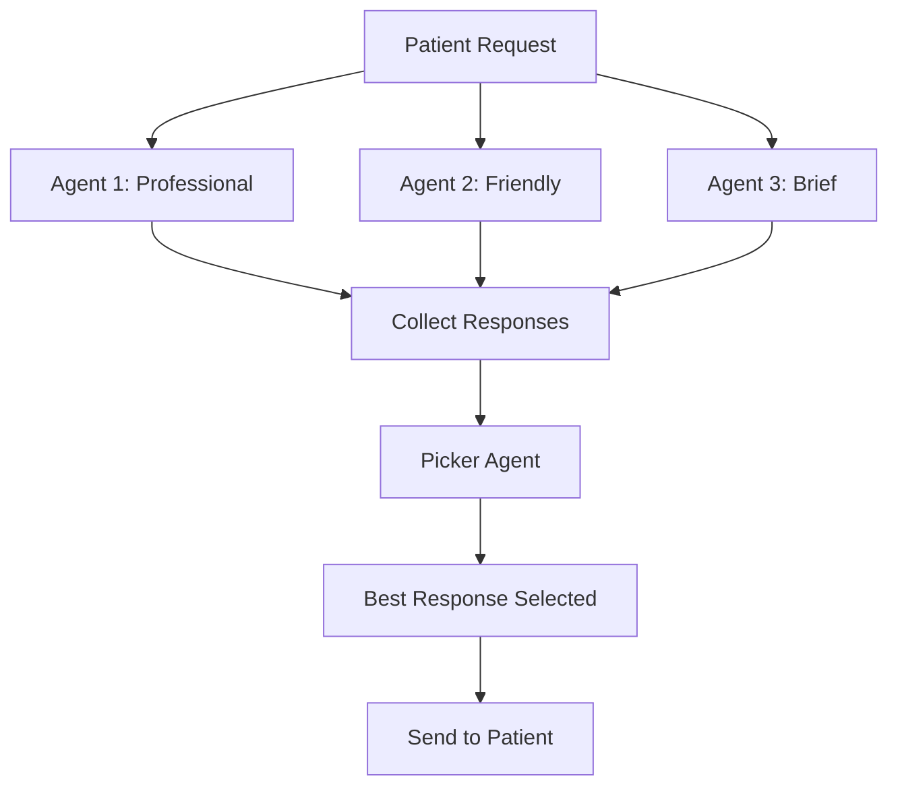
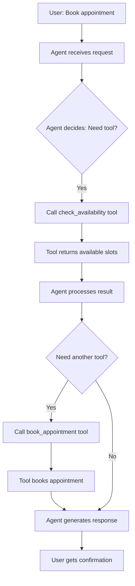
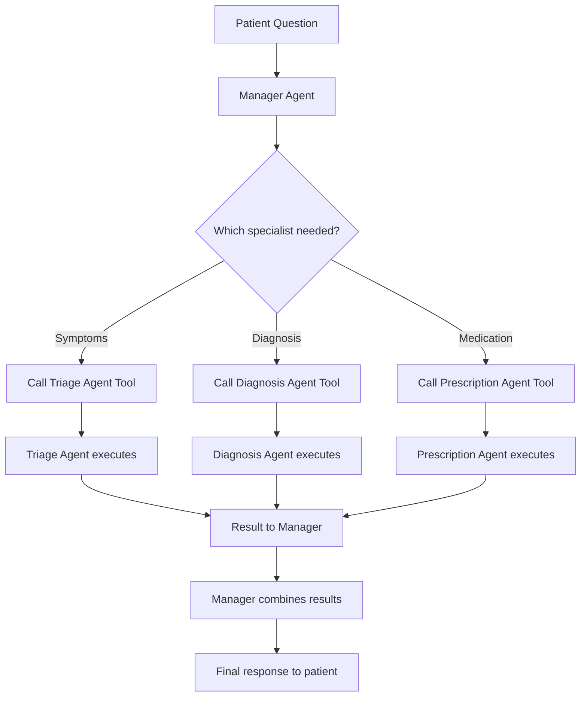
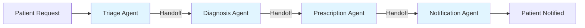
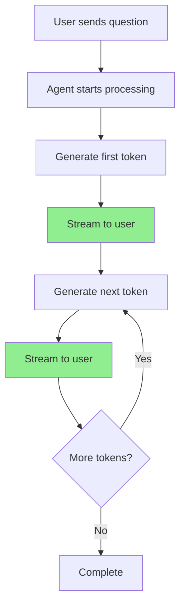
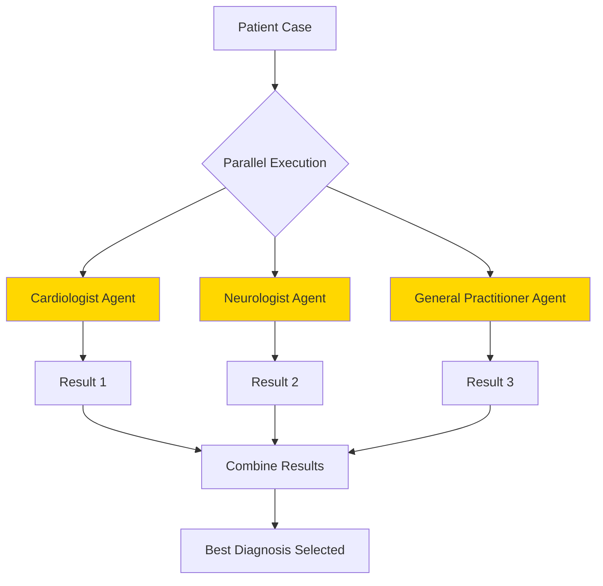
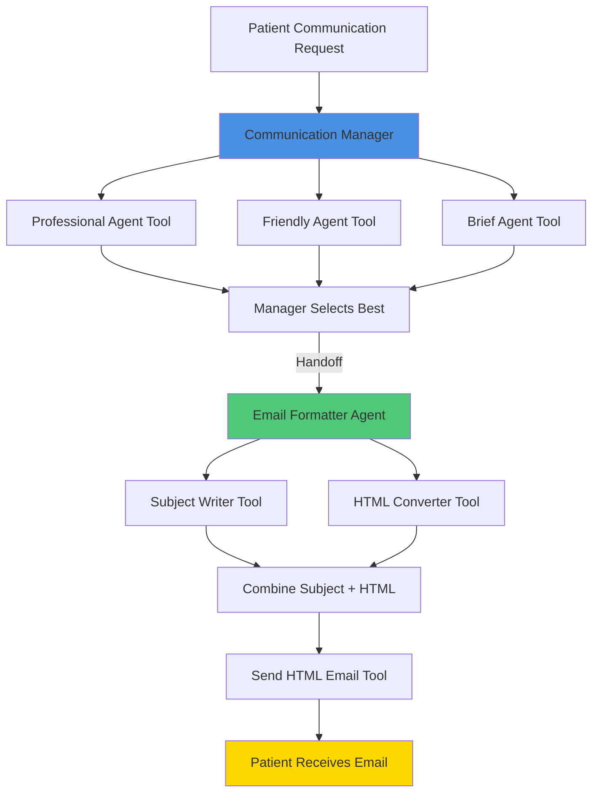

# 2.5 Build AI Sales Agents with SendGrid: Tools & Collaboration in Agent SDK

**Version:** 1.0  
**Date:** February 2026  
**Target:** Beginner to Intermediate Developers  
**Domain:** Smart Healthcare AI Platform

---

## Overview

This document explains how to build AI agents that work together using tools and collaboration patterns. You'll learn how to create multiple agents, give them tools to use, and make them collaborate to complete complex tasks.

---

## Table of Contents

1. [Agent Workflow](#1-agent-workflow)
2. [Function Tools](#2-function-tools)
3. [Agents as Tools](#3-agents-as-tools)
4. [Agent Handoffs](#4-agent-handoffs)
5. [Streaming Responses](#5-streaming-responses)
6. [Parallel Agent Execution](#6-parallel-agent-execution)
7. [Lab Exercise](#7-lab-exercise)
8. [Common Interview Questions](#8-common-interview-questions)
9. [Quick Revision Summary](#9-quick-revision-summary)

---

# 1. Agent Workflow

## 1. Simple Explanation

An agent workflow is when you create multiple AI agents with different personalities or skills, and you control how they work together using Python code.

Think of it like having 3 doctors with different communication styles:
- Doctor A: Very professional and formal
- Doctor B: Friendly and engaging
- Doctor C: Quick and to-the-point

You manually decide which doctor to use for which patient.


## 2. Why It Matters (Interview + Real World)

- **Problem it solves**: Different tasks need different approaches. One agent can't be perfect at everything.
- **Why companies use it**: Healthcare needs formal communication for doctors, friendly tone for patients, and quick responses for emergencies.
- **Why interviewers ask**: Shows you understand multi-agent systems and orchestration patterns.

## 3. Very Simple Healthcare Example

Patient needs appointment → System runs 3 agents (formal, friendly, brief) → Each creates a message → System picks the best one → Sends to patient.

## 4. Step-by-Step Workflow

1. Create multiple agents with different instructions (system prompts)
2. Send same task to all agents
3. Each agent generates a response independently
4. Python code collects all responses
5. Another agent or logic picks the best response
6. Final response is used



## 5. Where It Fits in the System

- **Component**: AI Agent Layer
- **Pattern**: Multi-Agent Orchestration
- **Used in**: Medical Assistant Agent, Patient Communication Service

---

# 2. Function Tools

## 1. Simple Explanation

Function tools let AI agents call Python functions to perform actions like sending emails, checking databases, or making API calls.

Instead of just generating text, agents can now DO things.


## 2. Why It Matters (Interview + Real World)

- **Problem it solves**: AI can't interact with real systems without tools. Tools bridge AI and real-world actions.
- **Why companies use it**: Healthcare agents need to book appointments, send prescriptions, update records - not just chat.
- **Why interviewers ask**: Tool calling is fundamental to building useful AI agents in production.

## 3. Very Simple Healthcare Example

Patient asks for appointment → Agent uses "check_availability" tool → Agent uses "book_appointment" tool → Agent uses "send_confirmation_email" tool → Patient gets confirmation.

## 4. Step-by-Step Workflow

1. Define Python function (e.g., send_email)
2. Add @function_tool decorator
3. SDK automatically converts function to tool format
4. Give tool to agent when creating it
5. Agent decides when to call the tool
6. SDK executes the function
7. Result goes back to agent
8. Agent continues with the result



## 5. Where It Fits in the System

- **Component**: AI Agent Layer + Tool Registry
- **Pattern**: Tool Calling Pattern
- **Used in**: All AI agents (Medical Assistant, Scheduling, Billing)

---

# 3. Agents as Tools

## 1. Simple Explanation

You can convert an AI agent into a tool that another agent can use. This means one agent can call another agent as if it's calling a function.

Think of it like a hospital receptionist (main agent) calling a specialist doctor (another agent) for expert advice.


## 2. Why It Matters (Interview + Real World)

- **Problem it solves**: Complex tasks need specialized agents. One manager agent can coordinate multiple specialist agents.
- **Why companies use it**: Healthcare has many specialties - triage, diagnosis, prescription, billing. Each needs its own agent.
- **Why interviewers ask**: Shows understanding of hierarchical agent architectures and delegation patterns.

## 3. Very Simple Healthcare Example

Patient asks complex question → Manager agent calls Triage agent (as tool) → Calls Diagnosis agent (as tool) → Calls Prescription agent (as tool) → Returns complete answer.

## 4. Step-by-Step Workflow

1. Create specialist agents (e.g., triage_agent, diagnosis_agent)
2. Convert each agent to a tool using .as_tool() method
3. Create a manager agent
4. Give manager agent the specialist agent tools
5. Manager agent decides which specialist to call
6. Specialist agent executes and returns result
7. Manager agent uses result to continue
8. Final response goes to user



## 5. Where It Fits in the System

- **Component**: AI Agent Orchestrator
- **Pattern**: Hierarchical Multi-Agent Pattern
- **Used in**: Medical Assistant Agent (coordinates specialist agents)

---

# 4. Agent Handoffs

## 1. Simple Explanation

Handoffs let one agent pass control completely to another agent. Unlike tools (where control returns), handoffs transfer responsibility.

Think of it like a nurse (Agent A) handing over a patient to a doctor (Agent B). The nurse doesn't get the patient back.


## 2. Why It Matters (Interview + Real World)

- **Problem it solves**: Some workflows need sequential handoffs, not back-and-forth. Handoffs make workflows clearer.
- **Why companies use it**: Healthcare workflows often have clear handoff points (triage → diagnosis → treatment → billing).
- **Why interviewers ask**: Tests understanding of agent collaboration patterns and when to use tools vs handoffs.

## 3. Very Simple Healthcare Example

Patient enters symptoms → Triage agent assesses urgency → Hands off to Scheduling agent → Scheduling agent books appointment → Hands off to Notification agent → Patient gets SMS.

## 4. Step-by-Step Workflow

1. Create multiple agents for different workflow stages
2. Define handoff_description for each agent
3. First agent processes request
4. First agent decides to hand off to next agent
5. Control transfers completely to second agent
6. Second agent continues the workflow
7. Can hand off again to third agent if needed
8. Final agent completes the task



## 5. Where It Fits in the System

- **Component**: AI Agent Orchestrator
- **Pattern**: Sequential Workflow Pattern
- **Used in**: Patient Care Workflow, Appointment Booking Flow

---

# 5. Streaming Responses

## 1. Simple Explanation

Streaming means the AI response comes back piece by piece (word by word) instead of waiting for the complete answer.

Like watching a doctor type notes in real-time instead of waiting for the full report.


## 2. Why It Matters (Interview + Real World)

- **Problem it solves**: Users don't want to wait 10-20 seconds for a response. Streaming makes it feel instant.
- **Why companies use it**: Better user experience. Patients see the AI "thinking" and responding in real-time.
- **Why interviewers ask**: Streaming is important for production AI apps. Shows you understand async programming.

## 3. Very Simple Healthcare Example

Patient asks: "What are symptoms of diabetes?" → AI starts responding immediately → Words appear one by one → Patient reads while AI is still generating → Better experience.

## 4. Step-by-Step Workflow

1. Use Runner.run_streamed() instead of Runner.run()
2. Returns a coroutine (async object)
3. Use "async for" to iterate through events
4. Check if event contains text data
5. Print each piece as it arrives
6. Continue until complete response received



## 5. Where It Fits in the System

- **Component**: AI Agent Layer + API Gateway
- **Pattern**: Streaming Response Pattern
- **Used in**: Medical Assistant Chat, Patient Portal

---

# 6. Parallel Agent Execution

## 1. Simple Explanation

Parallel execution means running multiple agents at the same time instead of one after another. This makes things faster.

Like having 3 doctors review a case simultaneously instead of one by one.


## 2. Why It Matters (Interview + Real World)

- **Problem it solves**: Sequential execution is slow. Parallel execution saves time when agents don't depend on each other.
- **Why companies use it**: Healthcare needs fast responses. Running agents in parallel reduces wait time from 30s to 10s.
- **Why interviewers ask**: Tests understanding of async programming and performance optimization.

## 3. Very Simple Healthcare Example

Patient needs second opinion → System asks 3 specialist agents simultaneously → All 3 analyze at same time → Results come back together → System picks best diagnosis.

## 4. Step-by-Step Workflow

1. Create multiple agents
2. Use asyncio.gather() to run them in parallel
3. Pass same or different inputs to each agent
4. All agents execute simultaneously
5. Wait for all to complete
6. Collect all results together
7. Process or combine results
8. Return final answer



## 5. Where It Fits in the System

- **Component**: AI Agent Orchestrator
- **Pattern**: Parallel Multi-Agent Pattern
- **Used in**: Second Opinion System, Risk Assessment

---

# 7. Lab Exercise (Hands-On)

## 📁 Folder Name
`HC_2_openai`

## 📄 File Name
`HC_2_lab2.ipynb`

---

## Lab Title
**Building Healthcare Communication Agents with Email Notifications**

## Objective
Learn to build a multi-agent system for healthcare patient communication using:
1. Agent workflows with different communication styles
2. Function tools for sending emails
3. Agents as tools for collaboration
4. Handoffs for sequential workflows


## Scenario

You are building the **Patient Communication System** for the Smart Healthcare AI Platform. The system needs to send appointment reminders, health tips, and follow-up messages to patients.

Different patients prefer different communication styles:
- **Elderly patients**: Prefer formal, clear, professional messages
- **Young patients**: Prefer friendly, engaging, casual messages
- **Busy professionals**: Prefer brief, to-the-point messages

Your task is to build an AI agent system that:
1. Generates messages in 3 different styles
2. Selects the best message based on patient profile
3. Sends the message via email
4. Formats messages professionally with HTML

---

## Setup Instructions

### Step 1: Install SendGrid (Email Service)

SendGrid is a free email service (owned by Twilio) that lets you send emails programmatically.

**Alternative**: If SendGrid doesn't work, you can use:
- Resend Email (see community_contributions/2_lab2_with_resend_email)
- Just print to console instead of sending real emails
- Use Pushover for notifications

**Setup Steps:**

1. Visit: https://sendgrid.com/
2. Create a free account
3. Go to: Settings → API Keys → Create API Key
4. Copy the API key
5. Add to your `.env` file:
   ```
   SENDGRID_API_KEY=your_key_here
   ```
6. Go to: Settings → Sender Authentication → Verify a Single Sender
7. Verify your email address (so SendGrid can send emails from it)

---

## Tasks / Steps

### Task 1: Import Libraries and Setup

```python
from dotenv import load_dotenv
from agents import Agent, Runner, trace, function_tool
from openai.types.responses import ResponseTextDeltaEvent
from typing import Dict
import sendgrid
import os
from sendgrid.helpers.mail import Mail, Email, To, Content
import asyncio

load_dotenv(override=True)
```

**Healthcare Context**: These imports give us tools to build AI agents that can send patient communications.

---

### Task 2: Test Email Sending

```python
def send_test_email():
    sg = sendgrid.SendGridAPIClient(api_key=os.environ.get('SENDGRID_API_KEY'))
    from_email = Email("your-email@example.com")  # Your verified sender
    to_email = To("your-email@example.com")  # Your recipient
    content = Content("text/plain", "Test email from Healthcare AI Platform")
    mail = Mail(from_email, to_email, "Test Email", content).get()
    response = sg.client.mail.send.post(request_body=mail)
    print(response.status_code)  # 202 means success

send_test_email()
```

**Expected Output**: Status code 202 (success)

**Healthcare Context**: Testing email delivery before building the full system.

---

### Task 3: Create Three Communication Agents

```python
instructions1 = "You are a healthcare communication specialist at Smart Healthcare AI Platform. \
You write professional, clear, formal messages for elderly patients. \
Use respectful language and explain medical terms clearly."

instructions2 = "You are a friendly healthcare communication specialist at Smart Healthcare AI Platform. \
You write warm, engaging, conversational messages for young patients. \
Use simple language and a caring tone."

instructions3 = "You are an efficient healthcare communication specialist at Smart Healthcare AI Platform. \
You write brief, to-the-point messages for busy professionals. \
Get straight to the key information."
```


```python
# Create the three agents
communication_agent1 = Agent(
    name="Professional Healthcare Communicator",
    instructions=instructions1,
    model="gpt-4o-mini"
)

communication_agent2 = Agent(
    name="Friendly Healthcare Communicator",
    instructions=instructions2,
    model="gpt-4o-mini"
)

communication_agent3 = Agent(
    name="Brief Healthcare Communicator",
    instructions=instructions3,
    model="gpt-4o-mini"
)
```

**Healthcare Context**: Three agents with different communication styles for different patient demographics.

---

### Task 4: Test Streaming Response

```python
result = Runner.run_streamed(
    communication_agent1, 
    input="Write an appointment reminder message for tomorrow at 2 PM with Dr. Smith"
)

async for event in result.stream_events():
    if event.type == "raw_response_event" and isinstance(event.data, ResponseTextDeltaEvent):
        print(event.data.delta, end="", flush=True)
```

**Expected Output**: Message streams word-by-word in real-time

**Healthcare Context**: Streaming makes the patient portal feel responsive and interactive.

---

### Task 5: Run Agents in Parallel

```python
message = "Write an appointment reminder message for tomorrow at 2 PM with Dr. Smith for a diabetes checkup"

with trace("Parallel patient communications"):
    results = await asyncio.gather(
        Runner.run(communication_agent1, message),
        Runner.run(communication_agent2, message),
        Runner.run(communication_agent3, message),
    )

outputs = [result.final_output for result in results]

for i, output in enumerate(outputs, 1):
    print(f"\n--- Agent {i} Output ---")
    print(output)
```

**Expected Output**: Three different message styles generated simultaneously

**Healthcare Context**: System generates multiple options quickly, then picks the best one for the patient.

---

### Task 6: Create Message Picker Agent

```python
message_picker = Agent(
    name="message_picker",
    instructions="You are a healthcare communication expert. \
    You select the most appropriate patient message from the given options. \
    Consider clarity, empathy, and effectiveness. \
    Reply with the selected message only, no explanation.",
    model="gpt-4o-mini"
)
```

**Healthcare Context**: This agent acts as a quality control layer, selecting the best message.

---

### Task 7: Complete Workflow with Selection

```python
message = "Write an appointment reminder message for tomorrow at 2 PM with Dr. Smith for a diabetes checkup"

with trace("Patient message selection workflow"):
    # Generate 3 options in parallel
    results = await asyncio.gather(
        Runner.run(communication_agent1, message),
        Runner.run(communication_agent2, message),
        Runner.run(communication_agent3, message),
    )
    outputs = [result.final_output for result in results]
    
    # Combine for picker
    all_messages = "Patient message options:\n\n" + "\n\nOption:\n\n".join(outputs)
    
    # Pick best one
    best = await Runner.run(message_picker, all_messages)
    
    print(f"Best patient message:\n{best.final_output}")
```

**Expected Output**: The best message selected from the three options

**Healthcare Context**: Automated quality control ensures patients get the most appropriate communication.

**Check the trace**: Visit https://platform.openai.com/traces to see the workflow visualization

---

### Task 8: Create Email Sending Tool

```python
@function_tool
def send_patient_email(body: str):
    """ Send a patient communication email with the given message body """
    sg = sendgrid.SendGridAPIClient(api_key=os.environ.get('SENDGRID_API_KEY'))
    from_email = Email("your-email@example.com")  # Your verified sender
    to_email = To("your-email@example.com")  # Your recipient (patient)
    content = Content("text/plain", body)
    mail = Mail(from_email, to_email, "Healthcare Appointment Reminder", content).get()
    sg.client.mail.send.post(request_body=mail)
    return {"status": "success", "message": "Email sent to patient"}
```

**Healthcare Context**: This tool allows agents to actually send emails to patients.

**Understanding the @function_tool Decorator:**

When you add `@function_tool` above a function, the SDK automatically:
- Reads the function signature (parameters and types)
- Extracts the docstring as the tool description
- Creates JSON schema for all parameters
- Wraps the function so agents can call it

You can inspect the tool by printing it:
```python
print(send_patient_email)
# Shows: FunctionTool with name, description, and params JSON schema
```

This eliminates all the boilerplate JSON you had to write manually in Week 1!

---

### Task 9: Convert Agents to Tools

```python
description = "Generate a patient communication message"

tool1 = communication_agent1.as_tool(
    tool_name="professional_communicator", 
    tool_description=description
)
tool2 = communication_agent2.as_tool(
    tool_name="friendly_communicator", 
    tool_description=description
)
tool3 = communication_agent3.as_tool(
    tool_name="brief_communicator", 
    tool_description=description
)

tools = [tool1, tool2, tool3, send_patient_email]
```

**Healthcare Context**: Now other agents can use these communication agents as tools.

**Understanding .as_tool():**

When you call `.as_tool()` on an agent, it:
- Wraps the entire agent (with its LLM call) as a tool
- Creates a tool description from the provided parameters
- Returns a FunctionTool object
- When called, it executes the agent and returns the result

You can inspect it:
```python
print(tool1)
# Shows: FunctionTool wrapping the Professional Healthcare Communicator agent
```

This is powerful because one agent can now use another agent as if it's just a function!

---

### Task 10: Create Communication Manager Agent

```python
manager_instructions = """
You are a Patient Communication Manager at Smart Healthcare AI Platform.

Your goal is to send the best patient communication message.

Follow these steps:
1. Use all three communicator tools to generate message options
2. Review all options and select the single best message
3. Use the send_patient_email tool to send ONLY the best message

Rules:
- You must use the communicator tools - do not write messages yourself
- Send exactly ONE email - never more than one
"""

communication_manager = Agent(
    name="Communication Manager",
    instructions=manager_instructions,
    tools=tools,
    model="gpt-4o-mini"
)
```

**Healthcare Context**: Manager agent coordinates the specialist agents and handles email sending.

**Important Note on Agent Behavior:**

The manager agent can:
- Call tools multiple times if not satisfied with results
- Try different combinations
- Make decisions about which tool to use when
- This is TRUE agent behavior - it has autonomy to decide its workflow

---

### Task 11: Run Complete Automated System

```python
message = "Send an appointment reminder for tomorrow at 2 PM with Dr. Smith for diabetes checkup. Patient name is John."

with trace("Automated patient communication"):
    result = await Runner.run(communication_manager, message)

print(result.final_output)
```

**Expected Output**: 
- Three messages generated
- Best one selected
- Email sent
- You receive the email

**Check your email!** You should receive the appointment reminder.

**Check the trace**: https://platform.openai.com/traces

**What to Look for in the Trace:**
- You'll see the manager agent calling all 3 communicator tools
- Each tool call shows the agent execution underneath
- The send_patient_email tool call at the end
- Total execution time and number of tools used
- This helps you debug and understand agent decision-making

**Key Insight:** This is where we moved from "workflow" to "agent" - the manager has autonomy to decide which tools to call and when!

---

### Task 12: Create HTML Formatting Agents

```python
subject_instructions = "You write clear, professional email subject lines for healthcare communications. \
Keep them concise and informative."

html_instructions = "You convert plain text healthcare messages to clean, professional HTML email format. \
Use simple, accessible design with clear headings and good spacing."

subject_writer = Agent(
    name="Email Subject Writer",
    instructions=subject_instructions,
    model="gpt-4o-mini"
)

html_converter = Agent(
    name="HTML Email Converter",
    instructions=html_instructions,
    model="gpt-4o-mini"
)
```

**Healthcare Context**: Professional email formatting improves patient experience and trust.

---

### Task 13: Create HTML Email Sending Tool

```python
@function_tool
def send_html_patient_email(subject: str, html_body: str) -> Dict[str, str]:
    """ Send a formatted HTML patient communication email """
    sg = sendgrid.SendGridAPIClient(api_key=os.environ.get('SENDGRID_API_KEY'))
    from_email = Email("your-email@example.com")  # Your verified sender
    to_email = To("your-email@example.com")  # Your recipient
    content = Content("text/html", html_body)
    mail = Mail(from_email, to_email, subject, content).get()
    sg.client.mail.send.post(request_body=mail)
    return {"status": "success", "message": "HTML email sent to patient"}
```

---

### Task 14: Create Email Formatter Agent with Handoffs

```python
subject_tool = subject_writer.as_tool(
    tool_name="subject_writer",
    tool_description="Write an email subject line"
)

html_tool = html_converter.as_tool(
    tool_name="html_converter",
    tool_description="Convert text to HTML email format"
)

formatter_instructions = "You are an Email Formatter for healthcare communications. \
You receive a message body and: \
1. Use subject_writer tool to create a subject line \
2. Use html_converter tool to format the body as HTML \
3. Use send_html_patient_email tool to send the formatted email"

email_formatter = Agent(
    name="Email Formatter",
    instructions=formatter_instructions,
    tools=[subject_tool, html_tool, send_html_patient_email],
    model="gpt-4o-mini",
    handoff_description="Format message as HTML and send email"
)
```

**Healthcare Context**: This agent handles the final formatting and delivery stage.

**Understanding handoff_description:**

The `handoff_description` parameter tells other agents what this agent does. It's like advertising the agent's capabilities. When a manager agent has handoffs available, it can read these descriptions to decide which agent to hand off to.

---

### Task 15: Complete System with Handoffs

```python
# Update manager to use handoffs
tools = [tool1, tool2, tool3]  # Communication agents only
handoffs = [email_formatter]  # Handoff to formatter

manager_instructions_v2 = """
You are a Patient Communication Manager at Smart Healthcare AI Platform.

Steps:
1. Use all three communicator tools to generate message options
2. Select the single best message
3. Hand off the winning message to the Email Formatter agent

Rules:
- Use communicator tools to generate messages
- Hand off exactly ONE message to Email Formatter
"""

communication_manager_v2 = Agent(
    name="Communication Manager",
    instructions=manager_instructions_v2,
    tools=tools,
    handoffs=handoffs,
    model="gpt-4o-mini"
)
```

**Key Difference: Tools vs Handoffs**

**Tools (Request-Response):**
- Agent calls tool
- Tool executes
- Control returns to calling agent
- Agent continues with result
- Like calling a function

**Handoffs (Delegation):**
- Agent hands off to another agent
- Control transfers completely
- Original agent does NOT get control back
- Like passing a baton in a relay race

**When to Use Each:**
- Use **tools** when you need the result back to continue processing
- Use **handoffs** for sequential workflows where each stage is independent

---

### Task 16: Run Final System

```python
message = "Send appointment reminder for tomorrow at 2 PM with Dr. Smith for diabetes checkup. Patient: John"

with trace("Complete automated patient communication system"):
    result = await Runner.run(communication_manager_v2, message)

print("System completed!")
```

**Expected Output**:
- Three message options generated
- Best one selected
- Subject line created
- HTML formatting applied
- Professional email sent
- You receive a beautifully formatted email

**Check your email and the trace!**

**Analyzing the Trace:**

Visit https://platform.openai.com/traces and look for "Complete automated patient communication system"

You should see:
1. **Manager calls 3 communicator tools** (Professional, Friendly, Brief)
2. **Each tool shows agent execution underneath** (green icons with agent details)
3. **Manager might call tools again** if not satisfied (shows agent autonomy!)
4. **Handoff point** where control transfers to Email Formatter
5. **Email Formatter calls its tools** (Subject Writer, HTML Converter, Send Email)
6. **Control does NOT return** to manager after handoff
7. **Timeline shows** which agent had control at each point

**Important Observations:**
- The manager agent may call tools multiple times (2-3 rounds) before deciding
- This demonstrates true agent behavior with decision-making autonomy
- The handoff is clearly visible as a transfer of control
- Total execution time is typically 30-60 seconds

---

## Understanding the Complete Flow

Let's break down what just happened:

**Phase 1: Message Generation (Manager Agent with Tools)**
- Manager agent receives request
- Calls Professional Communicator tool → Agent 1 generates message
- Calls Friendly Communicator tool → Agent 2 generates message  
- Calls Brief Communicator tool → Agent 3 generates message
- Manager evaluates all 3 messages
- Manager selects the best one

**Phase 2: Formatting & Sending (Handoff to Email Formatter)**
- Manager hands off the winning message to Email Formatter
- **Control transfers** - Manager is done
- Email Formatter receives the message
- Calls Subject Writer tool → Agent generates subject line
- Calls HTML Converter tool → Agent converts to HTML
- Calls send_html_patient_email tool → Function sends email
- Email Formatter completes the task

**Key Insight:** The manager never gets control back after the handoff. This is different from tools where control always returns.

---

## Workflow Diagram



---

## Expected Outcome

You will have built a complete multi-agent healthcare communication system that:

1. ✅ Generates messages in 3 different styles
2. ✅ Selects the best message automatically
3. ✅ Formats messages professionally with HTML
4. ✅ Sends emails to patients
5. ✅ Uses tools for actions
6. ✅ Uses agents as tools for collaboration
7. ✅ Uses handoffs for workflow stages
8. ✅ Traces execution for debugging

---

## Key Learning Points

1. **Agent Workflows**: Orchestrating multiple agents with Python code
2. **Function Tools**: Converting Python functions to agent tools with @function_tool
3. **Agents as Tools**: Using .as_tool() to let agents call other agents
4. **Handoffs**: Transferring control between agents for sequential workflows
5. **Streaming**: Using run_streamed() for real-time responses
6. **Parallel Execution**: Using asyncio.gather() to run agents simultaneously
7. **Tracing**: Using trace() context manager for debugging and monitoring

---

## Notes

**Troubleshooting SendGrid:**

- **Status 202**: Success! Check your email (including spam folder)
- **SSL Certificate Error**: Run `uv pip install --upgrade certifi` then:
  ```python
  import certifi
  import os
  os.environ['SSL_CERT_FILE'] = certifi.where()
  ```
- **No email received**: Check SendGrid dashboard for delivery logs
- **Alternative**: Use Resend Email or just print to console

**Design Patterns Used:**
- **Multi-Agent Orchestration**: Manager coordinates specialist agents
- **Tool Calling Pattern**: Agents use tools to perform actions
- **Hierarchical Agent Pattern**: Manager → Workers
- **Sequential Workflow Pattern**: Handoffs for stage-by-stage processing

**Production Considerations:**
- Add patient preference tracking (formal vs friendly)
- Implement retry logic for email failures
- Add email delivery tracking
- Store sent messages in database
- Add unsubscribe functionality
- Implement rate limiting

---

## Exercises & Challenges

### Exercise 1: Identify Design Patterns

Review the lab code and identify which Agentic Design Patterns were used:
- Reflection Pattern?
- Tool Use Pattern?
- Planning Pattern?
- Multi-Agent Collaboration?

**Answer**: Tool Use Pattern and Multi-Agent Collaboration (hierarchical)

### Exercise 2: Workflow vs Agent

**Question**: At which exact point did we move from "workflow" (manual orchestration) to "agent" (autonomous decision-making)?

**Answer**: When we gave the Communication Manager agent the tools and let IT decide which tools to call and when. Before that, we were manually calling agents with Python code (asyncio.gather). After that, the agent had autonomy.

### Exercise 3: Add More Tools

Extend the system by adding:
- A patient preference lookup tool (checks if patient prefers formal/friendly/brief)
- A scheduling tool (checks if appointment time is valid)
- A translation tool (translates message to patient's preferred language)

### Exercise 4: Advanced - Email Conversation Loop

**Hard Challenge**: Make the system handle email replies.

Requirements:
- Set up SendGrid webhook to receive replies
- Store conversation history
- Have agent respond to patient questions
- Continue conversation until patient is satisfied

This requires:
- Understanding webhooks
- Setting up an API endpoint
- Managing conversation state
- Implementing conversation memory

**Hint**: You'll need to:
1. Create a Flask/FastAPI endpoint
2. Configure SendGrid Inbound Parse webhook
3. Store conversation in database
4. Trigger agent when reply received
5. Send follow-up email

### Exercise 5: Healthcare-Specific Extensions

Add these healthcare-specific features:
- **Appointment confirmation**: Patient can reply "YES" or "NO"
- **Rescheduling**: If patient says "NO", offer alternative times
- **Medication reminders**: Send daily medication reminders
- **Lab results**: Notify patients when lab results are ready
- **Follow-up scheduling**: Automatically schedule follow-ups after visits

---

## Commercial Applications

### Healthcare Use Cases

**1. Patient Communication Automation**
- Appointment reminders (what we built!)
- Medication adherence reminders
- Lab result notifications
- Follow-up scheduling
- Health education campaigns

**2. Clinical Workflow Automation**
- Referral coordination between specialists
- Insurance pre-authorization requests
- Medical record requests
- Prescription refill processing

**3. Administrative Automation**
- Billing inquiries
- Insurance claim status updates
- Payment reminders
- Patient satisfaction surveys

### Beyond Healthcare

**Sales & Marketing:**
- Cold email campaigns (original use case)
- Lead nurturing sequences
- Customer onboarding emails
- Product announcements

**Customer Support:**
- Ticket routing and responses
- FAQ automation
- Escalation management
- Follow-up communications

**HR & Recruitment:**
- Candidate outreach
- Interview scheduling
- Onboarding communications
- Employee surveys

**Key Insight**: Any business process involving multi-step communication can be automated using this agent pattern!

---

# 8. Common Interview Questions

## Question 1: What's the difference between agents as tools and handoffs?

**Answer**: 
- **Agents as tools**: Control returns to the calling agent. Like a function call.
- **Handoffs**: Control transfers completely to the next agent. Like passing a baton.

Use tools when you need the result back. Use handoffs for sequential workflows where each stage is independent.

## Question 2: Why use parallel agent execution?

**Answer**:
Parallel execution runs multiple agents simultaneously, reducing total time. If 3 agents each take 10 seconds, sequential takes 30 seconds but parallel takes only 10 seconds. Use it when agents don't depend on each other's results.

## Question 3: How does the @function_tool decorator work?

**Answer**:
The decorator automatically converts a Python function into a tool that AI agents can call. It reads the function signature, docstring, and type hints to create the tool definition. The SDK handles calling the function when the agent decides to use it.

## Question 4: When should you use tools vs handoffs?

**Answer**:
- **Use tools** when you need the result back to continue processing (request-response pattern)
- **Use handoffs** when you want to delegate complete control to another agent (delegation pattern)
- Tools = function call (control returns), Handoffs = passing the baton (control transfers)

## Question 5: Can an agent call the same tool multiple times?

**Answer**:
Yes! Agents have autonomy to call tools multiple times if they're not satisfied with results. This is a key feature of agentic behavior - the agent makes decisions about when and how many times to use tools. You can see this in the trace when an agent calls all 3 communicator tools twice before selecting the best message.

## Question 6: What's the difference between asyncio.gather() and giving an agent tools?

**Answer**:
- **asyncio.gather()**: You (the programmer) manually orchestrate which agents run and when. This is a workflow.
- **Agent with tools**: The agent decides which tools to call and when. This is true agentic behavior with autonomy.

The shift from workflow to agent happens when you give control to the agent instead of manually orchestrating everything.

---

# 9. Quick Revision Summary

- **Agent Workflow**: Multiple agents with different skills, manually orchestrated with Python code
- **Function Tools**: @function_tool decorator converts Python functions to agent tools (eliminates JSON boilerplate)
- **Agents as Tools**: .as_tool() method wraps entire agents as tools that other agents can call
- **Handoffs**: Transfer control completely to another agent (delegation, not request-response)
- **Tools vs Handoffs**: Tools return control, handoffs transfer control permanently
- **Streaming**: run_streamed() for real-time word-by-word responses (better UX)
- **Parallel Execution**: asyncio.gather() runs agents simultaneously for speed (3x faster)
- **Tracing**: trace() context manager for debugging and monitoring agent decisions
- **Agent Autonomy**: Agents can call tools multiple times and make their own decisions
- **Workflow → Agent**: Shift happens when you give agent tools instead of manually orchestrating

---

**End of Document**
