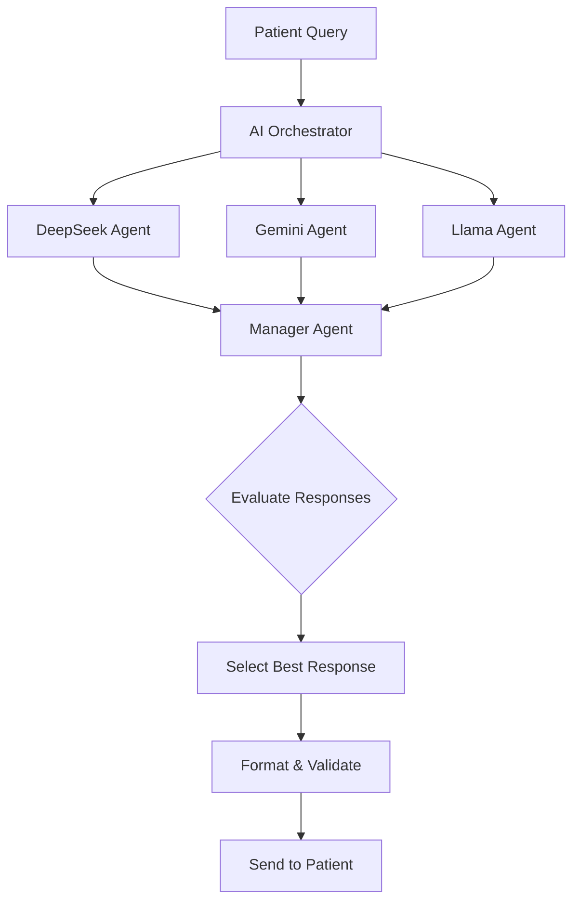
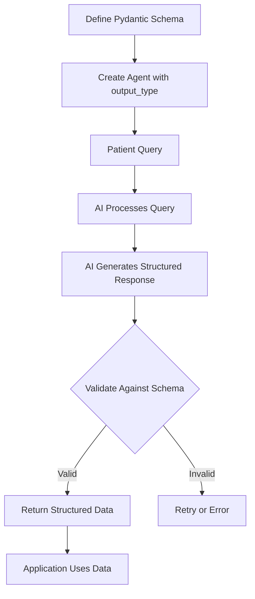
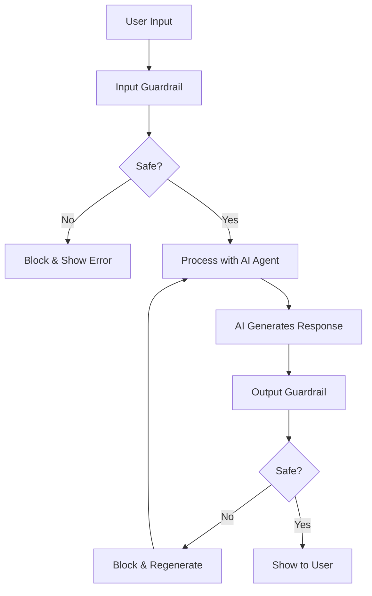
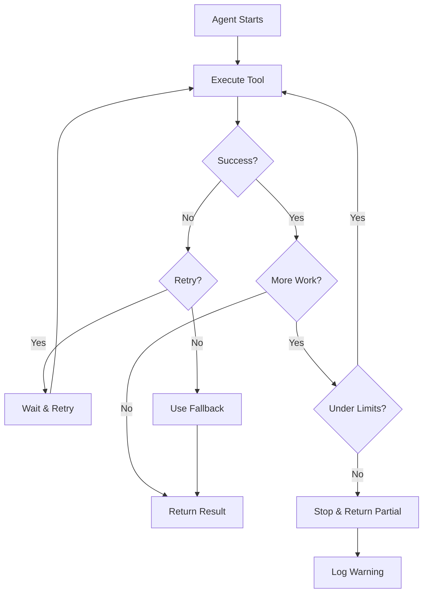

# 2.6 Robust LLM Agent Systems: Multi-Model Integration and Guardrails

**Course:** Smart Healthcare AI Platform  
**Module:** AI Agent Engineering  
**Version:** 1.0  
**Date:** February 2026

---

## Table of Contents
1. [Multi-Model Integration](#1-multi-model-integration)
2. [Structured Outputs](#2-structured-outputs)
3. [Guardrails](#3-guardrails)
4. [Agent Stability and Error Handling](#4-agent-stability-and-error-handling)

---

## 1. Multi-Model Integration

### 1. Simple Explanation

Multi-model integration means using different AI models (like GPT-4, Gemini, DeepSeek, Llama) in the same system. Instead of relying on just one AI provider, you can connect to multiple models and use them together.

Think of it like having multiple doctors with different specialties working together. One might be better at diagnosis, another at treatment plans, and another at patient communication.

### 2. Why It Matters (Interview + Real World)

**Problems it solves:**
- Avoids vendor lock-in (not dependent on one AI provider)
- Different models have different strengths (cost, speed, accuracy)
- Provides backup if one model fails or has downtime
- Allows cost optimization (use cheaper models for simple tasks)

**Why companies use it:**
- Reduces risk of service disruption
- Optimizes costs (GPT-4 is expensive, DeepSeek is cheaper)
- Improves quality by using best model for each task
- Meets compliance requirements (some regions prefer local models)

**Why interviewers ask:**
- Tests understanding of AI architecture flexibility
- Shows knowledge of different AI providers
- Demonstrates cost-awareness and optimization thinking
- Reveals experience with production AI systems

### 3. Very Simple Healthcare Example

Patient asks: "What are my symptoms?"
- DeepSeek Agent (fast, cheap) → Analyzes basic symptoms
- Gemini Agent (balanced) → Suggests possible conditions
- Llama Agent (concise) → Recommends next steps
- System picks best response → Shows to patient

### 4. Step-by-Step Workflow

1. Patient sends medical query to system
2. System routes query to multiple AI models simultaneously
3. DeepSeek generates professional medical response
4. Gemini generates friendly, engaging response
5. Llama generates quick, concise response
6. Manager agent reviews all three responses
7. Manager selects best response based on quality
8. System validates and formats the response
9. Response sent to patient



### 5. Where It Fits in the System

**Location:** AI Service Layer → AI Agent Orchestrator

**Components:**
- **AI Agent Orchestrator**: Coordinates multiple models
- **Model Integration Layer**: Connects to different AI providers
- **LLM Integration Layer**: Manages API calls and responses
- **Agent Manager**: Selects and routes to appropriate models

**Integration Points:**
- Connects to OpenAI, Google, DeepSeek, Groq APIs
- Uses OpenAI-compatible endpoints for easy integration
- Managed by AI Engine Service microservice

### 6. Lab Exercise (Hands-On)

#### Lab Objective
Build a multi-model healthcare AI system that uses different AI models (DeepSeek, Gemini, Llama) to generate medical responses and select the best one.

**Reference:** Based on `D:\MyProjects\agents\2_openai\3_lab3.ipynb`

---

## 📁 Folder Name
`HC_2_openai`

## 📄 File Name
`HC_3_lab3.ipynb`

---

## 📘 Lab Content

### Lab Title
**Healthcare Multi-Model AI Agent System with Guardrails**

### Objective
Learn how to:
1. Integrate multiple AI models (DeepSeek, Gemini, Llama) into one healthcare system
2. Use structured outputs to format medical responses
3. Implement guardrails to protect patient privacy
4. Build robust AI agents that handle errors gracefully

### Scenario

You are building a **Smart Healthcare AI Platform** that provides medical guidance to patients. The system needs to:
- Generate medical advice using multiple AI models
- Select the best response from different AI agents
- Ensure patient privacy by blocking personal information
- Format responses in a structured way

Your hospital wants to avoid depending on just one AI provider and wants to use the best model for each situation.

### Tasks / Steps

#### Step 1: Setup and Import Libraries

```python
from dotenv import load_dotenv
from openai import AsyncOpenAI
from agents import Agent, Runner, trace, function_tool, OpenAIChatCompletionsModel, input_guardrail, GuardrailFunctionOutput
from typing import Dict
import sendgrid
import os
from sendgrid.helpers.mail import Mail, Email, To, Content
from pydantic import BaseModel

load_dotenv(override=True)
```

**Healthcare Context:** Import necessary libraries for building multi-model AI healthcare agents.

---

#### Step 2: Configure API Keys for Multiple Models

```python
openai_api_key = os.getenv('OPENAI_API_KEY')
google_api_key = os.getenv('GOOGLE_API_KEY')
deepseek_api_key = os.getenv('DEEPSEEK_API_KEY')
groq_api_key = os.getenv('GROQ_API_KEY')

# Verify keys are loaded
if openai_api_key:
    print(f"OpenAI API Key exists and begins {openai_api_key[:8]}")
if google_api_key:
    print(f"Google API Key exists and begins {google_api_key[:2]}")
if deepseek_api_key:
    print(f"DeepSeek API Key exists and begins {deepseek_api_key[:3]}")
if groq_api_key:
    print(f"Groq API Key exists and begins {groq_api_key[:4]}")
```

**Healthcare Context:** Load API keys for different AI providers. In healthcare, using multiple providers ensures system reliability and compliance with regional regulations.

---

#### Step 3: Define Medical Agent Instructions

```python
instructions1 = "You are a medical AI assistant working for HealthCare Plus, \
a smart healthcare platform that provides evidence-based medical guidance. \
You write professional, accurate medical advice based on clinical guidelines."

instructions2 = "You are a friendly, empathetic medical AI assistant working for HealthCare Plus, \
a smart healthcare platform that provides evidence-based medical guidance. \
You write warm, engaging medical advice that helps patients feel comfortable and informed."

instructions3 = "You are an efficient medical AI assistant working for HealthCare Plus, \
a smart healthcare platform that provides evidence-based medical guidance. \
You write concise, clear medical advice that gets straight to the point."
```

**Healthcare Context:** Three different communication styles for medical advice:
- **Professional**: For detailed clinical information
- **Empathetic**: For anxious patients needing reassurance
- **Concise**: For busy patients wanting quick answers

---

#### Step 4: Configure OpenAI-Compatible Endpoints

```python
GEMINI_BASE_URL = "https://generativelanguage.googleapis.com/v1beta/openai/"
DEEPSEEK_BASE_URL = "https://api.deepseek.com/v1"
GROQ_BASE_URL = "https://api.groq.com/openai/v1"

# Create clients for each model
deepseek_client = AsyncOpenAI(base_url=DEEPSEEK_BASE_URL, api_key=deepseek_api_key)
gemini_client = AsyncOpenAI(base_url=GEMINI_BASE_URL, api_key=google_api_key)
groq_client = AsyncOpenAI(base_url=GROQ_BASE_URL, api_key=groq_api_key)

# Create model objects
deepseek_model = OpenAIChatCompletionsModel(model="deepseek-chat", openai_client=deepseek_client)
gemini_model = OpenAIChatCompletionsModel(model="gemini-2.0-flash", openai_client=gemini_client)
llama3_3_model = OpenAIChatCompletionsModel(model="llama-3.3-70b-versatile", openai_client=groq_client)
```

**Healthcare Context:** Configure connections to different AI models. Each model has different strengths:
- **DeepSeek**: Cost-effective for routine medical queries
- **Gemini**: Balanced performance for general medical advice
- **Llama 3.3**: Fast inference for urgent medical triage

---

#### Step 5: Create Medical AI Agents

```python
medical_agent1 = Agent(name="DeepSeek Medical Agent", instructions=instructions1, model=deepseek_model)
medical_agent2 = Agent(name="Gemini Medical Agent", instructions=instructions2, model=gemini_model)
medical_agent3 = Agent(name="Llama Medical Agent", instructions=instructions3, model=llama3_3_model)
```

**Healthcare Context:** Create three medical AI agents, each using a different model and communication style.

---

#### Step 6: Convert Agents to Tools

```python
description = "Provide medical guidance and health advice to patients"

tool1 = medical_agent1.as_tool(tool_name="medical_agent1", tool_description=description)
tool2 = medical_agent2.as_tool(tool_name="medical_agent2", tool_description=description)
tool3 = medical_agent3.as_tool(tool_name="medical_agent3", tool_description=description)
```

**Healthcare Context:** Convert agents into tools so a manager agent can call them and compare responses.

---

#### Step 7: Create Email Notification Tool

```python
@function_tool
def send_medical_notification(subject: str, html_body: str) -> Dict[str, str]:
    """ Send medical advice email to patient """
    sg = sendgrid.SendGridAPIClient(api_key=os.environ.get('SENDGRID_API_KEY'))
    from_email = Email("noreply@healthcareplus.com")
    to_email = To("patient@example.com")
    content = Content("text/html", html_body)
    mail = Mail(from_email, to_email, subject, content).get()
    sg.client.mail.send.post(request_body=mail)
    return {"status": "success", "message": "Medical advice sent to patient"}
```

**Healthcare Context:** Tool to send medical advice via email to patients.

---

#### Step 8: Create Subject Writer and HTML Converter Agents

```python
subject_instructions = "You can write a subject line for a medical advice email. \
You are given medical content and you need to write a clear, professional subject line."

html_instructions = "You can convert medical advice text to HTML email format. \
You are given text medical advice and you need to convert it to a clean, readable HTML email."

subject_writer = Agent(name="Email Subject Writer", instructions=subject_instructions, model="gpt-4o-mini")
subject_tool = subject_writer.as_tool(tool_name="subject_writer", tool_description="Write subject for medical email")

html_converter = Agent(name="HTML Converter", instructions=html_instructions, model="gpt-4o-mini")
html_tool = html_converter.as_tool(tool_name="html_converter", tool_description="Convert medical advice to HTML")

email_tools = [subject_tool, html_tool, send_medical_notification]
```

**Healthcare Context:** Helper agents to format and send medical advice emails professionally.

---

#### Step 9: Create Email Manager Agent

```python
email_manager_instructions = "You are an email formatter for medical communications. \
You receive medical advice text. First use subject_writer to create a subject line, \
then use html_converter to format as HTML, finally use send_medical_notification to send the email."

emailer_agent = Agent(
    name="Email Manager",
    instructions=email_manager_instructions,
    tools=email_tools,
    model="gpt-4o-mini",
    handoff_description="Format and send medical advice email to patient"
)
```

**Healthcare Context:** Agent that handles the complete email workflow for patient communications.

---

#### Step 10: Create Medical Manager Agent

```python
tools = [tool1, tool2, tool3]
handoffs = [emailer_agent]

medical_manager_instructions = """
You are a Medical AI Manager at HealthCare Plus. Your goal is to provide the best medical guidance.

Follow these steps:
1. Generate Responses: Use all three medical_agent tools to generate three different medical responses.
2. Evaluate: Review all three responses and select the single best one based on accuracy, clarity, and helpfulness.
3. Handoff: Pass ONLY the best response to the 'Email Manager' agent to send to the patient.

Rules:
- You must use all three medical agent tools to generate responses
- You must select exactly ONE best response
- You must hand off only the winning response to Email Manager
"""

medical_manager = Agent(
    name="Medical Manager",
    instructions=medical_manager_instructions,
    tools=tools,
    handoffs=handoffs,
    model="gpt-4o-mini"
)

message = "Provide medical advice about managing type 2 diabetes for a newly diagnosed patient"

with trace("Healthcare Multi-Model System"):
    result = await Runner.run(medical_manager, message)
```

**Healthcare Context:** Manager agent coordinates multiple AI models to generate medical advice, selects the best response, and sends it to the patient.

**Workflow:**
```
Patient Query
    ↓
Medical Manager
    ↓
├─→ DeepSeek Agent (Professional)
├─→ Gemini Agent (Empathetic)
└─→ Llama Agent (Concise)
    ↓
Manager Evaluates All 3
    ↓
Selects Best Response
    ↓
Email Manager
    ↓
├─→ Subject Writer
├─→ HTML Converter
└─→ Send Email
    ↓
Patient Receives Advice
```

---

#### Step 11: Implement Structured Outputs

```python
class MedicalAdviceOutput(BaseModel):
    diagnosis_summary: str
    recommendations: str
    urgency_level: str  # "low", "medium", "high"
    follow_up_needed: bool

structured_agent = Agent(
    name="Structured Medical Agent",
    instructions="Provide medical advice in structured format",
    output_type=MedicalAdviceOutput,
    model="gpt-4o-mini"
)
```

**Healthcare Context:** Instead of free-text responses, force AI to return structured data with specific fields. This ensures consistency and makes it easier to process responses programmatically.

---

#### Step 12: Implement Privacy Guardrails

```python
class NameCheckOutput(BaseModel):
    is_name_in_message: bool
    name: str

guardrail_agent = Agent(
    name="Privacy Check",
    instructions="Check if the user is including someone's personal name or private information in their request.",
    output_type=NameCheckOutput,
    model="gpt-4o-mini"
)

@input_guardrail
async def guardrail_against_pii(ctx, agent, message):
    result = await Runner.run(guardrail_agent, message, context=ctx.context)
    is_pii_found = result.final_output.is_name_in_message
    return GuardrailFunctionOutput(
        output_info={"found_pii": result.final_output},
        tripwire_triggered=is_pii_found
    )
```

**Healthcare Context:** Guardrail prevents patients from accidentally including personal names or private information in medical queries. This protects patient privacy and HIPAA compliance.

---

#### Step 13: Create Protected Medical Manager

```python
protected_medical_manager = Agent(
    name="Protected Medical Manager",
    instructions=medical_manager_instructions,
    tools=tools,
    handoffs=[emailer_agent],
    model="gpt-4o-mini",
    input_guardrails=[guardrail_against_pii]
)

# This will FAIL because it contains a name
message_with_pii = "Provide medical advice for my friend Alice who has diabetes"

with trace("Protected Healthcare System - PII Detected"):
    result = await Runner.run(protected_medical_manager, message_with_pii)
```

**Healthcare Context:** When a patient includes a name, the guardrail triggers and stops the request. This prevents accidental privacy violations.

**Expected Output:** Exception raised with message "Guardrail triggered: Personal information detected"

---

#### Step 14: Test Without PII

```python
# This will SUCCEED because no PII
message_without_pii = "Provide medical advice for a newly diagnosed type 2 diabetes patient"

with trace("Protected Healthcare System - Success"):
    result = await Runner.run(protected_medical_manager, message_without_pii)
```

**Healthcare Context:** When no personal information is detected, the system processes the request normally.

---

### Expected Outcome

1. **Multi-Model Integration**: System successfully calls DeepSeek, Gemini, and Llama models in parallel
2. **Response Selection**: Manager agent evaluates all three responses and selects the best one
3. **Email Delivery**: Selected medical advice is formatted and sent to patient
4. **Privacy Protection**: Guardrails block requests containing personal information
5. **Structured Output**: Medical advice follows consistent format with required fields

### Key Learning Points

1. **OpenAI-Compatible Endpoints**: Most AI providers offer OpenAI-compatible APIs for easy integration
2. **Agent as Tool Pattern**: Agents can be converted to tools and called by other agents
3. **Parallel Execution**: Multiple agents can run simultaneously for faster responses
4. **Guardrails**: Input/output validation using AI agents themselves
5. **Structured Outputs**: Pydantic models enforce response format
6. **Error Handling**: Guardrails throw exceptions when validation fails

### Notes

**Important Considerations:**

1. **Model Selection Strategy**:
   - Use cheaper models (DeepSeek) for routine queries
   - Use advanced models (GPT-4) for complex medical decisions
   - Use fast models (Llama via Groq) for urgent triage

2. **Guardrail Placement**:
   - **Input Guardrails**: Validate user input before processing
   - **Output Guardrails**: Validate AI responses before showing to users
   - Can use AI agents as guardrails for complex validation

3. **Agent Stability**:
   - Autonomous agents can loop infinitely if not constrained
   - Set maximum iterations or time limits
   - Monitor agent behavior in production

4. **Cost Optimization**:
   - Track token usage per model
   - Cache common responses
   - Use streaming for long responses

5. **HIPAA Compliance**:
   - Never log patient PII
   - Encrypt all medical data
   - Implement audit trails
   - Use guardrails to prevent data leaks

---

### 7. Common Interview Questions

**Q1: Why would you use multiple AI models instead of just one?**

**Answer:** Using multiple models provides redundancy, cost optimization, and quality improvement. Different models have different strengths - some are faster, some are cheaper, some are more accurate. By using multiple models, you avoid vendor lock-in and can select the best model for each specific task. In healthcare, this also helps meet compliance requirements where some regions prefer local models.

---

**Q2: What are guardrails and why are they important in healthcare AI?**

**Answer:** Guardrails are validation checks that run before (input guardrails) or after (output guardrails) AI agent execution. They ensure the system doesn't process inappropriate inputs or generate harmful outputs. In healthcare, guardrails are critical for protecting patient privacy (blocking PII), ensuring medical accuracy (validating against guidelines), and maintaining HIPAA compliance. The unique aspect is that guardrails can themselves be AI agents that use LLMs to perform complex validation.

---

**Q3: What is the difference between structured outputs and regular text outputs?**

**Answer:** Regular text outputs are free-form strings that AI generates. Structured outputs use Pydantic models to enforce a specific schema with defined fields and types. For example, instead of getting "The patient has high urgency and needs follow-up", you get a structured object with `urgency_level: "high"` and `follow_up_needed: true`. This makes responses consistent, easier to validate, and simpler to integrate with other systems. In healthcare, structured outputs are essential for integrating AI responses into EHR systems and clinical workflows.

---

### 8. Quick Revision Summary

- **Multi-Model Integration**: Connect to multiple AI providers (OpenAI, Gemini, DeepSeek, Llama) using OpenAI-compatible endpoints
- **Agent as Tool**: Convert agents into tools that other agents can call, enabling agent collaboration
- **Guardrails**: Use input/output validation (can be AI-powered) to protect against privacy violations and ensure quality
- **Structured Outputs**: Use Pydantic models to enforce consistent response formats instead of free text
- **Parallel Execution**: Run multiple agents simultaneously to compare responses and select the best one
- **Error Handling**: Guardrails throw exceptions when validation fails, preventing bad data from entering the system

---


## 2. Structured Outputs

### 1. Simple Explanation

Structured outputs mean forcing AI to return data in a specific format with defined fields, instead of just returning free text. It's like filling out a form with specific boxes instead of writing a paragraph.

Instead of AI saying: "The patient needs urgent care and should follow up in 3 days"

You get:
```json
{
  "urgency": "high",
  "follow_up_days": 3,
  "action_required": true
}
```

### 2. Why It Matters (Interview + Real World)

**Problems it solves:**
- Inconsistent AI responses (sometimes detailed, sometimes brief)
- Hard to parse free text programmatically
- Difficult to validate AI output
- Integration challenges with other systems

**Why companies use it:**
- Ensures consistent data format for databases
- Makes it easy to integrate AI with existing systems
- Enables automatic validation and error checking
- Simplifies UI rendering (know exactly what fields to display)

**Why interviewers ask:**
- Tests understanding of production AI systems
- Shows knowledge of data modeling
- Demonstrates awareness of integration challenges
- Reveals experience with real-world AI applications

### 3. Very Simple Healthcare Example

Patient asks: "Do I need to see a doctor?"

**Without Structured Output:**
"Based on your symptoms, you should see a doctor soon. It's moderately urgent."

**With Structured Output:**
```json
{
  "needs_doctor": true,
  "urgency": "medium",
  "recommended_specialty": "General Practitioner",
  "timeframe_hours": 24
}
```

### 4. Step-by-Step Workflow

1. Define Pydantic model with required fields
2. Create agent with `output_type` parameter
3. Patient sends medical query
4. AI processes query
5. AI generates response matching schema
6. System validates response against schema
7. If valid, return structured data
8. If invalid, retry or throw error
9. Application uses structured data directly



### 5. Where It Fits in the System

**Location:** AI Service Layer → LLM Integration Layer

**Components:**
- **Pydantic Models**: Define schemas for structured outputs
- **Agent Configuration**: Set `output_type` parameter
- **Validation Layer**: Automatic schema validation
- **Response Parser**: Converts AI output to structured objects

**Integration Points:**
- Used by all AI agents that need consistent output
- Integrates with database schemas
- Feeds into UI components
- Enables automated workflows

### 6. Lab Exercise (Hands-On)

See **Section 1, Step 11** for hands-on implementation of structured outputs in healthcare context.

**Additional Exercise:**

Create a structured output for patient triage:

```python
class TriageOutput(BaseModel):
    urgency_level: str  # "emergency", "urgent", "routine", "non-urgent"
    recommended_action: str
    estimated_wait_time_minutes: int
    requires_specialist: bool
    specialist_type: Optional[str]
    symptoms_summary: str

triage_agent = Agent(
    name="Triage Agent",
    instructions="Analyze patient symptoms and provide triage assessment",
    output_type=TriageOutput,
    model="gpt-4o-mini"
)

# Use the agent
result = await Runner.run(triage_agent, "Patient has chest pain and shortness of breath")
print(f"Urgency: {result.final_output.urgency_level}")
print(f"Action: {result.final_output.recommended_action}")
print(f"Wait time: {result.final_output.estimated_wait_time_minutes} minutes")
```

### 7. Common Interview Questions

**Q1: What is the difference between structured outputs and JSON mode?**

**Answer:** JSON mode tells the AI to return valid JSON, but doesn't enforce a specific schema. Structured outputs use Pydantic models to enforce exact fields, types, and validation rules. With JSON mode, you might get `{"status": "urgent"}` or `{"urgency": "high"}` - inconsistent field names. With structured outputs, you always get the exact fields you defined. Structured outputs provide stronger guarantees and automatic validation.

---

**Q2: How do you handle optional fields in structured outputs?**

**Answer:** Use Python's `Optional` type from the typing module. For example: `specialist_type: Optional[str] = None`. This tells the AI that the field can be omitted or set to None. You can also provide default values. In healthcare, this is useful for fields like "allergies" which may not always be present or relevant to the query.

---

**Q3: What happens if the AI can't generate output matching the schema?**

**Answer:** The system will retry the generation, usually with additional instructions to follow the schema. If it continues to fail, it throws an exception. In production healthcare systems, you should implement fallback logic - either use a default safe response, escalate to human review, or use a simpler schema. Never let invalid data reach the patient or clinical systems.

---

### 8. Quick Revision Summary

- **Structured Outputs**: Force AI to return data in predefined format using Pydantic models
- **Schema Definition**: Use Python classes with type hints to define expected fields
- **Automatic Validation**: System validates AI output against schema automatically
- **Consistency**: Ensures every response has the same structure, making integration easier
- **Type Safety**: Catch errors early by enforcing field types (string, int, bool, etc.)

---

## 3. Guardrails

### 1. Simple Explanation

Guardrails are safety checks that validate inputs before AI processes them and outputs before showing them to users. They act like security guards that check if something is safe to enter or leave the system.

Think of it like airport security - they check what you bring in (input guardrails) and what you take out (output guardrails).

### 2. Why It Matters (Interview + Real World)

**Problems it solves:**
- Prevents processing of harmful or inappropriate inputs
- Blocks AI from generating dangerous or incorrect outputs
- Protects patient privacy (HIPAA compliance)
- Prevents prompt injection attacks
- Ensures medical accuracy and safety

**Why companies use it:**
- Legal compliance (HIPAA, GDPR)
- Risk mitigation (prevent medical errors)
- Brand protection (avoid PR disasters)
- Security (prevent data leaks)
- Quality assurance (maintain standards)

**Why interviewers ask:**
- Tests understanding of AI safety
- Shows awareness of compliance requirements
- Demonstrates production-readiness thinking
- Reveals experience with real-world AI risks

### 3. Very Simple Healthcare Example

**Input Guardrail:**
Patient types: "Give medical advice for my friend John Smith at 123 Main St"
→ Guardrail detects personal information
→ System blocks request
→ Shows error: "Please don't include personal names or addresses"

**Output Guardrail:**
AI generates: "Take 10 aspirin tablets immediately"
→ Guardrail detects dangerous dosage
→ System blocks response
→ Regenerates safe response or escalates to human

### 4. Step-by-Step Workflow

**Input Guardrail Flow:**
1. User submits medical query
2. Input guardrail agent receives query
3. Guardrail checks for PII, inappropriate content
4. If problem found, set `tripwire_triggered=True`
5. System throws exception, blocks processing
6. User sees error message
7. If no problem, processing continues normally

**Output Guardrail Flow:**
1. AI agent generates medical response
2. Output guardrail agent receives response
3. Guardrail checks for dangerous advice, errors
4. If problem found, set `tripwire_triggered=True`
5. System blocks response from reaching user
6. Either regenerate or escalate to human
7. If safe, show response to user



### 5. Where It Fits in the System

**Location:** AI Service Layer → Guardrail Layer (wraps all agents)

**Components:**
- **Input Guardrail Agents**: Validate incoming requests
- **Output Guardrail Agents**: Validate AI responses
- **Guardrail Registry**: Manages all active guardrails
- **Tripwire System**: Triggers exceptions when violations detected

**Integration Points:**
- Wraps all patient-facing AI agents
- Integrates with audit logging system
- Connects to compliance monitoring
- Feeds into security alerts

### 6. Lab Exercise (Hands-On)

See **Section 1, Steps 12-14** for hands-on implementation of guardrails in healthcare context.

**Additional Exercise - Output Guardrail:**

```python
class SafetyCheckOutput(BaseModel):
    is_safe: bool
    risk_level: str  # "none", "low", "medium", "high"
    concerns: str

safety_guardrail_agent = Agent(
    name="Medical Safety Check",
    instructions="Check if medical advice is safe and appropriate. Flag dangerous dosages, contraindications, or harmful recommendations.",
    output_type=SafetyCheckOutput,
    model="gpt-4o-mini"
)

@output_guardrail
async def guardrail_medical_safety(ctx, agent, output):
    result = await Runner.run(safety_guardrail_agent, output, context=ctx.context)
    is_unsafe = not result.final_output.is_safe
    return GuardrailFunctionOutput(
        output_info={"safety_check": result.final_output},
        tripwire_triggered=is_unsafe
    )

# Create protected agent
safe_medical_agent = Agent(
    name="Safe Medical Agent",
    instructions="Provide medical advice",
    model="gpt-4o-mini",
    output_guardrails=[guardrail_medical_safety]
)
```

### 7. Common Interview Questions

**Q1: What's the difference between input and output guardrails?**

**Answer:** Input guardrails validate user requests before AI processes them - they check for PII, inappropriate content, or malicious inputs. Output guardrails validate AI responses before showing them to users - they check for dangerous advice, errors, or policy violations. In healthcare, input guardrails protect privacy (HIPAA), while output guardrails protect patient safety (prevent harmful medical advice).

---

**Q2: Why use AI agents as guardrails instead of simple rules?**

**Answer:** Simple rules (regex, keyword matching) can't understand context. For example, "Alice" might be a patient name (should block) or a medical term "Alice in Wonderland syndrome" (should allow). AI-powered guardrails understand context and nuance. They can detect subtle privacy violations, understand medical safety concerns, and adapt to new patterns. However, for critical safety checks, use both - fast rule-based checks first, then AI-powered validation for complex cases.

---

**Q3: What happens when a guardrail is triggered in production?**

**Answer:** When a guardrail triggers, the system throws an exception that stops processing. In production, you should: (1) Log the incident for audit, (2) Show user-friendly error message, (3) Alert security team if it's a potential attack, (4) Offer alternative actions to the user. For output guardrails, you might retry with different parameters or escalate to human review. Never silently fail - always log and alert.

---

### 8. Quick Revision Summary

- **Input Guardrails**: Validate user requests before AI processing (check for PII, attacks)
- **Output Guardrails**: Validate AI responses before showing to users (check for safety, accuracy)
- **AI-Powered**: Guardrails can themselves be AI agents for complex validation
- **Tripwire System**: When validation fails, `tripwire_triggered=True` throws exception
- **Production Critical**: Essential for HIPAA compliance, patient safety, and security

---

## 4. Agent Stability and Error Handling

### 1. Simple Explanation

Agent stability means making sure AI agents don't get stuck in infinite loops, don't crash unexpectedly, and handle errors gracefully. It's about making AI systems reliable and predictable.

Autonomous agents can sometimes keep calling tools repeatedly without stopping, or fail when external services are down. Stability mechanisms prevent these problems.

### 2. Why It Matters (Interview + Real World)

**Problems it solves:**
- Infinite loops wasting money and resources
- System crashes affecting patient care
- Unpredictable behavior in production
- Cost overruns from runaway agents
- Service disruptions

**Why companies use it:**
- Ensures reliable 24/7 operation
- Controls costs (prevent infinite API calls)
- Maintains SLA commitments
- Protects against edge cases
- Enables safe autonomous operation

**Why interviewers ask:**
- Tests production-readiness thinking
- Shows understanding of real-world AI challenges
- Demonstrates debugging and monitoring skills
- Reveals experience with autonomous systems

### 3. Very Simple Healthcare Example

**Problem:**
Medical AI agent keeps calling "get_patient_history" tool repeatedly
→ Makes 100+ API calls in 1 minute
→ Costs spike, system slows down
→ Patient waits forever for response

**Solution:**
Set maximum iterations = 10
→ Agent stops after 10 tool calls
→ Returns best answer so far
→ Logs warning for review

### 4. Step-by-Step Workflow

**Stability Mechanisms:**

1. **Maximum Iterations**
   - Set limit on tool calls per agent execution
   - Agent stops after N iterations
   - Returns result or error message

2. **Timeout Limits**
   - Set maximum execution time
   - Agent stops after T seconds
   - Prevents hanging indefinitely

3. **Circuit Breaker**
   - Monitor failure rate of external services
   - If failures exceed threshold, stop calling
   - Prevents cascading failures

4. **Retry Logic**
   - Retry failed operations with exponential backoff
   - Maximum retry attempts
   - Different strategies for different errors

5. **Fallback Responses**
   - Predefined safe responses when agent fails
   - Escalation to human when uncertain
   - Graceful degradation



### 5. Where It Fits in the System

**Location:** AI Service Layer → Agent Orchestrator → Stability Layer

**Components:**
- **Iteration Counter**: Tracks tool calls per execution
- **Timeout Manager**: Enforces time limits
- **Circuit Breaker**: Monitors service health
- **Retry Handler**: Manages retry logic
- **Fallback Manager**: Provides safe defaults

**Integration Points:**
- Wraps all agent executions
- Integrates with monitoring (Application Insights)
- Connects to alerting system
- Feeds into cost tracking

### 6. Lab Exercise (Hands-On)

**Exercise: Implement Stability Controls**

```python
from agents import Agent, Runner
import asyncio

class StableAgent:
    def __init__(self, agent, max_iterations=10, timeout_seconds=60):
        self.agent = agent
        self.max_iterations = max_iterations
        self.timeout_seconds = timeout_seconds
        self.iteration_count = 0
    
    async def run_with_stability(self, message):
        try:
            # Set timeout
            result = await asyncio.wait_for(
                self._run_with_iteration_limit(message),
                timeout=self.timeout_seconds
            )
            return result
        except asyncio.TimeoutError:
            return {
                "status": "timeout",
                "message": "Agent execution exceeded time limit",
                "partial_result": "Please try again or contact support"
            }
        except Exception as e:
            return {
                "status": "error",
                "message": str(e),
                "fallback": "I'm having trouble processing your request. A human agent will assist you shortly."
            }
    
    async def _run_with_iteration_limit(self, message):
        self.iteration_count = 0
        
        # Custom runner that tracks iterations
        async for event in Runner.run_stream(self.agent, message):
            if event.type == "tool_call":
                self.iteration_count += 1
                if self.iteration_count > self.max_iterations:
                    raise Exception(f"Agent exceeded maximum iterations ({self.max_iterations})")
        
        return event.final_output

# Usage
medical_agent = Agent(
    name="Medical Agent",
    instructions="Provide medical advice",
    tools=[...],
    model="gpt-4o-mini"
)

stable_agent = StableAgent(medical_agent, max_iterations=5, timeout_seconds=30)
result = await stable_agent.run_with_stability("What are symptoms of flu?")
```

**Healthcare Context:** This prevents medical AI agents from getting stuck in loops or taking too long, ensuring patients get timely responses.

---

**Exercise: Implement Circuit Breaker**

```python
from datetime import datetime, timedelta

class CircuitBreaker:
    def __init__(self, failure_threshold=5, timeout_seconds=60):
        self.failure_threshold = failure_threshold
        self.timeout_seconds = timeout_seconds
        self.failure_count = 0
        self.last_failure_time = None
        self.state = "closed"  # closed, open, half-open
    
    async def call(self, func, *args, **kwargs):
        if self.state == "open":
            if datetime.now() - self.last_failure_time > timedelta(seconds=self.timeout_seconds):
                self.state = "half-open"
            else:
                raise Exception("Circuit breaker is OPEN - service unavailable")
        
        try:
            result = await func(*args, **kwargs)
            if self.state == "half-open":
                self.state = "closed"
                self.failure_count = 0
            return result
        except Exception as e:
            self.failure_count += 1
            self.last_failure_time = datetime.now()
            
            if self.failure_count >= self.failure_threshold:
                self.state = "open"
            
            raise e

# Usage
circuit_breaker = CircuitBreaker(failure_threshold=3, timeout_seconds=30)

async def get_patient_data(patient_id):
    return await circuit_breaker.call(patient_service.get_data, patient_id)
```

**Healthcare Context:** If the patient database is down, the circuit breaker stops making requests after 3 failures, preventing system overload and allowing time for recovery.

---

### 7. Common Interview Questions

**Q1: What causes AI agents to get stuck in infinite loops?**

**Answer:** Agents can loop when they're given too much autonomy without constraints. For example, an instruction like "use tools multiple times if not satisfied" can cause the agent to keep regenerating responses indefinitely. This happens because the agent's evaluation of "satisfaction" is subjective. Solutions include: (1) Set maximum iterations, (2) Use explicit success criteria, (3) Implement timeout limits, (4) Monitor and alert on unusual patterns.

---

**Q2: How do you handle external service failures in AI agent systems?**

**Answer:** Use the circuit breaker pattern. Monitor failure rates for external services (databases, APIs). If failures exceed a threshold (e.g., 5 failures in 1 minute), stop calling that service temporarily. This prevents cascading failures and gives the service time to recover. Also implement retry logic with exponential backoff for transient failures. In healthcare, always have fallback responses ready - never leave patients without any response.

---

**Q3: What's the difference between timeout and maximum iterations?**

**Answer:** Timeout is time-based (stop after N seconds), while maximum iterations is action-based (stop after N tool calls). Use both together. Timeout prevents agents from running forever even if they're making progress. Maximum iterations prevents agents from making too many API calls even if they're fast. In healthcare, timeout ensures patients don't wait too long, while max iterations controls costs and prevents abuse.

---

### 8. Quick Revision Summary

- **Maximum Iterations**: Limit number of tool calls per agent execution to prevent infinite loops
- **Timeout Limits**: Stop agent execution after maximum time to ensure responsiveness
- **Circuit Breaker**: Stop calling failing services to prevent cascading failures
- **Retry Logic**: Automatically retry failed operations with exponential backoff
- **Fallback Responses**: Provide safe default responses when agents fail
- **Monitoring**: Track agent behavior, costs, and failures in production

---

## Summary: Building Robust Healthcare AI Systems

### Key Takeaways

1. **Multi-Model Integration**
   - Use multiple AI providers for redundancy and optimization
   - OpenAI-compatible endpoints make integration easy
   - Select best model for each task (cost vs quality vs speed)

2. **Structured Outputs**
   - Enforce consistent response formats using Pydantic models
   - Makes integration with other systems easier
   - Enables automatic validation and type safety

3. **Guardrails**
   - Validate inputs and outputs for safety and compliance
   - Can use AI agents as guardrails for complex validation
   - Essential for HIPAA compliance and patient safety

4. **Stability & Error Handling**
   - Prevent infinite loops with iteration limits
   - Use timeouts to ensure responsiveness
   - Implement circuit breakers for external services
   - Always have fallback responses ready

### Production Checklist for Healthcare AI Agents

- [ ] Multi-model support with fallback options
- [ ] Input guardrails for PII detection
- [ ] Output guardrails for medical safety
- [ ] Structured outputs for all critical responses
- [ ] Maximum iteration limits (recommended: 10)
- [ ] Timeout limits (recommended: 60 seconds)
- [ ] Circuit breakers for external services
- [ ] Retry logic with exponential backoff
- [ ] Comprehensive logging and monitoring
- [ ] Audit trail for all AI decisions
- [ ] Fallback responses for all failure modes
- [ ] Human escalation paths
- [ ] Cost tracking and alerts
- [ ] Performance metrics and SLAs

---

**End of Module 2.6**

**Next Module:** 2.7 Deep Research Agent - Building Multi-Agent Research Systems

---
