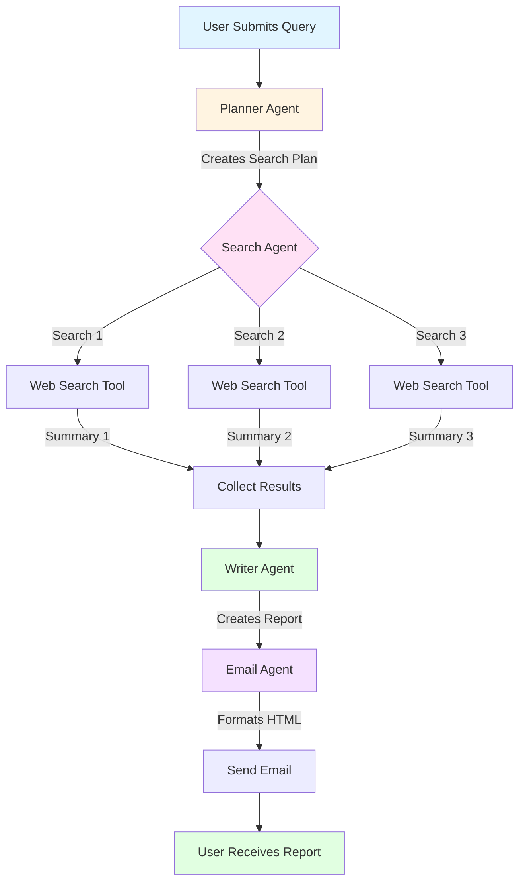
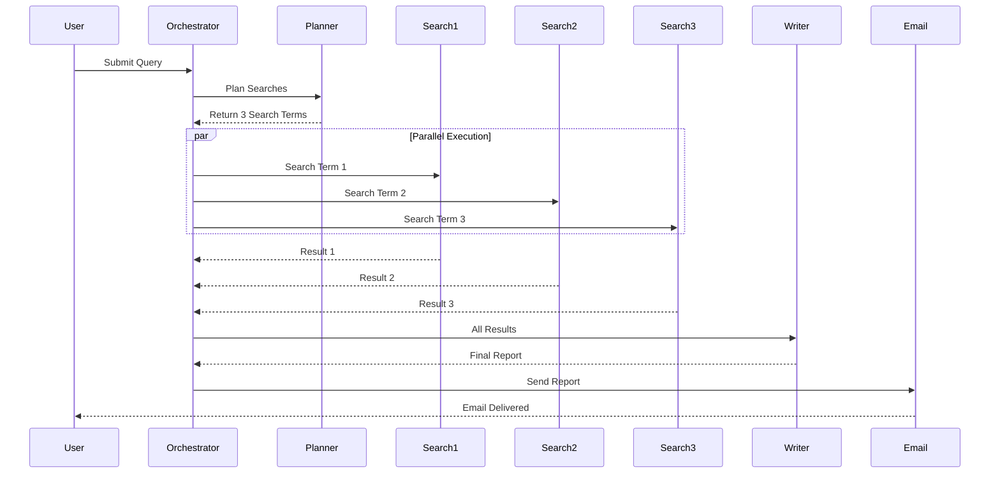
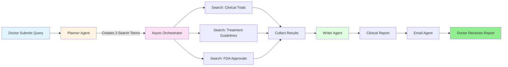

# 2.7 Scalable Deep Research AI Agent With Planner and Async Orchestration

---

## 1. Simple Explanation

A Deep Research AI Agent is a system that automatically searches the internet, reads multiple sources, and creates a detailed report on any topic you give it.

Think of it like having a research assistant who:
- Takes your question
- Figures out what to search for
- Searches multiple websites at the same time
- Reads all the results
- Writes a complete report
- Emails it to you

The system uses multiple AI agents working together:
- **Planner Agent**: Decides what searches to do
- **Search Agent**: Does the actual web searching
- **Writer Agent**: Creates the final report
- **Email Agent**: Sends the report to you

All of this happens automatically in minutes.

---

## 2. Why It Matters (Interview + Real World)

### What Problem Does It Solve?

- Manual research takes hours or days
- People miss important information from multiple sources
- Hard to synthesize information from 10+ websites
- Repetitive research tasks waste time

### Why Do Companies Use It?

- Saves 80% of research time
- Provides comprehensive analysis automatically
- Scales to handle many research requests
- Reduces human error in information gathering
- Works 24/7 without breaks

### Why Do Interviewers Ask About It?

- Tests understanding of multi-agent systems
- Shows knowledge of async programming
- Demonstrates real-world AI application
- Proves you can build production-ready agents
- Common use case in many industries

---

## 3. Very Simple Healthcare Example

**Scenario**: Doctor needs latest treatment guidelines for a rare disease.

**Flow**:
- Doctor asks: "Latest treatment for Lupus in 2025"
- Planner Agent decides to search: clinical trials, FDA approvals, medical journals
- Search Agent finds information from 3 medical sources simultaneously
- Writer Agent creates a 5-page medical summary
- Email Agent sends report to doctor's inbox

**Result**: Doctor gets comprehensive research in 2 minutes instead of 2 hours.

---

## 4. Step-by-Step Workflow

### Overall Deep Research Flow

1. **User submits research query**
   - Example: "Latest diabetes treatment options"

2. **Planner Agent analyzes query**
   - Breaks down into specific search topics
   - Creates 3-5 search terms
   - Uses structured output (JSON format)

3. **Search Agent performs multiple searches in parallel**
   - Runs all searches at the same time (async)
   - Each search uses OpenAI Web Search Tool
   - Summarizes results from each search

4. **Writer Agent synthesizes information**
   - Reads all search summaries
   - Creates outline for report
   - Writes detailed 5-10 page report in markdown

5. **Email Agent formats and sends**
   - Converts markdown to HTML
   - Creates subject line
   - Sends email with formatted report

6. **User receives complete research report**
   - Professional formatting
   - References and links included
   - Follow-up questions suggested

### Mermaid Flow Diagram



### Async Orchestration Pattern



---

## 5. Where It Fits in the System

### In Smart Healthcare AI Platform

**Component**: AI Agent Layer → Multi-Agent Orchestrator

**Integration Points**:
- **RAG Knowledge Service**: Provides medical knowledge context
- **Notification Service**: Sends email reports
- **Patient Service**: Accesses patient history for personalized research
- **Audit Service**: Logs all research queries and results

**Architecture Position**:
```
Patient/Doctor Query
        ↓
API Gateway
        ↓
AI Agent Orchestrator ← [Deep Research Agent Lives Here]
        ↓
├─ Planner Agent
├─ Search Agent (uses Web Search Tool)
├─ Writer Agent
└─ Email Agent
        ↓
Notification Service → Email Sent
```

---

## 6. Lab Exercise (Hands-On)

### Lab Objective

Build a Deep Research AI Agent for healthcare that can automatically research medical topics, synthesize information from multiple sources, and deliver comprehensive reports to healthcare professionals.

**Lab Exercise Reference Path**: `D:\MyProjects\agents\2_openai\4_lab4.ipynb`

---

## 📁 Folder Name

**HC_2_openai**

(Keep same folder structure, just adapt content to healthcare)

---

## 📄 File Name

**HC_4_lab4.ipynb**

---

## 📘 Lab Content

### Lab Title

**Healthcare Deep Research Agent - Medical Literature Synthesis**

---

### Objective

Create a multi-agent system that:
1. Takes medical research queries from healthcare professionals
2. Plans and executes multiple medical literature searches
3. Synthesizes findings into comprehensive clinical reports
4. Delivers formatted reports via email

**Skills Learned**:
- Multi-agent orchestration
- Async parallel execution
- Structured outputs with Pydantic
- OpenAI hosted tools (Web Search)
- Agent-to-agent communication

---

### Scenario

**Healthcare Context**:

Dr. Sarah is an oncologist who needs to stay updated on the latest cancer treatment protocols. She has 20 patients to see today and no time for manual research. She needs a system that can:

- Research latest clinical trials
- Find FDA-approved treatments
- Summarize medical journal findings
- Deliver a comprehensive report she can review in 5 minutes

**Your Task**: Build an AI agent system that automates this entire research process.

---

### Tasks / Steps

#### Step 1: Setup and Imports

```python
from agents import Agent, WebSearchTool, trace, Runner, function_tool
from agents.model_settings import ModelSettings
from pydantic import BaseModel, Field
from dotenv import load_dotenv
import asyncio
import sendgrid
import os
from sendgrid.helpers.mail import Mail, Email, To, Content
from typing import Dict
from IPython.display import display, Markdown

load_dotenv(override=True)
```

**Healthcare Note**: Ensure your environment has:
- OpenAI API key
- SendGrid API key (for email notifications)
- Verified sender email address

---

#### Step 2: Create Search Agent (Medical Literature Searcher)

**Purpose**: This agent searches medical databases and websites for clinical information.

```python
INSTRUCTIONS = """You are a medical research assistant. Given a medical search term, you search 
the web for that term and produce a concise summary of the results. The summary must be 2-3 
paragraphs and less than 300 words. Capture the main clinical points, latest research findings, 
and treatment guidelines. Write succinctly, focusing on evidence-based information. This will be 
consumed by a healthcare professional synthesizing a clinical report."""

search_agent = Agent(
    name="Medical Search Agent",
    instructions=INSTRUCTIONS,
    tools=[WebSearchTool(search_context_size="low")],
    model="gpt-4o-mini",
    model_settings=ModelSettings(tool_choice="required"),
)
```

**Test the Search Agent**:

```python
message = "Latest immunotherapy treatments for melanoma 2025"

with trace("Medical Search"):
    result = await Runner.run(search_agent, message)

display(Markdown(result.final_output))
```

**Expected Output**: A 2-3 paragraph summary of latest melanoma immunotherapy treatments.

---

#### Step 3: Create Planner Agent (Research Strategy Planner)

**Purpose**: Decides what medical topics to search for based on the doctor's query.

```python
HOW_MANY_SEARCHES = 3  # Start with 3 to control costs

INSTRUCTIONS = f"""You are a medical research planning assistant. Given a clinical query, 
come up with a set of medical literature searches to perform to best answer the query. 
Output {HOW_MANY_SEARCHES} specific search terms focusing on: clinical trials, treatment 
guidelines, and recent medical publications."""

# Define structured output schema
class MedicalSearchItem(BaseModel):
    reason: str = Field(description="Clinical reasoning for why this search is important to the query.")
    query: str = Field(description="The medical search term to use for the web search.")

class MedicalSearchPlan(BaseModel):
    searches: list[MedicalSearchItem] = Field(
        description="A list of medical searches to perform to best answer the clinical query."
    )

planner_agent = Agent(
    name="Medical Research Planner",
    instructions=INSTRUCTIONS,
    model="gpt-4o-mini",
    output_type=MedicalSearchPlan,
)
```

**Test the Planner Agent**:

```python
message = "Latest treatment protocols for Type 2 Diabetes in elderly patients"

with trace("Medical Research Planning"):
    result = await Runner.run(planner_agent, message)
    print(result.final_output)
```

**Expected Output**: 
```
searches=[
    MedicalSearchItem(
        reason='To find current clinical guidelines for diabetes management in elderly',
        query='Type 2 Diabetes treatment guidelines elderly patients 2025'
    ),
    MedicalSearchItem(
        reason='To identify latest medications approved for elderly diabetic patients',
        query='FDA approved diabetes medications elderly 2025'
    ),
    MedicalSearchItem(
        reason='To understand complications and risk factors specific to elderly',
        query='Type 2 Diabetes complications elderly patients management'
    )
]
```

---

#### Step 4: Create Email Tool (Clinical Report Delivery)

**Purpose**: Sends the research report to the healthcare professional.

```python
@function_tool
def send_clinical_email(subject: str, html_body: str) -> Dict[str, str]:
    """Send out a clinical research report email with the given subject and HTML body"""
    sg = sendgrid.SendGridAPIClient(api_key=os.environ.get('SENDGRID_API_KEY'))
    from_email = Email("research@healthcareai.com")  # Change to your verified email
    to_email = To("dr.sarah@hospital.com")  # Change to your email
    content = Content("text/html", html_body)
    mail = Mail(from_email, to_email, subject, content).get()
    sg.client.mail.send.post(request_body=mail)
    return "Clinical report sent successfully"
```

---

#### Step 5: Create Email Agent

**Purpose**: Formats the medical report into a professional HTML email.

```python
INSTRUCTIONS = """You are a medical communications specialist. You format clinical research 
reports into professional HTML emails for healthcare providers. You will be provided with a 
detailed medical report. Convert it into clean, well-presented HTML with an appropriate 
subject line. Use medical terminology appropriately and maintain professional formatting."""

email_agent = Agent(
    name="Clinical Email Agent",
    instructions=INSTRUCTIONS,
    tools=[send_clinical_email],
    model="gpt-4o-mini",
)
```

---

#### Step 6: Create Writer Agent (Clinical Report Writer)

**Purpose**: Synthesizes all search results into a comprehensive clinical report.

```python
INSTRUCTIONS = """You are a senior medical researcher tasked with writing a cohesive clinical 
report for a medical research query. You will be provided with the original query and initial 
research done by a research assistant.

First, create an outline for the report describing the structure and flow. Then, generate the 
report as your final output.

The report should include:
- Executive Summary
- Clinical Background
- Latest Research Findings
- Treatment Recommendations
- References

The final output should be in markdown format, lengthy and detailed. Aim for 5-10 pages of 
content, at least 1000 words. Use evidence-based language and cite sources."""

class ClinicalReportData(BaseModel):
    short_summary: str = Field(description="A short 2-3 sentence clinical summary of the findings.")
    markdown_report: str = Field(description="The final clinical research report")
    follow_up_questions: list[str] = Field(description="Suggested medical topics to research further")

writer_agent = Agent(
    name="Clinical Report Writer",
    instructions=INSTRUCTIONS,
    model="gpt-4o-mini",
    output_type=ClinicalReportData,
)
```

---

#### Step 7: Create Orchestration Functions

**Purpose**: Coordinate all agents to work together.

```python
async def plan_medical_searches(query: str):
    """Use the planner agent to plan which medical searches to run"""
    print("Planning medical literature searches...")
    result = await Runner.run(planner_agent, f"Clinical Query: {query}")
    print(f"Will perform {len(result.final_output.searches)} medical searches")
    return result.final_output

async def perform_medical_searches(search_plan: MedicalSearchPlan):
    """Execute all medical searches in parallel using asyncio"""
    print("Searching medical literature...")
    tasks = [asyncio.create_task(search_medical_literature(item)) 
             for item in search_plan.searches]
    results = await asyncio.gather(*tasks)
    print("Finished searching medical literature")
    return results

async def search_medical_literature(item: MedicalSearchItem):
    """Use the search agent to run a medical web search"""
    input = f"Medical Search Term: {item.query}\nClinical Reasoning: {item.reason}"
    result = await Runner.run(search_agent, input)
    return result.final_output

async def write_clinical_report(query: str, search_results: list[str]):
    """Use the writer agent to create a clinical report"""
    print("Writing clinical report...")
    input = f"Original Clinical Query: {query}\nMedical Research Summaries: {search_results}"
    result = await Runner.run(writer_agent, input)
    print("Finished writing clinical report")
    return result.final_output

async def send_report_email(report: ClinicalReportData):
    """Use the email agent to send the clinical report"""
    print("Sending clinical report email...")
    result = await Runner.run(email_agent, report.markdown_report)
    print("Clinical report email sent")
    return report
```

---

#### Step 8: Execute the Complete Deep Research Workflow

**Purpose**: Run the entire multi-agent system.

```python
# Healthcare research query
query = "Latest treatment protocols for Chronic Heart Failure in elderly patients"

with trace("Healthcare Deep Research"):
    print("Starting medical research...")
    
    # Step 1: Plan the searches
    search_plan = await plan_medical_searches(query)
    
    # Step 2: Execute searches in parallel
    search_results = await perform_medical_searches(search_plan)
    
    # Step 3: Write comprehensive report
    report = await write_clinical_report(query, search_results)
    
    # Step 4: Send email
    await send_report_email(report)
    
    print("Medical research complete!")
```

---

### Workflow Visualization



---

### Expected Outcome

**Email Received**:
- **Subject**: "Clinical Research Report: Chronic Heart Failure Treatment in Elderly Patients"
- **Content**: 
  - Executive Summary (2-3 sentences)
  - Clinical Background
  - Latest Research Findings (from 3 searches)
  - Treatment Recommendations
  - References with links
  - Follow-up Research Suggestions

**Time Saved**: 2 hours of manual research → 2 minutes automated

---

### Key Learning Points

1. **Multi-Agent Orchestration**: Coordinating multiple specialized agents
2. **Async Parallel Execution**: Running searches simultaneously with `asyncio.gather()`
3. **Structured Outputs**: Using Pydantic models for type-safe agent responses
4. **Hosted Tools**: Leveraging OpenAI's Web Search Tool
5. **Agent Specialization**: Each agent has a specific role (plan, search, write, email)
6. **Production Patterns**: Tracing, error handling, cost management

---

### Notes

**Cost Management**:
- Each web search costs ~$0.025 (2.5 cents)
- 3 searches = ~$0.075 per research query
- Adjust `HOW_MANY_SEARCHES` to control costs
- Use `search_context_size="low"` for cheaper searches

**OpenAI Tracing**:
- View execution traces at: https://platform.openai.com/traces
- Monitor agent performance and token usage
- Debug agent interactions

**Healthcare Compliance**:
- Do NOT include patient identifiable information in searches
- Log all research queries for audit trails
- Validate medical information with licensed professionals
- This is a research tool, not a diagnostic tool

**Scaling Considerations**:
- Increase `HOW_MANY_SEARCHES` to 10-20 for deeper research
- Add retry logic for failed searches
- Implement caching for repeated queries
- Add rate limiting to prevent API overuse

---

## 7. Common Interview Questions

### Question 1: Why use multiple agents instead of one agent?

**Answer**: 
Each agent specializes in one task (planning, searching, writing, emailing). This makes the system:
- Easier to test and debug
- More maintainable (change one agent without affecting others)
- More reliable (if one agent fails, others still work)
- Follows single responsibility principle

In healthcare, the planner understands medical research strategy, the searcher knows how to find clinical information, and the writer knows medical report formatting.

---

### Question 2: How does async orchestration improve performance?

**Answer**:
Async allows multiple searches to run at the same time instead of one after another.

**Without Async** (Sequential):
- Search 1: 5 seconds
- Search 2: 5 seconds  
- Search 3: 5 seconds
- **Total: 15 seconds**

**With Async** (Parallel):
- Search 1, 2, 3 all run together: 5 seconds
- **Total: 5 seconds**

This is critical in healthcare where doctors need fast answers.

---

### Question 3: What are structured outputs and why use them?

**Answer**:
Structured outputs use Pydantic models to force the AI to return data in a specific format (JSON schema).

**Benefits**:
- Type safety: You know exactly what fields you'll get
- Validation: Pydantic checks the data is correct
- No parsing errors: No need to parse free text
- Easier integration: Other systems can consume the structured data

**Example**: Instead of the planner returning text like "Search for X, Y, Z", it returns a structured list of search objects with `reason` and `query` fields.

---

## 8. Quick Revision Summary

- **Deep Research Agent** = Multi-agent system that automates research by planning searches, executing them in parallel, and synthesizing results

- **4 Key Agents**: Planner (decides what to search) → Search (finds information) → Writer (creates report) → Email (delivers report)

- **Async Orchestration** = Running multiple searches at the same time using `asyncio.gather()` for 3x faster execution

- **Structured Outputs** = Using Pydantic models to get type-safe, validated responses from AI agents

- **Healthcare Use Case** = Doctors get comprehensive medical research reports in 2 minutes instead of 2 hours of manual work

---

**End of Document**
