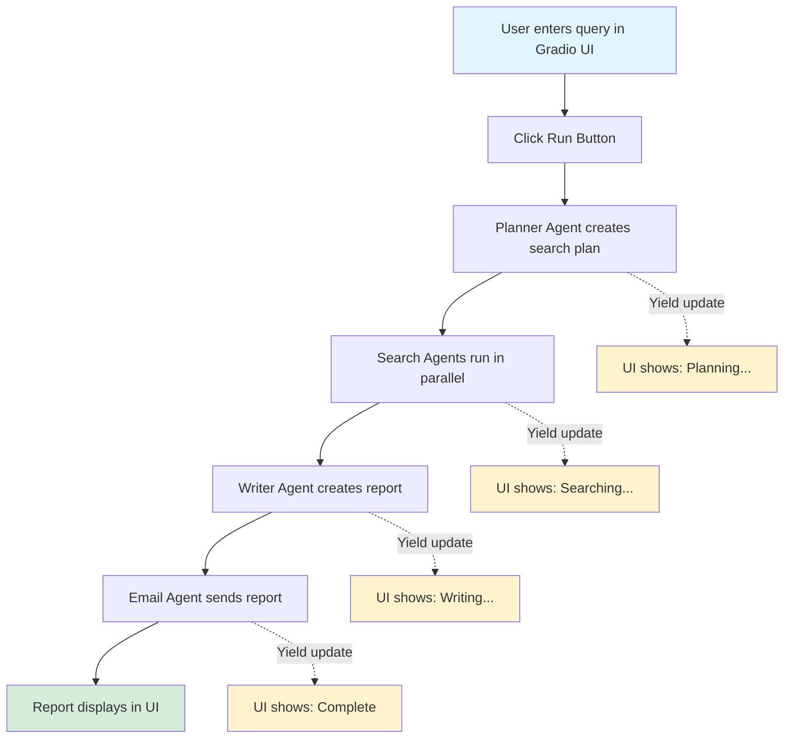
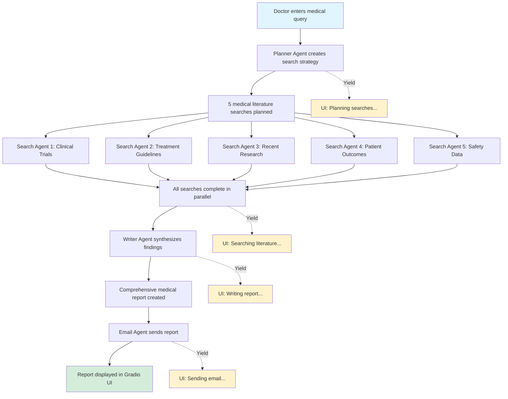

# 2.8 Autonomous AI Research Platform With Gradio and HuggingFace

---

## 1. Simple Explanation

This lesson shows how to convert a Jupyter notebook AI agent into a real Python application with a web interface.

You take the deep research agent (that plans searches, performs searches, writes reports, and sends emails) and turn it into:
- Separate Python modules (one file per agent)
- A web UI using Gradio (so users can interact with it)
- A deployable application (can be shared on HuggingFace)

Think of it like moving from a rough draft to a polished product.

---

## 2. Why It Matters (Interview + Real World)

**Problem it solves:**
- Notebooks are great for experiments but not for production
- Users need a simple interface, not code
- Teams need organized, maintainable code

**Why companies use it:**
- Production-ready applications need proper structure
- Non-technical users need web interfaces
- Gradio makes it easy to deploy AI tools quickly

**Why interviewers ask:**
- Shows you can build end-to-end applications
- Demonstrates understanding of software architecture
- Proves you can make AI accessible to users

---

## 3. Very Simple Healthcare Example

Doctor asks: "What are the latest treatments for Type 2 diabetes?"
→ AI plans 5 medical searches
→ Searches medical journals and guidelines
→ Writes a detailed report with references
→ Sends report to doctor's email

---

## 4. Step-by-Step Workflow

### Converting Notebook to Production App

1. User enters medical research question in web interface
2. Planner agent creates list of search queries
3. Search agents run all searches in parallel (async)
4. Writer agent combines results into detailed report
5. Email agent sends formatted report
6. User sees progress updates in real-time (via generators)

### Gradio UI Flow

1. User types query in text box
2. User clicks "Run" button
3. Gradio calls Python callback function
4. Callback runs research manager
5. Progress updates appear incrementally (yields)
6. Final report displays in markdown format



---

## 5. Where It Fits in the System

**Component:** AI Agent Layer + User Interface Layer

**Architecture:**
- **Planner Agent:** Plans research strategy
- **Search Agent:** Executes web searches
- **Writer Agent:** Synthesizes information
- **Email Agent:** Delivers results
- **Research Manager:** Orchestrates all agents
- **Gradio UI:** User-facing web interface

**In Smart Healthcare AI Platform:**
- Medical research assistant microservice
- Clinical guideline research tool
- Treatment option analyzer
- Medical literature review system

---

## 6. Lab Exercise (Hands-On)

### Lab Objective

Build a production-ready Medical Research AI Platform that converts notebook-based agents into a structured Python application with a web interface using Gradio.

---

### 📁 Folder Name
**HC_deep_research**

---

### 📄 File Names
1. `HC_deep_research.py` (Main Gradio UI)
2. `HC_email_agent.py` (Email delivery agent)
3. `HC_planner_agent.py` (Research planning agent)
4. `HC_research_manager.py` (Orchestration manager)
5. `HC_search_agent.py` (Medical search agent)
6. `HC_writer_agent.py` (Report writing agent)

---

### Lab Title
**Medical Research AI Platform - From Notebook to Production**

---

### Objective

Transform the deep research agent system into a production-ready medical research platform with:
- Modular Python architecture
- Web-based user interface
- Real-time progress updates
- Email delivery of research reports

---

### Scenario

A hospital's medical research team needs a tool to quickly research medical topics. Doctors and researchers should be able to:
- Enter a medical research question
- Get comprehensive research from multiple medical sources
- Receive a detailed report with citations
- Have results emailed for record-keeping

The system must be easy to use (web interface) and show progress in real-time.

---

### Tasks / Steps

#### **Step 1: Understand the Module Structure**

Review how the notebook code is organized into separate modules:

**HC_planner_agent.py:**
- Creates a plan for medical literature searches
- Defines how many searches to perform (5 searches)
- Uses Pydantic models for structured output
- Example: "What are diabetes treatments?" → Plans searches for: clinical trials, medications, lifestyle interventions, complications, latest research

**HC_search_agent.py:**
- Performs individual medical searches
- Summarizes results in 2-3 paragraphs
- Uses WebSearchTool with low context size (cost optimization)
- Example: Searches PubMed, medical journals, clinical guidelines

**HC_writer_agent.py:**
- Combines all search results into one comprehensive report
- Creates markdown-formatted medical report
- Includes summary, detailed findings, and follow-up questions
- Example output: 1000+ word report on diabetes treatments

**HC_email_agent.py:**
- Sends formatted HTML email with research report
- Uses SendGrid API
- Example: Emails report to requesting doctor

**HC_research_manager.py:**
- Orchestrates all agents in sequence
- Runs searches in parallel using asyncio
- Yields progress updates for UI
- Example flow: Plan → Search → Write → Email

**HC_deep_research.py:**
- Gradio web interface
- Text input for medical queries
- Real-time progress display
- Markdown report output

---

#### **Step 2: Set Up the Planner Agent**

Create `HC_planner_agent.py`:

```python
from pydantic import BaseModel, Field
from agents import Agent

HOW_MANY_SEARCHES = 5

INSTRUCTIONS = f"You are a medical research assistant. Given a medical query, come up with a set of \
medical literature searches to perform to best answer the query. Focus on: clinical trials, treatment \
guidelines, recent research, patient outcomes, and safety data. Output {HOW_MANY_SEARCHES} search terms."

class MedicalSearchItem(BaseModel):
    reason: str = Field(description="Why this search is important for the medical query.")
    query: str = Field(description="The medical search term to use.")

class MedicalSearchPlan(BaseModel):
    searches: list[MedicalSearchItem] = Field(
        description="A list of medical searches to perform."
    )
    
planner_agent = Agent(
    name="MedicalPlannerAgent",
    instructions=INSTRUCTIONS,
    model="gpt-4o-mini",
    output_type=MedicalSearchPlan,
)
```

**Healthcare Adaptation:**
- Changed to "medical research assistant"
- Focuses on clinical trials, treatment guidelines, research
- Uses MedicalSearchItem and MedicalSearchPlan models
- Example query: "Latest treatments for hypertension"

---

#### **Step 3: Set Up the Search Agent**

Create `HC_search_agent.py`:

```python
from agents import Agent, WebSearchTool, ModelSettings

INSTRUCTIONS = (
    "You are a medical research assistant. Given a medical search term, you search medical "
    "literature and databases for that term and produce a concise summary of the results. "
    "The summary must be 2-3 paragraphs and less than 300 words. Focus on: clinical evidence, "
    "treatment efficacy, safety data, and current medical guidelines. Capture the main medical "
    "findings. Write succinctly. This will be consumed by a medical researcher synthesizing a "
    "report, so it's vital you capture evidence-based information and ignore promotional content."
)

search_agent = Agent(
    name="MedicalSearchAgent",
    instructions=INSTRUCTIONS,
    tools=[WebSearchTool(search_context_size="low")],
    model="gpt-4o-mini",
    model_settings=ModelSettings(tool_choice="required"),
)
```

**Healthcare Adaptation:**
- Focuses on medical literature and databases
- Emphasizes clinical evidence and safety data
- Filters out promotional content
- Example: Searches for "ACE inhibitors hypertension efficacy"

---

#### **Step 4: Set Up the Writer Agent**

Create `HC_writer_agent.py`:

```python
from pydantic import BaseModel, Field
from agents import Agent

INSTRUCTIONS = (
    "You are a senior medical researcher tasked with writing a cohesive medical research report. "
    "You will be provided with the original medical query and research done by a research assistant.\n"
    "You should first create an outline for the medical report that describes: background, current "
    "evidence, treatment options, safety considerations, and clinical recommendations.\n"
    "The final output should be in markdown format, detailed and evidence-based. Aim for 5-10 pages "
    "of content, at least 1000 words. Include citations where possible."
)

class MedicalReportData(BaseModel):
    short_summary: str = Field(
        description="A short 2-3 sentence clinical summary of the findings."
    )
    markdown_report: str = Field(description="The final medical research report")
    follow_up_questions: list[str] = Field(
        description="Suggested medical topics to research further"
    )

writer_agent = Agent(
    name="MedicalWriterAgent",
    instructions=INSTRUCTIONS,
    model="gpt-4o-mini",
    output_type=MedicalReportData,
)
```

**Healthcare Adaptation:**
- Senior medical researcher role
- Report structure: background, evidence, treatments, safety, recommendations
- Evidence-based focus
- Example output: Comprehensive hypertension treatment report

---

#### **Step 5: Set Up the Email Agent**

Create `HC_email_agent.py`:

```python
import os
from typing import Dict
import sendgrid
from sendgrid.helpers.mail import Email, Mail, Content, To
from agents import Agent, function_tool

@function_tool
def send_medical_report_email(subject: str, html_body: str) -> Dict[str, str]:
    """Send a medical research report email with the given subject and HTML body"""
    sg = sendgrid.SendGridAPIClient(api_key=os.environ.get("SENDGRID_API_KEY"))
    from_email = Email("research@hospital.com")  # Your verified sender
    to_email = To("doctor@hospital.com")  # Recipient email
    content = Content("text/html", html_body)
    mail = Mail(from_email, to_email, subject, content).get()
    response = sg.client.mail.send.post(request_body=mail)
    print("Medical report email sent", response.status_code)
    return "success"

INSTRUCTIONS = """You are able to send a nicely formatted HTML email containing a medical research report.
You will be provided with a detailed medical report. You should use your tool to send one email, providing 
the report converted into clean, well-presented HTML with an appropriate medical subject line."""

email_agent = Agent(
    name="MedicalEmailAgent",
    instructions=INSTRUCTIONS,
    tools=[send_medical_report_email],
    model="gpt-4o-mini",
)
```

**Healthcare Adaptation:**
- Function renamed to send_medical_report_email
- Email addresses use hospital domain
- Subject line focuses on medical research
- Example: Sends "Hypertension Treatment Research Report" email

---

#### **Step 6: Set Up the Research Manager**

Create `HC_research_manager.py`:

```python
from agents import Runner, trace, gen_trace_id
from HC_search_agent import search_agent
from HC_planner_agent import planner_agent, MedicalSearchItem, MedicalSearchPlan
from HC_writer_agent import writer_agent, MedicalReportData
from HC_email_agent import email_agent
import asyncio

class MedicalResearchManager:

    async def run(self, query: str):
        """Run the medical research process, yielding status updates and final report"""
        trace_id = gen_trace_id()
        with trace("Medical Research Trace", trace_id=trace_id):
            print(f"View trace: https://platform.openai.com/traces/trace?trace_id={trace_id}")
            yield f"View trace: https://platform.openai.com/traces/trace?trace_id={trace_id}"
            
            print("Starting medical research...")
            search_plan = await self.plan_medical_searches(query)
            yield "Medical searches planned, starting to search medical literature..."
            
            search_results = await self.perform_medical_searches(search_plan)
            yield "Medical literature search complete, writing research report..."
            
            report = await self.write_medical_report(query, search_results)
            yield "Medical report written, sending email..."
            
            await self.send_medical_email(report)
            yield "Email sent, medical research complete"
            yield report.markdown_report

    async def plan_medical_searches(self, query: str) -> MedicalSearchPlan:
        """Plan the medical literature searches for the query"""
        print("Planning medical searches...")
        result = await Runner.run(planner_agent, f"Medical Query: {query}")
        print(f"Will perform {len(result.final_output.searches)} medical searches")
        return result.final_output_as(MedicalSearchPlan)

    async def perform_medical_searches(self, search_plan: MedicalSearchPlan) -> list[str]:
        """Perform the medical literature searches in parallel"""
        print("Searching medical literature...")
        num_completed = 0
        tasks = [
            asyncio.create_task(self.search_medical_literature(item)) 
            for item in search_plan.searches
        ]
        results = []
        for task in asyncio.as_completed(tasks):
            result = await task
            if result is not None:
                results.append(result)
            num_completed += 1
            print(f"Searching... {num_completed}/{len(tasks)} completed")
        print("Finished searching medical literature")
        return results

    async def search_medical_literature(self, item: MedicalSearchItem) -> str | None:
        """Perform a single medical literature search"""
        input = f"Medical search term: {item.query}\nReason: {item.reason}"
        try:
            result = await Runner.run(search_agent, input)
            return str(result.final_output)
        except Exception:
            return None

    async def write_medical_report(
        self, query: str, search_results: list[str]
    ) -> MedicalReportData:
        """Write the comprehensive medical research report"""
        print("Writing medical research report...")
        input = f"Original medical query: {query}\nMedical research findings: {search_results}"
        result = await Runner.run(writer_agent, input)
        print("Finished writing medical report")
        return result.final_output_as(MedicalReportData)
    
    async def send_medical_email(self, report: MedicalReportData) -> None:
        """Send the medical research report via email"""
        print("Sending medical report email...")
        result = await Runner.run(email_agent, report.markdown_report)
        print("Medical report email sent")
        return report
```

**Healthcare Adaptation:**
- Class renamed to MedicalResearchManager
- All methods prefixed with "medical"
- Progress messages mention "medical literature" and "medical research"
- Example: Orchestrates entire medical research workflow

---

#### **Step 7: Create the Gradio Web Interface**

Create `HC_deep_research.py`:

```python
import gradio as gr
from dotenv import load_dotenv
from HC_research_manager import MedicalResearchManager

load_dotenv(override=True)

async def run_medical_research(query: str):
    """Run medical research and yield progress updates"""
    async for chunk in MedicalResearchManager().run(query):
        yield chunk

with gr.Blocks(theme=gr.themes.Default(primary_hue="blue")) as ui:
    gr.Markdown("# 🏥 Medical Research AI Platform")
    gr.Markdown("Enter a medical research question to get a comprehensive evidence-based report")
    
    query_textbox = gr.Textbox(
        label="What medical topic would you like to research?",
        placeholder="Example: What are the latest treatments for Type 2 diabetes?",
        lines=2
    )
    run_button = gr.Button("🔍 Start Medical Research", variant="primary")
    report = gr.Markdown(label="Research Report")
    
    run_button.click(
        fn=run_medical_research, 
        inputs=query_textbox, 
        outputs=report
    )
    query_textbox.submit(
        fn=run_medical_research, 
        inputs=query_textbox, 
        outputs=report
    )

ui.launch(inbrowser=True)
```

**Healthcare Adaptation:**
- Title: "Medical Research AI Platform"
- Blue theme (medical/professional color)
- Medical-focused placeholder text
- Example query about diabetes treatments
- Hospital emoji (🏥) for branding

---

#### **Step 8: Understanding Gradio Components**

**Key Gradio Concepts:**

1. **gr.Blocks()** - Creates custom UI layout
2. **gr.Textbox()** - Input field for medical queries
3. **gr.Button()** - Triggers research process
4. **gr.Markdown()** - Displays formatted report
5. **.click()** - Registers button click event
6. **.submit()** - Registers Enter key press event

**How Gradio Works:**
```
User types query → Clicks button → Gradio calls run_medical_research() 
→ Function yields updates → UI shows progress in real-time 
→ Final report displays in markdown
```

**Generator Pattern (yield):**
- Normal functions return once
- Generators yield multiple times
- Gradio shows each yield incrementally
- User sees: "Planning..." → "Searching..." → "Writing..." → Final report

---

#### **Step 9: Run the Medical Research Platform**

**Terminal Commands:**

```bash
# Navigate to the healthcare research folder
cd 2_openai/HC_deep_research

# Run with UV (manages virtual environment)
uv run HC_deep_research.py
```

**What Happens:**
1. Gradio launches web interface in browser
2. User enters: "What are the latest treatments for hypertension?"
3. System shows real-time updates
4. Final report appears with:
   - Clinical background
   - Current treatment options
   - Safety considerations
   - Evidence-based recommendations
   - Follow-up research questions

---

#### **Step 10: Test with Medical Queries**

**Example Test Queries:**

1. "What are the most effective treatments for Type 2 diabetes as of 2025?"
2. "Latest clinical guidelines for managing chronic heart failure"
3. "Comparison of different immunotherapy approaches for cancer treatment"
4. "Evidence-based interventions for reducing hospital readmissions"
5. "Current best practices for managing post-operative pain"

**Expected Workflow:**
```
Query entered → 5 medical searches planned → Searches run in parallel 
→ Results synthesized → Comprehensive report generated → Email sent 
→ Report displayed in UI
```

---

### Medical Research Flow Diagram



---

### Expected Outcome

**Successful Completion:**
- Web interface launches in browser
- Medical query input field is clear and accessible
- Real-time progress updates appear during research
- Comprehensive medical report displays (1000+ words)
- Report includes: summary, detailed findings, citations, follow-up questions
- Email sent to specified recipient
- Trace URL provided for debugging

**Sample Report Structure:**
```markdown
# Medical Research Report: Hypertension Treatments

## Executive Summary
[2-3 sentence clinical summary]

## Background
[Clinical context and importance]

## Current Evidence
[Research findings from literature]

## Treatment Options
[Detailed treatment approaches]

## Safety Considerations
[Side effects and contraindications]

## Clinical Recommendations
[Evidence-based guidance]

## Follow-up Research Questions
- [Question 1]
- [Question 2]
- [Question 3]
```

---

### Key Learning Points

1. **Module Organization:** Separate files for each agent improves maintainability
2. **Async/Await:** Parallel searches using asyncio improve performance
3. **Generators (yield):** Enable real-time progress updates in UI
4. **Gradio Basics:** Simple way to create web interfaces for AI applications
5. **Production Patterns:** Moving from notebooks to structured Python code
6. **Agent Orchestration:** Research manager coordinates multiple agents
7. **Type Safety:** Pydantic models ensure structured outputs
8. **Error Handling:** Try/except blocks handle search failures gracefully

---

### Notes

**Required Setup:**
- SendGrid API key for email functionality
- OpenAI API key for agents
- UV package manager installed
- Python 3.10+ environment

**Cost Optimization:**
- Uses gpt-4o-mini (cheaper model)
- WebSearchTool with search_context_size="low"
- Configurable number of searches (HOW_MANY_SEARCHES)

**Deployment Options:**
- Run locally: `uv run HC_deep_research.py`
- Deploy to HuggingFace Spaces: `gradio deploy`
- Share on LinkedIn as portfolio project

**Customization Ideas:**
- Add authentication for hospital staff
- Integrate with EHR systems
- Add PDF export functionality
- Include medical image analysis
- Connect to PubMed API directly

---

## 7. Common Interview Questions

**Q1: Why use separate Python modules instead of keeping everything in a notebook?**

**A:** Notebooks are great for experiments, but production code needs:
- Better organization (one agent per file)
- Easier testing and debugging
- Team collaboration (Git-friendly)
- Reusable components
- Proper error handling

**Q2: How does Gradio show real-time progress updates?**

**A:** Using Python generators with `yield`:
- Function yields status messages during execution
- Gradio displays each yield incrementally
- User sees progress instead of waiting for final result
- Example: "Planning..." → "Searching..." → "Writing..." → Final report

**Q3: Why run searches in parallel with asyncio?**

**A:** Performance optimization:
- 5 sequential searches = 5x time
- 5 parallel searches = ~1x time (all at once)
- Uses `asyncio.create_task()` and `asyncio.as_completed()`
- Critical for user experience in production apps

---

## 8. Quick Revision Summary

- Convert notebook agents to Python modules (one file per agent) for production
- Use Gradio to create web interfaces without frontend knowledge
- Generators (yield) enable real-time progress updates in UI
- Asyncio runs multiple searches in parallel for better performance
- Research Manager orchestrates: Plan → Search → Write → Email
- Deploy to HuggingFace Spaces with `gradio deploy` command
- Production code needs proper structure, error handling, and type hints

---

