# 3.1 CrewAI Multi-Agent Framework With Multi-LLM Integration

## 1. Simple Explanation

CrewAI is an open-source framework that helps you build teams of AI agents that work together. Think of it like managing a team where each AI agent has a specific job (like researcher, writer, analyst), and they collaborate to complete tasks.

CrewAI has three main products:
- **CrewAI Enterprise**: A paid platform for deploying and managing agents
- **CrewAI Studio**: A low-code tool for building agents visually
- **CrewAI Framework**: Open-source code library (what we'll use)

The framework has two modes:
- **Crews**: Autonomous teams of agents working together
- **Flows**: Fixed workflows with defined steps (more predictable)

## 2. Why It Matters (Interview + Real World)

**Problems it solves:**
- Makes it easy to create multiple AI agents with different roles
- Agents can work together on complex tasks
- Supports switching between different AI models (GPT, Claude, Gemini, etc.)

**Why companies use it:**
- Separates agent configuration from code (easier to maintain)
- Flexible - can use any AI model provider
- Good for building autonomous AI teams

**Why interviewers ask:**
- Tests understanding of multi-agent systems
- Shows knowledge of agent orchestration frameworks
- Demonstrates ability to work with different AI models

## 3. Very Simple Healthcare Example

**Scenario**: Patient needs diagnosis help
- Doctor Agent: Reviews symptoms and medical history
- Research Agent: Searches latest medical guidelines
- Report Agent: Creates simple summary for patient
- All three agents work together to provide complete care recommendation

## 4. Step-by-Step Workflow

### Basic CrewAI Workflow:

1. Define agents with roles (researcher, writer, analyst)
2. Create tasks and assign them to agents
3. Build a crew (team) with agents and tasks
4. Choose process mode (sequential or hierarchical)
5. Run the crew
6. Agents execute tasks using their assigned AI models
7. Results are collected and returned

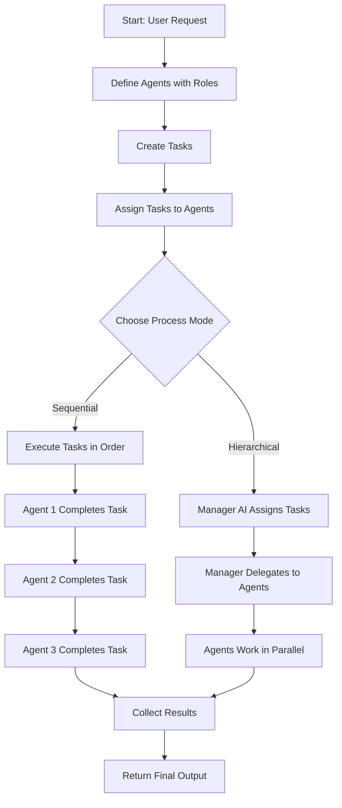

### Multi-LLM Integration Workflow:

1. Install CrewAI framework
2. Configure different LLM providers (OpenAI, Anthropic, Google)
3. Assign specific LLM to each agent
4. Agent uses its assigned model for reasoning
5. Results combined from multiple models

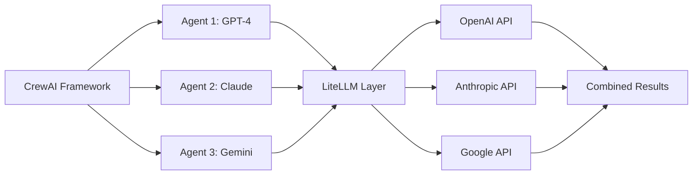

## 5. Where It Fits in the System

**AI Layer - Agent Orchestration**
- Sits above individual AI models
- Manages multiple agents working together
- Part of the multi-agent microservice architecture
- Uses LiteLLM for model flexibility
- Can integrate with RAG systems for knowledge retrieval

**In Smart Healthcare Platform:**
- Agent orchestration layer
- Coordinates specialist AI agents (diagnosis, research, reporting)
- Integrates with healthcare knowledge bases

## 6. Common Interview Questions

**Q1: What's the difference between CrewAI Crews and Flows?**
- **Answer**: Crews are autonomous - agents decide how to work. Flows are fixed workflows with defined steps. Use Crews for creative tasks, Flows for predictable processes.

**Q2: How does CrewAI support multiple AI models?**
- **Answer**: CrewAI uses LiteLLM underneath, which lets you easily switch between providers (OpenAI, Anthropic, Google, etc.) by just changing the model name.

**Q3: What are the core components of CrewAI?**
- **Answer**: Three main parts - Agents (workers with roles), Tasks (specific assignments), and Crew (team of agents and tasks working together).

**Q4: What's the difference between sequential and hierarchical mode?**
- **Answer**: Sequential executes tasks one by one in order. Hierarchical uses a manager AI to assign tasks to agents dynamically.

**Q5: How do you define an agent in CrewAI?**
- **Answer**: An agent needs a role (job title), goal (what to achieve), backstory (context), and optionally tools and memory. Can define in code or YAML config files.

## 7. Quick Revision Summary

- CrewAI is a framework for building teams of AI agents that work together
- Core concepts: Agent (worker), Task (assignment), Crew (team)
- Two modes: Sequential (one by one) or Hierarchical (manager assigns)
- Uses YAML files to separate configuration from code
- LiteLLM integration allows easy switching between AI models (GPT, Claude, Gemini)
- More opinionated than OpenAI SDK (requires role, goal, backstory)
- Project structure: config folder (YAML), crew.py (main logic), main.py (run script)

---

# Core Concepts Deep Dive

## Agent

### 1. Simple Explanation

An agent is a single AI worker with a specific job. It's like one employee on your team. Each agent has:
- **Role**: Job title (e.g., "Medical Researcher")
- **Goal**: What they're trying to achieve
- **Backstory**: Context about their expertise
- **LLM**: Which AI model powers them
- **Tools**: Optional functions they can use
- **Memory**: Optional ability to remember past interactions

### 2. Why It Matters

- Gives structure to AI prompting (role, goal, backstory)
- Makes agents specialized for specific tasks
- Easier to debug when each agent has clear responsibility

### 3. Very Simple Healthcare Example

**Medical Researcher Agent**:
- Role: "Medical Research Specialist"
- Goal: "Find latest treatment guidelines"
- Backstory: "Expert in medical literature with 10 years experience"
- Uses GPT-4 to search and analyze medical papers

### 4. Step-by-Step Workflow

1. Define agent role (what job they do)
2. Set goal (what they should achieve)
3. Write backstory (gives context and expertise)
4. Assign AI model (GPT-4, Claude, etc.)
5. Add tools if needed (search, calculator, etc.)
6. Agent receives task and executes using its LLM

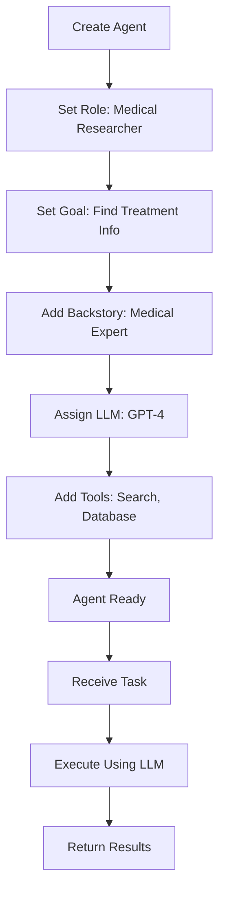

### 5. Where It Fits

- Basic building block of CrewAI
- Part of AI Agent layer
- Can be configured via YAML or Python code

### 6. Common Interview Questions

**Q1: What's required to create a CrewAI agent?**
- **Answer**: Role, goal, and backstory are required. LLM, tools, and memory are optional.

**Q2: How is CrewAI agent different from OpenAI agent?**
- **Answer**: CrewAI is more opinionated - requires role/goal/backstory. OpenAI just needs instructions (system prompt).

**Q3: Can one agent use multiple AI models?**
- **Answer**: No, each agent is assigned one LLM, but different agents in a crew can use different models.

### 7. Quick Revision Summary

- Agent = AI worker with specific role
- Requires: role, goal, backstory
- Optional: LLM, tools, memory
- More structured than OpenAI's instruction-based approach
- Define in YAML config or Python code

---

## Task

### 1. Simple Explanation

A task is a specific job that needs to be done. It's assigned to one agent. Think of it like a work ticket or assignment.

Each task has:
- **Description**: What needs to be done
- **Expected Output**: What the result should look like
- **Agent**: Which agent will do it

### 2. Why It Matters

- Breaks down complex work into smaller pieces
- Makes it clear what each agent should produce
- Helps track progress and results

### 3. Very Simple Healthcare Example

**Task**: "Analyze patient symptoms"
- Description: "Review patient's reported symptoms and medical history"
- Expected Output: "List of possible conditions with confidence scores"
- Agent: Diagnosis Agent

### 4. Step-by-Step Workflow

1. Write task description (what to do)
2. Define expected output (what result looks like)
3. Assign to specific agent
4. Task added to crew
5. When crew runs, agent executes task
6. Agent produces output matching expected format

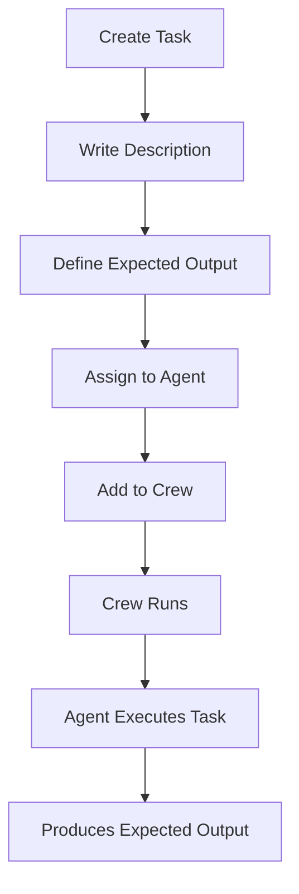

### 5. Where It Fits

- Work unit in CrewAI framework
- Links agents to specific assignments
- Part of crew configuration

### 6. Common Interview Questions

**Q1: What's the difference between an agent and a task?**
- **Answer**: Agent is the worker (who), task is the assignment (what). One agent can have multiple tasks.

**Q2: Why specify expected output?**
- **Answer**: Helps the AI understand what format to return and makes results more predictable.

**Q3: Can tasks depend on each other?**
- **Answer**: Yes, in sequential mode tasks run in order, so later tasks can use results from earlier ones.

### 7. Quick Revision Summary

- Task = specific assignment for an agent
- Requires: description, expected output, agent
- Multiple tasks can be assigned to one agent
- Tasks execute in order (sequential) or as assigned by manager (hierarchical)

---

## Crew

### 1. Simple Explanation

A crew is a team of agents and their tasks working together. It's the container that holds everything and manages how work gets done.

A crew includes:
- **Agents**: The team members
- **Tasks**: The work to be done
- **Process**: How tasks are executed (sequential or hierarchical)

### 2. Why It Matters

- Coordinates multiple agents working together
- Manages task execution order
- Provides final results from team collaboration

### 3. Very Simple Healthcare Example

**Patient Care Crew**:
- Agents: Symptom Analyzer, Treatment Researcher, Report Writer
- Tasks: Analyze symptoms, find treatments, create patient report
- Process: Sequential (one after another)
- Result: Complete patient care recommendation

### 4. Step-by-Step Workflow

1. Create multiple agents with different roles
2. Create tasks for each agent
3. Build crew with agents and tasks
4. Choose process mode (sequential or hierarchical)
5. Run crew with input
6. Crew executes tasks according to process mode
7. Collect and return final results

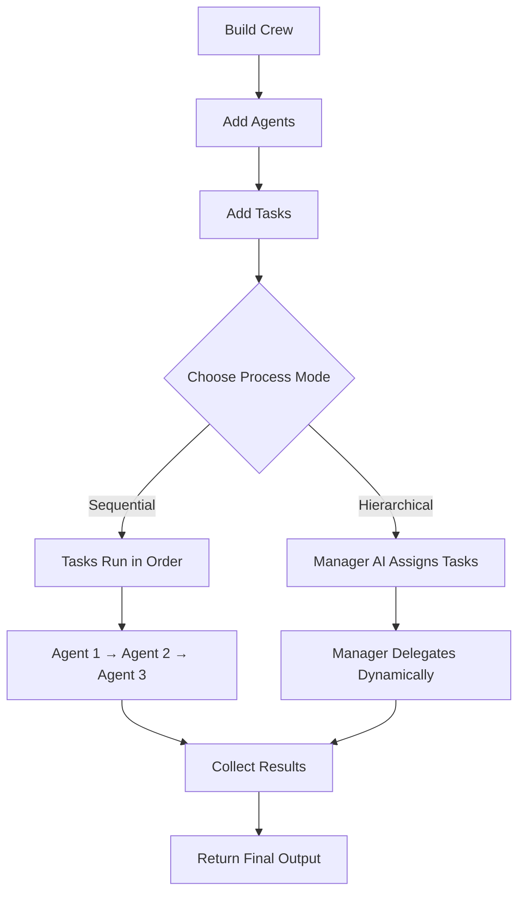

### 5. Where It Fits

- Top-level orchestrator in CrewAI
- Manages entire multi-agent workflow
- Part of AI orchestration layer

### 6. Common Interview Questions

**Q1: What are the two process modes in CrewAI?**
- **Answer**: Sequential (tasks run in order) and Hierarchical (manager AI assigns tasks to agents).

**Q2: When would you use hierarchical vs sequential?**
- **Answer**: Sequential for predictable workflows. Hierarchical when you want AI to decide task assignment and order.

**Q3: How do you run a crew?**
- **Answer**: Create crew instance, call crew.kickoff() with inputs, crew executes and returns results.

### 7. Quick Revision Summary

- Crew = team of agents + tasks
- Two modes: sequential or hierarchical
- Sequential: tasks run in defined order
- Hierarchical: manager AI assigns tasks
- Run with crew.kickoff()

---

## LiteLLM Integration

### 1. Simple Explanation

LiteLLM is a lightweight library that CrewAI uses to connect to different AI models. It makes it super easy to switch between OpenAI, Anthropic, Google, and other providers.

You just specify the model like this: `provider/model-name`
- Example: `openai/gpt-4`
- Example: `anthropic/claude-3-5-sonnet`
- Example: `google/gemini-flash`

### 2. Why It Matters

- No vendor lock-in - easily switch AI providers
- Simple syntax - just change model name
- Supports 100+ AI models
- Same code works with different models

### 3. Very Simple Healthcare Example

**Multi-Model Healthcare System**:
- Diagnosis Agent uses GPT-4 (best reasoning)
- Research Agent uses Claude (best for long documents)
- Report Agent uses Gemini (fast and cheap)
- All work together in one crew with different strengths

### 4. Step-by-Step Workflow

1. Install CrewAI (includes LiteLLM)
2. Create agent
3. Specify LLM with provider/model format
4. LiteLLM handles API connection
5. Agent uses that model for all reasoning
6. Switch models by just changing the string

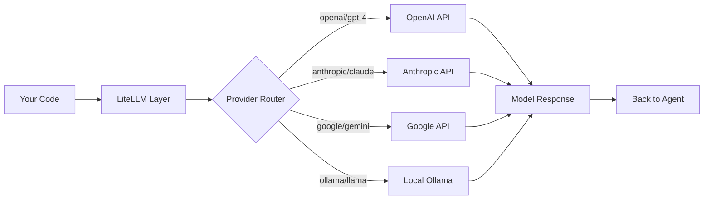

### 5. Where It Fits

- Integration layer between CrewAI and AI providers
- Handles API calls to different services
- Part of AI infrastructure

### 6. Common Interview Questions

**Q1: What is LiteLLM?**
- **Answer**: A lightweight library that provides a unified interface to connect to 100+ AI models from different providers.

**Q2: How do you specify which model to use in CrewAI?**
- **Answer**: Use format "provider/model-name" like "openai/gpt-4" or "anthropic/claude-3-5-sonnet".

**Q3: Can different agents in a crew use different models?**
- **Answer**: Yes! That's a key benefit. Each agent can use a different model based on what it's best at.

### 7. Quick Revision Summary

- LiteLLM = unified interface to many AI models
- Format: provider/model-name
- CrewAI uses LiteLLM under the hood
- Easy to switch models - just change string
- Supports OpenAI, Anthropic, Google, Ollama, and 100+ more

---

## YAML Configuration

### 1. Simple Explanation

YAML files let you define agents and tasks in configuration files instead of code. This separates your prompts and settings from your Python code.

Benefits:
- Cleaner code
- Easy to update prompts without touching code
- Better organization

### 2. Why It Matters

- Separates configuration from logic
- Non-developers can update agent prompts
- Easier to maintain and version control
- Industry best practice

### 3. Very Simple Healthcare Example

**agents.yaml file**:
```yaml
doctor_agent:
  role: "Medical Diagnosis Specialist"
  goal: "Analyze symptoms and suggest diagnosis"
  backstory: "Experienced doctor with 15 years in emergency medicine"
```

Now code just references "doctor_agent" instead of having all text in code.

### 4. Step-by-Step Workflow

1. Create config folder in project
2. Create agents.yaml file
3. Define agents with role, goal, backstory
4. Create tasks.yaml file
5. Define tasks with description and expected output
6. In crew.py, reference config by name
7. CrewAI loads configuration automatically

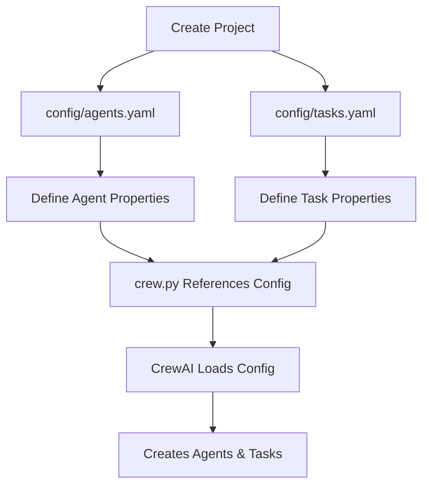

### 5. Where It Fits

- Configuration layer
- Separates data from code
- Part of project structure

### 6. Common Interview Questions

**Q1: Why use YAML instead of defining agents in code?**
- **Answer**: Separates configuration from logic, easier to maintain, non-developers can update prompts.

**Q2: What goes in agents.yaml?**
- **Answer**: Agent definitions with role, goal, backstory, and optionally LLM and tools.

**Q3: Is YAML required in CrewAI?**
- **Answer**: No, you can define everything in code, but YAML is recommended for better organization.

### 7. Quick Revision Summary

- YAML = configuration file format
- agents.yaml defines agents
- tasks.yaml defines tasks
- Separates prompts from code
- Reference by name in crew.py

---

## Project Structure

### 1. Simple Explanation

CrewAI creates a specific folder structure for each project. It's organized and consistent.

Structure:
```
my_crew/
  src/
    my_crew/
      config/
        agents.yaml
        tasks.yaml
      crew.py
      main.py
```

### 2. Why It Matters

- Consistent structure across projects
- Easy to find files
- Follows Python best practices
- Ready for deployment

### 3. Very Simple Healthcare Example

**healthcare_crew project**:
- config/agents.yaml: Doctor, Nurse, Researcher agents
- config/tasks.yaml: Diagnose, Research, Report tasks
- crew.py: Builds the healthcare team
- main.py: Runs patient analysis

### 4. Step-by-Step Workflow

1. Run command: `crewai create crew my_project`
2. CrewAI generates folder structure
3. Edit agents.yaml to define agents
4. Edit tasks.yaml to define tasks
5. Edit crew.py to build crew logic
6. Run with: `crewai run`
7. Results returned from main.py

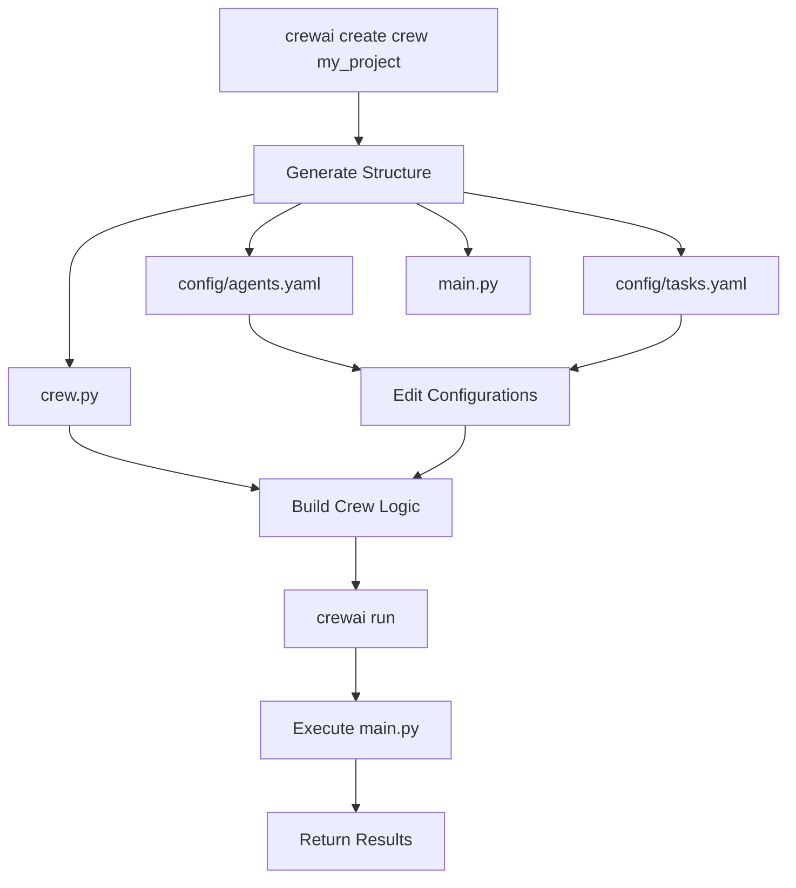

### 5. Where It Fits

- Project organization layer
- Standard structure for all CrewAI projects
- Uses uv for Python package management

### 6. Common Interview Questions

**Q1: How do you create a new CrewAI project?**
- **Answer**: Run `crewai create crew project_name` which generates the full folder structure.

**Q2: What's the purpose of crew.py?**
- **Answer**: It's where you define your crew, agents, and tasks using decorators. It's the main logic file.

**Q3: How do you run a CrewAI project?**
- **Answer**: Use command `crewai run` which executes main.py.

### 7. Quick Revision Summary

- Use `crewai create crew name` to generate project
- config/ folder holds YAML files
- crew.py has main logic with decorators
- main.py is entry point
- Run with `crewai run`

---

## Sequential vs Hierarchical Process

### 1. Simple Explanation

These are two ways a crew can execute tasks:

**Sequential**: Tasks run one after another in the order you define. Like an assembly line.

**Hierarchical**: A manager AI decides which agent should do which task and in what order. More flexible but less predictable.

### 2. Why It Matters

- Sequential: Predictable, easier to debug, good for fixed workflows
- Hierarchical: Flexible, autonomous, good for complex problems
- Choice affects how your agents collaborate

### 3. Very Simple Healthcare Example

**Sequential**: 
Patient intake → Symptom analysis → Treatment research → Report generation (fixed order)

**Hierarchical**: 
Manager AI sees patient case → Decides if urgent → Assigns to specialist → Coordinates follow-up (dynamic)

### 4. Step-by-Step Workflow

**Sequential Process:**
1. Define tasks in specific order
2. Set process=Process.sequential
3. Task 1 executes completely
4. Task 2 starts (can use Task 1 results)
5. Task 3 starts (can use previous results)
6. Continue until all tasks done

**Hierarchical Process:**
1. Set process=Process.hierarchical
2. Manager LLM analyzes all tasks
3. Manager assigns tasks to agents
4. Manager can delegate dynamically
5. Agents report back to manager
6. Manager coordinates final output

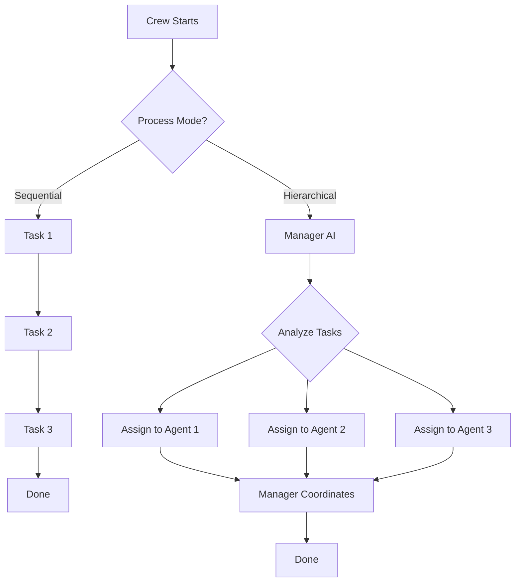

### 5. Where It Fits

- Execution strategy in CrewAI
- Determines workflow pattern
- Set in crew configuration

### 6. Common Interview Questions

**Q1: When should you use sequential vs hierarchical?**
- **Answer**: Sequential for predictable workflows and auditability. Hierarchical for complex, dynamic problems where AI should decide task order.

**Q2: What's the downside of hierarchical mode?**
- **Answer**: Less predictable, harder to debug, uses more tokens (manager AI adds overhead).

**Q3: Can you switch between modes?**
- **Answer**: Yes, just change the process parameter when creating the crew.

### 7. Quick Revision Summary

- Sequential = tasks run in fixed order
- Hierarchical = manager AI assigns tasks
- Sequential: predictable, easier to debug
- Hierarchical: flexible, autonomous
- Set with process parameter in crew

---

## Decorators in CrewAI

### 1. Simple Explanation

Decorators are special markers you put above functions in crew.py. They tell CrewAI what each function does.

Main decorators:
- `@CrewBase`: Marks the main crew class
- `@agent`: Marks a function that creates an agent
- `@task`: Marks a function that creates a task
- `@crew`: Marks the function that builds the crew

### 2. Why It Matters

- Clean syntax for defining crews
- Automatic registration of agents and tasks
- Follows Python best practices
- Makes code readable

### 3. Very Simple Healthcare Example

```python
@agent
def doctor_agent(self):
    return Agent(config=self.agents_config['doctor'])

@task
def diagnose_task(self):
    return Task(config=self.tasks_config['diagnose'])
```

Decorators automatically register doctor agent and diagnose task.

### 4. Step-by-Step Workflow

1. Create class with @CrewBase decorator
2. Define agent functions with @agent decorator
3. Define task functions with @task decorator
4. Define crew function with @crew decorator
5. CrewAI automatically collects all agents
6. CrewAI automatically collects all tasks
7. Access via self.agents and self.tasks

```mermaid
flowchart TD
    A[@CrewBase Class] --> B[@agent Functions]
    A --> C[@task Functions]
    B --> D[Auto-registered to self.agents]
    C --> E[Auto-registered to self.tasks]
    D --> F[@crew Function]
    E --> F
    F --> G[Creates Crew Instance]
    G --> H[Ready to Run]
```

### 5. Where It Fits

- Python code pattern in crew.py
- Part of CrewAI framework syntax
- Simplifies crew definition

### 6. Common Interview Questions

**Q1: What do decorators do in CrewAI?**
- **Answer**: They mark functions as agents, tasks, or crew builders and automatically register them.

**Q2: Why use decorators instead of manual registration?**
- **Answer**: Cleaner code, automatic collection, less boilerplate, follows Python conventions.

**Q3: What's the @CrewBase decorator for?**
- **Answer**: Marks the main class that contains all crew logic and enables other decorators to work.

### 7. Quick Revision Summary

- Decorators = special markers above functions
- @CrewBase, @agent, @task, @crew
- Automatically register agents and tasks
- Access via self.agents and self.tasks
- Makes code cleaner and more organized

---

## Final System Architecture

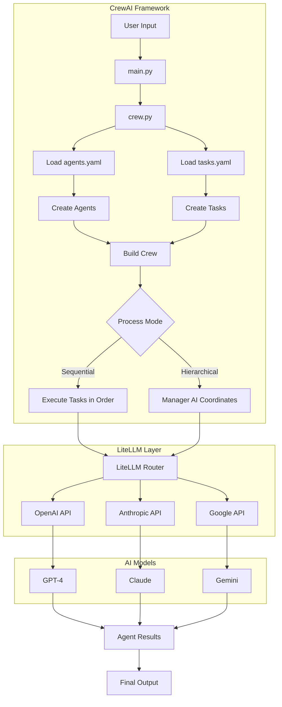

---

# Complete Healthcare Example

## Scenario: Patient Diagnosis System

### Agents:
1. **Intake Agent** (GPT-4): Collects and organizes patient information
2. **Research Agent** (Claude): Searches medical literature
3. **Diagnosis Agent** (GPT-4): Analyzes and suggests diagnosis
4. **Report Agent** (Gemini): Creates patient-friendly report

### Tasks:
1. Organize patient symptoms and history
2. Research similar cases and guidelines
3. Generate diagnosis with confidence scores
4. Create simple report for patient

### Process: Sequential (one after another)

### Workflow:
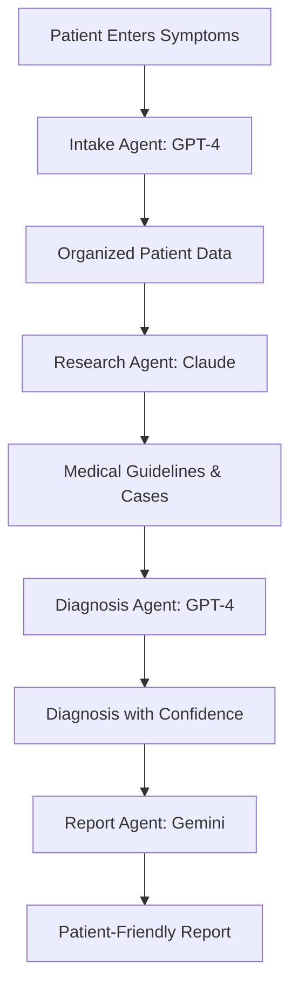

This shows how multiple AI models work together in one crew, each using their strengths!

---

# End of Document
